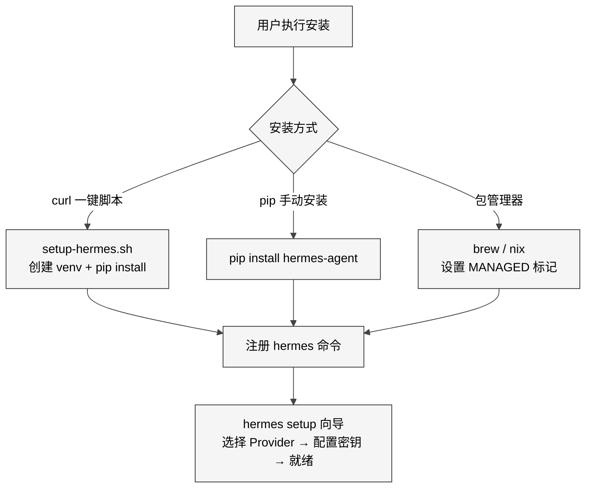
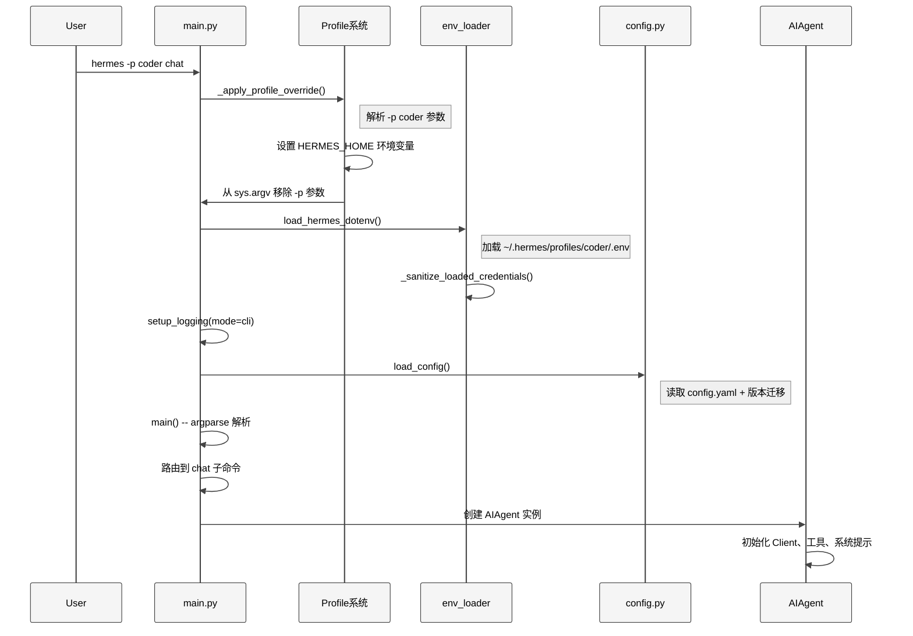
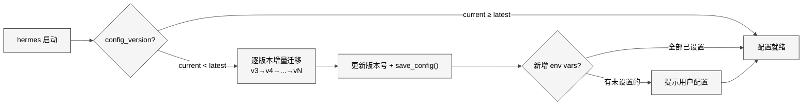

# 第2章 启动流程与配置系统

## 2.1 本质：从安装到运行的完整链路

Hermes Agent 的启动不是简单的"python 脚本跑起来"。它是一个多阶段的引导流程：安装脚本准备环境、CLI 入口解析命令、Profile 系统隔离配置、环境变量加载器合并多源凭证、配置系统在 18 个版本间自动迁移，最后才创建 AIAgent 实例。理解这条链路是理解整个系统的基础——因为 Agent 的行为（用哪个模型、启用哪些工具、连接哪个平台）完全由这条链路的输出决定。

## 2.2 核心问题

启动流程面对三个工程挑战：

1. **多入口统一**：用户可能通过 `hermes` 命令进入交互 CLI，也可能通过 `hermes gateway start` 启动 Telegram bot，还可能通过 `hermes-agent` 直接调用 Python API。每个入口都需要完成相同的初始化，但顺序和依赖不同。

2. **配置的分层与合并**：API 密钥在 `.env` 中，模型和工具集在 `config.yaml` 中，运行时参数在命令行中，Profile 覆盖在环境变量中。这四层配置需要按优先级正确合并。

3. **向后兼容**：配置 schema 已经迭代了 18 个版本（`_config_version: 18`），每次升级都必须无损迁移旧配置，不能要求用户重新运行 setup。

## 2.3 安装流程

Hermes Agent 的安装分为两条路径：

<div style="background: #ffffff !important; background-color: #ffffff !important; padding: 16px; border-radius: 8px; margin: 16px 0;" bgcolor="#ffffff">



</div>

`pyproject.toml` L117-L119 定义了三个入口点：

```python
[project.scripts]
hermes = "hermes_cli.main:main"          # CLI 主入口
hermes-agent = "run_agent:main"          # 直接 Agent API
hermes-acp = "acp_adapter.entry:main"    # 编辑器集成
```

其中 `hermes` 命令是最常用的入口，它映射到 `hermes_cli/main.py` 的 `main()` 函数。

## 2.4 CLI 启动序列

`hermes_cli/main.py` 的启动序列是整个系统最精妙的部分之一。它必须在**任何模块导入之前**完成 Profile 覆盖，因为许多模块在导入时就会缓存 `HERMES_HOME` 路径。

<div style="background: #ffffff !important; background-color: #ffffff !important; padding: 16px; border-radius: 8px; margin: 16px 0;" bgcolor="#ffffff">



</div>

关键步骤详解：

**第一步：Profile 覆盖**（L83-L138）。`_apply_profile_override()` 在模块顶层直接调用（L138），不在 `main()` 内部。它从 `sys.argv` 中预解析 `--profile/-p` 参数，设置 `os.environ["HERMES_HOME"]`，然后从 `sys.argv` 中删除这些参数以免 argparse 报错。如果没有显式 `-p` 参数，它还会检查 `~/.hermes/active_profile` 文件作为粘性默认值。

**第二步：.env 加载**（L140-L144）。`load_hermes_dotenv()` 定义在 `hermes_cli/env_loader.py` 中。它按优先级加载两个 `.env` 文件：首先是 `HERMES_HOME/.env`（用户配置），然后是项目根目录的 `.env`（开发回退）。加载后立即调用 `_sanitize_loaded_credentials()` 清理凭证中的非 ASCII 字符——这是因为从 PDF 或富文本编辑器粘贴 API key 时，可能会引入 Unicode 相似字形（如 U+028B 代替 v），导致 HTTP 请求失败。

**第三步：日志初始化**（L148-L152）。在配置加载之前就设置日志，确保后续所有模块都能写入 `~/.hermes/logs/agent.log`。

**第四步：IPv4 偏好**（L155-L164）。如果 `config.yaml` 中设置了 `network.force_ipv4: true`，在任何 HTTP 客户端创建之前应用，避免 IPv6 连接超时。

## 2.5 配置系统

### 2.5.1 config.yaml 结构

`hermes_cli/config.py` 的 `DEFAULT_CONFIG` 字典（L342-L771）定义了完整的配置 schema，包含 15 个顶层分组、约 200 个配置项。核心分组：

| 分组 | 行数范围 | 职责 |
|------|---------|------|
| `model` | L343 | 模型选择（支持字符串或字典） |
| `agent` | L346-L375 | 运行参数：max_turns(90)、超时、推理力度 |
| `terminal` | L377-L414 | 终端后端：local/docker/ssh/modal/daytona |
| `compression` | L443-L449 | 上下文压缩：阈值(0.50)、保护最近 20 条消息 |
| `auxiliary` | L484-L542 | 辅助模型：vision、web_extract、compression 等 |
| `display` | L544-L560 | 显示配置：皮肤、流式、内联 diff |
| `delegation` | L651-L660 | 子代理：模型覆盖、独立迭代预算(50) |
| `memory` | L634-L645 | 持久记忆：字符上限、外部 Provider |

### 2.5.2 OPTIONAL_ENV_VARS

`OPTIONAL_ENV_VARS` 字典（L796+）定义了所有可选环境变量的元数据。每个变量包含 description、prompt（显示名称）、url（获取链接）、password（是否掩码）、category（provider/tool/messaging/setting）。这些元数据被 setup 向导、`hermes doctor`、`hermes config status` 等多处消费。

与之配合的 `_EXTRA_ENV_KEYS` 集合（L32-L57）记录了由 setup/provider 流程直接管理的环境变量，包括各平台的 Token、密钥等共计约 60 个变量。

### 2.5.3 配置加载器

项目中存在三个独立的配置加载路径：

| 加载器 | 使用方 | 位置 |
|--------|--------|------|
| `load_cli_config()` | CLI 模式 | `cli.py` |
| `load_config()` | hermes tools/setup/config | `hermes_cli/config.py` |
| 直接 YAML 加载 | Gateway | `gateway/run.py` |

`load_config()` 的实现遵循**宽松合并策略**：从 `DEFAULT_CONFIG` 开始，用 `config.yaml` 的值覆盖对应键。缺失的键自动从默认值补全，多余的键保留不删除。这保证了新版本添加的配置项在旧配置文件上也能工作。

### 2.5.4 版本迁移

<div style="background: #ffffff !important; background-color: #ffffff !important; padding: 16px; border-radius: 8px; margin: 16px 0;" bgcolor="#ffffff">



</div>

`check_config_version()` 返回 `(current_version, latest_version)` 元组。当 `current < latest` 时，`migrate_config()` 按版本号顺序执行迁移逻辑。例如 v3 到 v4 的迁移将 `HERMES_TOOL_PROGRESS` 环境变量迁移到 `config.yaml` 的 `display.tool_progress_command` 字段。迁移完成后将 `_config_version` 更新为最新值并写回磁盘。

这种版本化迁移模式的优势在于**幂等性**：重复运行不会产生副作用。劣势在于**只增不减**：迁移代码永远保留在代码库中，即使 v3 的用户已经不存在了。

## 2.6 Setup 向导

`hermes_cli/setup.py` 实现了一个五步交互式向导：

1. **Model and Provider** — 选择 AI 提供商和模型
2. **Terminal Backend** — 选择命令执行环境（local/docker/ssh/modal/daytona）
3. **Agent Settings** — 配置迭代次数、压缩、会话重置
4. **Messaging Platforms** — 连接 Telegram/Discord/Slack 等
5. **Tools** — 配置 TTS、Web 搜索、图像生成等

向导的设计遵循**模块化原则**——每个步骤可以独立运行。`hermes setup` 运行全部步骤，`hermes setup model` 只运行第一步。这在调试时非常有用。

Provider 选择部分维护了一个 `_DEFAULT_PROVIDER_MODELS` 字典（`setup.py` L74-L114），为每个 Provider 定义了默认模型列表。当无法连接 Provider 的 `/models` 端点时，使用这个静态列表作为后备。支持的 Provider 包括：copilot、gemini、zai（智谱）、kimi-coding、arcee、minimax、huggingface 等 15+ 个。

## 2.7 .env 加载的分层策略

`hermes_cli/env_loader.py` 的 `load_hermes_dotenv()` 实现了两层加载：

```
优先级从高到低：
1. HERMES_HOME/.env（用户配置，override=True）
2. 项目根目录/.env（开发回退，override=False）
```

加载后立即执行两层清理：
- `_sanitize_loaded_credentials()`：只清理以 `_API_KEY`、`_TOKEN`、`_SECRET`、`_KEY` 结尾的环境变量的非 ASCII 字符。这个选择很精妙——我们不能盲目清理所有环境变量（可能破坏用户的自定义路径），但凭证是已知必须为 ASCII 的（因为它们会成为 HTTP header 值）。
- `_sanitize_env_file_if_needed()`：处理损坏的 `.env` 文件，例如多个 KEY=VALUE 对被拼接在同一行的情况（issue #8908）。

## 2.8 陷阱与注意事项

1. **TTY 守卫**。交互式 TUI 命令（`hermes tools`、`hermes setup`）使用 curses 或 input() 提示。当 stdin 是管道时会 100% CPU 空转。`_require_tty()` 函数（`main.py` L53-L67）在这些命令执行前检查 `sys.stdin.isatty()`，非交互环境直接退出。

2. **Managed 模式陷阱**。通过 Homebrew 或 NixOS 安装时，`HERMES_MANAGED` 标记会阻止 `hermes setup` 修改配置和 `hermes update` 自动升级。`format_managed_message()` 返回友好的错误消息，引导用户使用包管理器。

3. **Profile override 的时序依赖**。`_apply_profile_override()` 必须在文件顶层（L138）执行，不能在 `main()` 内部。因为 Python 的 import 语句在 `main()` 调用之前就可能触发模块级代码，那些代码会缓存错误的 `HERMES_HOME`。

## 2.9 与同类项目的对比

| 维度 | Hermes Agent | Claude Code | Aider |
|------|-------------|-------------|-------|
| 配置存储 | YAML + .env 分离 | JSON 单文件 | .env 单文件 |
| 版本迁移 | 18 版本增量迁移 | 无版本管理 | 无 |
| 多 Profile | 完整隔离 | 不支持 | 不支持 |
| 安装向导 | 5 步交互式 | OAuth 登录 | 无 |
| Provider 支持 | 15+ | 仅 Anthropic | OpenAI/Anthropic |

Hermes Agent 的配置系统是目前开源 Agent 中最完善的。YAML + .env 的分离确保了"密钥不与配置混在一起"，版本迁移确保了"升级不会破坏现有用户"。

## 2.10 遗留问题

1. **三个配置加载器**的存在是历史原因。理想情况下应该统一为一个，但 CLI 模式需要额外的 hardcoded defaults 合并，Gateway 需要异步兼容，统一需要仔细的重构。

2. **`_config_version` 只增不减**。没有版本降级路径——如果用户从新版本回退到旧版本，旧版本无法理解新的配置字段。实际上这很少发生，但在开发分支切换时可能造成困惑。

3. **环境变量数量膨胀**。`_EXTRA_ENV_KEYS` 已经包含约 60 个变量，`OPTIONAL_ENV_VARS` 又有数十个。对于新用户来说，`hermes doctor` 输出的环境变量列表令人望而生畏。一个可能的改进是按使用场景分组，只在用户启用相应功能时才显示。
