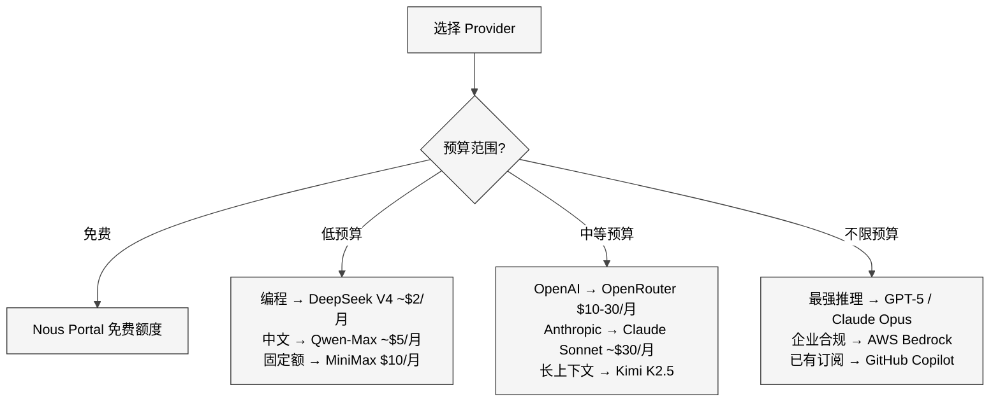
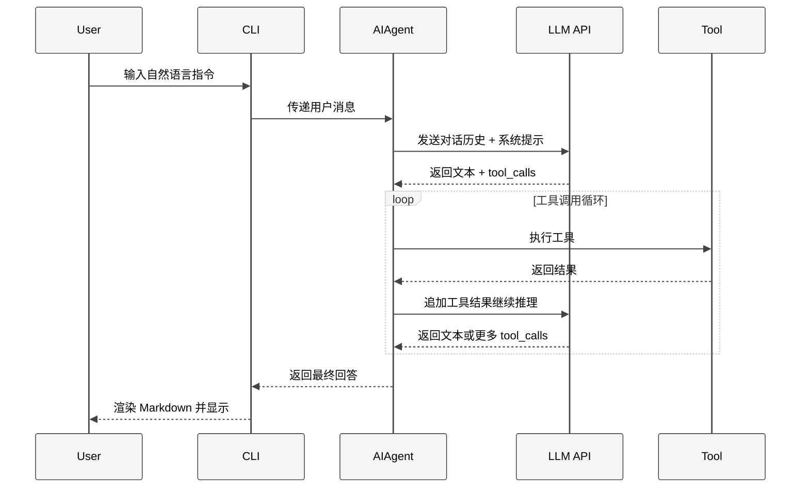
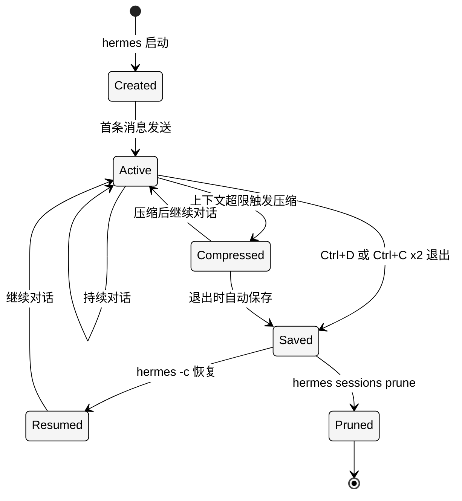

# 第3章 初级使用方法

## 3.1 一行命令安装

### 3.1.1 安装方式

Hermes Agent 的安装被刻意设计成"一行命令"体验。`scripts/install.sh` 是一个约 200 行的 Bash 脚本，自动检测操作系统、Python 版本、包管理器，完成 venv 创建和 pip 安装的全链路。

```bash
curl -fsSL https://raw.githubusercontent.com/NousResearch/hermes-agent/main/scripts/install.sh | bash
```

这条命令的执行过程如下：

```mermaid
%%{init: {'theme': 'neutral', 'themeVariables': {'background': '#ffffff', 'primaryColor': '#f5f5f5', 'primaryTextColor': '#000000', 'primaryBorderColor': '#333333', 'lineColor': '#444444', 'textColor': '#000000', 'mainBkg': '#f5f5f5', 'nodeBorder': '#333333', 'clusterBkg': '#fafafa', 'clusterBorder': '#888888', 'edgeLabelBackground': '#ffffff'}}}%%
flowchart LR
    subgraph phase1 ["检测与准备"]
        direction TB
        START["curl 下载 install.sh"] --> DETECT["检测操作系统<br/>(Linux / macOS / WSL2 / Termux)"]
        DETECT --> PYCHECK{"Python 3.10+ ?"}
        PYCHECK -->|"否"| INSTALL_PY["提示安装 Python"]
        PYCHECK -->|"是"| VENV["创建 ~/.hermes/venv"]
        INSTALL_PY --> VENV
    end
    subgraph phase2 ["安装与配置"]
        direction TB
        PIP["pip install hermes-agent"] --> SYMLINK["创建 hermes 命令软链接"]
        SYMLINK --> PATHRC["写入 PATH 到 .bashrc/.zshrc"]
        PATHRC --> SETUP["source 刷新 + hermes setup"]
        SETUP --> DONE["安装完成"]
    end
    VENV --> PIP
```

<div style="background-color: #ffffff; padding: 16px; border-radius: 8px; margin: 16px 0;" bgcolor="#ffffff">



</div>

### 3.1.2 支持平台

| 平台 | 状态 | 备注 |
|------|------|------|
| Linux (Ubuntu/Debian) | 完全支持 | 主开发平台，测试最充分 |
| Linux (Fedora/Arch) | 完全支持 | 需要手动确认 Python 3.10+ |
| macOS (Intel/Apple Silicon) | 完全支持 | Homebrew 用户可选 `brew install hermes-agent` |
| Windows via WSL2 | 完全支持 | 必须在 WSL2 内运行，原生 Windows 不支持 |
| Android (Termux) | 实验性支持 | 部分工具受限（如浏览器工具不可用） |
| Docker | 完全支持 | 提供官方镜像 `nousresearch/hermes-agent` |

Windows 用户需要先安装 WSL2：

```bash
wsl --install
```

然后在 WSL2 终端内执行安装脚本。

### 3.1.3 安装后刷新

安装脚本会将 `hermes` 命令的路径写入 shell 配置文件。需要刷新当前终端才能生效：

```bash
# Bash 用户
source ~/.bashrc

# Zsh 用户
source ~/.zshrc
```

或者直接关闭并重新打开终端。验证安装成功：

```bash
hermes --version
```

如果输出版本号（如 `hermes-agent 0.9.0`），安装完成。如果提示 `command not found`，检查 `~/.hermes/venv/bin` 是否在 `PATH` 中。

### 3.1.4 备选安装方式

除了一行脚本，Hermes Agent 还支持以下安装途径：

```bash
# pip 直接安装
pip install hermes-agent

# 带可选依赖安装（完整功能）
pip install "hermes-agent[all]"

# macOS Homebrew
brew install hermes-agent

# Nix
nix profile install nixpkgs#hermes-agent
```

`pip install hermes-agent` 安装核心包，不含消息平台网关、浏览器自动化等可选依赖。如需完整功能，使用 `hermes-agent[all]` 或按需选择 extra（如 `hermes-agent[messaging,browser]`）。

---

## 3.2 模型配置与 Provider 选择

### 3.2.1 交互式配置向导

安装完成后的第一步是配置模型。运行：

```bash
hermes model
```

这会启动交互式配置向导（TUI），列出所有可用的 Provider，用户通过方向键选择、回车确认。向导会引导完成三个步骤：选择 Provider、选择模型、配置 API Key。

在已有会话中，可以通过 Slash 命令 `/model` 临时切换模型，不影响全局配置。两者的区别：

| 操作 | 作用域 | 持久化 | 用法 |
|------|--------|--------|------|
| `hermes model` | 全局默认 | 写入 `config.yaml` | CLI 中运行 |
| `/model` | 当前会话 | 不持久化 | 会话中输入 |

### 3.2.2 Provider 全景表

Hermes Agent 通过统一的 Provider 系统支持 20+ 个 LLM 服务商。以下是主要 Provider 一览：

| Provider | 认证方式 | 代表模型 | API 模式 | 备注 |
|----------|---------|---------|---------|------|
| Nous Portal | OAuth 设备码 | Hermes 系列 | chat_completions | 官方默认，免费额度 |
| OpenAI Codex | OAuth 外部 | GPT-5, o3 | codex_responses | 需要 OpenAI 订阅 |
| Anthropic | API Key | Claude 4.6, Sonnet | anthropic_messages | 直连 Anthropic API |
| OpenRouter | API Key | 多模型路由 | chat_completions | 统一网关，支持 200+ 模型 |
| Z.AI / GLM | API Key | GLM-5, GLM-4 | chat_completions | 智谱 AI 国产模型 |
| Kimi / Moonshot | API Key | Kimi K2.5 | chat_completions | 月之暗面，超长上下文 |
| Alibaba Cloud | API Key | Qwen-3, Qwen-Max | chat_completions | 通义千问系列 |
| DeepSeek | API Key | DeepSeek V4, R2 | chat_completions | 高性价比推理模型 |
| GitHub Copilot | 外部进程 | GPT-5, Claude | 自动检测 | 复用 Copilot 订阅 |
| Hugging Face | API Key | 开源模型 | chat_completions | Inference API |
| MiniMax | API Key | MiniMax-01 | anthropic_messages | 月包制计费 |
| AWS Bedrock | AWS SDK | Claude, Nova, Llama | bedrock_converse | 企业级 AWS 集成 |
| Google Gemini | API Key | Gemini 2.5 Pro | chat_completions | Google AI Studio |
| xAI | API Key | Grok-3 | chat_completions | Elon Musk 旗下 |
| Mistral | API Key | Mistral Large | chat_completions | 欧洲开源模型 |
| Groq | API Key | Llama 3.x | chat_completions | 超快推理 |
| Fireworks | API Key | 多模型 | chat_completions | 高性能推理平台 |
| Together | API Key | 开源模型 | chat_completions | 分布式推理 |
| Lambda | API Key | 开源模型 | chat_completions | GPU 云平台 |
| 自定义端点 | API Key | 任意 | 可配置 | `custom:name:model` 语法 |

### 3.2.3 上下文窗口要求

Hermes Agent 对模型有一个硬性要求：**最低 64K 上下文窗口**。这个要求源于 Agent 核心循环的工作方式——每次工具调用的输入和输出都会追加到对话历史中，一个包含 20 次工具调用的任务很容易消耗 30K-50K token。如果模型上下文窗口不足，Agent 会频繁触发上下文压缩（context compression），丢失重要信息。

`agent/model_metadata.py` 中定义了每个模型的上下文窗口大小。如果选择的模型上下文小于 64K，`hermes model` 向导会发出警告。

### 3.2.4 预算参考

不同 Provider 的成本差异巨大。以日常编程助手的使用强度（每天约 50 次对话轮次，每轮平均 2K token 输入 + 1K token 输出）为基准：

| 方案 | 估算月费 | 适用场景 |
|------|---------|---------|
| Nous Portal 免费额度 | $0 | 轻度尝鲜 |
| DeepSeek V4 | ~$2/月 | 日常编程，极致性价比 |
| Kimi K2.5 | ~$3/天 | 超长上下文任务 |
| MiniMax 月包 | $10/月 | 固定预算，不限量 |
| Qwen-Max | ~$5/月 | 中文场景优化 |
| OpenRouter + 混合模型 | $10-30/月 | 灵活切换不同模型 |
| Claude 4.6 Sonnet | ~$30/月 | 高质量代码生成 |
| GPT-5 | ~$50/月 | 复杂推理任务 |

选择 Provider 的决策流程：

<div style="background-color: #ffffff; padding: 16px; border-radius: 8px; margin: 16px 0;" bgcolor="#ffffff">



</div>

### 3.2.5 Provider 配置示例

以 DeepSeek 为例，配置过程：

```bash
# 方式一：交互式向导
hermes model
# 选择 DeepSeek -> 输入 API Key -> 选择 deepseek-v4

# 方式二：环境变量
export DEEPSEEK_API_KEY="sk-your-key-here"
# 然后在 hermes model 中选择 DeepSeek

# 方式三：直接编辑 ~/.hermes/.env
echo 'DEEPSEEK_API_KEY=sk-your-key-here' >> ~/.hermes/.env
```

API Key 的存储位置：`~/.hermes/.env` 文件。`hermes model` 向导会自动写入。手动编辑时注意不要引入多余的空格或引号——`env_loader.py` 中的 `_sanitize_loaded_credentials()` 会清理非 ASCII 字符，但不会处理格式错误。

---

## 3.3 首次对话与基础交互

### 3.3.1 启动会话

配置完成后，输入一个命令即可开始对话：

```bash
hermes
```

等价于 `hermes chat`。启动后会看到欢迎横幅（Welcome Banner），显示当前模型、可用工具数量和已安装的 Skill 数量：

```
╭─────────────────────────────────────────╮
│  Hermes Agent v0.9.0                    │
│  Model: deepseek/deepseek-v4            │
│  Tools: 12 active                       │
│  Skills: 3 installed                    │
╰─────────────────────────────────────────╯

 >
```

光标停在 `>` 处，等待用户输入。

### 3.3.2 自然语言交互

Hermes Agent 的核心理念是"用自然语言驱动一切"。你不需要记忆复杂的命令语法，直接用自然语言描述需求：

```
> 帮我看看当前目录下有哪些 Python 文件

> 这个项目的 README 写了什么

> 我的磁盘使用情况怎么样

> 帮我写一个 Flask API，实现用户注册和登录
```

Agent 会自动判断需要调用哪些工具（终端命令、文件读取、代码搜索等），执行后将结果组织成人类可读的回答。

### 3.3.3 开箱即用的工具

安装完成后，以下工具无需额外配置即可使用：

| 工具类别 | 能力 | 示例指令 |
|---------|------|---------|
| 终端命令 | 执行 shell 命令 | "看看 CPU 使用率" |
| 文件操作 | 读取、写入、搜索文件 | "帮我改一下 config.py 第 10 行" |
| 代码执行 | 运行 Python/Node 等脚本 | "执行 test.py 看看结果" |
| 目录浏览 | 列出目录结构 | "这个项目的目录结构是什么" |
| 网络搜索 | 内置 Web Search | "搜索一下 FastAPI 的最新版本" |
| 图片分析 | 粘贴图片即可分析 | Ctrl+V 粘贴截图后提问 |

### 3.3.4 输入技巧

Hermes Agent 使用 `prompt_toolkit` 作为输入后端，支持多种交互方式：

**多行输入**：

```
Alt + Enter    在当前行后插入新行（继续输入）
Ctrl + J       同上，兼容不支持 Alt 的终端
Enter          单独按下时发送消息
```

这意味着你可以粘贴多行代码片段或写长指令而不会意外发送。

**粘贴检测**：当你从其他地方粘贴多行文本时，Hermes Agent 会自动检测并缓冲整个粘贴内容，不会在遇到换行符时提前发送。这个机制在 `cli.py` 中通过 `prompt_toolkit` 的 paste detection 实现。

**中断控制**：

```
Ctrl + C       按一次：中断当前操作，Agent 会总结已完成的工作
Ctrl + C       连按两次：直接退出会话
```

单次 Ctrl+C 是一个"软中断"——Agent 会停止当前工具调用，但保留对话上下文，你可以继续对话或给出新指令。这比直接退出友好得多，因为长任务中途可能需要调整方向。

### 3.3.5 基础交互循环

理解 Agent 的工作模式有助于更高效地使用它：

<div style="background-color: #ffffff; padding: 16px; border-radius: 8px; margin: 16px 0;" bgcolor="#ffffff">



</div>

关键点：Agent 不是"一问一答"——它可能在一次用户输入后进行多轮工具调用。例如"帮我重构这个函数"可能包含：读取文件、分析代码、搜索引用、编写新代码、运行测试等 5-10 次工具调用。每次工具调用的结果都会追加到对话历史中，LLM 根据累积信息决定下一步。

默认的最大工具调用轮次是 90（`config.yaml` 中的 `agent.max_turns`）。超过此限制，Agent 会自动停止并汇报当前进度。

---

## 3.4 常用命令速查

### 3.4.1 CLI 命令

以下是 `hermes` 命令行的主要子命令，在终端中使用：

| 命令 | 缩写 | 说明 |
|------|------|------|
| `hermes` | - | 启动交互式会话（等价于 `hermes chat`） |
| `hermes chat` | - | 启动交互式会话 |
| `hermes model` | - | 交互式 Provider/模型配置向导 |
| `hermes setup` | - | 完整安装配置向导（Provider + 工具 + 权限） |
| `hermes tools` | - | 配置工具（启用/禁用/设置 MCP） |
| `hermes doctor` | - | 诊断环境问题（Python 版本、依赖、API 连通性） |
| `hermes update` | - | 更新到最新版本 |
| `hermes --continue` | `hermes -c` | 恢复上次会话 |
| `hermes -r "标题"` | - | 按标题恢复指定会话 |
| `hermes --version` | `hermes -V` | 显示版本号 |
| `hermes --help` | `hermes -h` | 显示帮助信息 |
| `hermes sessions list` | - | 列出所有保存的会话 |
| `hermes sessions prune` | - | 清理过期会话 |
| `hermes config status` | - | 显示当前配置状态 |
| `hermes skills` | - | 浏览和管理 Skill |
| `hermes gateway start` | - | 启动消息平台网关（Telegram/Discord 等） |

常用启动参数：

```bash
# 使用指定 Provider 和模型
hermes --provider deepseek --model deepseek-v4

# 使用指定 Profile
hermes -p coder

# 恢复最近会话
hermes -c

# 按标题恢复
hermes -r "重构用户模块"

# 非交互式执行单条指令
hermes -m "列出当前目录的文件"

# 指定工作目录
hermes --cd /path/to/project
```

### 3.4.2 Slash 命令（会话内）

在交互式会话中，以 `/` 开头的命令是 Slash 命令，用于控制 Agent 行为：

| 命令 | 说明 |
|------|------|
| `/help` | 显示所有可用的 Slash 命令 |
| `/tools` | 列出当前已启用的工具 |
| `/model` | 临时切换模型（不影响全局配置） |
| `/model provider:model` | 直接指定 Provider 和模型 |
| `/skills` | 浏览已安装的 Skill |
| `/save` | 保存当前对话（导出为 Markdown/JSON） |
| `/compress` | 手动触发上下文压缩（释放 token 空间） |
| `/usage` | 显示当前会话的 token 使用统计 |
| `/verbose` | 循环切换工具输出详细程度（隐藏/摘要/完整） |
| `/title` | 为当前会话命名 |
| `/title "我的项目"` | 直接设置标题 |
| `/clear` | 清除对话历史（保留系统提示） |
| `/undo` | 撤销最近一次 Agent 操作 |
| `/diff` | 显示 Agent 对文件的修改差异 |

`/verbose` 命令值得特别说明——它在三个模式间循环：

1. **隐藏模式**：工具调用过程不显示，只显示最终回答
2. **摘要模式**（默认）：显示工具名和简要结果
3. **完整模式**：显示完整的工具输入输出，适合调试

### 3.4.3 快捷键

| 快捷键 | 功能 |
|--------|------|
| `Enter` | 发送消息 |
| `Alt + Enter` | 插入新行（多行输入） |
| `Ctrl + J` | 插入新行（Alt+Enter 替代） |
| `Ctrl + C` | 中断当前操作 |
| `Ctrl + C` x2 | 退出会话 |
| `Ctrl + D` | 退出会话 |
| `Ctrl + V` | 粘贴图片（支持的终端） |
| `Ctrl + L` | 清屏 |
| `Up/Down` | 浏览输入历史 |

---

## 3.5 AGENTS.md 项目配置

### 3.5.1 什么是 AGENTS.md

`AGENTS.md` 是 Hermes Agent 的项目级配置文件——放在项目根目录，每次在该项目内启动 `hermes` 时自动注入到系统提示词中。它的作用类似于代码规范文档，但面向 AI Agent 而非人类开发者。

工作原理：`agent/prompt_builder.py` 中的 `_build_system_prompt()` 函数在构建系统提示时，会扫描当前工作目录及其祖先目录，查找 `AGENTS.md` 文件。找到后，将其内容追加到系统提示的末尾。这意味着 Agent 在每次对话中都能"看到"项目的架构约定和编码规范。

### 3.5.2 与 .cursorrules 的关系

如果项目中已有 `.cursorrules` 文件（Cursor IDE 的配置），Hermes Agent 也会识别并注入。优先级为 `AGENTS.md` > `.cursorrules`——两者同时存在时，`AGENTS.md` 的内容在前。

### 3.5.3 编写建议

`AGENTS.md` 直接消耗模型的上下文窗口，因此需要在信息量和 token 预算之间取得平衡：

1. **保持简洁**：控制在 500-2000 字以内。过长的 AGENTS.md 会挤压对话和工具调用的空间
2. **结构化**：使用 Markdown 标题和列表，模型解析效率更高
3. **具体而非泛泛**：写"使用 black 格式化 Python 代码"而不是"保持代码整洁"
4. **包含架构信息**：让 Agent 了解项目结构，减少不必要的文件搜索
5. **包含约定**：命名规范、目录组织、测试策略等

### 3.5.4 示例 AGENTS.md

```markdown
# AGENTS.md

## 项目概述
这是一个 FastAPI 后端项目，提供用户管理和订单处理 API。

## 技术栈
- Python 3.12 + FastAPI + SQLAlchemy
- PostgreSQL 数据库
- Redis 缓存
- pytest 测试框架

## 目录结构
- `src/api/` — API 路由定义
- `src/models/` — SQLAlchemy 数据模型
- `src/services/` — 业务逻辑层
- `src/core/` — 配置、数据库连接、中间件
- `tests/` — 测试文件，镜像 src 结构

## 编码规范
- 使用 black + ruff 格式化
- 类型注解必须完整
- 每个 API 端点必须有对应的 pytest 测试
- 数据库操作通过 Service 层，不在路由中直接操作
- 环境变量通过 pydantic-settings 管理

## 注意事项
- 数据库迁移使用 alembic，修改模型后必须生成迁移脚本
- 敏感配置在 .env 中，不要硬编码
- Redis key 命名规范：`{module}:{entity}:{id}`
```

这个 AGENTS.md 大约 300 字，对模型来说约 500-800 token，不会对上下文窗口造成显著压力，但足以让 Agent 理解项目架构并遵循编码规范。

### 3.5.5 进阶用法

`AGENTS.md` 支持嵌套——子目录中也可以放置 `AGENTS.md`，Agent 进入该子目录工作时会同时加载父级和子级的配置。这对 monorepo 项目特别有用：

```
project/
├── AGENTS.md              # 全局规范
├── backend/
│   └── AGENTS.md          # 后端特有规范
├── frontend/
│   └── AGENTS.md          # 前端特有规范
└── infra/
    └── AGENTS.md          # 基础设施规范
```

---

## 3.6 会话管理

### 3.6.1 会话的本质

Hermes Agent 的每次对话都是一个"会话"（Session）。会话包含完整的对话历史（用户消息、Agent 回复、工具调用记录）和元数据（时间戳、模型、工作目录等）。会话自动持久化到 `~/.hermes/conversations/` 目录下的 SQLite 数据库中。

这意味着即使意外关闭终端，你的对话也不会丢失。

### 3.6.2 会话生命周期

<div style="background-color: #ffffff; padding: 16px; border-radius: 8px; margin: 16px 0;" bgcolor="#ffffff">



</div>

### 3.6.3 恢复会话

会话恢复是 Hermes Agent 最实用的功能之一——复杂任务往往跨越多个工作时段，恢复会话可以让 Agent 继续之前的工作，无需重新描述上下文。

**恢复最近会话**：

```bash
hermes -c
# 或
hermes --continue
```

这会恢复最近一次退出的会话，完整加载对话历史。Agent 可以"回忆起"之前做了什么，直接从中断处继续。

**按标题恢复**：

```bash
hermes -r "重构用户模块"
```

如果之前用 `/title` 命名了会话，可以通过标题模糊匹配恢复。匹配逻辑使用 SQLite 的 FTS5 全文搜索（`hermes_state.py` 中实现），支持部分匹配。

**列出所有会话**：

```bash
hermes sessions list
```

输出会话列表，包含时间、标题、消息数、工作目录等信息：

```
ID    Created          Messages  Title                  Working Dir
─────────────────────────────────────────────────────────────────────
a3f2  2026-04-15 14:30  42       重构用户模块             /Users/me/project
b7c1  2026-04-14 09:15  18       (untitled)              /Users/me/scripts
c9d4  2026-04-13 20:00  67       FastAPI 项目搭建        /Users/me/webapp
```

### 3.6.4 会话命名

在会话中使用 `/title` 命令为会话命名：

```
> /title 重构用户模块

> /title
# 不带参数会提示输入标题
```

命名后，会话在列表中更容易识别，也方便通过 `hermes -r` 恢复。建议为重要的、需要后续继续的会话命名。

### 3.6.5 清理会话

随着使用时间增长，会话数据库会积累大量过期会话。使用以下命令清理：

```bash
# 清理超过 30 天的会话
hermes sessions prune

# 清理超过 7 天的会话
hermes sessions prune --days 7
```

`prune` 操作会删除会话的对话历史，但保留元数据摘要以供统计。被清理的会话无法恢复。

### 3.6.6 会话导出

在会话中使用 `/save` 命令可以将对话导出为文件：

```
> /save
# 默认保存为 Markdown 格式到当前目录

> /save conversation.json
# 保存为 JSON 格式
```

导出的 Markdown 文件包含完整的对话记录，包括工具调用的输入输出，适合存档和复盘。

---

## 3.7 工具初体验

### 3.7.1 终端命令

最直接的工具——让 Agent 执行 shell 命令。无需手动打开终端，直接用自然语言描述需求：

```
> 我的磁盘使用情况怎么样

Agent: 让我检查一下磁盘使用情况。

[工具调用] terminal: df -h

Filesystem      Size  Used Avail Use% Mounted on
/dev/sda1       500G  234G  266G  47% /
...

你的主磁盘使用了 47%（234GB / 500GB），空间还比较充裕。
```

Agent 会根据你的描述选择合适的命令执行。它能处理的终端任务包括但不限于：

- 查看系统状态（磁盘、内存、CPU、进程）
- 执行构建命令（`npm install`、`cargo build`、`make`）
- Git 操作（`git status`、`git diff`、`git commit`）
- 包管理（`pip install`、`brew install`）
- 网络诊断（`curl`、`ping`）

### 3.7.2 文件操作

Agent 可以读取、写入和搜索文件，这是编程辅助的核心能力：

**读取文件**：

```
> 帮我看看 src/main.py 的内容
```

Agent 会读取文件并在回答中展示关键内容。对于大文件，Agent 会先读取结构（如函数列表），再根据需求读取具体部分。

**写入/修改文件**：

```
> 帮我在 src/utils.py 的 format_date 函数中添加时区支持
```

Agent 会先读取文件了解上下文，然后生成修改后的代码并写入。默认配置下，写入文件前会请求用户确认（`agent.auto_approve: false`）。

**搜索文件**：

```
> 在项目中搜索所有使用了 deprecated_function 的地方
```

Agent 使用文件搜索工具（基于 `ripgrep`）在项目中全局搜索，返回匹配的文件和行号。

### 3.7.3 网络搜索

内置 Web Search 工具让 Agent 能够查询实时信息：

```
> FastAPI 0.115 有什么新特性

> 搜索一下 Python 3.13 的 GIL 改进方案

> 查一下 pydantic v2 的迁移指南
```

Web Search 结果会被 Agent 消化后整合到回答中，而非直接展示原始搜索结果。Agent 会自动判断何时需要搜索——如果你的问题涉及它训练数据截止后的信息，它会主动搜索。

### 3.7.4 代码执行

Agent 可以直接执行代码脚本并返回结果：

```
> 运行 python tests/test_user.py 看看测试结果

> 执行 node scripts/migrate.js

> 帮我写一个快速排序算法，然后运行验证
```

对于第三个请求，Agent 会创建临时文件、写入代码、执行、显示输出，然后清理临时文件——整个过程自动完成。

### 3.7.5 图片分析

在支持的终端中（如 iTerm2、Kitty），可以通过 Ctrl+V 粘贴剪贴板中的图片，Agent 会使用视觉模型分析图片内容：

```
> [粘贴截图]
> 这个 UI 布局有什么问题？帮我优化一下

> [粘贴错误截图]
> 这个报错是什么原因？怎么解决？
```

图片分析需要模型支持多模态（如 GPT-5、Claude 4.6、Gemini 2.5），且在 `config.yaml` 中配置了 `auxiliary.vision` 辅助模型。部分 Provider（如 DeepSeek）不支持视觉能力，此时会回退到辅助视觉模型处理。

### 3.7.6 工具调用的权限控制

默认配置下，Agent 执行工具前会请求用户确认：

```
Agent 想执行以下操作：
  [terminal] rm -rf ./build/

允许执行？[y/N]
```

这是安全机制——防止 Agent 执行破坏性操作。可以在 `config.yaml` 中配置自动批准规则：

```yaml
agent:
  auto_approve: false      # 全局关闭自动批准
  auto_approve_reads: true  # 只读操作自动批准
```

建议初期保持默认（需确认），熟悉 Agent 行为后再根据需要调整。

---

## 3.8 诊断与问题排查

### 3.8.1 hermes doctor

当遇到问题时，`hermes doctor` 是第一个应该运行的命令：

```bash
hermes doctor
```

它会执行一系列诊断检查：

| 检查项 | 说明 |
|--------|------|
| Python 版本 | 是否为 3.10+ |
| 依赖完整性 | 所有必需的包是否已安装 |
| API Key 有效性 | 当前 Provider 的凭证是否可用 |
| 网络连通性 | 能否访问 Provider 的 API 端点 |
| 配置文件 | `config.yaml` 是否有语法错误 |
| 工具可用性 | 终端、文件、搜索等工具是否正常 |
| 磁盘空间 | `~/.hermes/` 目录空间是否充足 |

输出示例：

```
[PASS] Python 3.12.3
[PASS] Dependencies complete
[PASS] DeepSeek API key valid
[PASS] Network connectivity OK
[PASS] Config file valid (version 18)
[WARN] Browser tool: playwright not installed
[PASS] Disk space: 2.1 GB free in ~/.hermes/
```

### 3.8.2 常见问题

**Q: `hermes` 命令找不到**

```bash
# 检查 PATH
echo $PATH | tr ':' '\n' | grep hermes

# 如果没有输出，手动添加
export PATH="$HOME/.hermes/venv/bin:$PATH"
```

**Q: API 调用报错 401 Unauthorized**

```bash
# 检查 API Key 是否正确
hermes config status

# 重新配置
hermes model
```

**Q: 上下文过长导致报错**

在会话中使用 `/compress` 手动触发压缩，或降低 `config.yaml` 中 `compression.threshold` 的值（默认 0.50，即上下文使用 50% 时开始压缩）。

**Q: 更新到最新版**

```bash
hermes update
```

如果 `hermes update` 失败，可以手动更新：

```bash
~/.hermes/venv/bin/pip install --upgrade hermes-agent
```

---

## 3.9 从初级到进阶的路线图

掌握本章内容后，你已经能够使用 Hermes Agent 完成日常编程、文件管理和信息查询任务。进阶路线：

| 阶段 | 章节 | 能力提升 |
|------|------|---------|
| **初级** | 本章（第三章） | 安装、对话、基础工具使用 |
| **中级** | 第四章 高级使用方法 | Cron、Gateway、MCP、Voice 等进阶能力 |
| **中级** | 第五章 Agent 核心循环 | 理解 Agent 如何进入 ReAct 执行循环 |
| **中级** | 第六章 SystemPrompt 组装 | 理解上下文和规则如何注入 |
| **中级** | 第七章 Provider 与 API 模式 | 多模型切换和成本优化 |
| **高级** | 第八章 记忆系统 | 跨会话知识持久化 |
| **高级** | 第九章 Skill 系统 | 创建自定义 Skill 扩展能力 |
| **高级** | 第十章 自进化引擎 | 让 Agent 自我改进 |
| **专家** | Part II 源码分析 | 深入实现细节 |

建议的学习路径：先通过本章的实践熟悉基本操作（1-2 天），然后按兴趣选择中级章节深入（每章约半天），最后根据需要进入源码分析部分。

---

## 3.10 参考资料

- Hermes Agent 官方文档：https://github.com/NousResearch/hermes-agent
- 安装脚本源码：`scripts/install.sh`
- CLI 入口：`hermes_cli/main.py`
- 配置系统：`hermes_cli/config.py`（`DEFAULT_CONFIG` 字典）
- Provider 注册表：`hermes_cli/auth.py`（`PROVIDER_REGISTRY`）
- 模型元数据：`agent/model_metadata.py`
- 会话存储：`hermes_state.py`
- Slash 命令实现：`cli.py`（`HermesCLI` 类的 `_handle_slash_command` 方法）
- 工具注册表：`tools/registry.py`
- 系统提示构建：`agent/prompt_builder.py`（`_build_system_prompt()` 函数）
