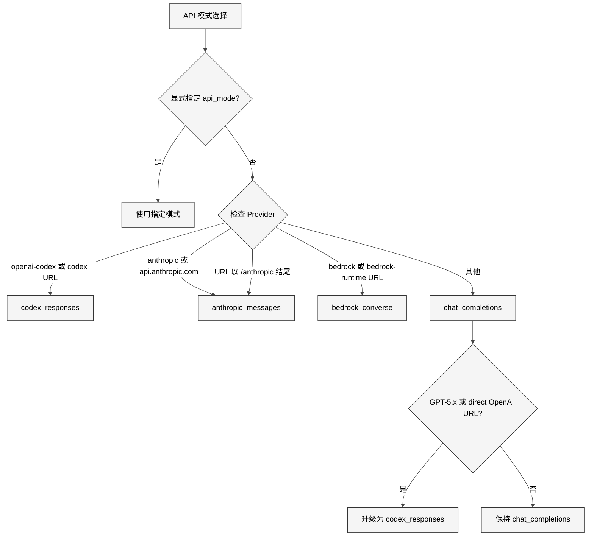
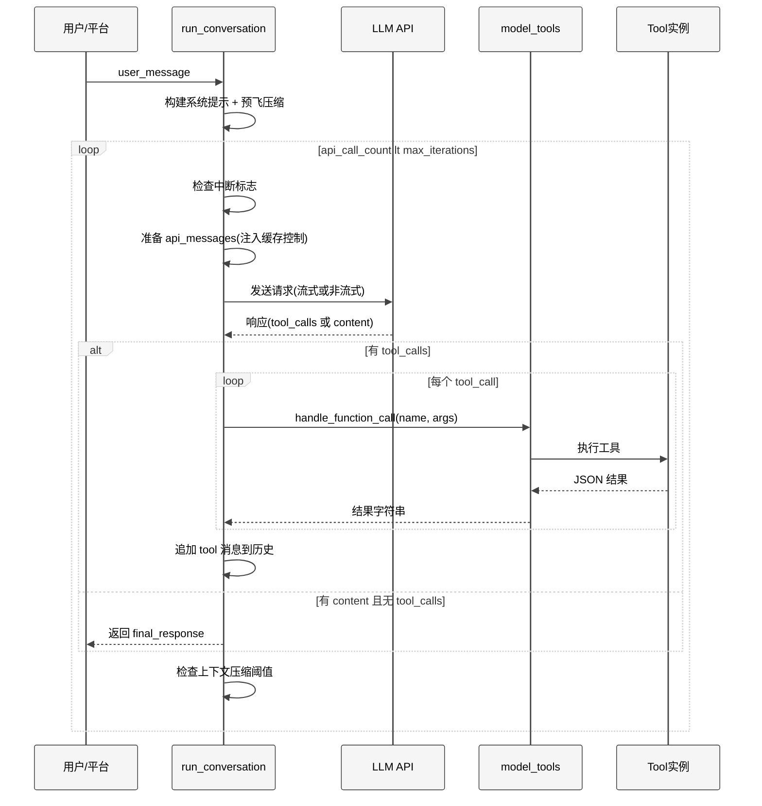
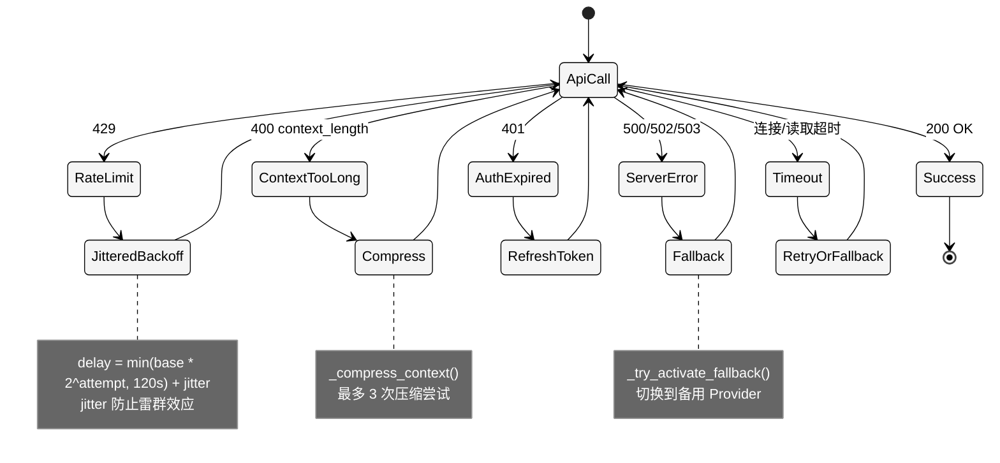

# 第5章 Agent 核心循环

## 3.1 本质：一个带有韧性工程的 ReAct 循环

`run_agent.py` 的 `AIAgent` 类是 Hermes Agent 的心脏。它的核心是一个经典的 ReAct 循环——模型思考、生成工具调用、执行工具、将结果回注上下文、重复直到模型给出最终回复。但 11,487 行代码中，纯粹的循环逻辑不到 100 行，剩余 11,000+ 行全部是**韧性工程**：错误分类、自动重试、Provider 故障转移、上下文压缩、中断处理、并行工具执行、预算控制、流式传输、多 API 协议适配。

`AGENTS.md` 中对这个循环的描述非常精炼：

> The core loop is inside `run_conversation()` — entirely synchronous.

同步设计是一个深思熟虑的选择。它意味着 Agent 的执行流程是线性可追踪的——没有 callback hell，没有 event loop 竞态。异步工具通过 `model_tools.py` 的 `_run_async()` 桥接函数跳入事件循环，但 Agent 本身始终在一个线程上同步推进。

## 3.2 核心问题

核心循环面对的工程挑战可以归纳为四个：

1. **多协议适配**：四种 API 模式（chat_completions、codex_responses、anthropic_messages、bedrock_converse）有完全不同的请求/响应格式，但循环逻辑不能为每种协议写一遍。
2. **错误恢复的复杂性**：API 调用可能遇到限流（429）、上下文超长（400）、认证过期（401）、Provider 宕机（500/502/503）、网络超时、流中断等至少 10 种错误类型，每种需要不同的恢复策略。
3. **预算与终止**：Agent 不能无限循环。但简单的"超过 N 次就停止"会导致模型在复杂任务的关键步骤被强行终止。需要更精细的预算管理。
4. **上下文膨胀**：每次工具调用的结果都会增加上下文长度。一个 90 次迭代的任务可能产生数十万 token 的上下文，远超模型的窗口。

## 3.3 AIAgent 类结构

`AIAgent.__init__()` 从 L559 到约 L940，接受超过 50 个参数。这些参数可以分为几个类别：

| 类别 | 关键参数 | 作用 |
|------|---------|------|
| 模型与 Provider | model, base_url, api_key, provider, api_mode | 决定调用哪个 API |
| 运行控制 | max_iterations(90), tool_delay(1.0) | 循环预算 |
| 工具过滤 | enabled_toolsets, disabled_toolsets | 启用/禁用工具集 |
| 回调 | tool_progress_callback, thinking_callback 等 10 个 | 与 UI 层通信 |
| 会话 | session_id, session_db, platform | 持久化与多平台 |
| 子代理 | iteration_budget, parent_session_id | 委派相关 |

`__init__` 中最关键的逻辑是 **API 模式自动检测**（L690-L745）。通过 Provider 名称、base_url 模式匹配和模型名称，自动选择正确的 API 协议：

<div style="background: #ffffff !important; background-color: #ffffff !important; padding: 16px; border-radius: 8px; margin: 16px 0;" bgcolor="#ffffff">



</div>

## 3.4 run_conversation() 主循环

`run_conversation()` 从 L8107 开始，是一个约 3,100 行的方法。整体结构可以分为四个阶段：

### 阶段一：准备（L8107-L8418）

1. 清理输入：surrogate 字符替换、内存上下文标签清理
2. 重置重试计数器（共 8 个不同的计数器）
3. 预检连接：清理死 TCP 连接
4. 构建/恢复系统提示词
5. 预飞压缩：如果已有历史超过阈值，先压缩再进循环
6. 执行插件 `pre_llm_call` 钩子

### 阶段二：主循环（L8469+）

核心 while 条件简洁而精确：

```python
while (api_call_count < self.max_iterations 
       and self.iteration_budget.remaining > 0) or self._budget_grace_call:
```

这里有三层预算控制：(1) `api_call_count` 是本次 turn 的局部计数器；(2) `iteration_budget` 是跨子代理共享的全局预算（`IterationBudget` 类，L170-L211）；(3) `_budget_grace_call` 是预算耗尽后的一次宽限调用。

### 阶段三：API 调用与错误处理

每次迭代内部又有一个 `while retry_count < max_retries` 的重试循环（L8696+），处理 API 调用的各种失败。

### 阶段四：工具执行与结果注入

当模型返回 `tool_calls` 时，依次或并行执行工具，将结果作为 `role: tool` 消息追加到历史中。

## 3.5 对话循环流程

<div style="background: #ffffff !important; background-color: #ffffff !important; padding: 16px; border-radius: 8px; margin: 16px 0;" bgcolor="#ffffff">



</div>

## 3.6 错误处理与重试机制

Hermes Agent 的错误处理不是简单的"出错就重试"。`agent/error_classifier.py` 的 `classify_api_error()` 函数将 API 错误分类为不同的 `FailoverReason`，每种原因对应不同的恢复策略：

<div style="background: #ffffff !important; background-color: #ffffff !important; padding: 16px; border-radius: 8px; margin: 16px 0;" bgcolor="#ffffff">



</div>

**Jittered Backoff**（`agent/retry_utils.py`）是重试延迟计算的核心。它使用装饰相关的抖动避免雷群效应：

```python
delay = min(base_delay * (2 ** (attempt - 1)), max_delay)
jitter = random.uniform(0, jitter_ratio * delay)
return delay + jitter
```

抖动种子从 `time.time_ns() ^ (tick * 0x9E3779B9)` 生成，`0x9E3779B9` 是黄金比例的 32 位近似，确保即使在粗粒度时钟的系统上也能产生足够的去相关性。线程安全的单调计数器 `_jitter_counter` 避免了并发重试使用相同种子的问题。

## 3.7 IterationBudget 与预算控制

`IterationBudget` 类（L170-L211）是线程安全的迭代计数器。设计要点：

- 每个 Agent（父或子）拥有独立的 `IterationBudget`
- 父 Agent 预算上限为 `max_iterations`（默认 90）
- 子 Agent 预算上限为 `delegation.max_iterations`（默认 50）
- `execute_code` 工具的迭代会通过 `refund()` 退还，因为程序化工具调用不应消耗 Agent 预算
- 预算耗尽时不立即终止，而是注入一条消息告知模型，然后给予一次 `_budget_grace_call`

这种"通知-宽限"模式比硬截断更优雅——模型有机会在最后一次调用中输出总结，而不是被中途截断。代码中的注释解释了为什么不采用渐进式压力警告（issue #7915）：中间警告会导致模型"提前放弃"复杂任务。

## 3.8 中断处理

中断机制通过三个层次实现：

1. **标志位**：`self._interrupt_requested`（布尔值）和 `self._interrupt_message`（触发中断的消息内容）
2. **线程作用域**：`tools/interrupt.py` 的 `set_interrupt(flag, thread_id)` 将中断信号绑定到特定线程，避免跨 Agent 干扰
3. **子代理级联**：`self._active_children` 列表跟踪所有运行中的子 Agent，中断时遍历传播

主循环在每次迭代开头检查中断（L8474-L8479）：

```python
if self._interrupt_requested:
    interrupted = True
    _turn_exit_reason = "interrupted_by_user"
    break
```

中断后的清理工作包括：持久化当前消息历史到 session DB、清理活动环境（VM/浏览器）、记录中断原因到日志。

## 3.9 上下文压缩

当对话历史超过阈值时，`_compress_context()` 方法（L7047）执行压缩：

1. 估算当前 token 数（包括 tool schema 的 20-30K+ token）
2. 保护首尾 N 条消息不被压缩（`protect_first_n`、`protect_last_n = 20`）
3. 用辅助模型（`auxiliary.compression`）总结中间部分
4. 创建新会话继续对话
5. 更新系统提示词中的记忆部分

压缩阈值由 `compression.threshold`（默认 0.50）和模型的上下文窗口长度共同决定。`run_conversation()` 在进入主循环前还执行**预飞压缩**（L8322-L8381）——如果用户切换到上下文窗口更小的模型，已有历史可能已经超标，需要先压缩再开始新的对话轮次。预飞压缩最多执行 3 次 pass，每次只总结中间 N 条消息。

## 3.10 并行工具执行

当模型在单次响应中返回多个 tool_calls 时，Agent 会尝试并行执行。`_should_parallelize_tool_batch()` 函数（L267-L308）检查安全性：

- `_NEVER_PARALLEL_TOOLS`（如 `clarify`）绝不并行——它需要用户交互
- `_PARALLEL_SAFE_TOOLS`（如 `read_file`、`web_search`）可以安全并行
- `_PATH_SCOPED_TOOLS`（如 `read_file`、`write_file`、`patch`）只在操作不同路径时并行
- 最大并发数：`_MAX_TOOL_WORKERS = 8`

路径重叠检测由 `_paths_overlap()` 实现，它比较两个路径的公共前缀。例如 `/a/b` 和 `/a/b/c` 被视为重叠，而 `/a/b` 和 `/a/c` 不重叠。

## 3.11 工具调度链

`model_tools.py` 是 `run_agent.py` 和 `tools/` 之间的编排层。它的核心 API：

| 函数 | 职责 |
|------|------|
| `discover_builtin_tools()` | AST 扫描 tools/ 目录，导入自注册模块 |
| `get_tool_definitions()` | 根据启用/禁用的 toolsets 返回 schema 列表 |
| `handle_function_call()` | 查找注册表、执行 handler、包装结果 |

`handle_function_call()` 的返回值始终是 JSON 字符串——这是一个硬性约定。所有 handler 都必须返回 `json.dumps(...)` 格式的结果。这简化了消息构建：结果直接作为 `tool` 消息的 `content` 字段。

异步工具的处理由 `_run_async()` 函数（L81-L108）完成。它检测当前线程是否已有运行中的事件循环：
- 无循环（CLI 路径）：使用持久化 `_tool_loop` 避免反复创建/销毁
- 有循环（Gateway 路径）：启动独立线程以避免嵌套 loop 冲突
- Worker 线程：使用 `thread-local` 持久化 loop 避免跨线程竞争

## 3.12 陷阱与注意事项

1. **surrogate 字符崩溃**。从 Google Docs 或 Word 粘贴的文本可能包含孤立的 UTF-16 surrogate（U+D800-U+DFFF），它们在 JSON 序列化时会导致 OpenAI SDK 崩溃。`_sanitize_surrogates()` 和 `_sanitize_messages_surrogates()` 在输入和消息历史两个层面进行防御。

2. **空响应重试**。某些模型在工具调用后可能返回空的 `content`。Agent 使用 `_empty_content_retries` 计数器，最多重试 3 次，超过后注入一条用户消息"Please provide your response"。

3. **thinking 标签泄露**。部分模型（尤其是 Moonshot）在 reasoning_content 中使用 `<scratchpad>` 标签但不关闭。`has_incomplete_scratchpad()` 检测并在重试时修复。

4. **流式 stale 检测**。流式传输路径有 90 秒的 stale-stream 检测——如果 Provider 保持 SSE 连接但不发送实际 token，Agent 会主动断开并重试。

## 3.13 与同类项目的对比

| 维度 | Hermes Agent | LangChain ReAct | OpenAI Agents SDK |
|------|-------------|-----------------|-------------------|
| 循环设计 | 同步 while 循环 | 异步 AgentExecutor | 异步 Runner |
| 重试策略 | 分类重试 + jittered backoff | 固定重试 | SDK 内置 |
| 故障转移 | Provider 级自动切换 | 无 | 无 |
| 上下文管理 | 压缩 + 预飞检查 | ConversationBufferMemory | 无内置 |
| 并行工具 | 安全性检测后并行 | 不支持 | 支持 |
| 预算控制 | 通知-宽限模式 | 硬截断 | 无 |

## 3.14 遗留问题

1. **方法长度**。`run_conversation()` 约 3,100 行，是一个难以测试和维护的超长方法。错误处理逻辑与正常流程深度交织，重构需要仔细提取"API 调用+重试"、"工具执行+并行化"、"上下文管理"为独立方法或类。

2. **四种 API 模式的条件分支**。chat_completions、codex_responses、anthropic_messages、bedrock_converse 的差异散布在 `__init__`、`_build_api_kwargs()`、`_interruptible_api_call()`、响应解析等多处。引入 Strategy 模式（每种 API 模式一个策略类）可以显著降低认知负荷。

3. **全局变量问题**。`model_tools.py` 中的 `_last_resolved_tool_names` 和 `_tool_loop` 是进程全局变量。虽然有线程级保护，但在子代理场景下仍可能产生微妙的竞态。

4. **同步设计的瓶颈**。在 Gateway 模式下，每个用户消息创建一个新的 AIAgent 实例在同一线程上同步执行。高并发场景（如繁忙的 Telegram 群）需要依赖 Gateway 层的异步调度和线程池来获得吞吐量，Agent 本身无法利用 asyncio 的协作式并发优势。
