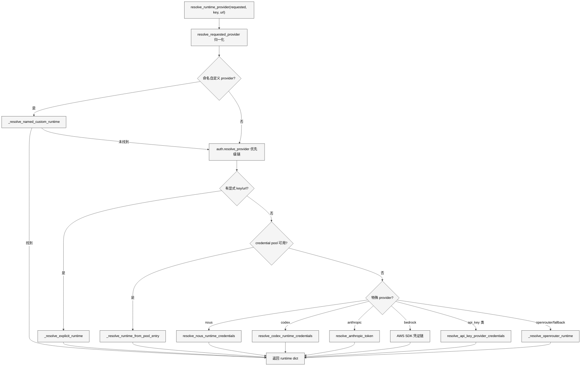
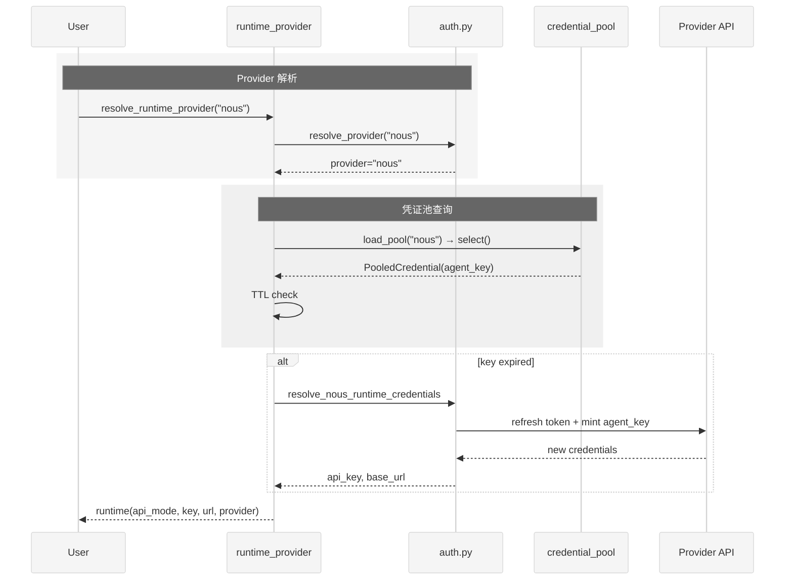

# 第7章 Provider 与 API 模式

## 1 本质是什么

Provider 系统是 Hermes Agent 的"通信基础设施"——它负责将一个抽象的 `(provider, model)` 对解析为具体的 `(api_mode, api_key, base_url)` 三元组，使上层 Agent 逻辑完全不关心底层 API 协议差异。这个解析过程涉及 `runtime_provider.py`（963 行）、`auth.py`（3300 行）、`models.py`（2026 行）和 `anthropic_adapter.py`（1438 行）四个文件共计近 8000 行代码，是 Hermes 代码库中规模最大的子系统之一。

Provider 系统要解决的根本矛盾是：LLM 行业没有统一的 API 标准。OpenAI 的 Chat Completions、OpenAI 的 Responses API、Anthropic 的 Messages API、AWS 的 Bedrock Converse API 在请求格式、认证方式、工具调用协议上各不相同。Hermes 通过一个统一的解析层将 25+ 个 provider（含用户自定义端点）归一到 4 种 API 模式，使同一段 Agent 循环代码能无缝切换任何 provider。

## 2 核心问题和痛点

**第一，provider 数量的组合爆炸。** `CANONICAL_PROVIDERS` 列表包含 25 个官方 provider（从 Nous Portal 到 AWS Bedrock），加上用户自定义端点，每个 provider 有独立的认证方式、base URL、API 模式偏好。一个 `resolve_runtime_provider` 调用需要在这些组合中找到正确路径。

**第二，凭证来源多样。** 同一个 provider 的凭证可能来自环境变量、config.yaml 文件、OAuth token 刷新、credential pool 轮换、外部进程（Copilot ACP）等多个来源，优先级链复杂。

**第三，API 模式与 provider 不是简单映射。** 同一个 provider 下不同模型可能使用不同 API 模式——例如 GitHub Copilot 的 GPT-5.x 使用 Responses API，而 Claude 使用 Messages API；OpenCode Zen 的 Claude 模型走 anthropic_messages，GPT 模型走 codex_responses，其余走 chat_completions。

**第四，OAuth 流程的工程复杂度。** Nous Portal 使用设备码授权流程（device code flow），OpenAI Codex 和 Qwen 使用外部 OAuth 流程，每个都涉及 token 刷新、agent key 铸造、过期检测等状态机逻辑。

## 3 解决思路与方案

Hermes 将 provider 解析分为三层：身份识别（这是哪个 provider）、凭证获取（用什么 key 访问）、模式决定（用哪种 API 协议）。

### 3.1 四种 API 模式

`_VALID_API_MODES` 定义了 Hermes 支持的四种 API 协议：

| API 模式 | 协议 | 典型 Provider | 工具调用格式 |
|:---|:---|:---|:---|
| `chat_completions` | OpenAI Chat Completions | OpenRouter, Nous, Gemini, DeepSeek 等 | function calling |
| `codex_responses` | OpenAI Responses API | OpenAI Codex, GPT-5.x via Copilot | 内置 code_interpreter |
| `anthropic_messages` | Anthropic Messages API | Anthropic, Bedrock Claude, MiniMax | tool_use content block |
| `bedrock_converse` | AWS Bedrock Converse | Bedrock Nova, Llama, DeepSeek | toolUse in converse |

模式选择的优先级链为：显式配置 (`config.yaml model.api_mode`) > URL 自动检测 (`_detect_api_mode_for_url`) > provider 默认值 > 模型名推断。

## 4 实现细节关键点

### 4.1 Provider 注册表

`auth.py` 中的 `PROVIDER_REGISTRY` 是一个包含 25 个 `ProviderConfig` 数据类实例的字典，每个条目定义了：

- `auth_type`：四种认证类型之一——`oauth_device_code`（Nous）、`oauth_external`（Codex、Qwen）、`api_key`（大部分 provider）、`external_process`（Copilot ACP）、`aws_sdk`（Bedrock）
- `inference_base_url`：默认推理端点
- `api_key_env_vars`：环境变量检查顺序，如 Copilot 的 `("COPILOT_GITHUB_TOKEN", "GH_TOKEN", "GITHUB_TOKEN")`
- `base_url_env_var`：可选的端点覆盖环境变量

`models.py` 中的 `CANONICAL_PROVIDERS` 列表（25 个 `ProviderEntry`）提供了面向用户的展示信息（slug、label、tui_desc）。两个注册表保持同步是一个隐式约束。

### 4.2 别名解析

`_PROVIDER_ALIASES` 字典包含 50+ 个别名映射（如 `glm` -> `zai`、`claude` -> `anthropic`、`grok` -> `xai`），使用户可以用各种自然名称指定 provider。`normalize_provider` 函数是所有别名解析的入口，确保内部始终使用规范 slug。

`parse_model_input` 支持 `provider:model` 语法，带有冒号歧义消解——只有当冒号左侧是已知 provider 名称时才视为 provider 分隔符，避免误解 `anthropic/claude-3.5-sonnet:beta` 这样包含冒号的模型名。还支持 `custom:name:model` 三元组语法用于命名自定义 provider。

### 4.3 Credential Pool 与轮换策略

`credential_pool.py`（1418 行）实现了多凭证池机制，支持同一 provider 下注册多个 API key，通过不同策略轮换使用：

- `fill_first`：优先用第一个，直到耗尽
- `round_robin`：依次轮换
- `random`：随机选择
- `least_used`：选用使用次数最少的

每个凭证条目（`PooledCredential`）跟踪状态（ok/exhausted）、使用次数、最后使用时间和过期时间。当凭证收到 429（限流）或 402（额度不足）响应时，进入 1 小时冷却期（`EXHAUSTED_TTL_429_SECONDS`）。

### 4.4 OAuth 流程

Nous Portal 的 OAuth 设备码流程在 `auth.py` 中实现：

1. 向 Portal 请求 device code
2. 打开浏览器让用户授权
3. 以 `DEVICE_AUTH_POLL_INTERVAL_CAP_SECONDS`（1 秒）间隔轮询
4. 获取 access_token 后铸造 agent_key（短期推理凭证，30 分钟 TTL）
5. 运行时通过 `resolve_nous_runtime_credentials` 检查 TTL，必要时刷新

OpenAI Codex 和 Qwen 使用类似但略有不同的外部 OAuth 流程（`oauth_external`），凭证同样持久化到 `~/.hermes/auth.json`。

### 4.5 API 模式自动检测

`runtime_provider.py` 中的几个关键函数负责根据模型名和 URL 推断 API 模式：

- `_detect_api_mode_for_url`：检测到 `api.openai.com` 时自动使用 `codex_responses`
- `copilot_model_api_mode`（models.py）：GPT-5.x（除 gpt-5-mini）使用 Responses API，Claude 模型检查 catalog 的 `supported_endpoints` 是否仅有 `/v1/messages`
- `opencode_model_api_mode`（models.py）：OpenCode Zen 的 Claude 走 `anthropic_messages`、GPT 走 `codex_responses`；OpenCode Go 的 MiniMax 走 `anthropic_messages`，其余走 `chat_completions`

URL 后缀约定也参与检测：以 `/anthropic` 结尾的 base URL（如 MiniMax 的 `api.minimax.io/anthropic`）自动切换到 `anthropic_messages` 模式。

### 4.6 模型目录与验证

`models.py` 维护了两层模型目录：

1. **静态目录** `_PROVIDER_MODELS`：为每个 provider 预定义模型列表（Nous 28 个、Copilot 14 个、OpenCode Zen 30+ 个等）
2. **动态目录** `provider_model_ids`：优先调用 provider API 的 `/models` 端点获取实时列表，失败则回退到静态目录

`validate_requested_model` 提供了模型验证逻辑：先格式检查（非空、无空格），再 API 探测，最后模糊匹配（`difflib.get_close_matches`，cutoff 0.9 自动纠错，cutoff 0.5 提供建议）。对于 Bedrock 这样不支持 HTTP `/models` 的 provider，会通过 AWS SDK 的 `ListFoundationModels` + `ListInferenceProfiles` 做动态发现。

## 5 易错点和注意事项

**api_mode 泄漏问题。** `_provider_supports_explicit_api_mode` 解决了一个微妙 bug：当用户切换 provider 后，config.yaml 中旧 provider 的 `api_mode` 可能泄漏到新 provider。例如从 Anthropic（anthropic_messages）切换到 OpenRouter（chat_completions），如果不检查 provider 匹配，会错误地使用 anthropic_messages 模式。

**Nous agent_key 的 TTL 陷阱。** agent_key 有 30 分钟 TTL，credential pool 的 `select()` 不做刷新（避免在非运行时上下文触发网络调用）。必须在运行时通过 `_agent_key_is_usable` 二次检查，过期则跳过 pool 走 `resolve_nous_runtime_credentials` 刷新路径。

**OpenCode 的 /v1 路径冲突。** Anthropic SDK 会自动在 base_url 后追加 `/v1/messages`。如果 base_url 已经包含 `/v1`，就会变成 `.../v1/v1/messages`。代码通过 `re.sub(r"/v1/?$", "", base_url)` 在 OpenCode 的 anthropic_messages 路径上显式剥离。

**自定义 provider 的双格式兼容。** config.yaml 的自定义 provider 同时支持新格式（`providers:` dict）和旧格式（`custom_providers:` list），且旧格式的 dict 写法（缺少 YAML `-` 前缀）会产生告警。两种格式的解析逻辑是独立的代码路径。

## 6 竞品对比

| 维度 | Hermes Agent | Claude Code | OpenCode |
|:---|:---|:---|:---|
| Provider 数量 | 25+ 内置 + 自定义 | 1（Anthropic） | 约 10 |
| API 模式 | 4 种协议统一 | 仅 Anthropic Messages | 3 种（OpenAI, Anthropic, Copilot） |
| 凭证池 | 多 key 轮换，4 种策略 | 无 | 无 |
| OAuth 支持 | 3 个 OAuth provider | 仅 Anthropic OAuth | 无 |
| 别名系统 | 50+ 别名映射 | 无 | 有限别名 |
| 模型验证 | 实时 API + 模糊匹配 | 无动态验证 | 有限验证 |
| 自定义端点 | 命名 provider + pool | 无 | base URL 覆盖 |
| 定价查询 | 实时 /models 定价 | 无 | 无 |

Hermes 的 provider 系统在本研究比较范围内属于覆盖面很广的一类实现：它同时支持 4 种 API 协议、凭证池轮换和 25+ provider。这更适合被理解为“覆盖面较广”的实现，而不是简单归纳为绝对最全面。

## 7 仍存在的问题和缺陷

**auth.py 的单文件膨胀。** 3300 行的 `auth.py` 承载了太多职责：ProviderConfig 注册、OAuth 设备码流程、token 刷新、凭证持久化、provider 解析。这些应该拆分为独立模块。

**静态模型目录的维护负担。** `_PROVIDER_MODELS` 中的硬编码列表需要频繁手动更新，每次 provider 新增模型都需要发 PR。虽然有动态 `/models` 查询作为补充，但静态列表仍是离线环境的唯一数据源。

**缺少 provider 健康检查。** `resolve_runtime_provider` 返回凭证后不验证其有效性。如果 API key 已被吊销但格式正确，错误只会在第一次 API 调用时暴露。一个可选的轻量级 health probe（如调用 `/models` 端点）可以在启动时提前发现问题。

**Bedrock 的双路径复杂度。** Bedrock 同时支持 Anthropic SDK 路径（Claude 模型）和 Converse API 路径（其他模型），由 `is_anthropic_bedrock_model` 在运行时决定。这意味着同一个 `provider="bedrock"` 可能返回 `api_mode="anthropic_messages"` 或 `api_mode="bedrock_converse"`，增加了下游代码的分支复杂度。

**自动 provider 检测的误判。** `detect_provider_for_model` 在用户输入裸模型名时尝试自动匹配 provider，但当同名模型存在于多个 provider 目录（如 `kimi-k2.5` 同时在 kimi-coding、moonshot、opencode-zen 中）时，返回的是第一个遍历命中的，而非最优的。
