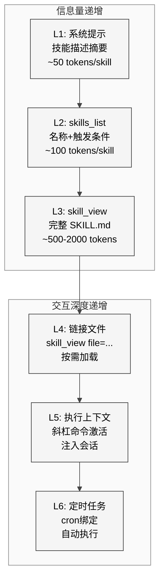
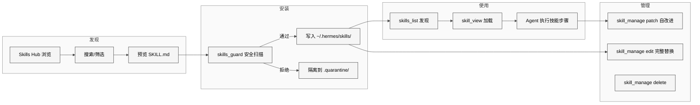

# 第9章 Skill系统

## 16.1 本质

Skill系统是Hermes Agent的**程序性知识管理层**。如果说Memory存储的是"事实"（用户偏好、项目上下文），那么Skill存储的就是"方法"——一组可复用的、结构化的操作指令，以`SKILL.md`文件的形式存在于文件系统中。

整个Skill系统由六个模块构成（总计约5500行代码）：

| 模块 | 行数 | 职责 |
|------|------|------|
| `tools/skills_tool.py` | ~1315 | 列表与查看（只读门面） |
| `tools/skill_manager_tool.py` | ~1100 | CRUD操作（写入门面） |
| `tools/skills_hub.py` | ~900 | Hub浏览与安装 |
| `tools/skills_guard.py` | ~700 | 安全扫描 |
| `agent/skill_utils.py` | ~100 | 共享工具函数 |
| `agent/skill_commands.py` | ~150 | 斜杠命令集成 |

其本质是一个**六层渐进式知识加载系统**：从最轻量的元数据列表到完整的技能内容注入，每一层的信息量和成本递增，Agent按需决定加载深度。

## 16.2 核心问题

1. **上下文窗口压力**：一个安装了50+技能的Agent，如果每轮都注入全部技能内容，会占用大量上下文。如何在"充分利用技能"和"节省token"之间平衡？
2. **安全边界**：技能本质上是注入Agent系统提示的自由文本。社区或用户创建的技能可能包含提示注入攻击。
3. **格式标准化**：技能需要同时被人类阅读和Agent解析，如何设计一种既友好又机器可读的格式？
4. **跨平台兼容**：某些技能仅适用于macOS（如截屏工具），如何在Linux上优雅地隐藏它们？
5. **来源信任**：内置技能、用户创建技能、社区Hub技能的信任度不同，安装策略应该有何区别？

## 16.3 解决方案

### 渐进式披露架构

<div style="background: #ffffff !important; background-color: #ffffff !important; padding: 16px; border-radius: 8px; margin: 16px 0;" bgcolor="#ffffff">



</div>

这种渐进式披露确保Agent在大多数情况下只消耗L1-L2级别的token（每个技能约50-100 tokens），只在确认需要某个技能时才加载L3及以上内容。

### Skill文件格式

```yaml
---
name: my-skill
description: 一行描述
version: 1.0.0
triggers:
  - "关键词A"
  - "关键词B"
platform: darwin          # 可选：darwin / linux / win32
env:
  - SOME_API_KEY          # 所需环境变量
credentials:
  - ~/.config/some.json   # 所需凭证文件
---

（Markdown正文：Agent应遵循的操作步骤）
```

`agent/skill_utils.py`中的`parse_frontmatter()`（L52-86）负责解析：先用正则匹配`---`分隔的YAML块，再用`yaml_load()`（L34-46）安全解析——它仅支持`yaml.safe_load()`，拒绝任何自定义构造器。

### Skill生命周期

<div style="background: #ffffff !important; background-color: #ffffff !important; padding: 16px; border-radius: 8px; margin: 16px 0;" bgcolor="#ffffff">



</div>

## 16.4 实现细节

### skills_list：六级加载优先级

`skills_tool.py`的`skills_list()`（L647-713）按以下优先级扫描技能目录：

1. **项目级**：`{project}/.hermes/skills/` — 项目专属技能
2. **用户级**：`~/.hermes/skills/` — 全局用户技能
3. **插件提供**：通过`_plugin_skill_dirs()`发现的第三方技能
4. **Agent创建**：`~/.hermes/agent-skills/` — Agent在运行中自动创建的技能
5. **内置**：Hermes安装包自带的技能
6. **Hub安装**：从Skills Hub下载的技能

每个目录下递归查找`SKILL.md`文件，解析frontmatter提取`name`、`description`、`triggers`。返回时仅包含元数据摘要——不返回Markdown正文，这是渐进式披露的L2层。

### skill_view：按需深度加载

`skill_view()`（L804-1315）支持两种模式：

- **默认模式**：返回完整`SKILL.md`内容，包括frontmatter和正文（L3层）
- **文件模式**（`file`参数）：加载技能引用的链接文件，如模板或示例代码（L4层）

加载时执行平台兼容性检查：`skill_matches_platform()`（`skill_utils.py` L92-100）比较frontmatter中的`platform`字段与`sys.platform`，不匹配时标记但不阻止加载——因为Agent可能需要为用户查看跨平台技能。

环境依赖检查（L900-930）验证frontmatter中声明的`env`变量和`credentials`文件是否存在，缺失时在返回中附加警告信息。

### skill_manage：CRUD操作

`skill_manager_tool.py`的`skill_manage()`（L616-675）是统一入口，支持六种操作：

- **create**（L300-380）：验证名称（仅`[a-z0-9-]`，长度3-64），创建`~/.hermes/skills/{name}/SKILL.md`
- **edit**（L382-420）：完整替换SKILL.md内容
- **patch**（L422-480）：局部修改——Agent可以在使用技能后发现改进空间，通过patch更新
- **delete**（L482-510）：删除技能目录，带确认机制
- **write_file**（L512-560）：向技能目录写入辅助文件
- **remove_file**（L562-600）：删除技能目录中的辅助文件

所有写操作都经过`_security_scan_skill()`（L56-74）调用`skills_guard`进行安全扫描。文件写入使用`_atomic_write_text()`（L268-298）确保原子性——先写临时文件再rename，防止写入中途崩溃导致数据损坏。

### skills_guard：安全扫描引擎

`tools/skills_guard.py`（约700行）是技能系统的安全基石。

**威胁模式库**（`THREAT_PATTERNS`，L82-484）定义了80+条正则规则，分为8大类：

| 类别 | 规则数 | 示例模式 |
|------|--------|----------|
| 提示注入 | 15 | `ignore previous`, `you are now` |
| 数据窃取 | 12 | `curl.*\|.*base64`, `webhook.site` |
| 破坏性命令 | 10 | `rm -rf /`, `:(){ :\|:& };:` |
| 持久化 | 8 | `crontab`, `.bashrc`, `launchd` |
| 混淆 | 10 | `base64.*decode`, `\\x[0-9a-f]` |
| 权限提升 | 8 | `sudo`, `chmod 777`, `setuid` |
| 凭证暴露 | 10 | `OPENAI_API_KEY`, `AWS_SECRET` |
| 网络滥用 | 7 | `reverse.*shell`, `nc -l` |

每条规则有`severity`（info/low/medium/high/critical）和`category`标签。

**信任层级**和**安装策略**（`INSTALL_POLICY`，L642-676）：

| 信任级别 | 来源 | high/critical发现处理 |
|----------|------|----------------------|
| builtin | Hermes内置 | 允许安装 |
| trusted | 用户手动标记 | 允许安装（附警告） |
| community | Skills Hub | 拒绝安装 |
| agent-created | Agent创建 | 拒绝安装 |

`scan_skill()`（L595-639）返回一个`ScanResult`对象，包含所有匹配的规则、总体评级、以及按严重度分组的发现列表。

### Skills Hub

`tools/skills_hub.py`（约900行）管理从外部Hub浏览和安装技能的完整流程。关键数据结构：

- `.hub/` 目录：存放锁文件、隔离目录、审计日志
- `LOCK_FILE`：防止并发安装竞争
- `QUARANTINE_DIR`：安全扫描失败的技能被隔离在此
- `SkillMeta`和`SkillBundle`数据类：技能元数据和打包格式

源适配器模式允许支持多个Hub来源，当前主要适配GitHub仓库。

## 16.5 易踩的坑

1. **frontmatter格式敏感**：YAML块必须被恰好两个`---`行包围，且必须位于文件开头。如果第一行不是`---`，解析器会将整个文件视为无元数据的纯Markdown技能——它仍然可以加载，但会丢失所有结构化信息。

2. **技能名称全局唯一性不保证**：六级加载优先级意味着项目级技能可以"覆盖"同名用户级技能。这是功能而非bug，但如果用户不了解优先级顺序，可能产生困惑。

3. **patch操作的脆弱性**：`patch`操作接受的是文本替换指令，如果原始文本因Agent的hallucination与实际内容不匹配，patch会静默失败。缺乏语义级别的patch能力。

4. **安全扫描的false positive**：80+条正则不可避免地产生误报。例如，一个教用户如何配置SSH的技能可能触发"凭证暴露"规则。当前的处理是报告但由信任层级决定是否阻止。

5. **`yaml.safe_load()`限制**：虽然安全，但不支持YAML的锚点（`&`/`*`）和自定义标签，某些复杂的frontmatter会解析失败。

## 16.6 与同类方案的比较

| 维度 | Hermes Skills | Claude Projects | GPTs Knowledge |
|------|--------------|----------------|----------------|
| 存储格式 | SKILL.md + frontmatter | 自由文本 | 上传文件 |
| 安全扫描 | 80+规则引擎 | 无 | 无 |
| 渐进加载 | 6层渐进式 | 全量注入 | RAG检索 |
| CRUD | Agent可自主CRUD | 人工管理 | 人工管理 |
| 分发机制 | Skills Hub | 无 | GPT Store |
| 平台适配 | frontmatter声明 | 无 | 无 |
| 开放标准 | agentskills.io | 私有 | 私有 |

Hermes的技能系统最大的创新在于**Agent可以自主创建和改进技能**——这不仅是一个知识管理系统，更是一个自进化的基础设施（详见第10章）。

## 16.7 遗留问题

1. **缺乏版本管理**：`SKILL.md`的`version`字段存在于frontmatter中，但没有实际的版本控制机制——没有changelog、没有回滚、没有升级通知。
2. **搜索能力原始**：`skills_list`仅返回名称和描述，没有全文搜索或语义搜索。当技能数量超过100个时，Agent可能需要多次调用才能找到合适的技能。
3. **技能间依赖未建模**：技能A可能依赖技能B的存在（如"先安装docker技能，再使用k8s部署技能"），但当前格式不支持声明依赖关系。
4. **Hub生态尚在起步**：Skills Hub的源适配器当前主要支持GitHub，缺乏类似npm registry的中心化索引和版本解析。
5. **审计日志不完整**：`.hub/`目录下的审计日志记录安装事件，但不记录技能的使用频次和效果，无法为技能推荐提供数据支持。
