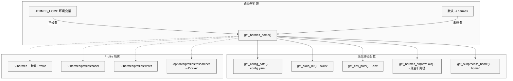
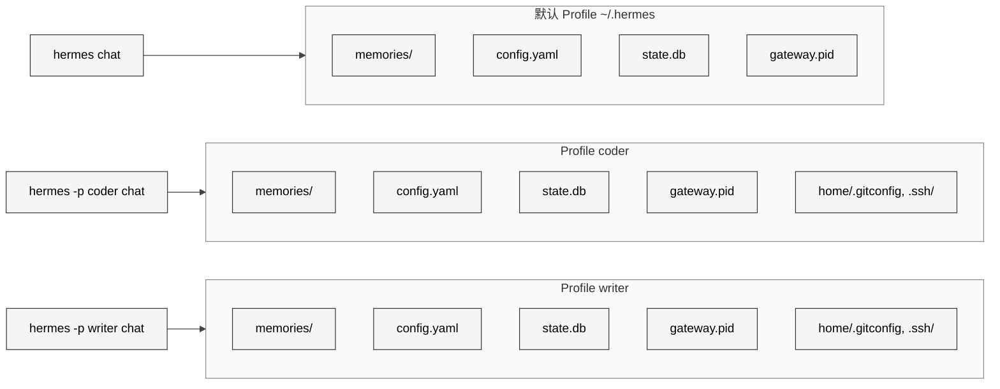

# 第11章 状态管理

## 9.1 本质

状态管理回答的是 Agent 运行时最基础的问题：**我的家在哪里、我的配置放在哪里、我和其他实例如何互不干扰**。在 Hermes Agent 中，这个问题被抽象为一个路径系统——以 `HERMES_HOME` 环境变量为根，衍生出配置、记忆、会话、技能、日志等所有子目录。

与传统应用的状态管理不同，Hermes 面临"多身份"场景：同一台机器上可能运行多个 Profile（如 `coder`、`writer`、`researcher`），每个 Profile 都是完全独立的 Agent 实例，拥有自己的记忆、技能、会话历史、Gateway 进程乃至 Git 身份。状态管理的核心任务就是确保这些并行世界互不渗透。

## 9.2 核心问题

1. **路径耦合**：代码中到处散落的 `~/.hermes/config.yaml`、`~/.hermes/memories/` 等硬编码路径，一旦部署环境改变（Docker、WSL、Termux）或启用 Profile，就会全面崩溃。
2. **Profile 隔离**：多个 Agent 实例共享同一个操作系统用户（尤其在 Docker 中），需要隔离到文件系统级别——不仅是 Hermes 自己的文件，还包括 Git、SSH、npm 等外部工具的配置。
3. **Schema 演进**：SQLite 数据库的表结构需要跨版本平滑升级，不能丢数据也不能要求用户手动迁移。
4. **环境检测**：同一份代码需要正确识别 WSL、Docker、Termux 等特殊环境，并调整行为（如浏览器启动方式、文件路径格式）。
5. **时区一致性**：Agent 的"现在几点"看似简单，但在跨时区部署、服务端托管场景下，需要可配置的时区支持。

## 9.3 解决思路

Hermes 采用"单一根目录 + 函数式路径解析 + Profile 目录克隆"的架构：

<div style="background-color: #ffffff; padding: 16px; border-radius: 8px; margin: 16px 0;" bgcolor="#ffffff">



</div>

整个路径系统的核心是一个 17 行的函数 `get_hermes_home()`——所有其他路径都从它派生。通过改变 `HERMES_HOME` 环境变量，整个 Agent 实例的状态空间就平移到了另一个目录。这是典型的"约定优于配置"思想的实践。

## 9.4 实现细节

### 9.4.1 get_hermes_home：唯一的真相来源

`hermes_constants.py` L11-17 定义了整个系统最关键的函数：

```python
def get_hermes_home() -> Path:
    return Path(os.getenv("HERMES_HOME", Path.home() / ".hermes"))
```

这个函数被注释标记为"single source of truth"。设计上它是**动态解析**的——每次调用都读取环境变量，而不是在模块加载时缓存。这个选择是刻意的：`tools/memory_tool.py` 的注释（L49-52）解释了原因："The old module-level constant was cached at import time and could go stale if a profile switch happened after the first import."

围绕这个根函数，`hermes_constants.py` 提供了一系列派生函数：

| 函数 | 返回路径 | 用途 |
|------|---------|------|
| `get_config_path()` | `{HOME}/config.yaml` | 替代 7+ 处重复的路径拼接 |
| `get_skills_dir()` | `{HOME}/skills/` | 技能文件存储 |
| `get_env_path()` | `{HOME}/.env` | 环境变量文件 |
| `get_hermes_dir(new, old)` | `{HOME}/{new}` 或 `{HOME}/{old}` | 兼容旧目录名 |
| `display_hermes_home()` | `~/.hermes` 或完整路径 | 用户可读的显示字符串 |
| `get_subprocess_home()` | `{HOME}/home/` 或 None | 子进程的 HOME 目录 |

`get_hermes_dir` 函数（L73-91）值得特别关注。它实现了无迁移的目录重命名：如果旧路径（如 `image_cache`）已存在于磁盘上，就继续使用旧路径；否则使用新路径（如 `cache/images`）。这避免了强制用户执行数据迁移。

### 9.4.2 Profile 隔离机制

Profile 系统（`hermes_cli/profiles.py`）让每个 Agent 实例获得完全独立的文件空间。Profile 的目录结构由 `_PROFILE_DIRS` 常量定义（L36-50）：

```
~/.hermes/profiles/coder/
    memories/        # MEMORY.md, USER.md
    sessions/        # 会话 JSONL 文件
    skills/          # 用户技能
    skins/           # 界面皮肤
    logs/            # 日志
    plans/           # 执行计划
    workspace/       # 工作目录
    cron/            # 定时任务
    home/            # 子进程 HOME（Git/SSH/npm 配置隔离）
    config.yaml      # 独立配置
    .env             # 独立环境变量
    state.db         # 独立 SQLite 数据库
```

`home/` 子目录是 Profile 隔离最精妙的设计之一。`get_subprocess_home()` 函数（L114-137）检测此目录是否存在：如果存在，Agent 启动的所有子进程（git、ssh、gh、npm）都会将 `HOME` 环境变量指向这个目录。这意味着每个 Profile 可以有独立的 Git 身份（`~/.gitconfig`）、SSH 密钥（`~/.ssh/`）和 npm 凭证（`~/.npmrc`）。

<div style="background-color: #ffffff; padding: 16px; border-radius: 8px; margin: 16px 0;" bgcolor="#ffffff">



</div>

关键的隔离保证：Python 进程自己的 `os.environ["HOME"]` 和 `Path.home()` **永远不被修改**——只有子进程环境会注入 `home/` 路径。这个约束在 `get_subprocess_home()` 的 docstring 中明确声明。

### 9.4.3 get_default_hermes_root 的三重分派

`get_default_hermes_root()`（L20-56）解决的是"向上找根"的问题——当 `HERMES_HOME` 指向一个 Profile 子目录时，如何找到包含所有 Profile 的根目录。它的逻辑分三层：

1. **标准部署**：`HERMES_HOME` 未设置或在 `~/.hermes` 之下 -> 返回 `~/.hermes`
2. **Profile 模式**：路径形如 `<root>/profiles/<name>` -> 返回 `<root>`（祖父目录）
3. **Docker/自定义**：`HERMES_HOME` 指向外部路径如 `/opt/data` -> 直接返回该路径

判断逻辑依赖 `env_path.parent.name == "profiles"` 这个启发式检查。这意味着 Profile 目录**必须**位于名为 `profiles` 的父目录下——这是一个隐含的约定。

### 9.4.4 环境检测函数

`hermes_constants.py` 提供了三个缓存的环境检测函数：

**`is_wsl()`**（L174-189）：读取 `/proc/version` 检查 `microsoft` 标记。结果缓存在模块级变量 `_wsl_detected` 中，整个进程生命周期只检测一次。WSL 检测影响浏览器启动方式（WSL 下需要调用 Windows 侧的 `cmd.exe /c start`）。

**`is_container()`**（L196-220）：三级检测——先检查 `/.dockerenv`（Docker 标志文件），再检查 `/run/.containerenv`（Podman 标志文件），最后读取 `/proc/1/cgroup` 查找 `docker`/`podman`/`lxc` 关键字。容器检测影响文件权限处理和网络配置。

**`is_termux()`**（L161-168）：检查 `TERMUX_VERSION` 环境变量或 `PREFIX` 路径中的 `com.termux` 标记。Termux 环境下文件系统布局和进程管理都有显著差异。

三个函数都遵循"结果缓存 + 静默失败"模式：`try/except` 兜底防止在受限环境中崩溃，首次检测后结果缓存避免重复 I/O。

### 9.4.5 数据库初始化与迁移

`hermes_state.py` 的 `_init_schema`（L252-349）实现了增量迁移策略：

```
读取 schema_version 表
-> 如果为空：插入当前版本号（全新安装）
-> 如果有值但小于目标版本：逐级执行 ALTER TABLE
-> 每次 ALTER TABLE 用 try/except 忽略"列已存在"错误
-> 迁移完成后更新版本号
```

这个设计有一个关键的防御性细节：每个 `ALTER TABLE ADD COLUMN` 都包裹在 `try/except sqlite3.OperationalError` 中。这不是懒惰——它处理的是中断恢复场景：如果前一次迁移在添加列之后、更新版本号之前崩溃，重启后会再次尝试添加同一个列。`except` 确保这种情况下不会报错。

FTS5 虚拟表的初始化（L343-347）单独处理，因为 `CREATE VIRTUAL TABLE IF NOT EXISTS` 在 `executescript` 中不可靠——先用 `SELECT * FROM messages_fts LIMIT 0` 探测表是否存在，不存在时再创建。

### 9.4.6 时区管理

`hermes_time.py` 提供了 Agent 感知时间的能力。时区解析遵循三级优先级：

1. `HERMES_TIMEZONE` 环境变量（最高，用于 Supervisor 等进程管理器注入）
2. `config.yaml` 中的 `timezone` 字段
3. 服务器本地时间（通过 `datetime.now().astimezone()` 获取带时区的本地时间）

解析结果被缓存在模块级变量 `_cached_tz` 中。`_get_zoneinfo` 函数对无效的时区名（如拼写错误的 `Asia/Kolkatta`）记录警告并安全回退——Hermes 不会因为一个错误的时区字符串崩溃。

`now()` 函数（L91-102）是 Agent 获取当前时间的唯一入口。只有 9 行代码，但它封装了整个时区解析链路的复杂性。

### 9.4.7 网络偏好：IPv4 优先

`apply_ipv4_preference`（L249-288）解决了一个在服务器环境中常见但难以诊断的问题：当 IPv6 不可达但有 AAAA 记录时，Python 的 `socket.getaddrinfo` 会先尝试 IPv6，hang 住直到 TCP 超时（通常 30-75 秒），然后才回退到 IPv4。

解决方案是 monkey-patch `socket.getaddrinfo`：当 `family=AF_UNSPEC`（默认值）时，强制使用 `AF_INET`（IPv4）。如果没有 A 记录，再回退到原始行为以支持纯 IPv6 主机。`_hermes_ipv4_patched` 属性标记防止多次 patch。

## 9.5 易踩的坑

1. **HERMES_HOME 的动态性双刃剑**：`get_hermes_home()` 每次调用都读环境变量，意味着如果有代码在运行中修改了 `HERMES_HOME`，所有后续的路径解析都会变化。`hermes_state.py` 的 `DEFAULT_DB_PATH`（L32）在模块加载时就调用了 `get_hermes_home()`——如果后续 Profile 切换改变了环境变量，这个变量就过时了。

2. **Profile 目录命名限制**：`_PROFILE_ID_RE = r"^[a-z0-9][a-z0-9_-]{0,63}$"` 要求小写字母开头、最长 64 字符。用户如果习惯用大写字母（如 `Coder`）或中文（如 `编码者`），会被拒绝但错误信息可能不够明确。

3. **子进程 HOME 的激活条件**：`get_subprocess_home()` 只在 `{HERMES_HOME}/home/` 目录存在时才返回非 None。新建 Profile 时 `_PROFILE_DIRS` 包含 `home`，但如果用户手动删除了这个目录，Git 等工具的配置会悄悄回退到系统级 HOME。

4. **WSL 检测的缓存不可逆**：`_wsl_detected` 一旦设置就不会改变。如果某个测试修改了 `/proc/version` 的 mock 但忘记重置缓存，后续测试可能在错误的环境假设下运行。

## 9.6 横向对比

| 维度 | Hermes 状态管理 | Claude Desktop | Cursor |
|------|---------------|----------------|--------|
| 多实例隔离 | Profile 系统（完整文件空间隔离） | 不支持 | 不支持 |
| 路径系统 | 单一环境变量 + 派生函数 | 固定路径 | 固定路径 |
| 环境检测 | WSL/Docker/Termux 三类 | 不公开 | 不公开 |
| Schema 迁移 | 增量式，6 个版本 | 不公开 | 不公开 |
| 时区支持 | 三级优先级，安全回退 | 系统时区 | 系统时区 |
| 子进程隔离 | 独立 HOME 目录 | 无 | 无 |

Hermes 的 Profile 系统在开源 Agent 框架中几乎是独一无二的。它解决了一个真实的运维需求：同一台服务器上为不同项目或角色运行独立的 Agent 实例，彼此完全隔离到 Git 身份和 SSH 密钥级别。

## 9.7 遗留问题

1. **DEFAULT_DB_PATH 的静态绑定**：`hermes_state.py` L32 的 `DEFAULT_DB_PATH = get_hermes_home() / "state.db"` 在模块加载时求值，后续 Profile 切换无法影响它。目前 `SessionDB.__init__` 允许传入 `db_path` 参数来覆盖，但调用方需要意识到这个问题。

2. **Profile 间无共享机制**：完全隔离意味着两个 Profile 无法共享技能或记忆。如果 `coder` Profile 学到了一个通用技能，`writer` Profile 无法自动受益。需要手动复制文件。

3. **环境检测的缓存不可刷新**：`is_wsl()`、`is_container()` 的结果在进程生命周期内不可变。虽然在生产环境中环境不会变化，但这对测试造成了不便——`hermes_time.py` 提供了 `reset_cache()` 方法，但环境检测函数没有等效机制。

4. **迁移无回滚**：`_init_schema` 只支持前向迁移。如果版本 6 的迁移引入了 bug，用户无法回退到版本 5 的 Schema。当前的 `try/except` 策略让新版本的代码能兼容旧 Schema（忽略不存在的列），但反过来不成立。

5. **IPv4 monkey-patch 的全局副作用**：`apply_ipv4_preference` 修改了全局 `socket.getaddrinfo`，影响当前进程中所有网络调用。如果用户的某个工具依赖 IPv6，这个 patch 可能导致意外的连接失败，且问题难以追踪到根因。
