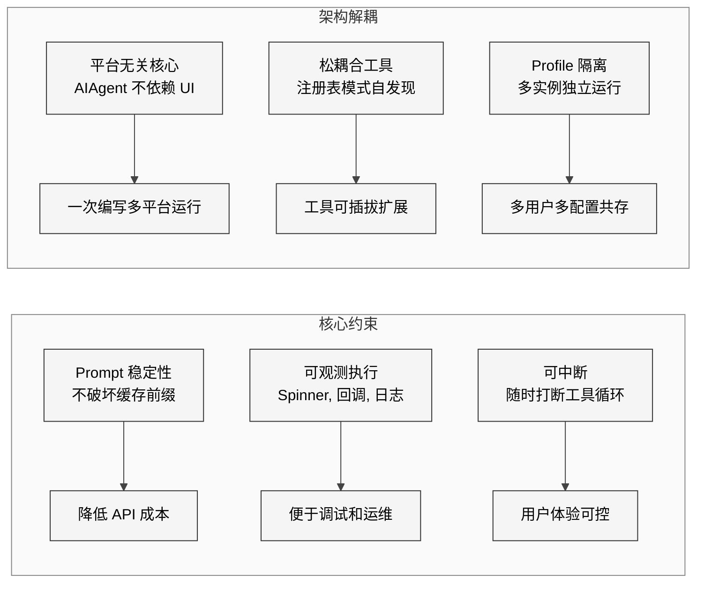
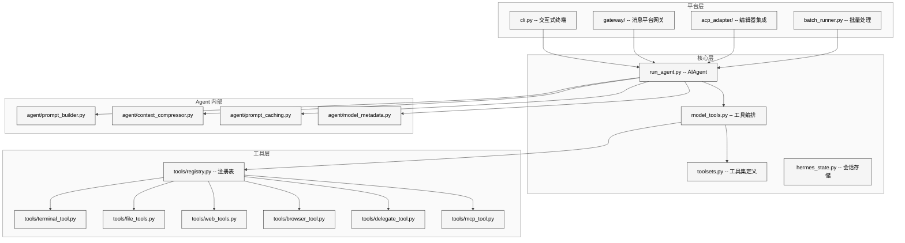

# 第1章 项目全景与设计哲学

## 1.1 本质：Hermes Agent 到底是什么

Hermes Agent 是 Nous Research 开源的一个**自改进 AI Agent 框架**。它的官方定义写在 `pyproject.toml` 第 8 行：

> The self-improving AI agent — creates skills from experience, improves them during use, and runs anywhere

这句话提炼了三个核心特征：(1) 从交互经验中创建技能（skill），(2) 在使用过程中持续改进技能，(3) 在任何平台上运行——CLI、Telegram、Discord、Slack、钉钉、飞书等。从架构分类角度看，它属于**工具增强型 ReAct Agent**：模型生成动作，工具执行动作，结果回注到对话上下文，循环迭代至任务完成。

但 Hermes Agent 不仅是一个玩具式的 agent 循环。它是一个工程级产品，拥有 886 个 Python 文件、约 411,492 行代码。为理解这个数字的含义，下表列出按行数排序的前 10 个文件：

| 排名 | 文件路径 | 行数 | 核心职责 |
|------|---------|------|---------|
| 1 | `run_agent.py` | 11,487 | AIAgent 核心循环、API 调用、错误恢复 |
| 2 | `hermes_cli/main.py` | 6,383 | CLI 入口、所有子命令分发 |
| 3 | `cli.py` | ~5,800 | HermesCLI 交互式会话、Slash 命令 |
| 4 | `hermes_cli/config.py` | 3,513 | 配置系统、DEFAULT_CONFIG、迁移 |
| 5 | `hermes_cli/setup.py` | 3,209 | 安装向导、Provider 选择 |
| 6 | `gateway/run.py` | ~3,000 | 消息平台网关主循环 |
| 7 | `hermes_state.py` | ~2,500 | SQLite 会话存储 + FTS5 搜索 |
| 8 | `agent/prompt_builder.py` | ~2,000 | 系统提示词装配 |
| 9 | `tools/mcp_tool.py` | ~1,050 | MCP 客户端集成 |
| 10 | `tools/registry.py` | ~480 | 工具注册表核心 |

单个 `run_agent.py` 就有 11,487 行——这是整个系统的心脏。它不只处理"发消息-收回复"，还处理流式传输、中断恢复、上下文压缩、Provider 故障转移、并行工具执行、子代理委派、预算控制等至少 20 种边界情况。

## 1.2 核心问题：为什么需要这么复杂

构建一个 AI Agent 的最简实现只需要 50 行 Python：调用 API、解析 tool_calls、执行工具、把结果追加到消息列表、循环。Hermes Agent 多出的 11,000+ 行解决的是**生产环境中的工程复杂性**：

1. **多 Provider 兼容**：OpenAI Chat Completions、Codex Responses API、Anthropic Messages API、AWS Bedrock Converse——四种 API 协议，每种有不同的消息格式、认证方式和错误码。
2. **平台无关运行**：同一个 Agent 核心要在 CLI 终端、Telegram bot、Discord bot、Slack app 等 10+ 平台上运行，每个平台有不同的消息长度限制、富文本格式、中断语义。
3. **长任务韧性**：Agent 可能执行 90 次工具调用，期间可能遇到 API 限流、网络中断、Provider 宕机，需要自动重试和故障转移。
4. **成本控制**：长对话的上下文窗口会膨胀，Anthropic 的 prompt caching 可以减少 75% 输入成本，但任何对历史消息的修改都会打破缓存。

## 1.3 解决思路：六大设计原则

通读 `AGENTS.md` 和核心源码，我提炼出 Hermes Agent 的六条设计原则：

<div style="background-color: #ffffff; padding: 16px; border-radius: 8px; margin: 16px 0;" bgcolor="#ffffff">



</div>

**原则一：Prompt 稳定性（Prompt Stability）**。`AGENTS.md` 中用大写加粗警告："Do NOT implement changes that would alter past context mid-conversation"。系统提示词在会话首次调用时构建一次（`_build_system_prompt()`），后续调用从 SQLite 读取完全相同的副本。这保证了 Anthropic 的 prompt caching 前缀永远命中。

**原则二：可观测执行（Observable Execution）**。`run_agent.py` 中定义了超过 10 种回调：`tool_progress_callback`、`thinking_callback`、`step_callback`、`stream_delta_callback` 等（L587-L597）。每个 API 调用都有 `KawaiiSpinner` 动画和详细的 token 估算日志。

**原则三：可中断（Interruptible）**。`_interrupt_requested` 标志在主循环每次迭代开始时检查（L8474）。中断信号通过线程 ID 作用域传递，子代理通过 `_active_children` 列表级联中断。

**原则四：平台无关核心（Platform-Agnostic Core）**。`AIAgent` 类不引入任何 UI 依赖。CLI 的 Rich/prompt_toolkit 在 `cli.py` 中，Telegram 的 python-telegram-bot 在 `gateway/platforms/telegram.py` 中。AIAgent 通过回调与外界通信。

**原则五：松耦合工具（Loose Coupling Tools）**。工具通过 `tools/registry.py` 的注册表模式自注册，`model_tools.py` 通过 AST 静态分析自动发现，无需手工维护导入列表。

**原则六：Profile 隔离（Profile Isolation）**。`_apply_profile_override()` 在 `hermes_cli/main.py` L83-L138 实现，在任何模块导入之前设置 `HERMES_HOME` 环境变量，确保 119+ 处 `get_hermes_home()` 调用都指向正确的 Profile 目录。

## 1.4 目录结构与依赖链

Hermes Agent 的目录结构反映了"核心-工具-平台"三层架构：

<div style="background-color: #ffffff; padding: 16px; border-radius: 8px; margin: 16px 0;" bgcolor="#ffffff">



</div>

文件依赖链的关键是**单向无环**，`AGENTS.md` 明确记录了这条链：

```
tools/registry.py  (无外部依赖 -- 被所有工具文件导入)
       ^
tools/*.py  (每个文件在导入时调用 registry.register())
       ^
model_tools.py  (导入 tools/registry + 触发工具发现)
       ^
run_agent.py, cli.py, batch_runner.py, environments/
```

`tools/registry.py` 处于链条底部，不依赖任何其他 hermes 模块，这保证了工具注册不会引发循环导入。`discover_builtin_tools()` 函数（`registry.py` L56-L73）用 AST 解析扫描 `tools/` 目录，只导入包含顶层 `registry.register()` 调用的模块。

## 1.5 陷阱与注意事项

从 `AGENTS.md` 的 "Known Pitfalls" 章节和代码中的防御性模式，我总结了几个关键陷阱：

1. **不要硬编码 `~/.hermes` 路径**。由于 Profile 机制，`HERMES_HOME` 可能是 `~/.hermes/profiles/coder/`。所有代码必须使用 `get_hermes_home()`，PR #3575 修复了 5 个因硬编码导致的 bug。

2. **不要在工具 schema 中硬编码跨工具引用**。如果 schema 描述中写了"优先使用 web_search"，但 web_search 的 API key 未配置，模型会尝试调用不存在的工具。正确做法是在 `model_tools.py` 的 `get_tool_definitions()` 中动态注入。

3. **不要使用 `simple_term_menu`**。在 tmux/iTerm2 中有渲染 bug（滚动时出现重影），应使用 stdlib `curses`。

4. **`_last_resolved_tool_names` 是进程全局变量**。子代理运行期间它会被临时替换，如果在此期间读取会得到陈旧值。

## 1.6 与同类项目的对比

| 维度 | Hermes Agent | LangChain Agent | AutoGPT | Claude Code |
|------|-------------|-----------------|---------|-------------|
| API 协议支持 | 4 种（CC/Codex/Anthropic/Bedrock） | 抽象层封装 | 仅 OpenAI | 仅 Anthropic |
| 平台运行 | CLI + 10 种消息平台 | 需自行集成 | 仅 CLI | 仅 CLI |
| 工具扩展 | 注册表自发现 | Chain/Tool 继承 | Plugin 协议 | 内置不可扩展 |
| 上下文管理 | 压缩 + prompt caching | 依赖框架 Memory | 无 | 内置压缩 |
| 代码规模 | ~41 万行 | ~18 万行 | ~5 万行 | 闭源 |
| 自改进能力 | Skill 创建/改进 | 无 | 无 | 无 |

Hermes Agent 的独特定位是：**它不是框架，而是产品**。LangChain 让你自己组装 Agent，Hermes Agent 则提供了一个开箱即用的、可以直接部署到 Telegram 群里的 AI 助手。

## 1.7 遗留问题与改进空间

1. **`run_agent.py` 的 11,487 行**是明显的"上帝文件"问题。虽然已经抽取了 `agent/` 子包（prompt_builder、context_compressor 等），但核心循环、四种 API 模式的适配逻辑、错误处理仍然高度耦合在一个文件中。

2. **同步设计的局限**。`run_conversation()` 是完全同步的，异步工具通过 `_run_async()` 桥接。当 gateway 运行在 asyncio 事件循环中时，需要通过线程池跳板来避免冲突。

3. **配置版本迁移**。`_config_version` 当前为 18，每次新增配置字段都需要 bump 版本并编写迁移逻辑。随着功能增长，迁移代码只会越来越复杂。

4. **依赖清单庞大**。`pyproject.toml` 的 `[project.optional-dependencies]` 包含 20 个 extra 分组（modal、daytona、messaging、voice、rl 等），安装 `hermes-agent[all]` 会拉入大量传递依赖。

这些问题并不影响 Hermes Agent 作为目前最完整的开源 AI Agent 产品之一的地位。它解决了从"能跑"到"能用"之间的巨大工程鸿沟，值得每一个 Agent 开发者深入研究。
