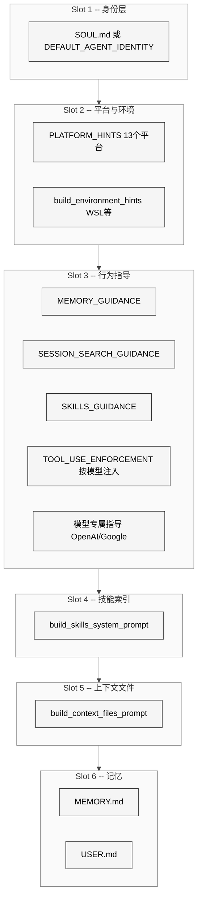
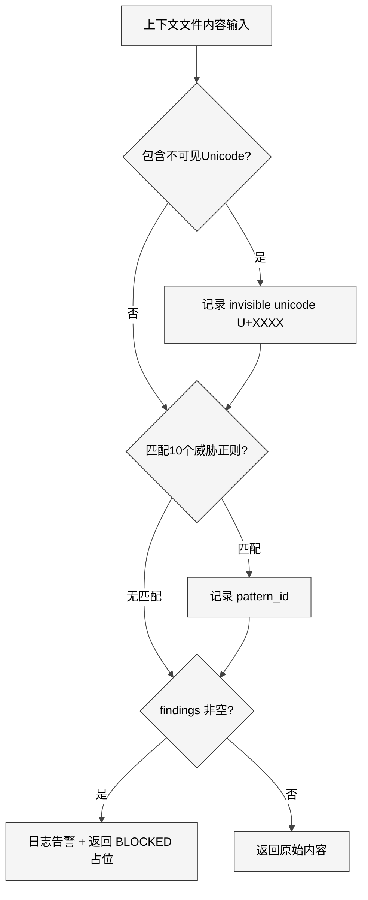

# 第6章 SystemPrompt 组装

## 1 本质是什么

System prompt 是 AI Agent 每次对话的"操作系统内核"——它定义了 Agent 的身份、能力边界、行为规范以及对当前环境的感知。Hermes Agent 的 `prompt_builder.py`（1045 行）和 `skill_utils.py`（465 行）共同构成了一条 **多阶段装配流水线**：从静态身份文本到动态技能索引，从用户记忆注入到上下文文件加载，每个环节都是可插拔的独立模块，最终拼装出一条完整的 system prompt 交给 LLM。

与简单的字符串拼接不同，Hermes 的 prompt 装配需要处理三类根本性矛盾：安全性与开放性（用户可以写 AGENTS.md 注入任意内容）、信息量与 token 预算（技能索引可能包含上百个条目）、通用性与平台差异（WhatsApp 不能渲染 Markdown，Telegram 支持有限格式）。这些矛盾决定了装配流水线不能是一个简单的 `join`，而必须包含扫描、截断、去重、优先级仲裁等多个子环节。

## 2 核心问题和痛点

**第一，prompt 注入攻击。** 用户的项目目录中可能存在 `.hermes.md`、`AGENTS.md`、`.cursorrules` 等上下文文件，这些文件的内容会被直接注入 system prompt。恶意内容可以通过这个通道劫持 Agent 行为——例如 `ignore previous instructions` 或通过隐藏 Unicode 字符嵌入不可见指令。

**第二，技能索引膨胀。** 当用户积累了大量 skill 后，技能索引本身就可能占用数千 token。需要在"让 Agent 知道所有可用能力"和"不浪费宝贵的上下文窗口"之间取得平衡。

**第三，多平台身份适配。** Hermes 可以通过 WhatsApp、Telegram、Discord、Slack、WeChat、Email、SMS 等十余个平台运行，每个平台对 Markdown、媒体文件、消息长度的支持都不同。

**第四，模型行为差异。** 不同模型家族（GPT、Claude、Gemini、Grok）对 system prompt 的遵循程度和工具调用能力差异巨大，需要针对性注入行为矫正指令。

## 3 解决思路与方案

Hermes 采用 **分槽装配（Slot Assembly）** 架构，将 system prompt 分解为多个独立槽位，每个槽位由专门的函数负责填充，最终按固定顺序拼接。

装配流程的核心设计决策：

1. **SOUL.md 优先于默认身份**：如果 `~/.hermes/SOUL.md` 存在，用它替换 `DEFAULT_AGENT_IDENTITY` 作为 Slot 1 的内容，同时在 Slot 5 的上下文加载中设置 `skip_soul=True` 避免重复注入。
2. **上下文文件互斥加载**：`.hermes.md` > `AGENTS.md` > `CLAUDE.md` > `.cursorrules`，采用 first-match-wins 策略，只加载一个项目上下文源。
3. **模型感知的行为注入**：通过 `TOOL_USE_ENFORCEMENT_MODELS` 元组检测模型名，GPT/Codex/Gemini/Gemma/Grok 家族会被额外注入工具调用强制指导。

## 4 实现细节关键点

### 4.1 安全扫描：_scan_context_content

`_scan_context_content` 是所有上下文文件进入 system prompt 前的必经检查点。它实现了两层防御：

**威胁模式匹配：** `_CONTEXT_THREAT_PATTERNS` 定义了 10 个正则表达式模式，覆盖 prompt 注入（`ignore previous instructions`）、隐藏指令（`do not tell the user`）、系统覆盖（`system prompt override`）、HTML 隐藏（`display: none`）、凭证窃取（`curl ... $KEY`）、秘密读取（`cat .env`）等攻击向量。

**不可见 Unicode 检测：** `_CONTEXT_INVISIBLE_CHARS` 集合包含 10 个零宽/方向控制字符（`\u200b` 零宽空格、`\u200d` 零宽连接符、`\u202e` 右到左覆盖等），这些字符可以在视觉上隐藏恶意指令。

扫描结果的处理策略是 **整体阻断**——只要发现一个匹配，整个文件内容被替换为 `[BLOCKED: filename contained potential prompt injection (...)]`，不做部分清除。这是一个重要的设计取舍：宁可误杀一个合法文件，也不能让注入攻击通过。

### 4.2 技能索引的渐进式披露

`build_skills_system_prompt` 是装配流水线中最复杂的函数（约 220 行），实现了三层缓存机制：

1. **进程内 LRU 缓存：** `_SKILLS_PROMPT_CACHE` 是一个 `OrderedDict`，最大容量 8 条，以 `(skills_dir, external_dirs, tools, toolsets, platform)` 五元组为 key。使用 `threading.Lock` 保护并发访问。
2. **磁盘快照缓存：** `.skills_prompt_snapshot.json` 保存了技能的 mtime/size manifest。冷启动时先校验 manifest 是否匹配，命中则直接复用预解析的元数据，跳过整个文件系统扫描。
3. **文件系统全扫描（冷路径）：** 遍历 `~/.hermes/skills/` 及外部目录，逐一解析 `SKILL.md` 的 YAML frontmatter，提取描述、平台兼容性、条件激活规则。

技能的 **条件激活** 是一个精巧的设计：每个技能可以在 frontmatter 中声明 `fallback_for_toolsets`（当主工具集可用时隐藏）、`requires_toolsets`（当依赖工具集不可用时隐藏）、`fallback_for_tools` 和 `requires_tools`。这实现了"只在需要时才展示"的渐进式披露——例如，一个 `web_search` 的 fallback 技能只在用户没有配置 Firecrawl 时才出现。

最终输出格式是按分类分组的紧凑列表，每个技能只保留名称和截断到 60 字符的描述。

### 4.3 上下文文件的优先级与截断

`build_context_files_prompt` 按以下优先级加载项目上下文：

| 优先级 | 文件 | 搜索策略 |
|:---:|:---|:---|
| 1 | `.hermes.md` / `HERMES.md` | 从 cwd 向上遍历到 git root |
| 2 | `AGENTS.md` / `agents.md` | 仅 cwd |
| 3 | `CLAUDE.md` / `claude.md` | 仅 cwd |
| 4 | `.cursorrules` + `.cursor/rules/*.mdc` | 仅 cwd |

所有上下文文件都受两个约束：安全扫描（`_scan_context_content`）和大小截断（`_truncate_content`，上限 20000 字符）。截断策略是 **Head 70% + Tail 20%**——保留文件头部（通常包含最重要的配置和规则）和尾部（最近添加的内容），中间插入截断标记。这比简单的头部截断更好，因为用户倾向于在文件末尾追加新规则。

### 4.4 模型专属行为注入

Hermes 为不同模型家族注入针对性的行为矫正指令：

- **GPT/Codex 系列**：注入 `TOOL_USE_ENFORCEMENT_GUIDANCE`（约 180 行）+ `OPENAI_MODEL_EXECUTION_GUIDANCE`（约 60 行），包含 `<tool_persistence>`、`<mandatory_tool_use>`、`<act_dont_ask>`、`<prerequisite_checks>`、`<verification>` 等 XML 分区。这些纠正了 GPT 模型常见的"描述而不执行"、"跳过前置查找"、"算术不用工具"等失败模式。
- **Gemini/Gemma 系列**：注入 `GOOGLE_MODEL_OPERATIONAL_GUIDANCE`，包含绝对路径、并行工具调用、非交互式命令等操作规范。
- **GPT-5/Codex 的 developer 角色**：`DEVELOPER_ROLE_MODELS` 元组标记了应在 API 层将 `system` 角色替换为 `developer` 角色的模型，利用 OpenAI 对 developer 角色更高的指令遵循权重。

### 4.5 平台感知提示

`PLATFORM_HINTS` 字典涵盖 13 个平台（whatsapp、telegram、discord、slack、signal、email、cron、cli、sms、bluebubbles、weixin、wecom、qqbot），每个平台的提示都描述了：消息格式限制（是否支持 Markdown）、媒体文件发送语法（`MEDIA:/path/to/file`）、特殊约束（SMS 1600 字符限制、cron 模式无用户交互）。

## 5 易错点和注意事项

**SOUL.md 的双重注入风险。** `load_soul_md` 在 Slot 1 加载 SOUL.md 作为身份，如果不传 `skip_soul=True`，`build_context_files_prompt` 会在 Slot 5 再次加载。代码通过 `skip_soul` 参数显式控制，但这是一个需要调用者协调的隐式契约。

**安全扫描的误杀。** 合法技术文档中可能包含 `ignore all previous` 这样的字眼（例如 Git commit message 模板），会触发 `prompt_injection` 模式导致整个文件被阻断。目前没有白名单机制。

**技能缓存失效的延迟。** 磁盘快照基于 mtime/size manifest 校验，如果文件被原地修改但大小不变（例如修改了描述但保持行数），快照不会失效。需要调用 `clear_skills_system_prompt_cache(clear_snapshot=True)` 手动清除。

**上下文文件的互斥加载可能丢失信息。** 如果项目同时有 `.hermes.md` 和 `AGENTS.md`，后者完全被忽略。这是有意为之的设计（避免重复/冲突），但可能让不了解优先级的用户困惑。

## 6 竞品对比

| 维度 | Hermes Agent | Claude Code | OpenCode |
|:---|:---|:---|:---|
| 身份覆盖 | SOUL.md 替换默认身份 | CLAUDE.md 追加到系统提示 | 无用户身份覆盖 |
| 安全扫描 | 10 正则 + 10 不可见字符 | 无公开扫描机制 | 无 |
| 上下文文件 | 4 级优先级互斥 | 仅 CLAUDE.md | 无 |
| 技能系统 | 完整索引 + 条件激活 | 无内置技能系统 | 无 |
| 平台适配 | 13 个平台提示模板 | 仅 CLI | 仅 CLI/VSCode |
| 模型行为矫正 | GPT/Gemini/Grok 专属指导 | 无（仅支持 Claude） | Gemini 专属指导 |
| 截断策略 | Head 70% + Tail 20% | 无截断（依赖小文件） | 无公开截断逻辑 |

Hermes 在 prompt 装配的工程深度上显著领先：它是唯一同时具备安全扫描、条件技能激活、多平台适配和模型行为矫正的开源 Agent 框架。

## 7 仍存在的问题和缺陷

**安全扫描覆盖面有限。** 10 个正则模式只覆盖了最常见的攻击向量，对于更隐蔽的间接注入（通过工具输出回注系统提示）、多步骤社工攻击（先建立信任再注入）、编码绕过（Base64 编码的指令）等高级攻击缺乏防御。

**技能索引没有 token 预算控制。** 当技能数量超过百个时，索引本身可能占用数千 token，但 `build_skills_system_prompt` 不接受 token 上限参数，也不根据模型上下文窗口动态调整详细程度。

**YAML frontmatter 解析的回退路径过于宽松。** `parse_frontmatter` 在 YAML 解析失败时回退到简单的 `key: value` 行分割，这可能将格式错误的 YAML 解析为不正确的元数据，而不是报错。

**缺少 system prompt 的 token 审计。** 整条装配流水线没有在最终输出时记录 prompt 的总 token 数。当 system prompt 过长导致可用对话窗口不足时，没有告警机制。这与 `context_compressor.py` 中精细的 token 管理形成对比——压缩器知道精确的 token 预算，但装配器不知道自己占用了多少。
