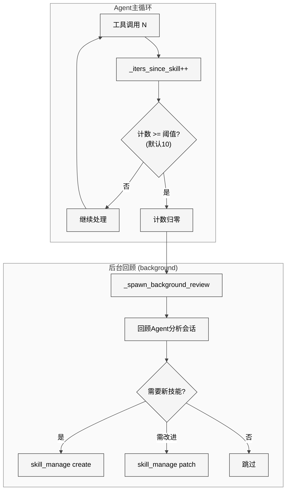

# 第17章 自进化引擎

## 17.1 本质

如果Skill系统是Agent的"教科书"，那么自进化引擎就是Agent的"学习能力"本身。Hermes Agent不仅能使用技能，还能在运行中**自发地创建、改进和优化技能**——形成一个闭环的学习循环。

这套机制分布在两个层面：

- **运行时自改进**：嵌入`run_agent.py`核心循环中的nudge机制（约50行关键代码），在Agent每10次工具调用后触发技能回顾，促使Agent将重复模式固化为可复用技能。
- **离线进化优化**：独立的`hermes-agent-self-evolution`仓库，实现了基于DSPy/Stanford GEPA算法的技能系统性优化流程——通过遗传-帕累托搜索自动发现更优的技能变体。

两个层面分别对应生物学中的"个体学习"和"种群进化"：前者是Agent在单次会话中的即时适应，后者是跨会话的系统性改良。

## 17.2 核心问题

1. **何时触发学习**：Agent需要在"做事"和"反思"之间平衡。过于频繁的自省会拖慢任务执行，过于稀疏则错过学习机会。
2. **学什么**：并非所有操作模式都值得固化为技能。如何识别"这个复杂的多步骤操作"值得提取为可复用技能？
3. **如何改进**：技能文本是自然语言，不像代码那样可以精确diff。如何对"指令质量"进行量化评估和优化？
4. **安全与正确性**：Agent自动创建的技能可能包含错误或危险操作。如何确保自进化不引入回归？
5. **进化方向**：多目标优化问题——一个技能可能在"准确性"和"效率"上存在权衡，如何找到帕累托最优？

## 17.3 解决方案

### 运行时自改进循环

<div style="background: #ffffff; padding: 16px; border-radius: 8px; margin: 16px 0;">



</div>

### 离线GEPA进化流程

<div style="background: #ffffff; padding: 16px; border-radius: 8px; margin: 16px 0;">


</div>

## 17.4 实现细节

### 运行时Nudge机制

核心代码位于`run_agent.py`中，通过三个实例变量和一段条件逻辑实现：

**初始化**（L1217-1343）：
```python
self._iters_since_skill = 0
self._skill_nudge_interval = 10  # 默认值，可通过config覆盖
```

`_skill_nudge_interval`从`config.yaml`的`skills.creation_nudge_interval`读取，默认每10次工具调用迭代触发一次回顾。

**计数累积**（L8523-8527）：
```python
if (self._skill_nudge_interval > 0
        and "skill_manage" in self.valid_tool_names):
    self._iters_since_skill += 1
```

每次工具调用后计数器递增。关键设计：如果Agent在某次迭代中主动调用了`skill_manage`，计数器立即归零（L7326-7327）——这避免了"刚创建完技能又立刻被提醒回顾"的冗余。

**触发判定**（L11202-11208）：
```python
_should_review_skills = False
if (self._skill_nudge_interval > 0
        and self._iters_since_skill >= self._skill_nudge_interval
        and "skill_manage" in self.valid_tool_names):
    _should_review_skills = True
    self._iters_since_skill = 0
```

触发判定在**响应交付后**执行——这确保技能回顾永远不会与用户任务竞争模型注意力。

**后台回顾**（L11220-11230）：

当`_should_review_skills`为True时，`_spawn_background_review()`启动一个独立的回顾Agent。这个Agent拿到当前对话的快照，分析是否存在可提取为技能的重复模式。它拥有`skill_manage`工具，可以直接创建或修改技能。

关键约束：回顾Agent的`_skill_nudge_interval`和`_memory_nudge_interval`都被设为0（L2357-2358），防止回顾Agent自身又触发嵌套回顾。

### Memory Nudge（姊妹机制）

与Skill Nudge并行存在的是Memory Nudge（L8245-8252），使用`_turns_since_memory`计数器、默认间隔10轮。两者在`_spawn_background_review()`中合并：同一个回顾Agent可以同时审查Memory和Skill，但两个触发条件独立判定。

### 技能自改进：Patch流程

当Agent在使用某个技能后发现改进空间（如步骤缺失、参数不准确），它通过`skill_manage(action="patch")`提交局部修改：

1. 定位目标技能文件
2. 找到需要修改的文本片段（old_text）
3. 提供替换文本（new_text）
4. 系统执行字符串替换后调用`skills_guard`重新扫描
5. 使用`_atomic_write_text()`原子性写入

这使得技能可以在使用中渐进式改良——每次Agent发现一个更好的做法，都可以即时更新到技能文件中。

### GEPA离线进化

`hermes-agent-self-evolution`仓库中的`evolve_skill.py`实现了系统性的技能优化，核心是DSPy框架（Stanford NLP Group开发）的GEPA（Genetic-Pareto）算法：

**10步流程**：

1. **加载技能**：读取目标`SKILL.md`文件
2. **构建评估数据集**：从历史会话中提取该技能被使用的案例，标注成功/失败
3. **基线验证**：用当前技能版本在评估集上运行，记录基线指标
4. **配置DSPy**：设置语言模型、温度、评估器
5. **GEPA优化**：核心算法——将技能文本视为"基因"，通过交叉（crossover）和突变（mutation）产生变体，用多目标帕累托排序筛选
6. **提取进化体**：从帕累托前沿中选择最优变体
7. **验证进化体**：在评估集上验证改进确实存在
8. **留出集评估**：用未参与优化的holdout数据检验泛化能力
9. **生成报告**：对比基线与进化体的各项指标
10. **保存最优**：如果进化体优于基线，替换原始`SKILL.md`

GEPA的关键思想：

- **遗传搜索**：维护一个技能变体"种群"，通过LLM执行"突变"（改写部分指令）和"交叉"（混合两个变体的段落）
- **帕累托排序**：技能质量不是单一维度的——GEPA同时优化准确性、效率（token消耗）、鲁棒性（不同输入下的一致性），找到帕累托最优集
- **与EvoMap Evolver的关系**：GEPA的多目标搜索策略在架构上类似于EvoMap Evolver中的进化优化方法——两者都使用基因启发的搜索在庞大的配置空间中寻找最优解

### 自评估检查点

自进化系统还包含"自评估检查点"机制：每15次工具调用执行一次轻量级自检，Agent评估自身的行为是否与预期一致，如果发现系统性偏差（如总是忽略某类错误处理），会触发一次针对性的技能改进或创建。

## 17.5 易踩的坑

1. **Nudge间隔的"甜蜜点"难找**：默认10次迭代的间隔是经验值。对于短对话（<10次工具调用），nudge永远不会触发；对于长对话，可能每隔几分钟就触发一次回顾。理想的间隔应该自适应任务复杂度，但当前实现是静态值。

2. **回顾Agent的上下文截断**：回顾Agent接收的是`messages_snapshot`——当前对话的完整副本。对于超长对话，这可能导致回顾Agent的上下文窗口溢出。当前没有对传递给回顾Agent的消息做截断或摘要。

3. **GEPA的计算成本**：每一轮进化需要多次LLM调用（评估、突变、交叉），一个完整的10步流程可能消耗数千次API调用。这使得GEPA更适合作为定期的离线批处理任务，而非实时触发。

4. **评估数据集偏差**：GEPA的优化质量完全取决于评估数据集的质量。如果历史使用案例存在系统性偏差（如只在某类场景下使用该技能），进化出的技能可能过拟合到特定模式。

5. **Patch累积导致的"技能漂移"**：多次patch操作后，技能文本可能偏离原始设计意图。没有变更日志或回滚机制，技能可能逐渐变得不连贯。

## 17.6 与同类方案的比较

| 维度 | Hermes自进化 | Voyager (MineDojo) | ADAS (Hu et al.) | DSPy Optimizers |
|------|------------|--------------------|--------------------|-----------------|
| 学习载体 | SKILL.md自然语言 | JS代码库 | Python代码 | Prompt模板 |
| 触发条件 | 工具调用计数 | 任务完成后 | 手动 | 手动 |
| 优化算法 | GEPA(帕累托) | 无(仅累积) | 元搜索 | MIPROv2/BootstrapFewShot |
| 多目标 | 是(帕累托前沿) | 否 | 否 | 否(单评分) |
| 安全扫描 | skills_guard | 无 | 无 | 无 |
| 运行时改进 | 是(patch) | 是(新增) | 否 | 否 |

Hermes的独特之处在于将运行时的即时改进（patch）与离线的系统性优化（GEPA）结合为一个完整的学习闭环，同时通过`skills_guard`确保进化过程不引入安全风险。

## 17.7 遗留问题

1. **缺乏进化历史追踪**：技能被修改后没有版本历史，无法回溯"为什么这个技能变成了现在的样子"。建议引入类似git log的变更日志。
2. **Nudge只推不管**：当前nudge仅"建议"Agent回顾，但回顾的质量完全取决于LLM在那一刻的判断。没有结构化的回顾模板或检查清单。
3. **GEPA与运行时学习割裂**：运行时的patch修改不会自动反馈到GEPA的评估集中。两个学习渠道各自独立运行，缺乏信息流通。
4. **自评估缺乏外部基准**：Agent的自评估是内省式的（自己评判自己），缺乏外部ground-truth验证。这可能导致"自我感觉良好"的错觉——Agent认为自己表现优异，但实际上存在系统性盲区。
5. **Memory Nudge与Skill Nudge的耦合**：两种nudge共享`_spawn_background_review()`入口，但各自独立计数。在极端情况下两者可能同时触发，导致回顾Agent需要同时处理两种任务，注意力被分散。
