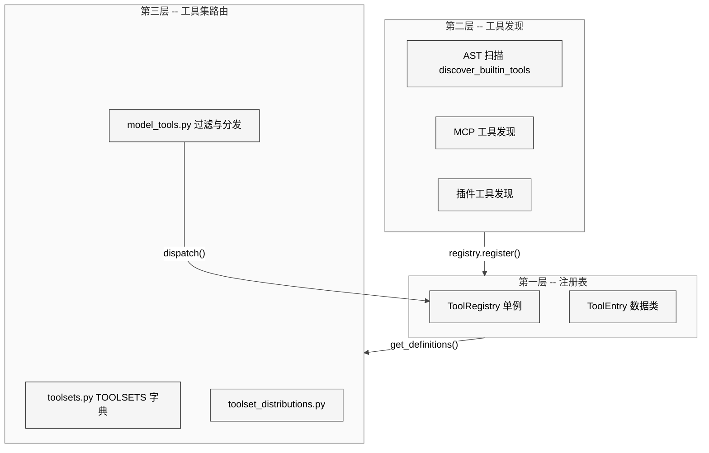
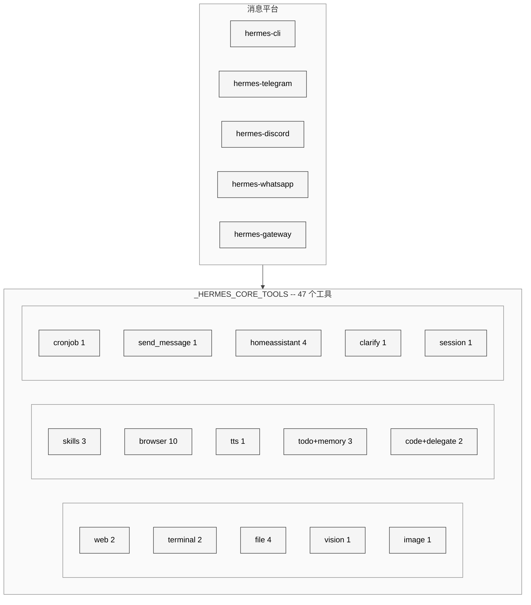
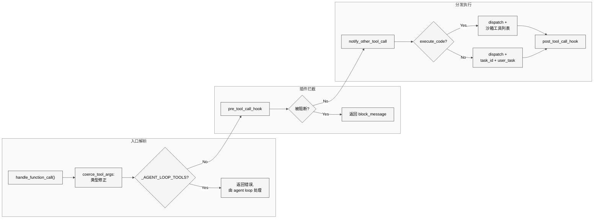

# 第14章 工具系统总览

## 10.1 本质：从散落的函数到统一的注册表

Hermes Agent 的工具系统本质上是一个**自发现、自注册的函数路由器**。它解决的核心问题是：如何让数十个分布在不同文件中的工具函数，以统一的 JSON Schema 格式暴露给 LLM，同时支持运行时的动态增删（MCP 服务器）和平台级的工具集筛选。

整个工具系统由四个核心模块构成，总计约 2110 行代码：

| 模块 | 行数 | 职责 |
|------|------|------|
| `tools/registry.py` | 482 行 | 工具注册表（单例）、schema 收集、dispatch 路由 |
| `model_tools.py` | 562 行 | 工具发现、schema 过滤、函数调用分发 |
| `toolsets.py` | 702 行 | 工具集定义、递归解析、平台预设 |
| `toolset_distributions.py` | 364 行 | 数据生成场景的工具集概率分布 |

## 10.2 核心问题与痛点

工具系统需要同时解决五个相互矛盾的需求：

1. **去中心化注册**——每个工具文件独立声明自己的 schema 和 handler，不依赖中央配置文件
2. **循环导入安全**——registry.py 不能导入任何工具文件，工具文件不能导入 model_tools.py
3. **运行时动态性**——MCP 工具可以在任意时刻注册/注销，需要线程安全
4. **平台差异化**——CLI、Telegram、Discord、API Server 需要不同的工具子集
5. **可用性检查**——某些工具依赖外部服务（Browserbase、Home Assistant），需要在 schema 返回前检查

## 10.3 解决思路：三层分离架构

<div style="background: #ffffff !important; background-color: #ffffff !important; padding: 16px; border-radius: 8px; margin: 16px 0;" bgcolor="#ffffff">



</div>

这个三层架构保证了导入链的单向性：`registry.py` 不导入任何工具模块，工具模块在模块级调用 `registry.register()`，`model_tools.py` 最后才导入所有工具模块触发注册。

## 10.4 实现细节

### 10.4.1 ToolEntry：工具的元数据容器

`ToolEntry` 类使用 `__slots__` 优化内存，存储每个工具的完整元数据：

```python
class ToolEntry:
    __slots__ = (
        "name", "toolset", "schema", "handler", "check_fn",
        "requires_env", "is_async", "description", "emoji",
        "max_result_size_chars",
    )
```

十个字段各有分工：`name` 是工具名称（如 `"browser_navigate"`）；`toolset` 是所属工具集（如 `"browser"`）；`schema` 是 OpenAI 格式的 JSON Schema；`handler` 是实际的处理函数；`check_fn` 是可用性检查函数（返回 bool）；`requires_env` 记录依赖的环境变量列表；`is_async` 标记异步处理器；`max_result_size_chars` 限制单次返回的最大字符数。

### 10.4.2 register() 的防冲突机制

`register()` 方法包含一个关键的防覆盖策略（registry.py L175-L195）：

- **同工具集覆盖**——允许，这是正常的重复导入
- **MCP 对 MCP 覆盖**——允许，支持服务器刷新场景
- **内建 对 MCP 或 MCP 对 内建**——拒绝，记录 `logger.error` 并跳过注册

这个策略防止恶意或错误的 MCP 服务器覆盖核心工具（如 `terminal`、`write_file`），是工具系统的关键安全边界。

### 10.4.3 discover_builtin_tools() 的 AST 扫描

工具发现的核心是 `discover_builtin_tools()`，它使用 Python AST 在不导入模块的前提下判断哪些文件需要加载：

```python
def _module_registers_tools(module_path: Path) -> bool:
    source = module_path.read_text(encoding="utf-8")
    tree = ast.parse(source, filename=str(module_path))
    return any(_is_registry_register_call(stmt) for stmt in tree.body)
```

函数 `_is_registry_register_call()` 检查 AST 中是否存在模块级的 `registry.register(...)` 调用。这种设计有两个优点：(1) 避免导入辅助模块（如 `fuzzy_match.py`、`ansi_strip.py`），减少启动开销；(2) 只检查模块体（`tree.body`），忽略函数内部的注册调用，避免误判。

扫描时排除三个文件：`__init__.py`、`registry.py` 本身、以及 `mcp_tool.py`（MCP 工具走独立的发现路径）。

### 10.4.4 工具集系统

`toolsets.py` 定义了一个名为 `TOOLSETS` 的大字典，包含约 30 个工具集。每个工具集由三个字段组成：

```python
"browser": {
    "description": "Browser automation for web interaction...",
    "tools": ["browser_navigate", "browser_snapshot", ...],
    "includes": []
}
```

工具集支持递归组合。例如 `"debugging"` 工具集包含 `terminal` 和 `process` 工具，同时 includes `"web"` 和 `"file"` 两个工具集。`resolve_toolset()` 使用 `visited` 集合做环检测和钻石依赖去重。

核心工具列表 `_HERMES_CORE_TOOLS` 定义了 47 个工具，被 `hermes-cli`、`hermes-telegram`、`hermes-discord` 等所有消息平台共享。这个设计实现了"改一处，全平台生效"的效果。

<div style="background: #ffffff !important; background-color: #ffffff !important; padding: 16px; border-radius: 8px; margin: 16px 0;" bgcolor="#ffffff">



</div>

### 10.4.5 工具注册分布

通过统计 `registry.register` 调用次数，可以得到各文件的工具注册数：

| 工具文件 | 注册数 | 工具集 |
|----------|--------|--------|
| `browser_tool.py` | 10 | browser |
| `rl_training_tool.py` | 10 | rl |
| `file_tools.py` | 4 | file |
| `homeassistant_tool.py` | 4 | homeassistant |
| `web_tools.py` | 2 | web |
| `skills_tool.py` | 2 | skills |
| 其余 14 个文件 | 各 1 | 各自独立 |

### 10.4.6 dispatch 管线

`handle_function_call()` 是所有工具调用的统一入口（model_tools.py），经过以下步骤：

<div style="background: #ffffff !important; background-color: #ffffff !important; padding: 16px; border-radius: 8px; margin: 16px 0;" bgcolor="#ffffff">



</div>

其中 `coerce_tool_args()` 是一个值得注意的设计：LLM 经常将数字参数以字符串形式返回（如 `"42"` 而非 `42`），该函数对照 JSON Schema 的 `type` 字段自动做类型转换，支持 `integer`、`number`、`boolean` 和联合类型。

### 10.4.7 toolset_distributions：RL 训练的概率采样

`toolset_distributions.py` 定义了 15 种分布预设，用于数据生成和 RL 训练。每种分布为各工具集指定一个百分比概率：

```python
"research": {
    "toolsets": {
        "web": 90,
        "browser": 70,
        "vision": 50,
        "moa": 40,
        "terminal": 10,
    }
}
```

`sample_toolsets_from_distribution()` 对每个工具集独立投掷随机数，概率低于阈值则包含该工具集。如果所有工具集都未被选中（极端情况），则保底选择概率最高的那一个。

## 10.5 易错点与注意事项

1. **线程安全**——`ToolRegistry` 使用 `RLock`（可重入锁），MCP 动态刷新可能在读取 schema 的同时修改注册表。`_snapshot_state()` 返回列表拷贝而非直接引用，确保读者看到一致的快照。

2. **异步桥接**——`_run_async()` 处理三种情况：(a) 主线程无事件循环，用持久化 event loop；(b) 已有运行中的事件循环（gateway 内部），启动临时线程；(c) 工作线程，用线程局部持久 loop。错误使用 `asyncio.run()` 会导致"Event loop is closed"异常。

3. **Schema name 字段**——`get_definitions()` 强制在返回的 schema 中添加 `"name"` 字段（registry.py L255），因为某些工具注册时 schema 内未包含 name，导致 OpenAI API 调用失败。

4. **工具集别名**——`register_toolset_alias()` 允许 MCP 服务器用友好名称覆盖内部工具集名（如 `"github"` 映射到 `"mcp-github-tools"`），但别名冲突只记录警告不阻断。

## 10.6 与竞品对比

| 维度 | Hermes Agent | Claude Code | OpenAI Codex |
|------|-------------|-------------|--------------|
| 工具发现 | AST 扫描 + 模块级注册 | 硬编码工具列表 | API 端声明 |
| 动态工具 | 支持（MCP 运行时注册/注销） | 不支持 | 通过 function calling |
| 工具集筛选 | 平台级预设 + 递归组合 | 固定集合 | 用户端自选 |
| 类型修正 | coerce_tool_args 自动修正 | 无 | 服务端处理 |
| 概率采样 | 15 种 RL 训练分布 | 无 | 无 |

Hermes 的工具系统在动态性和可扩展性上明显领先，代价是增加了注册表的复杂度和线程安全负担。

## 10.7 仍存在的问题

1. **工具集爆炸**——`TOOLSETS` 字典已包含约 30 个条目，`hermes-gateway` 通过 includes 聚合了 18 个平台工具集。当消息平台继续增加时，维护成本会线性增长。一个可能的改进是引入继承机制，让平台工具集只声明与 `_HERMES_CORE_TOOLS` 的差异。

2. **check_fn 缺乏缓存**——每次调用 `get_definitions()` 都会执行所有工具的 `check_fn()`。虽然通过 `check_results` 字典做了同 check_fn 去重，但跨调用没有缓存。在 gateway 场景下，每个消息都会触发完整的检查，对依赖网络的检查（如 Browserbase API）可能产生延迟。

3. **_LEGACY_TOOLSET_MAP 的技术债**——`model_tools.py` 仍维护一个硬编码的旧名称映射表（`_LEGACY_TOOLSET_MAP`），包含 `"web_tools"`、`"terminal_tools"` 等带 `_tools` 后缀的旧名称。这些应该逐步迁移到 `register_toolset_alias()` 机制。

4. **deregister 的级联清理**——当 MCP 工具集的最后一个工具被注销时，`deregister()` 会清理对应的 `check_fn` 和别名。但如果工具集的工具被逐个注销（而非批量），中间状态可能导致别名指向一个只剩部分工具的工具集。
