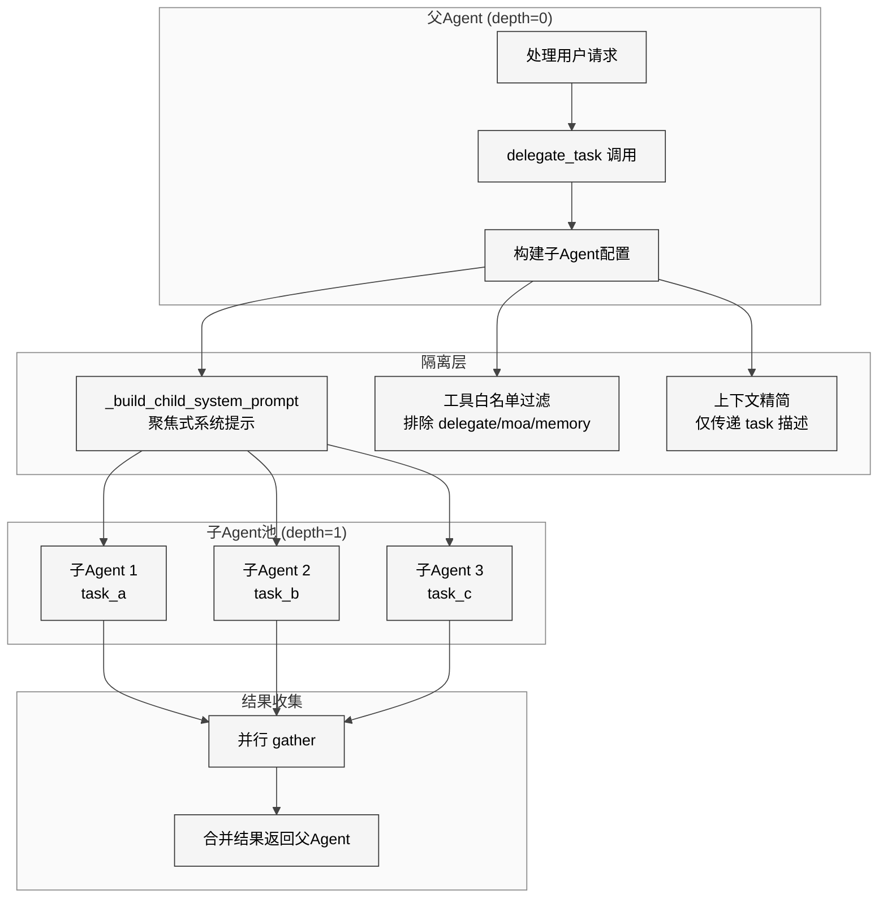
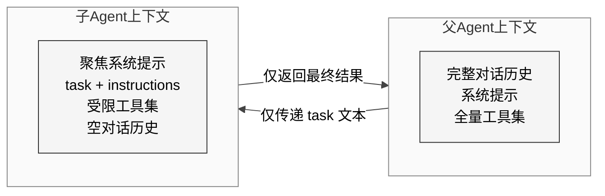

# 第19章 子Agent委托

## 15.1 本质

`delegate_task`工具（`tools/delegate_tool.py`，约688行）实现了Hermes Agent的多智能体协作能力。其本质是**受控的上下文分裂**：父Agent可以派生出一个或多个临时子Agent，每个子Agent拥有独立的对话历史和工具子集，在隔离环境中执行特定任务后将结果返回给父Agent。

与此互补的`mixture_of_agents`工具（`tools/mixture_of_agents_tool.py`，约334行）实现了另一种多智能体模式——**集体智慧聚合**：将同一问题分发给多个不同LLM，再由聚合模型综合各家观点给出最终答案。

两种模式代表了多智能体架构的两个极端：委托是**垂直分工**（一个Agent指挥多个专业Agent），MoA是**水平共识**（多个平行Agent投票表决）。

## 15.2 核心问题

1. **上下文膨胀**：父Agent的完整对话历史可能包含数万token，全部传递给子Agent既浪费又可能引入干扰。
2. **工具递归失控**：子Agent如果能继续委托，可能产生无限递归的Agent树。
3. **并行安全**：多个子Agent同时执行时共享文件系统和外部API，如何防止冲突？
4. **模型路由**：不同子任务可能适合不同的LLM，如何灵活选择？
5. **进度可见性**：子Agent执行时间可能很长，父Agent和用户如何感知进度？

## 15.3 解决方案

### 委托架构概览

<div style="background-color: #ffffff; padding: 16px; border-radius: 8px; margin: 16px 0;" bgcolor="#ffffff">



</div>

### 上下文隔离模型

<div style="background-color: #ffffff; padding: 16px; border-radius: 8px; margin: 16px 0;" bgcolor="#ffffff">



</div>

## 15.4 实现细节

### 工具禁止列表

`DELEGATE_BLOCKED_TOOLS`（L32-38）定义了子Agent不可使用的工具：

```python
DELEGATE_BLOCKED_TOOLS = frozenset({
    "delegate_task",        # 防止递归委托
    "mixture_of_agents",   # 防止递归聚合
    "memory",              # 子Agent不应修改父Agent记忆
    "todo",                # 子Agent不应修改父Agent待办
    "session_search",      # 子Agent无需检索历史会话
    "skill_manage",        # 子Agent不应修改技能库
})
```

此外，`MAX_DEPTH = 3`（L53）限制委托链最大深度，每个子Agent创建时`depth`递增，到达上限时所有`delegate_task`调用被拒绝。

### 子Agent系统提示构建

`_build_child_system_prompt()`（L90-122）为子Agent生成精炼的系统提示：

1. 注入`CHILD_AGENT_IDENTITY`前缀，明确告知它是受委托的子Agent
2. 拼接用户提供的`task`描述和可选的`instructions`
3. 附加当前工作目录信息，确保子Agent知道文件系统位置
4. 如果父Agent提供了`context_snippets`，将相关上下文片段注入

关键设计：子Agent的对话历史是**空的**——它只看到系统提示中的任务描述，不继承父Agent的对话。这是有意的隔离策略，避免上下文污染。

### 单子Agent执行流程

`_run_single_child()`（L399-566）是核心执行函数：

1. **创建Agent实例**（L415-450）：复用父Agent的配置但覆盖关键参数——`max_iterations`默认50（可配置），`model`可指定不同LLM
2. **工具集过滤**（L452-478）：从父Agent的可用工具中移除禁止工具，可选择添加MCP工具
3. **执行对话**（L480-520）：调用`child_agent.run_conversation()`，此过程中子Agent可以使用文件读写、终端、搜索等工具
4. **进度回调**（L522-540）：通过`step_callback`将子Agent的每个工具调用作为进度事件冒泡到父Agent的流输出
5. **结果提取**（L542-566）：从子Agent的最终回复中提取文本，限制在`max_result_chars`以内

### 并行委托

当`delegate_task`收到多个任务时（`tasks`参数为数组），`_run_parallel_delegates()`（L570-625）使用`asyncio.gather`并行执行所有子Agent。每个子Agent在独立的asyncio Task中运行，共享底层文件系统但对话完全隔离。

```python
tasks = [
    _run_single_child(parent, task_config, depth+1, ...)
    for task_config in task_list
]
results = await asyncio.gather(*tasks, return_exceptions=True)
```

### Mixture-of-Agents模式

`mixture_of_agents_tool.py` 实现了完全不同的多智能体范式：

**参考模型**（L63-68）：
```python
REFERENCE_MODELS = [
    "google/gemini-2.5-flash",
    "anthropic/claude-sonnet-4",
    "deepseek/deepseek-r1",
]
```

**流程**：
1. 将用户查询并行发送给3个参考模型（通过OpenRouter API）
2. `_run_reference_model_safe()`（L104-177）对每个模型执行带重试的调用，单次超时120秒
3. 收集所有响应后，`_run_aggregator_model()`（L179-230）使用`google/gemini-2.5-pro`作为聚合器
4. 聚合器收到一个专门的系统提示，要求它"批判性地综合多个AI的回答，找出共识和分歧，形成最佳答案"

这种设计来源于学术论文"Mixture-of-Agents Enhances Large Language Model Capabilities"（2024），其核心洞见是：不同LLM在不同领域有互补的优势，聚合多个模型的输出通常优于任何单一模型。

## 15.5 易踩的坑

1. **文件系统冲突**：并行子Agent共享同一个工作目录。如果两个子Agent同时写同一个文件，结果不可预测。当前实现没有文件锁机制，依赖用户在任务描述中隔离文件操作范围。

2. **Token消耗不透明**：子Agent的token消耗不会反映在父Agent的使用统计中，用户可能对实际费用感到意外。`delegate_task`的返回值中包含`tokens_used`字段，但需要父Agent主动报告。

3. **中断传播延迟**：当用户中断父Agent时，`_interrupt_event`需要通过定期检查传播到子Agent。如果子Agent正在等待API响应，中断可能需要等到当前API调用完成。

4. **MoA的隐含成本**：`mixture_of_agents`一次调用实际触发4次LLM调用（3个参考 + 1个聚合），且全部通过OpenRouter路由。如果参考模型不可用或响应过慢，会显著影响响应延迟。

## 15.6 与同类方案的比较

| 维度 | Hermes delegate | CrewAI | AutoGen |
|------|----------------|--------|---------|
| Agent间通信 | 无（仅返回结果） | 有（消息传递） | 有（对话） |
| 共享状态 | 文件系统级 | 显式共享内存 | 对话历史 |
| 工具隔离 | 禁止列表 | 角色级工具 | 无限制 |
| 并行执行 | asyncio.gather | 串行为主 | GroupChat |
| 模型异构 | 支持per-task模型 | 支持 | 支持 |
| 架构复杂度 | 低（200行核心） | 高（框架级） | 高（框架级） |

Hermes的委托设计明显更轻量——它是一个工具，不是一个框架。这意味着更低的学习成本和更少的抽象层，但也意味着缺乏复杂多智能体工作流（如Agent间协商、共享黑板）的原生支持。

## 15.7 遗留问题

1. **无Agent间通信**：子Agent之间无法直接交换信息。如果task_a的结果是task_b的输入，必须由父Agent串行化调用，无法形成管道。
2. **无崩溃恢复**：子Agent如果因API错误中途失败，整个任务标记为失败。没有检查点（checkpoint）机制让子Agent从中间状态恢复。
3. **深度限制硬编码**：`MAX_DEPTH=3`是代码常量而非配置项，在某些需要深层委托的场景（如递归分析大型代码库）中可能不够。
4. **缺乏智能路由**：Issue #344提出了多智能体架构路线图，包括基于任务类型自动选择最优模型、动态工具集推荐等，但尚未实现。当前的模型选择完全依赖父Agent在`delegate_task`调用时的显式指定。
