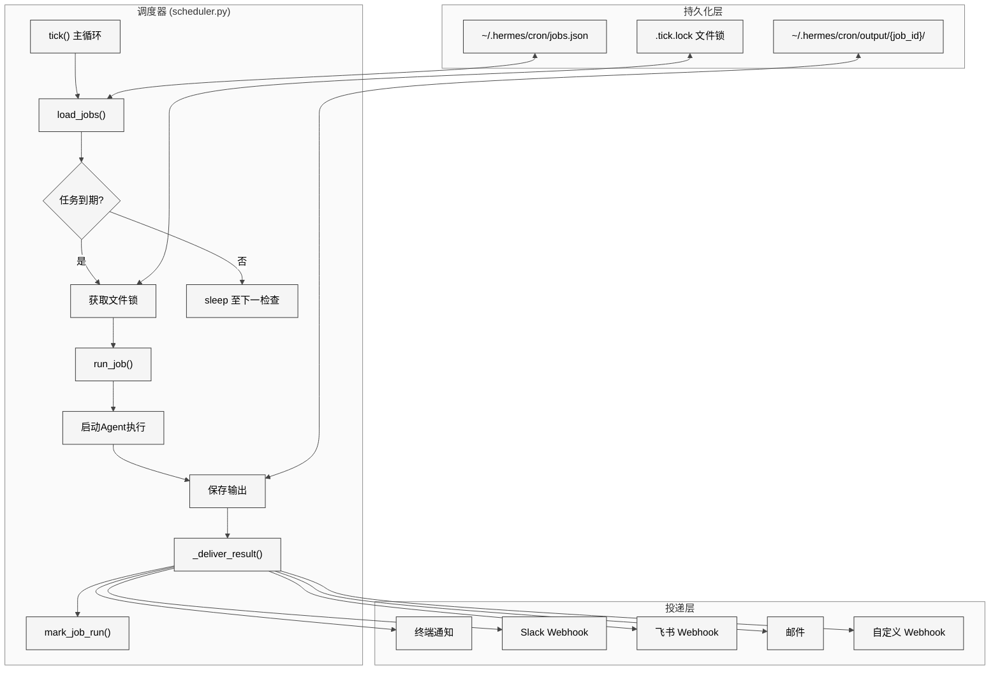
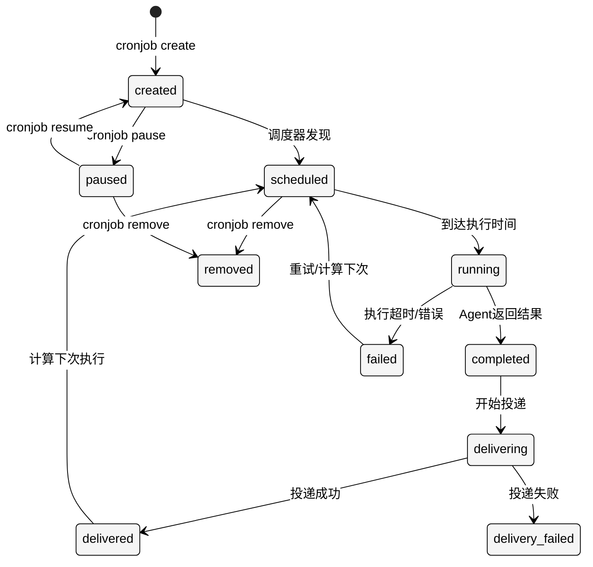

# 第20章 定时任务

## 18.1 本质

Hermes Agent的定时任务系统（cron模块，约2600行代码）将Agent从"被动响应"模式扩展到"主动执行"模式——Agent不再只是等待用户提问，而是可以按照预定义的时间表自主执行任务，并将结果投递到多个平台。

从架构上看，这是一个嵌入了完整Agent执行能力的cron调度器：

| 模块 | 行数 | 职责 |
|------|------|------|
| `cron/jobs.py` | ~700 | 任务存储与调度逻辑 |
| `cron/scheduler.py` | ~1000 | 调度器引擎与任务执行 |
| `tools/cronjob_tools.py` | ~480 | Agent工具接口 |

其本质是**无服务器的本地cron**——不需要额外的守护进程或消息队列，通过文件锁实现简单可靠的调度。

## 18.2 核心问题

1. **调度精度与资源占用**：传统cron以分钟为最小粒度，而Agent任务可能需要秒级调度。但过于频繁的检查会浪费CPU。
2. **并发控制**：如果上一次任务还未完成，新的调度时间到了怎么办？多个Hermes实例同时运行时如何防止重复执行？
3. **任务定义的灵活性**：用户可能说"每天早上9点"、"每隔30分钟"、"下周三下午3点执行一次"——如何统一处理这些不同的时间表达？
4. **结果投递**：Agent执行完成后，结果需要送达用户。但用户可能在不同平台（终端、Slack、飞书、邮件），如何多平台投递？
5. **任务安全**：定时任务在无人值守环境下运行，恶意或错误的任务提示可能造成损害。

## 18.3 解决方案

### 调度器架构

<div style="background: #ffffff !important; background-color: #ffffff !important; padding: 16px; border-radius: 8px; margin: 16px 0;" bgcolor="#ffffff">



</div>

### 任务生命周期

<div style="background: #ffffff !important; background-color: #ffffff !important; padding: 16px; border-radius: 8px; margin: 16px 0;" bgcolor="#ffffff">



</div>

## 18.4 实现细节

### 调度类型与时间解析

`cron/jobs.py`的`parse_schedule()`（L117-204）支持三种调度类型：

**1. 间隔调度（interval）**：
```python
# "every 30 minutes", "every 2 hours", "every 1 day"
{"type": "interval", "seconds": 1800}
```
解析逻辑：正则匹配`every (\d+) (minute|hour|day|week)`，转换为秒数。最小间隔为60秒。

**2. Cron表达式（cron）**：
```python
# "0 9 * * *" — 每天9点
{"type": "cron", "expression": "0 9 * * *"}
```
使用`croniter`库计算下次执行时间。支持标准五段cron语法。

**3. 一次性调度（once）**：
```python
# "2025-01-15T14:30:00"
{"type": "once", "timestamp": 1736952600}
```
一次性任务执行后自动标记为completed，不再调度。

`next_run_time()`（L206-260）根据调度类型计算下一次应执行的时间戳，并处理时区问题。

### 任务存储

`jobs.json`结构：

```json
{
  "jobs": {
    "abc-123": {
      "id": "abc-123",
      "name": "每日代码审查",
      "prompt": "审查 ~/project 中昨天的所有 git commit...",
      "schedule": {"type": "interval", "seconds": 86400},
      "skill": "code-review",
      "delivery": [
        {"platform": "slack", "webhook": "https://hooks.slack.com/..."},
        {"platform": "feishu", "webhook": "https://open.feishu.cn/..."}
      ],
      "status": "active",
      "created_at": 1736000000,
      "last_run": 1736086400,
      "last_status": "success",
      "run_count": 15,
      "pre_run_script": "cd ~/project && git pull"
    }
  }
}
```

`load_jobs()`（L320-347）和`save_jobs()`（L349-366）使用文件级锁（`fcntl.flock`）保证读写原子性。每次保存前创建`.bak`备份文件，防止JSON写入中途崩溃导致数据丢失。

### 任务执行：run_job()

`scheduler.py`的`run_job()`（L580-883）是最复杂的函数，约300行：

**1. 前置脚本执行**（L608-640）：
如果任务配置了`pre_run_script`，`_run_job_script()`（L409-488）通过`subprocess.run()`在shell中执行。超时设为300秒，输出被捕获并注入到Agent提示的上下文中。典型用途：`git pull`更新代码后再执行审查。

**2. 技能注入**（L642-680）：
如果任务绑定了技能（`skill`字段），系统加载对应的`SKILL.md`内容并注入到Agent的系统提示中。这使得定时任务可以复用技能库中的操作流程，而不必在`prompt`中重复编写。

**3. Agent实例化与执行**（L682-780）：
创建一个专用的Agent实例（非复用，避免状态污染），配置：
- `max_iterations`：默认100（高于交互模式的50）
- `quiet_mode: True`：抑制终端输出
- 超时策略：基于不活跃时间（`inactivity_timeout`），默认300秒无工具调用则终止

Agent执行的是标准的`run_conversation()`流程，它可以使用所有可用工具（除了`cronjob`自身以外，防止定时任务创建新的定时任务形成递归）。

**4. 输出保存**（L782-830）：
执行结果保存到`~/.hermes/cron/output/{job_id}/{timestamp}.json`，包含：
- Agent的完整文本回复
- 工具调用日志
- token消耗统计
- 执行时长

### 结果投递：_deliver_result()

`_deliver_result()`（L201-368）支持五种投递平台：

- **Slack**（L220-260）：通过Incoming Webhook POST markdown格式的结果
- **飞书**（L262-300）：通过自定义机器人Webhook POST富文本消息
- **邮件**（L302-330）：通过SMTP发送，支持TLS
- **自定义Webhook**（L332-355）：POST JSON到任意URL
- **终端**（L357-368）：写入文件，下次启动时显示通知

每个投递渠道独立执行，单个渠道失败不影响其他渠道。失败时记录到任务的`delivery_errors`字段。

### 并发控制

`tick()`（L906-996）主调度循环使用文件锁（`.tick.lock`）实现跨进程互斥：

```python
lock_fd = open(TICK_LOCK, 'w')
try:
    fcntl.flock(lock_fd, fcntl.LOCK_EX | fcntl.LOCK_NB)
except BlockingIOError:
    return  # 另一个实例正在运行
```

`LOCK_NB`标志确保非阻塞——如果锁已被持有，直接返回而不等待。这种设计允许多个Hermes CLI实例共存，但保证同一时刻只有一个实例在执行cron任务。

### Agent工具接口：cronjob_tools.py

`cronjob()`（L221-385）提供统一的Agent工具接口，支持7种操作：

| 操作 | 说明 |
|------|------|
| create | 创建新定时任务 |
| list | 列出所有任务 |
| update | 修改任务属性 |
| pause | 暂停任务 |
| resume | 恢复任务 |
| remove | 删除任务 |
| run | 立即手动触发 |

**安全扫描**（L60-68）：`_scan_cron_prompt()`在创建和更新操作时对任务的`prompt`执行安全检查，复用`skills_guard`的扫描引擎检测提示注入、破坏性命令等威胁。

`CRONJOB_SCHEMA`（L388-464）定义了完整的工具Schema，使LLM能够通过函数调用创建结构化的定时任务，而不需要用户手动编辑JSON。

## 18.5 易踩的坑

1. **文件锁在NFS上不可靠**：`fcntl.flock`在网络文件系统上可能不生效。如果`~/.hermes`挂载在NFS上（多机共享家目录场景），可能出现并发执行。

2. **croniter的时区陷阱**：`croniter`默认使用本地时区。如果用户配置了cron表达式`0 9 * * *`但Agent运行在UTC环境（如Docker容器中），实际触发时间会与预期不同。

3. **inactivity timeout的误判**：Agent在"思考"时（等待API响应）不产生工具调用，可能被误判为"不活跃"而超时终止。特别是使用推理模型（如o1）时，单次API响应可能超过300秒。

4. **前置脚本的环境隔离不足**：`pre_run_script`在当前用户的shell环境中执行，继承所有环境变量和权限。一个恶意的前置脚本可以做任何用户能做的事。

5. **输出目录膨胀**：每次执行都在`output/{job_id}/`下创建新文件。高频任务（如每5分钟执行一次）会在短时间内积累大量文件，当前没有自动清理机制。

## 18.6 与同类方案的比较

| 维度 | Hermes Cron | Anthropic Computer Use | n8n/Make |
|------|------------|----------------------|----------|
| 调度方式 | 本地文件+croniter | 无（手动触发） | 云端调度 |
| 执行环境 | 本地Agent | 云VM | 云容器 |
| 技能集成 | 原生支持 | 无 | 通过API |
| 结果投递 | 多平台原生 | 无 | 丰富集成 |
| 并发控制 | 文件锁 | N/A | 队列 |
| 部署复杂度 | 零（本地文件） | 高 | 中 |
| 可靠性 | 单机（无持久队列） | N/A | 云级别 |

Hermes的cron设计优势在于零部署复杂度——不需要Redis、数据库或云服务，一切基于本地文件。但这也意味着它不适合需要高可用性和分布式调度的生产场景。

## 18.7 遗留问题

1. **无持久化队列**：如果调度时刻Hermes未运行，该次执行会被错过（下次tick时catch-up执行）。没有可靠的消息队列确保"精确一次"语义。
2. **缺乏任务依赖**：无法表达"任务A完成后再执行任务B"的依赖关系。所有任务独立调度，无法构建DAG工作流。
3. **无资源限制**：定时任务与交互任务共享同一个LLM配额和API密钥。高频定时任务可能耗尽配额，影响用户的交互使用。
4. **监控盲区**：虽然每次执行的输出被保存，但没有集中的仪表板展示任务健康状态、成功率、延迟趋势等运维指标。
5. **投递重试策略简陋**：投递失败后仅记录错误，不重试。对于关键通知场景（如告警），这可能导致重要信息丢失。

---

## 升级补遗（v0.10 → v0.14）

### 1. `no_agent` 模式：脚本-only watchdog（v0.13）

[#19709](https://github.com/NousResearch/hermes-agent/pull/19709)：

- cron 任务可以完全跳过 Agent，只跑用户脚本
- 空 stdout 静默，非空 stdout 逐字交付
- 用途：纯轮询（RSS / HTTP JSON / GitHub）、watchdog、定时心跳

配套：v0.14 起的 `watchers` optional skill（[#21881](https://github.com/NousResearch/hermes-agent/pull/21881)）就基于 `no_agent` 跑 RSS / HTTP JSON / GitHub 轮询。

### 2. `context_from` 链接（v0.12-v0.13）

- **`context_from` 字段链接 cron job 输出**（v0.12，[#15606](https://github.com/NousResearch/hermes-agent/pull/15606)）
- **`context_from` 链式文档**（v0.13，[#20394](https://github.com/NousResearch/hermes-agent/pull/20394)）

回应原章节问题 2 "缺乏任务依赖"：现在 cron 之间可以串联输出，至少能搭出 watch → process → deliver 这种线性管道。

### 3. Per-job 控制（v0.11-v0.12）

- **`wakeAgent` 门控**（v0.11，[#12373](https://github.com/NousResearch/hermes-agent/pull/12373)）：脚本可以跳过 agent
- **Per-job `enabled_toolsets`**（v0.11，[#14767](https://github.com/NousResearch/hermes-agent/pull/14767)）：单 cron 限制工具集，截 token + 截成本——直接回应原章节问题 3 "无资源限制"
- **Per-job `workdir`**（v0.12，[#15110](https://github.com/NousResearch/hermes-agent/pull/15110)）：项目感知的 cron 执行
- **Honor `hermes tools` config for cron platform**（v0.12，[#14798](https://github.com/NousResearch/hermes-agent/pull/14798)）

### 4. 调度可靠性

- **Recover null `next_run_at` jobs**（v0.13，[#19576](https://github.com/NousResearch/hermes-agent/pull/19576)）
- **Serialize `get_due_jobs` writes to prevent parallel state corruption**（v0.13，[#19874](https://github.com/NousResearch/hermes-agent/pull/19874)）
- **Bump skill usage when cron jobs load skills**（v0.13，[#19433](https://github.com/NousResearch/hermes-agent/pull/19433)）：cron 用到的 skill 计入 use count，让 Curator 看到
- **Expand config.yaml refs during job execution**（v0.13，[#19872](https://github.com/NousResearch/hermes-agent/pull/19872)）
- **Initialize MCP servers before constructing the cron AIAgent**（v0.13，[#21354](https://github.com/NousResearch/hermes-agent/pull/21354)）
- **Treat non-dict origin as missing instead of crashing tick**（v0.13，[#19283](https://github.com/NousResearch/hermes-agent/pull/19283)）
- **Skip AI call when prerun script produces no output**（v0.13，[#19628](https://github.com/NousResearch/hermes-agent/pull/19628)）
- **Promote `croniter` to a core dependency**（v0.12，[#17577](https://github.com/NousResearch/hermes-agent/pull/17577)）

### 5. cron 与 Curator 联动（v0.13）

- **Curator rewrite cron job skill refs after consolidation**（v0.13，[#18253](https://github.com/NousResearch/hermes-agent/pull/18253)）：Curator 合并 skill 时同步重写 cron job 中的 skill 引用
- **Restore cron skill links on rollback**（v0.13，[#18731](https://github.com/NousResearch/hermes-agent/pull/18731)）

### 6. cron 安全（v0.13 P0）

- **Cron — scan assembled prompt including skill content for prompt injection**（v0.13 P0，[#21350](https://github.com/NousResearch/hermes-agent/pull/21350)）：cron 把 skill 内容拼进 prompt 时一并扫注入

### 7. 仍未解决

- **持久化队列**：原章节问题 1 仍未变
- **完整 DAG**：`context_from` 现在能串线性管道，DAG 不行
- **监控盲区**：原章节问题 4 部分回应——v0.12 起 dashboard 有"Cron 仪表板 tab"，v0.14 修了 dashboard 空白与 partial-record crash（[#22389](https://github.com/NousResearch/hermes-agent/pull/22389)），但运维级指标还没成体系
