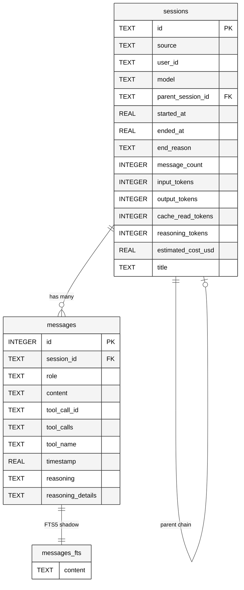
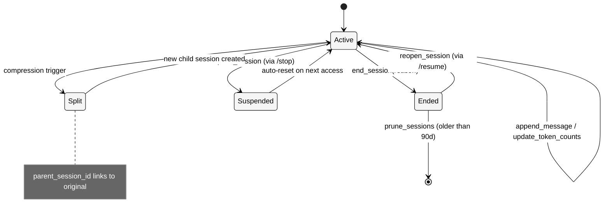

# 第八章 会话持久化

## 8.1 本质

会话持久化解决的是 Agent 的"连续性"问题：**如何在进程重启、网络断开、平台切换之后，还原对话的完整上下文**。不同于记忆系统关注跨会话的"长期认知"，持久化关注的是单次会话内的"短期完整性"——确保每条消息、每次工具调用、每个推理链都不丢失。

Hermes 用一个 SQLite 数据库（`state.db`）作为所有会话数据的单一真相来源。这个选择看似平凡，但在 Agent 场景下，它面对的并发模式远比典型的单用户应用复杂：CLI 进程、Gateway 进程、多个 worktree Agent、cron 任务可能同时写入同一个数据库文件。

## 8.2 核心问题

1. **多进程并发写入**：Gateway 多平台会话 + CLI 本地会话 + worktree Agent + cron 后台任务，全部共享一个 `state.db`。SQLite 的内置 busy handler 使用确定性等待，在高并发下产生护航效应（convoy effect），导致 TUI 冻结。
2. **会话上下文的无限增长**：长时间对话的消息历史可能超出 LLM 的上下文窗口。需要一种机制在不丢失历史的前提下分割会话。
3. **全文检索的性能平衡**：Agent 需要搜索跨越数百个会话的历史消息，但不能为此引入 Elasticsearch 等重依赖。
4. **向后兼容**：系统从 JSONL 文件迁移到 SQLite，必须平滑过渡，不丢失旧数据。
5. **平台隔离**：不同平台（Telegram、Discord、Slack）的同一用户可能需要独立的会话，也可能需要共享。

## 8.3 解决思路

Hermes 采用"WAL 模式 + 应用层抖动重试 + FTS5 虚拟表 + 压缩触发的会话分裂"四重机制：

<div style="background: #ffffff; padding: 16px; border-radius: 8px; margin: 16px 0;">



</div>

**WAL 模式**允许多个读者与一个写者并发执行，是 SQLite 在多进程场景下的最佳实践。**应用层抖动重试**替代 SQLite 内置的确定性 busy handler，通过随机 20-150ms 的退避打破护航效应。**FTS5 虚拟表**以触发器驱动的方式自动同步消息内容到全文索引。**会话分裂**通过 `parent_session_id` 链将压缩后的新会话关联到原会话，保持谱系可追溯。

## 8.4 实现细节

### 8.4.1 Schema 设计（SCHEMA_VERSION 6）

`hermes_state.py` 定义了完整的数据库 Schema（L36-91）。当前版本为 6，经历了 6 次增量迁移：

| 版本 | 变更 | 目的 |
|------|------|------|
| 1 | 基础 sessions + messages 表 | 初始 Schema |
| 2 | messages 添加 finish_reason | 记录 API 响应终止原因 |
| 3 | sessions 添加 title | 支持会话命名 |
| 4 | title 添加唯一索引（允许 NULL） | 防止标题冲突 |
| 5 | sessions 添加 11 个计费字段 | 精细化成本追踪 |
| 6 | messages 添加 reasoning 系列字段 | 保留推理链跨轮连续性 |

`sessions` 表包含 25 个字段，其中计费相关字段（`cache_read_tokens`、`estimated_cost_usd`、`billing_provider` 等）是 v5 批量添加的。这 11 个字段的存在说明 Hermes 对成本可见性的重视程度。

`messages` 表的 `reasoning`、`reasoning_details`、`codex_reasoning_items` 三个字段（v6 添加）专门用于保存推理链。注释明确说明了原因："Without these, reasoning chains are lost on session reload, breaking multi-turn reasoning continuity for providers that replay reasoning."

### 8.4.2 WAL 模式与写竞争处理

`SessionDB.__init__`（L138-161）在连接建立时立即执行 `PRAGMA journal_mode=WAL`。但 WAL 模式只解决了读写并发，写写并发仍需要获取排他锁。

核心写入辅助方法 `_execute_write`（L164-214）实现了精心设计的竞争处理策略：

```python
_WRITE_MAX_RETRIES = 15
_WRITE_RETRY_MIN_S = 0.020   # 20ms
_WRITE_RETRY_MAX_S = 0.150   # 150ms
```

每次写入都使用 `BEGIN IMMEDIATE`（而非默认的 `DEFERRED`），在事务开始时就获取写锁。如果遇到 `database is locked`，释放 Python 层面的线程锁，随机等待 20-150ms，然后重试。最多重试 15 次。

为什么不用 SQLite 内置的 `busy_timeout`？代码注释解释得很清楚：内置 handler 使用确定性的等待调度（100ms、200ms、300ms...），多个进程的重试时间点完全重合，形成护航效应。随机抖动自然地错开竞争写者。

此外，每 50 次成功写入（`_CHECKPOINT_EVERY_N_WRITES = 50`）触发一次 `PASSIVE` WAL checkpoint，将 WAL 帧刷回主数据库文件。这是非阻塞的——只刷新没有其他连接需要的帧，防止 WAL 文件无限增长。

### 8.4.3 FTS5 全文检索

FTS5 虚拟表（L93-112）通过三个触发器自动保持与 `messages` 表的同步：

- `messages_fts_insert`：新消息插入后自动添加到全文索引
- `messages_fts_delete`：消息删除时从索引移除
- `messages_fts_update`：消息更新时先删后加

`search_messages` 方法（L990-1091）支持完整的 FTS5 查询语法：简单关键词、精确短语、布尔运算（AND/OR/NOT）、前缀匹配。

`_sanitize_fts5_query` 方法（L937-988）是一个值得仔细阅读的防御性编程范例。它处理 6 类潜在的 FTS5 语法错误：保留配对引号短语、剥离未匹配的特殊字符、合并重复星号、移除悬挂的布尔运算符、为包含连字符和点号的术语自动加引号（避免 `chat-send` 被拆分为 `chat AND send`）、恢复保护的引号短语。

搜索结果还附带上下文——每个匹配消息的前后各一条消息被加载进来，让 Agent 能理解匹配发生的对话环境。

### 8.4.4 会话分裂与谱系链

当上下文窗口压力触发压缩时，系统创建一个新会话并通过 `parent_session_id` 指向原会话。`sessions` 表的外键约束：

```sql
FOREIGN KEY (parent_session_id) REFERENCES sessions(id)
```

这形成了一个单向链表结构。`session_search_tool.py` 中的 `_resolve_to_parent` 函数（L356-379）沿链向上遍历找到根会话，确保搜索结果不会重复返回同一对话的不同片段。

删除会话时采用"孤儿化"而非级联删除（`delete_session` L1175-1197）：子会话的 `parent_session_id` 被设为 NULL，保留独立可访问性。

### 8.4.5 会话生命周期状态机

<div style="background: #ffffff; padding: 16px; border-radius: 8px; margin: 16px 0;">



</div>

Gateway 层面的 `SessionStore`（`gateway/session.py` L498-1058）在 SQLite 之上增加了会话 Key 映射和重置策略。`build_session_key` 函数（L439-495）根据平台、聊天类型、用户 ID 生成确定性的会话 Key：

- DM 会话：`agent:main:{platform}:dm:{chat_id}`
- 群组会话：`agent:main:{platform}:group:{chat_id}:{user_id}`
- 线程会话（默认共享）：`agent:main:{platform}:group:{chat_id}:{thread_id}`

线程默认不隔离用户——所有参与者共享同一个会话上下文，这是聊天线程的预期 UX。

### 8.4.6 Session Search 工具

`session_search_tool.py` 实现了两种模式的会话检索：

1. **浏览模式**（无查询参数）：直接返回最近会话的元数据（标题、预览、时间戳），零 LLM 调用成本。
2. **搜索模式**（带查询参数）：FTS5 检索 -> 按会话去重 -> 加载对话文本 -> 辅助模型并行摘要。

`_truncate_around_matches` 函数（L90-172）实现了智能截断：对超过 100K 字符的长对话，它找到查询词出现密度最高的窗口，偏向 25% 前文 + 75% 后文的比例截取。三级匹配策略——先完整短语、再邻近共现（200 字符窗口内所有词共现）、最后单独词出现。

## 8.5 易踩的坑

1. **JSONL 与 SQLite 的双写竞态**：`append_to_transcript` 同时写 SQLite 和 JSONL，但 Agent 自身也可能通过 `_flush_messages_to_session_db` 写入 SQLite。`skip_db` 参数就是为了解决这个重复写入 bug（#860）。

2. **WAL checkpoint 时机**：`PASSIVE` checkpoint 只刷新没有活跃读者需要的帧。如果某个长连接持续读取，WAL 文件可能持续增长。`close()` 方法中的最后一次 checkpoint 缓解但不完全解决这个问题。

3. **Schema 迁移的单向性**：`_init_schema` 方法只支持前向迁移。如果用户降级了 Hermes 版本，新版本添加的列不会被移除，但旧代码不认识这些列时通常能忽略（SQLite 的灵活性在此帮了忙）。

4. **标题唯一性约束**：`idx_sessions_title_unique` 只对非 NULL 标题强制唯一。`set_session_title` 中的冲突检查是在应用层做的（`SELECT ... WHERE title = ? AND id != ?`），存在极小的竞态窗口。

## 8.6 横向对比

| 维度 | Hermes (SQLite + FTS5) | LangChain Memory | AutoGPT |
|------|----------------------|-----------------|---------|
| 存储后端 | SQLite WAL (本地，零配置) | 可插拔（Redis/Postgres/向量库） | JSON 文件 |
| 全文检索 | FTS5 原生（布尔+短语+前缀） | 依赖向量库 | 无 |
| 并发支持 | 多进程安全（WAL + 抖动重试） | 取决于后端 | 单进程 |
| 会话分裂 | parent_session_id 链 | 无原生支持 | 无 |
| 成本追踪 | 11 个计费字段，逐会话累计 | 无 | 有限 |
| 迁移性 | 增量 Schema 迁移（v1-v6） | 无统一迁移 | 无 |

Hermes 的 SQLite 选择在开发便捷性和功能完整性之间取得了出色的平衡。FTS5 提供了接近专业搜索引擎的能力，而 WAL + 应用层抖动让多进程并发成为可能——这对一个"全端合一"的 Agent 框架来说非常关键。

## 8.7 遗留问题

1. **FTS5 不支持语义搜索**：全文检索只能匹配精确词汇，无法找到语义相关但措辞不同的对话。例如搜索"部署服务器"无法匹配"把应用推到线上"。

2. **JSONL 双写的技术债务**：`gateway/session.py` 中仍保留了 JSONL 文件写入（"keeps existing tooling working during transition"）。`load_transcript` 方法取两个来源中消息数更多的那个——这是过渡方案，增加了 I/O 和维护负担。

3. **WAL 文件无主动清理**：关闭连接时执行的 `PASSIVE` checkpoint 可能不完整。如果 Gateway 异常退出，WAL 文件可能保留到下次启动。在磁盘空间受限的环境中（Docker 容器），这可能成为问题。

4. **会话修剪的粒度**：`prune_sessions` 以天为单位删除旧会话，但不考虑会话的重要性。一个 90 天前的关键技术决策讨论会和一个测试会话被同等对待。

5. **FTS5 查询注入的边界情况**：`_sanitize_fts5_query` 虽然处理了 6 类问题，但对某些极端输入（如纯标点符号组合）仍可能产生 `OperationalError`。代码通过外层 `try/except` 返回空结果来兜底，但这意味着某些有效查询被静默丢弃。
