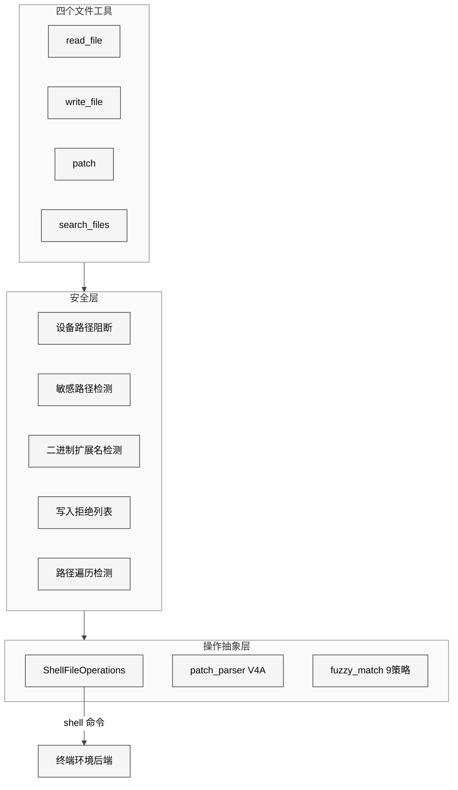
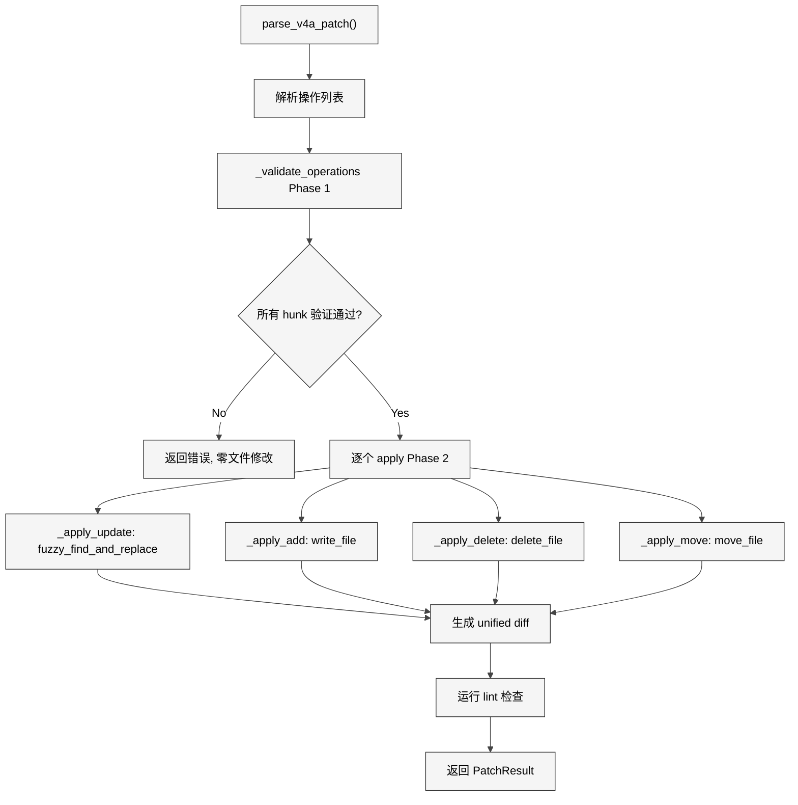
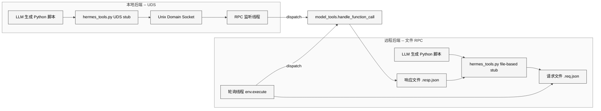

# 第十二章 文件与代码工具

## 12.1 本质：让 LLM 安全地触碰文件系统

文件与代码工具是 Hermes Agent 的"眼睛和笔"——读取代码、编辑文件、搜索内容、执行脚本。与直接在终端中使用 `cat`/`sed`/`grep` 不同，这些工具提供了结构化的输入输出、安全边界检查、模糊匹配容错和重复操作检测。

这套系统涉及约 4058 行核心代码：

| 模块 | 行数 | 职责 |
|------|------|------|
| `tools/file_tools.py` | 799 行 | 四个文件工具的入口与注册 |
| `tools/code_execution_tool.py` | 1378 行 | 代码沙箱执行（PTC） |
| `tools/file_operations.py` | 1216 行 | 跨后端的文件操作实现 |
| `tools/patch_parser.py` | 580 行 | V4A 补丁格式解析与应用 |
| `tools/path_security.py` | 43 行 | 路径遍历检测 |
| `tools/binary_extensions.py` | 42 行 | 二进制文件扩展名表 |

## 12.2 核心问题

文件操作面临四个关键挑战：

1. **LLM 的编辑不精确**——模型生成的"查找文本"可能有缩进差异、空白差异甚至微小错别字
2. **上下文窗口压力**——大文件直接返回会溢出上下文窗口，且浪费 token
3. **安全边界**——必须防止 LLM 读取/写入敏感路径（`~/.ssh/`、`/etc/shadow`）
4. **跨后端一致性**——本地文件系统和远程容器需要同样的文件操作接口

## 12.3 解决方案：四工具 + 安全层 + 操作抽象

<div style="background: #ffffff; padding: 16px; border-radius: 8px; margin: 16px 0;">



</div>

## 12.4 实现细节

### 12.4.1 read_file：带限流的文件读取

`read_file` 工具的设计体现了对 LLM 行为模式的深刻理解。核心参数：`path`（文件路径）、`offset`（起始行号，1-indexed）、`limit`（最大行数，默认 500，上限 2000）。

**读取大小保护**——默认上限 100K 字符（`_DEFAULT_MAX_READ_CHARS`），约 25-35K tokens。超过该限制时直接拒绝读取，要求 LLM 用 offset+limit 分段读取。可通过 `config.yaml` 的 `file_read_max_chars` 调整。

**设备路径阻断**——`_BLOCKED_DEVICE_PATHS` 包含 `/dev/zero`、`/dev/random`、`/dev/stdin` 等设备文件。读取这些文件会导致进程挂起（无限输出或阻塞等待输入）。检查使用字面路径而非 `realpath()`，因为 symlink 解析链可能绕过检查。

**重复读取检测**——`_read_tracker` 字典记录每个 task 的读取历史。同一文件、同一 offset+limit 连续读取 4 次以上会被阻断，返回错误信息要求 LLM 停止重复操作。同时引入了 mtime 去重：如果文件未被修改过，返回缓存提示而非重新读取。

**敏感信息脱敏**——读取结果通过 `redact_sensitive_text()` 过滤，替换可能存在的 API Key、Token 等敏感内容。

### 12.4.2 write_file 与 patch：两种写入模式

**write_file** 执行全量覆写——适合创建新文件或完全替换内容。自动创建父目录。包含写前检查：

- `_is_write_denied()` 检查 `WRITE_DENIED_PATHS`（精确匹配）和 `WRITE_DENIED_PREFIXES`（前缀匹配），覆盖 `~/.ssh/`、`~/.aws/`、`/etc/sudoers` 等敏感路径
- `HERMES_WRITE_SAFE_ROOT` 环境变量可限制所有写操作在指定目录内（用于 gateway 部署）
- 写入后检查 mtime 记录，如果文件在"上次读取"和"本次写入"之间被外部修改，发出警告

**patch** 工具提供两种模式：

1. **replace 模式**——查找 `old_string` 并替换为 `new_string`。使用 `fuzzy_match` 模块的 9 种匹配策略，包括精确匹配、忽略前导空白、忽略全部空白、正则化缩进等。`replace_all` 参数控制是替换所有匹配还是要求唯一匹配。

2. **patch 模式**——应用 V4A 格式的多文件补丁。V4A 是 Codex、Cline 等 coding agent 使用的补丁格式，支持文件更新、创建、删除和移动四种操作。

### 12.4.3 patch_parser.py：V4A 补丁解析器

`patch_parser.py`（580 行）实现了完整的 V4A 补丁解析和应用流程。V4A 格式示例：

```
*** Begin Patch
*** Update File: path/to/file.py
@@ optional context hint @@
 context line
-removed line
+added line
*** End Patch
```

解析器产出 `PatchOperation` 对象列表，每个包含 `operation`（枚举：ADD/UPDATE/DELETE/MOVE）、`file_path`、`hunks`（变更块列表）。

**两阶段应用策略**——`apply_v4a_operations()` 先执行全量验证（Phase 1：`_validate_operations()`），确保所有 hunk 都能在当前文件内容中找到匹配。只有验证全部通过才进入应用阶段（Phase 2），否则不修改任何文件。这避免了"应用了前三个 hunk，第四个失败导致文件半损坏"的问题。

<div style="background: #ffffff; padding: 16px; border-radius: 8px; margin: 16px 0;">



</div>

### 12.4.4 search_files：ripgrep 封装

`search_files` 工具底层使用 ripgrep（`rg`），提供两种模式：

- **content 模式**——在文件内容中搜索正则表达式，支持 `file_glob` 过滤、`context` 行数、`output_mode`（content/files_only/count）
- **files 模式**——按 glob 模式搜索文件名，按修改时间排序

搜索同样有重复检测：同一搜索连续执行 4 次以上被阻断，3 次时附加警告信息。分页通过 `offset` + `limit` 实现，结果截断时自动提示下一个 offset 值。

### 12.4.5 ShellFileOperations：跨后端统一

`file_operations.py` 的 `ShellFileOperations` 类是关键的抽象层。它将所有文件操作转换为 shell 命令，通过终端环境后端执行。这意味着无论后端是本地、Docker 还是 Modal，文件操作都使用相同的代码路径。

写入拒绝列表在此层实现（`WRITE_DENIED_PATHS` 和 `WRITE_DENIED_PREFIXES`），覆盖了 SSH 私钥、shell 配置文件、Hermes 自身的 `.env` 文件、系统级认证文件等。

### 12.4.6 code_execution_tool：编程式工具调用

`code_execution_tool.py`（1378 行）实现了 Programmatic Tool Calling（PTC）——让 LLM 编写 Python 脚本直接调用 Hermes 工具，将多步工具链压缩为单次推理。

**沙箱允许的工具集**——`SANDBOX_ALLOWED_TOOLS` 限定了 7 个工具：`web_search`、`web_extract`、`read_file`、`write_file`、`search_files`、`patch`、`terminal`。不包含 `browser_*`（开销大）和 `delegate_task`（防止递归）。

**双传输架构**：

<div style="background: #ffffff; padding: 16px; border-radius: 8px; margin: 16px 0;">



</div>

本地后端使用 Unix Domain Socket，父进程启动 RPC 监听线程，子进程通过 socket 发送工具调用请求。远程后端（Docker/SSH/Modal/Daytona）使用文件 RPC：脚本写入 `.req.json` 文件，父进程的轮询线程通过 `env.execute()` 读取请求、分发调用、写入 `.resp.json` 响应。

**资源限制**——默认超时 300 秒、最大 50 次工具调用、stdout 上限 50KB、stderr 上限 10KB。可通过 `config.yaml` 的 `code_execution.*` 调整。

### 12.4.7 二进制文件与路径安全

`binary_extensions.py`（42 行）定义了约 80 个二进制扩展名（图片、视频、音频、归档、可执行文件、字体、字节码等），`has_binary_extension()` 执行纯字符串检查。注意 `.pdf` 被故意排除——它是文本格式，agent 可能需要检查。

`path_security.py`（43 行）提供两个通用函数：
- `validate_within_dir()` 使用 `Path.resolve()` + `relative_to()` 确保路径不逃逸指定根目录
- `has_traversal_component()` 快速检查路径中是否包含 `..` 组件

这两个函数被 skill_manager、skills_tool、cronjob_tools 等多个模块共享。

## 12.5 易错点与注意事项

1. **fuzzy_match 的副作用**——9 种匹配策略按宽松程度递增，最后几种（如忽略全部空白）可能匹配到错误位置。V4A 补丁验证阶段会在模拟内容上执行所有 hunk，确保匹配正确，但 replace 模式无此保护。

2. **_get_file_ops 的缓存失效**——`file_tools.py` 缓存了每个 task 的 `ShellFileOperations`。当终端环境被清理线程回收后，缓存的 file_ops 变为无效。代码通过检查 `_active_environments` 字典来检测此情况并重建。

3. **context compression 后的去重重置**——上下文压缩会使 LLM 丢失之前读取的文件内容。`_read_tracker` 中的 `dedup` 字典需要被清除，否则 LLM 重新读取同一文件时会被错误地跳过。

4. **write_file 的 mtime 竞态**——写入前检查文件的上次读取 mtime 是否匹配，但在并发场景下（如 delegate_task 的子代理同时编辑），检查和写入之间可能有其他写入发生。

## 12.6 与竞品对比

| 维度 | Hermes Agent | Claude Code | Cursor Agent |
|------|-------------|-------------|--------------|
| 编辑模式 | replace + V4A patch | str_replace | diff |
| 模糊匹配 | 9 种策略 | 精确匹配 | 精确匹配 |
| 读取限制 | 100K chars, 可配置 | 无限 | 按 token |
| 重复检测 | 4次连续阻断 | 无 | 无 |
| 代码执行 | UDS/文件 RPC 沙箱 | 直接 shell | 直接 shell |
| 写入保护 | 路径黑名单 + safe_root | 用户审批 | 用户审批 |

Hermes 在文件操作的安全性和容错性上做了更多工程投入，尤其是模糊匹配和重复检测。代价是复杂度更高，且偶尔可能出现模糊匹配误命中的问题。

## 12.7 仍存在的问题

1. **V4A 补丁的验证-应用间隙**——两阶段策略保证了验证失败时不修改文件，但验证通过后到实际应用之间可能有外部修改（竞态窗口）。代码注释中承认了这一点："Apply phase failed ... run `git diff` to assess"。

2. **远程文件 RPC 的性能**——文件 RPC 使用轮询机制（`_rpc_poll_loop`），轮询间隔和 `env.execute()` 的开销叠加，使得远程沙箱中的工具调用延迟显著高于本地 UDS。每次工具调用需要一次完整的远程命令执行（读请求文件 + 写响应文件）。

3. **search_files 的大仓库性能**——底层 ripgrep 虽然高效，但在超大型仓库（百万文件级）中，不带 `file_glob` 的全文搜索仍可能很慢。目前没有仓库索引机制。

4. **code_execution 的 Python 限制**——PTC 沙箱只支持 Python 脚本。如果远程环境没有预装 Python 3，代码执行工具将不可用。应该考虑检测远程环境的 Python 可用性并在不可用时给出明确提示。
