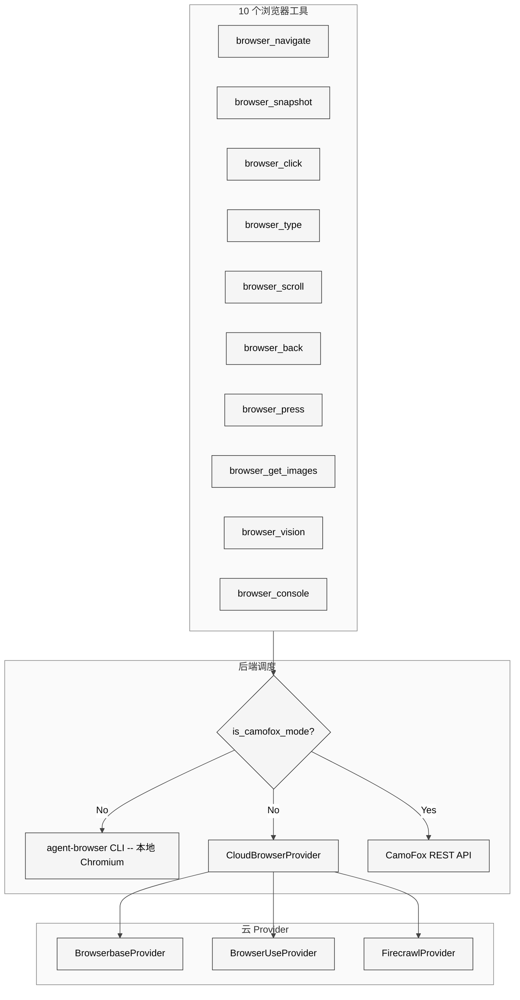
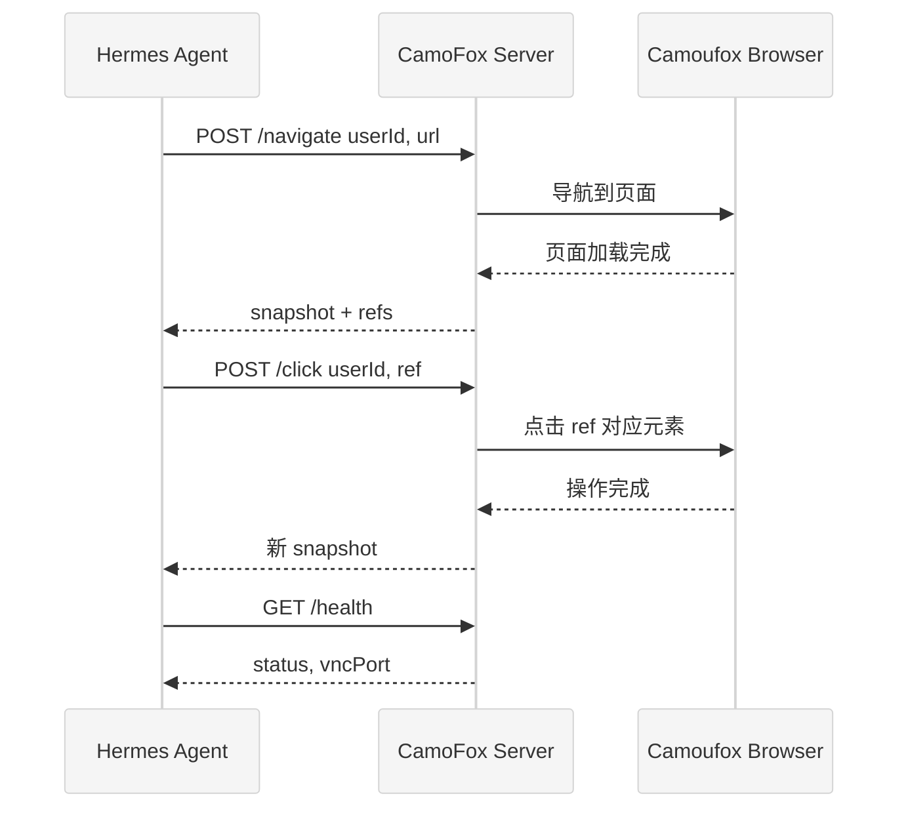

# 第十三章 浏览器自动化

## 13.1 本质：给 LLM 一双"网络之眼"

浏览器自动化工具让 Hermes Agent 能够像人类一样浏览网页——导航到 URL、阅读页面内容、点击按钮、填写表单、截取屏幕。与 `web_search`/`web_extract` 的静态 HTTP 抓取不同，浏览器工具操控真实的浏览器引擎，能处理 JavaScript 渲染的动态页面。

这是 Hermes 工具系统中最庞大的单一子系统，涉及约 3650 行代码：

| 模块 | 行数 | 职责 |
|------|------|------|
| `tools/browser_tool.py` | 2393 行 | 10 个浏览器工具、会话管理、provider 调度 |
| `tools/browser_camofox.py` | 600 行 | CamoFox 反检测浏览器后端 |
| `tools/browser_camofox_state.py` | 47 行 | CamoFox 身份与持久化状态 |
| `tools/browser_providers/base.py` | 59 行 | CloudBrowserProvider 抽象基类 |
| `tools/browser_providers/browserbase.py` | 217 行 | Browserbase 云浏览器 |
| `tools/browser_providers/browser_use.py` | 215 行 | Browser Use 云浏览器 |
| `tools/browser_providers/firecrawl.py` | 107 行 | Firecrawl 抓取 provider |

## 13.2 核心问题

浏览器自动化面临五个独特挑战：

1. **无视觉的页面理解**——LLM 无法直接"看"网页，需要将视觉页面转换为文本表示
2. **反爬虫对抗**——商业网站广泛使用指纹检测、行为分析、CAPTCHA 等技术
3. **会话隔离**——多个 task 同时使用浏览器不能互相干扰
4. **后端异构**——本地 Chromium、云 Browserbase、反检测 CamoFox 的 API 完全不同
5. **资源管理**——浏览器进程内存密集，需要及时清理

## 13.3 解决方案：三层 Provider 架构

<div style="background: #ffffff; padding: 16px; border-radius: 8px; margin: 16px 0;">



</div>

每个工具函数在执行时首先检查 CamoFox 模式（通过 `CAMOFOX_URL` 环境变量），如果启用则将请求转发到 CamoFox REST API。否则，检查是否配置了云 provider（Browserbase/Browser Use），配置了就通过 CDP WebSocket 连接云浏览器，否则使用本地 `agent-browser` CLI 驱动 headless Chromium。

## 13.4 实现细节

### 13.4.1 十个浏览器工具

浏览器工具覆盖了网页交互的完整语义：

| 工具 | 功能 | 关键参数 |
|------|------|---------|
| `browser_navigate` | 导航到 URL | `url` |
| `browser_snapshot` | 获取页面快照（无障碍树） | `full` (全页/当前视口) |
| `browser_click` | 点击元素 | `ref` (如 @e5) |
| `browser_type` | 在元素中输入文字 | `ref`, `text` |
| `browser_scroll` | 滚动页面 | `direction` (up/down) |
| `browser_back` | 返回上一页 | 无 |
| `browser_press` | 按键操作 | `key` (如 Enter, Tab) |
| `browser_get_images` | 获取页面图片列表 | 无 |
| `browser_vision` | 截图 + 视觉分析 | `question`, `annotate` |
| `browser_console` | 执行 JS / 读取控制台 | `expression`, `clear` |

所有 10 个工具在 `browser_tool.py` 尾部通过 `registry.register()` 注册到 `"browser"` 工具集，共享同一个 `check_fn`（`check_browser_requirements`）。

### 13.4.2 无障碍树：LLM 的"页面视觉"

`browser_snapshot` 是最核心的工具。它不返回 HTML 源码（太大且含噪声），而是返回页面的**无障碍树**（Accessibility Tree / ariaSnapshot）。无障碍树是浏览器为辅助技术（屏幕阅读器）构建的结构化页面表示，每个可交互元素都有唯一的 ref 标识符（如 `@e1`、`@e2`）。

这个设计让 LLM 无需视觉能力即可理解页面结构和内容。元素的 ref 直接用于 `browser_click`、`browser_type` 等工具的 `ref` 参数，形成"快照-识别-操作"的交互循环。

当快照内容超过 `SNAPSHOT_SUMMARIZE_THRESHOLD`（8000 tokens）时，`browser_snapshot` 会调用辅助 LLM（`call_llm`）对内容进行摘要，结合用户的原始任务（`user_task` 参数）提取相关信息，避免将大量无关内容塞入主模型的上下文窗口。

### 13.4.3 会话管理

`_active_sessions` 字典维护每个 `task_id` 的浏览器会话。会话包括 agent-browser 的子进程、云 provider 的 session ID、以及 CamoFox 的 user/tab 标识。

清理通过三个层面保障：
- `cleanup_browser(task_id)` 显式清理单个会话
- `cleanup_all_browsers()` 进程退出时批量清理
- `atexit` 和信号处理器（SIGTERM/SIGINT）确保异常退出也能清理

云 provider 额外提供 `emergency_cleanup()` 方法，在信号处理器中使用，容忍网络错误和认证失败。

### 13.4.4 agent-browser CLI 集成

本地模式通过 `agent-browser` CLI（Node.js 工具）驱动 headless Chromium。Hermes 通过 subprocess 调用 CLI，传入命令和参数，解析 JSON 输出。

CLI 发现逻辑相当复杂。`_find_agent_browser()` 按以下顺序搜索：

1. `HERMES_HOME/node/bin/agent-browser`（Hermes 自管理的 Node 安装）
2. Homebrew 版本化 Node 目录（如 `/opt/homebrew/opt/node@24/bin`）
3. 标准系统 PATH（`/usr/local/bin`、`/opt/homebrew/bin` 等）
4. Android/Termux 特殊路径（`/data/data/com.termux/files/usr/bin`）
5. 最后回退到 `npx agent-browser`

`_merge_browser_path()` 将这些路径合并到 `PATH` 环境变量，供子进程使用。

### 13.4.5 CloudBrowserProvider 抽象

`browser_providers/base.py` 定义了 `CloudBrowserProvider` 抽象基类，包含四个核心方法：

```python
class CloudBrowserProvider(ABC):
    def provider_name(self) -> str: ...
    def is_configured(self) -> bool: ...
    def create_session(self, task_id: str) -> Dict[str, object]: ...
    def close_session(self, session_id: str) -> bool: ...
    def emergency_cleanup(self, session_id: str) -> None: ...
```

`create_session()` 返回的字典包含 `session_name`、`bb_session_id`（通用 provider session ID，键名出于历史原因保留 `bb_` 前缀）、`cdp_url`（CDP WebSocket 地址）和 `features`（特性标志）。

**BrowserbaseProvider**（217 行）通过 REST API 创建 Browserbase 云浏览器会话。支持住宅代理（`BROWSERBASE_PROXIES`）、高级隐身模式（`BROWSERBASE_ADVANCED_STEALTH`）、会话保活（`BROWSERBASE_KEEP_ALIVE`）和自定义超时（`BROWSERBASE_SESSION_TIMEOUT`）。

**BrowserUseProvider**（215 行）对接 Browser Use 云服务，是 Nous Research 订阅用户的默认选择。

**FirecrawlProvider**（107 行）是一个特殊的 provider——它不驱动真正的浏览器，而是使用 Firecrawl API 抓取页面内容并转换为结构化数据。

### 13.4.6 CamoFox：反检测浏览器

CamoFox 是 Hermes 的"隐身模式"。它基于 Camoufox（Firefox 的 C++ 级指纹伪装分支），通过自托管的 Node.js 服务器暴露 REST API。

<div style="background: #ffffff; padding: 16px; border-radius: 8px; margin: 16px 0;">



</div>

CamoFox 的关键特性：

- **身份持久化**——`browser_camofox_state.py` 使用 `uuid.uuid5()` 基于 Hermes profile 生成确定性 `user_id`，使同一 profile 的请求映射到同一浏览器 profile 目录，保留 cookies 和登录状态
- **会话管理**——`_sessions` 字典按 `task_id` 隔离，每个 task 有独立的 `user_id`、`tab_id`、`session_key`
- **VNC 预览**——健康检查端点返回 `vncPort`，用户可以实时观看浏览器操作
- **快照分页**——`_SNAPSHOT_MAX_CHARS = 80,000`，超大页面内容自动分页

`is_camofox_mode()` 的判断逻辑包含一个优先级规则：如果 `BROWSER_CDP_URL` 已设置（用户通过 `/browser connect` 连接了实体浏览器），则 CamoFox 让位，确保 CDP 直连优先。

### 13.4.7 URL 安全检查

每次 `browser_navigate` 调用前会执行两重安全检查：

1. `is_safe_url()` 检查 URL 格式和协议（阻断 `file://`、`javascript:` 等危险协议）
2. `check_website_access()` 检查网站访问策略（可配置的域名黑名单/白名单）

如果安全模块导入失败，策略为 fail-open（`is_safe_url` 回退为 `lambda: False` 即全部阻断）和 fail-open（`check_website_access` 回退为 `lambda: None` 即全部放行）。这个不一致的默认策略值得注意。

## 13.5 易错点与注意事项

1. **agent-browser 安装依赖**——在 Docker 和 headless Linux 中，Chromium 需要额外的系统库（libgbm、libnss3 等）。`agent-browser install --with-deps` 会尝试安装这些依赖，但仅支持 Debian/Ubuntu。其他发行版需要手动安装。

2. **Termux 的特殊处理**——在 Android Termux 上，裸 `npx` 回退不够可靠。`_requires_real_termux_browser_install()` 检测此情况，要求用户全局安装 `agent-browser` 而非依赖 `npx`。

3. **命令超时的配置化**——`DEFAULT_COMMAND_TIMEOUT = 30` 秒对于慢速网络可能不够。可通过 `config.yaml` 的 `browser.command_timeout` 调整，下限 5 秒防止设为 0 导致立即超时。

4. **截图清理的节流**——`_last_screenshot_cleanup_by_dir` 记录每个目录的上次清理时间，避免重复扫描。但如果同一目录在短时间内生成大量截图（如连续 `browser_vision` 调用），清理可能延迟。

5. **缓存重置**——`cleanup_all_browsers()` 不仅清理会话，还重置 `_cached_agent_browser`、`_cached_command_timeout`、`_discover_homebrew_node_dirs.cache_clear()`。这些缓存在 CLI 模式下无关紧要，但在 gateway 长运行进程中可能导致过时配置。

## 13.6 与竞品对比

| 维度 | Hermes Agent | Claude Computer Use | Open Interpreter |
|------|-------------|-------------------|-----------------|
| 页面表示 | 无障碍树 + 文本 | 截图 + 视觉 | HTML 源码 |
| 后端数量 | 4 种（本地+3云） | 1 种（本地） | 1 种（Playwright） |
| 反检测 | CamoFox (Firefox fork) | 无 | 无 |
| 工具数量 | 10 个 | 3-5 个 | 自定义 |
| 云浏览器 | Browserbase, Browser Use | 无 | 无 |
| 视觉分析 | browser_vision 辅助 | 原生视觉 | 无 |

Hermes 的浏览器系统在后端多样性和反检测能力上有明显优势。无障碍树方案在大多数场景下比截图+视觉更可靠（不受渲染差异影响），但在需要理解页面布局和视觉设计的场景下，`browser_vision` 作为补充。

## 13.7 仍存在的问题

1. **2393 行单文件**——`browser_tool.py` 是整个项目中最大的单个工具文件。10 个工具、会话管理、provider 调度、CLI 发现、安全检查全部在一个文件中。应该拆分为 `browser_session.py`（会话管理）、`browser_tools.py`（工具注册）、`browser_cli.py`（CLI 集成）等子模块。

2. **`bb_session_id` 命名遗留**——`CloudBrowserProvider.create_session()` 返回的 `bb_session_id` 键名源自最初只支持 Browserbase 时的设计。现在已扩展到三个 provider，但键名未更新，代码注释标注为"legacy key name kept for backward compat"。

3. **CamoFox 的单点故障**——当 `CAMOFOX_URL` 配置后，所有浏览器操作都路由到 CamoFox 服务器。如果服务器宕机，浏览器工具完全不可用。缺少自动回退到本地 Chromium 的机制。

4. **Firecrawl 的语义差异**——`FirecrawlProvider` 不驱动真正的浏览器，无法执行点击、输入等交互操作。当用户配置 Firecrawl 后，`browser_click` 等工具仍然注册并可见，但执行会失败或行为异常。应该在 provider 层面声明支持的工具子集。

5. **无障碍树的不完整性**——某些现代 Web 应用（如 Canvas 绘制的 UI、WebGL 内容）不生成无障碍树节点。这些页面对 LLM 几乎"不可见"，只能回退到 `browser_vision` 的截图分析。
