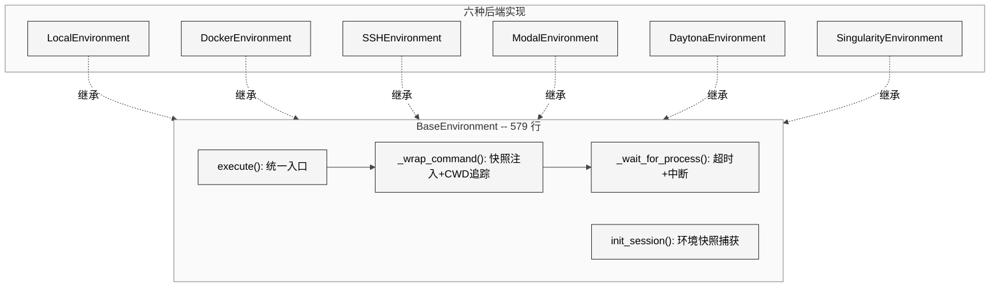
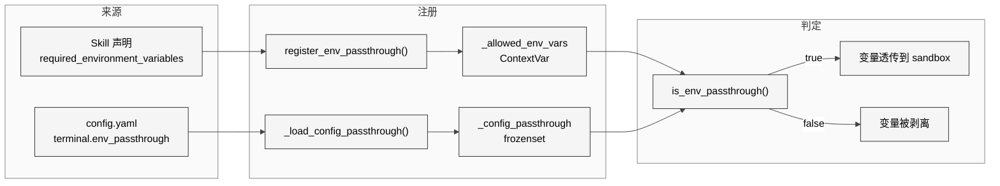

# 第15章 终端与沙箱执行

## 11.1 本质：一个统一接口背后的六种执行后端

终端系统是 Hermes Agent 的"手"——它让 LLM 生成的 shell 命令在物理世界中执行。表面上，LLM 只看到一个 `terminal` 工具，但背后是六种完全不同的执行环境：本地进程、Docker 容器、SSH 远程、Modal 云沙箱、Daytona 云开发环境、Singularity/Apptainer HPC 容器。

这套系统涉及约 6300 行代码，分布在以下文件：

| 模块 | 行数 | 职责 |
|------|------|------|
| `tools/terminal_tool.py` | 1756 行 | 工具入口、环境工厂、生命周期管理 |
| `tools/process_registry.py` | 1184 行 | 后台进程管理、端口发现 |
| `tools/environments/base.py` | 579 行 | 抽象基类、统一执行流 |
| `tools/environments/docker.py` | 578 行 | Docker 容器后端 |
| `tools/environments/modal.py` | 434 行 | Modal 云后端 |
| `tools/environments/local.py` | 314 行 | 本地执行后端 |
| `tools/environments/singularity.py` | 262 行 | Singularity 容器后端 |
| `tools/environments/ssh.py` | 258 行 | SSH 远程后端 |
| `tools/environments/daytona.py` | 229 行 | Daytona 云后端 |
| `tools/env_passthrough.py` | 101 行 | 环境变量白名单 |

## 11.2 核心问题

终端执行面临三个根本挑战：

1. **安全隔离**——LLM 可能生成危险命令（`rm -rf /`、读取密钥文件），需要在不阻断正常操作的前提下隔离
2. **环境状态持久化**——shell 是有状态的（CWD、环境变量、函数定义），但每次执行都是独立进程
3. **异构后端统一**——本地进程、Docker 容器、云 SDK 的 API 完全不同，需要统一抽象

## 11.3 解决方案：BaseEnvironment 抽象

<div style="background-color: #ffffff; padding: 16px; border-radius: 8px; margin: 16px 0;" bgcolor="#ffffff">



</div>

所有后端继承 `BaseEnvironment`，只需实现两个抽象方法：`_run_bash()` 和 `cleanup()`。基类提供了完整的执行流程：快照注入、CWD 追踪、超时处理、中断响应。

## 11.4 实现细节

### 11.4.1 Spawn-per-call + Session Snapshot

Hermes 采用了"每次调用启动新进程"的模型，而非维护一个持久化的 shell 会话。这个选择牺牲了一点性能，但换来了可靠性——不会有"僵尸 shell"问题，不会有未回收的进程，不会有交互式命令阻塞。

状态持久化通过 Session Snapshot 实现。`init_session()` 在首次调用时捕获登录 shell 的完整环境：

```python
bootstrap = (
    f"export -p > {self._snapshot_path}\n"
    f"declare -f | grep -vE '^_[^_]' >> {self._snapshot_path}\n"
    f"alias -p >> {self._snapshot_path}\n"
    f"echo 'shopt -s expand_aliases' >> {self._snapshot_path}\n"
)
```

这段代码依次导出：环境变量（`export -p`）、用户定义的 shell 函数（`declare -f`，排除以单下划线开头的内部函数）、别名（`alias -p`）、以及 `expand_aliases` 选项。后续每次执行前，`_wrap_command()` 会 `source` 这个快照文件来恢复环境。

### 11.4.2 CWD 追踪的双通道机制

CWD 持久化使用了两种并行的追踪方式：

1. **文件通道**（本地后端）——命令结束后执行 `pwd -P > /tmp/hermes-cwd-{session}.txt`，本地后端直接读取该文件
2. **标记通道**（远程后端）——在 stdout 中注入标记 `__HERMES_CWD_{session}__path__HERMES_CWD_{session}__`，远程后端从输出中解析

`_extract_cwd_from_output()` 负责从输出中提取 CWD 标记并清除注入的内容，确保 LLM 看到的输出是干净的。

### 11.4.3 六种后端对比

| 后端 | stdin 模式 | 文件同步 | 持久化 | 适用场景 |
|------|-----------|---------|--------|---------|
| Local | pipe | 无需 | 否 | 开发调试、个人使用 |
| Docker | pipe | bind mount | 可选 | 安全隔离、CI/CD |
| SSH | pipe | SCP + ControlMaster | 可选 | 远程服务器 |
| Modal | heredoc | FileSyncManager | snapshot | 云端计算、GPU |
| Daytona | heredoc | FileSyncManager | sandbox | 云开发环境 |
| Singularity | pipe | overlay | 可选 | HPC 集群 |

**Local** 后端（314 行）是最简单的实现。它维护一个庞大的环境变量黑名单（`_HERMES_PROVIDER_ENV_BLOCKLIST`），包含所有 API 密钥、消息平台 Token、OAuth Token 等。子进程继承父进程环境，但黑名单中的变量被剥离，防止 LLM 通过 `env` 或 `echo $OPENAI_API_KEY` 泄露密钥。

**Docker** 后端（578 行）使用安全加固配置：`--cap-drop ALL`（删除所有 Linux capabilities）、`--security-opt no-new-privileges`（禁止提权）、PID 限制。支持可配置的 CPU、内存、磁盘限制。

**SSH** 后端（258 行）使用 ControlMaster 连接复用，避免每次命令都重新握手。通过 `ControlPersist=300` 保持连接 5 分钟。

**Modal** 后端（434 行）使用 Modal SDK 的 `Sandbox.create()` + `Sandbox.exec()`。由于 Modal SDK 是阻塞式 API，通过 `_ThreadedProcessHandle` 适配器在后台线程中执行，暴露与 `subprocess.Popen` 兼容的接口。支持 snapshot 持久化，在 `~/.hermes/modal_snapshots.json` 中记录 `task_id -> snapshot_id` 的映射。

**Daytona** 后端（229 行）同样使用 `_ThreadedProcessHandle`，`cancel_fn` 绑定到 `sandbox.stop()` 用于中断支持。磁盘限制最大 10GB（平台硬性限制）。

**Singularity** 后端（262 行）面向 HPC 场景，使用 `--containall`（完全隔离）和 `--no-home`（不挂载宿主 home），通过 writable overlay 目录实现跨会话持久化。

### 11.4.4 进程管理器 process_registry.py

`process_registry.py`（1184 行）提供后台进程的生命周期管理。核心数据结构是 `ProcessInfo`，包含 PID、命令、启动时间、端口列表、别名等。关键功能：

- **进程发现**——扫描 `/proc` 或使用 `ps` 命令发现后台进程
- **端口关联**——通过 `ss -tlnp` 或 `lsof` 将端口映射到进程
- **信号管理**——向后台进程发送 SIGTERM/SIGKILL
- **自动清理**——检测僵尸进程并回收

进程注册表对外暴露为一个 `process` 工具，让 LLM 可以列出、停止或重启后台服务。

### 11.4.5 环境变量透传

`env_passthrough.py`（101 行）解决了一个安全与功能的冲突：sandbox 默认剥离所有敏感环境变量，但某些 skill 声明了 `required_environment_variables`，需要这些变量才能正常工作。

<div style="background-color: #ffffff; padding: 16px; border-radius: 8px; margin: 16px 0;" bgcolor="#ffffff">



</div>

使用 `ContextVar` 而非全局变量，确保 gateway 场景下不同会话的透传列表互不干扰。

### 11.4.6 环境生命周期

`terminal_tool.py` 管理所有活跃环境的生命周期：

- `_active_environments` 字典维护 `task_id -> BaseEnvironment` 的映射
- `_cleanup_inactive_envs()` 以 300 秒为默认过期时间，清理不活跃的环境
- `_cleanup_thread_worker()` 作为守护线程每 60 秒运行一次清理
- `cleanup_vm()` 用于显式销毁指定 task 的环境
- `cleanup_all_environments()` 在进程退出时（通过 `atexit`）清理所有环境

环境创建使用了 per-task 锁（`_creation_locks`）防止并发创建：多个工具调用可能同时需要同一个 task 的环境，只有第一个获得锁的线程执行创建，其余等待后获取已创建的实例。

## 11.5 易错点与注意事项

1. **sudo 密码处理**——`_transform_sudo_command()` 将 `sudo xxx` 重写为 `echo $SUDO_PASSWORD | sudo -S xxx`，通过 stdin 传入密码。密码通过 `set_sudo_password_callback` 注入，而非环境变量，避免在 `ps aux` 中可见。

2. **_wait_for_process 的活跃回调**——长时间运行的命令需要每 10 秒触发 `activity_callback`，向 gateway 报告"我还活着"。否则 gateway 的不活跃超时会杀死整个会话。

3. **heredoc 模式的 stdin 陷阱**——Modal 和 Daytona 的 SDK 不支持真正的 stdin pipe，因此将 stdin 数据内嵌为 shell heredoc。`_embed_stdin_heredoc()` 使用随机生成的分隔符（`HERMES_STDIN_{uuid}`）避免与用户输入冲突。

4. **Docker 可执行文件发现**——Docker Desktop 在不同平台安装路径不同（`/usr/local/bin`、`/opt/homebrew/bin`、`/Applications/Docker.app/.../bin`），`_DOCKER_SEARCH_PATHS` 硬编码了三个常见位置作为 PATH 补充。

## 11.6 与竞品对比

| 维度 | Hermes Agent | Devin | Claude Code |
|------|-------------|-------|-------------|
| 执行后端 | 6 种（本地到云） | 云 VM | 本地 |
| 状态持久化 | session snapshot | 持久 VM | 单次进程 |
| 安全模型 | 环境变量剥离 + cap-drop | VM 隔离 | 用户审批 |
| 后台进程 | process_registry | VM 原生 | 无 |
| HPC 支持 | Singularity/Apptainer | 无 | 无 |

Hermes 是目前唯一同时支持本地、Docker、SSH、Modal、Daytona 和 Singularity 的 AI Agent 框架。这种广度意味着更高的维护成本，但也使其成为从个人开发到 HPC 集群最通用的选择。

## 11.7 仍存在的问题

1. **Windows 支持缺失**——整个终端系统假设 POSIX 环境，`_IS_WINDOWS` 检查后直接禁用。code_execution_tool 明确标注 "Linux/macOS only"。这限制了 Windows 用户只能通过 WSL 使用。

2. **环境变量黑名单的膨胀**——`local.py` 的 `_build_provider_env_blocklist()` 硬编码了数十个变量名。每增加一个新的 provider 或消息平台，都需要手动添加。应该考虑反转为白名单模式或基于前缀的自动检测。

3. **快照与环境漂移**——session snapshot 在 `init_session()` 时捕获一次，后续命令修改环境变量会在命令结束时更新快照（`export -p > snapshot`）。但如果命令因超时被杀死，快照更新不会执行，导致环境变量修改丢失。

4. **FileSyncManager 的延迟**——SSH、Modal、Daytona 后端在每次命令前调用 `_before_execute()` 进行文件同步。对于频繁操作的场景（如连续的 `read_file` + `patch`），同步开销可能成为瓶颈。
