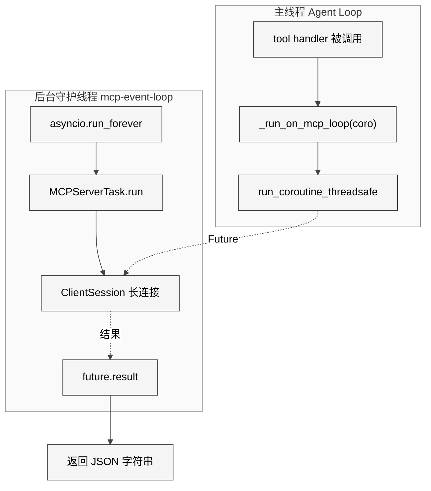

# 第18章 MCP集成

## 14.1 本质

MCP（Model Context Protocol）是Anthropic提出的开放协议，旨在为LLM提供标准化的外部工具接入方式。Hermes Agent的MCP集成模块（`tools/mcp_tool.py`，约2274行）实现了一个完整的MCP客户端，能够连接外部MCP服务器、自动发现其暴露的工具、并将这些工具无缝注册到Hermes的内部工具注册表中。从Agent的视角看，MCP工具与内置工具完全一致——它不需要知道某个工具是本地Python函数还是远端MCP服务器提供的。

这一设计的本质是**协议桥接**：将MCP协议的异步世界（asyncio事件循环、长连接、流式传输）与Hermes Agent的同步工具调用接口之间建立双向桥梁。

## 14.2 核心问题

MCP集成面临五个关键挑战：

1. **异步/同步鸿沟**：MCP SDK是纯异步的（基于anyio），而Hermes的工具处理器是同步函数。如何让同步的`handler(args)`调用触发异步的MCP RPC？
2. **连接生命周期管理**：MCP服务器需要长连接（stdio子进程或HTTP流），而工具调用是短暂的。如何在两者之间保持连接活性？
3. **安全隔离**：stdio传输需要启动子进程，如何防止API密钥泄露到子进程环境？
4. **动态工具发现**：MCP服务器可能在运行时增减工具（`tools/list_changed`通知），如何实时同步？
5. **OAuth认证流**：远程MCP服务器可能需要OAuth 2.1 PKCE认证，如何在CLI环境下完成浏览器授权？

## 14.3 解决方案

### 专用后台事件循环架构

Hermes采用了一个精巧的线程架构来解决异步/同步鸿沟：

<div style="background: #ffffff; padding: 16px; border-radius: 8px; margin: 16px 0;">



</div>

核心机制在`_ensure_mcp_loop()`（L1224-1237）中：创建一个独立的asyncio事件循环运行在守护线程上。每个MCP服务器作为一个长生命周期的`asyncio.Task`运行在该循环中，保持传输连接不断。当Agent需要调用MCP工具时，`_run_on_mcp_loop()`（L1240-1270）通过`run_coroutine_threadsafe`将协程调度到后台循环，然后以0.1秒的轮询间隔等待结果——这种短间隔轮询设计使得用户中断（`is_interrupted()`）能被及时响应。

### MCP连接与工具注册流程

<div style="background: #ffffff; padding: 16px; border-radius: 8px; margin: 16px 0;">

```mermaid
%%{init: {'theme': 'neutral', 'themeVariables': {'background': '#ffffff', 'primaryColor': '#f5f5f5', 'primaryTextColor': '#000000', 'primaryBorderColor': '#333333', 'lineColor': '#444444', 'textColor': '#000000', 'mainBkg': '#f5f5f5', 'nodeBorder': '#333333', 'actorBkg': '#f5f5f5', 'actorBorder': '#333333', 'actorTextColor': '#000000', 'actorLineColor': '#444444', 'signalColor': '#444444', 'signalTextColor': '#000000', 'noteBkgColor': '#f0f0f0', 'noteTextColor': '#000000', 'noteBorderColor': '#888888', 'activationBorderColor': '#333333', 'activationBkgColor': '#e8e8e8', 'sequenceNumberColor': '#ffffff'}}}%%
sequenceDiagram
    participant AG as Agent启动
    participant CFG as config.yaml
    participant LOOP as MCP后台循环
    participant SRV as MCPServerTask
    participant SDK as MCP SDK
    participant REG as Tool Registry

    AG->>CFG: _load_mcp_config()
    CFG-->>AG: mcp_servers dict
    AG->>LOOP: _ensure_mcp_loop()
    AG->>LOOP: _discover_all() 并行连接
    LOOP->>SRV: server.start(config)
    SRV->>SDK: stdio_client / streamablehttp_client
    SDK-->>SRV: read_stream, write_stream
    SRV->>SDK: session.initialize()
    SRV->>SDK: session.list_tools()
    SDK-->>SRV: tools列表
    SRV->>REG: _register_server_tools()
    REG-->>AG: mcp_server_tool_name 列表
    Note over AG,REG: 工具以 mcp_{server}_{tool} 格式注册
```

</div>

## 14.4 实现细节

### 传输层：Stdio与HTTP双通道

`MCPServerTask`（L774-1160）根据配置自动选择传输方式：

- **Stdio传输**（`_run_stdio`，L890-939）：启动子进程，通过stdin/stdout通信。启动前会调用`check_package_for_malware()`进行OSV恶意软件数据库检查，并通过`_build_safe_env()`（L194-210）过滤环境变量——只传递`PATH`、`HOME`等安全变量加上用户显式配置的变量，防止API密钥泄露。
- **HTTP传输**（`_run_http`，L941-1015）：支持新旧两套API（`streamable_http_client` vs `streamablehttp_client`），通过`_MCP_NEW_HTTP`标志自动选择。当配置`auth: oauth`时，调用`mcp_oauth.py`构建OAuth处理器。

### Schema转换：MCP到OpenAI函数调用

`_convert_mcp_schema()`（L1652-1670）执行关键的Schema翻译：

```python
def _convert_mcp_schema(server_name, mcp_tool):
    safe_tool_name = sanitize_mcp_name_component(mcp_tool.name)
    safe_server_name = sanitize_mcp_name_component(server_name)
    prefixed_name = f"mcp_{safe_server_name}_{safe_tool_name}"
    return {
        "name": prefixed_name,
        "description": mcp_tool.description or f"MCP tool ...",
        "parameters": _normalize_mcp_input_schema(mcp_tool.inputSchema),
    }
```

命名规则`mcp_{server}_{tool}`确保全局唯一，`sanitize_mcp_name_component()`将非`[A-Za-z0-9_]`字符替换为下划线，避免与Provider的函数名验证规则冲突。`_normalize_mcp_input_schema()`（L1630-1638）补齐空的`properties`字段，保证LLM能正确生成函数调用参数。

### 安全扫描：工具描述注入检测

`_scan_mcp_description()`（L253-271）对每个MCP工具的描述进行提示注入检测，检查10种攻击模式：

- `ignore previous instructions` — 提示覆盖
- `you are now a` — 身份劫持
- `system:` — 系统提示注入
- `exec(` / `eval(` — 代码执行引用

检测到可疑内容时仅记录WARNING而不阻止注册——这是有意的设计取舍，因为误报会破坏合法MCP服务器的正常使用。

### Sampling：服务器发起的LLM请求

`SamplingHandler`类（L403-767）实现了MCP Sampling协议，允许MCP服务器反向请求LLM补全。关键控制机制包括：

- **滑动窗口限速**（`_check_rate_limit`）：60秒窗口内最多`max_rpm`次请求
- **工具循环治理**（`_build_tool_use_result`）：限制tool-use响应轮数，防止无限递归
- **模型白名单**（`allowed_models`）：限制服务器可以请求的模型范围
- **凭证清洗**（`_sanitize_error`）：所有返回给LLM的错误文本都经过正则清洗，替换token/key/secret等模式为`[REDACTED]`

### OAuth 2.1 PKCE认证

`tools/mcp_oauth.py`（483行）实现完整的浏览器OAuth流：

1. `HermesTokenStorage` 将token和client_info持久化到`~/.hermes/mcp-tokens/{server}.json`，文件权限设为0o600
2. `build_oauth_auth()` 构建`OAuthClientProvider`（httpx.Auth子类）
3. 授权流：自动打开浏览器 -> 临时HTTP服务器监听回调 -> 获取authorization code -> SDK处理token交换和刷新

### CLI配置管理

`hermes_cli/mcp_config.py`（约717行）提供`hermes mcp add/remove/list/test/configure`命令，支持交互式添加MCP服务器配置，连接测试，以及工具包含/排除过滤器的设置。

## 14.5 易踩的坑

1. **anyio取消作用域必须在同一Task中关闭**：这是整个`MCPServerTask`架构存在的原因。如果在一个Task中打开stdio连接，在另一个Task中关闭，anyio会抛出异常。因此每个服务器的完整生命周期必须在同一个`asyncio.Task`内完成（L779注释）。

2. **事件循环关闭后的幽灵回调**：`_mcp_loop_exception_handler()`（L1209-1221）专门处理httpx/httpcore析构函数在事件循环关闭后调用`call_soon()`的RuntimeError，将其静默吞掉。

3. **Stdio子进程孤儿问题**：如果优雅关闭超时，`_kill_orphaned_mcp_children()`（L2231-2252）通过追踪`_stdio_pids`集合强制SIGKILL残留子进程。

4. **工具名冲突**：MCP工具名可能与内置工具冲突。`_register_server_tools()`（L1867-1875）检测碰撞：如果目标名字已在非MCP工具集中注册，跳过该MCP工具并记录WARNING。

## 14.6 与同类方案的比较

| 维度 | Hermes MCP | Claude Desktop MCP | Cursor MCP |
|------|-----------|-------------------|------------|
| 传输 | Stdio + HTTP(StreamableHTTP) | Stdio + SSE | Stdio + SSE |
| 并行连接 | asyncio.gather并行 | 串行 | 串行 |
| 动态刷新 | tools/list_changed通知 | 重启连接 | 不支持 |
| OAuth | 完整2.1 PKCE流 | 不支持 | 不支持 |
| Sampling | 完整支持(含tool-use) | 不支持 | 不支持 |
| 安全扫描 | 描述注入检测+凭证清洗 | 无 | 无 |
| 工具过滤 | include/exclude白黑名单 | 无 | 无 |

Hermes的MCP实现是目前开源Agent中最完整的之一，特别是Sampling支持和动态工具发现在其他客户端中极为少见。

## 14.7 遗留问题

1. **MCP Resources/Prompts是二等公民**：虽然注册了`list_resources`、`read_resource`、`list_prompts`、`get_prompt`四个实用工具，但它们的使用率远低于普通工具调用，且没有与Agent的RAG管线集成。
2. **重连策略较粗糙**：初始连接最多3次重试，运行中断线最多5次重试，但没有circuit breaker模式——一个持续失败的服务器会反复尝试。
3. **Sampling安全边界模糊**：MCP服务器可以通过Sampling请求LLM执行任意提示，当前仅依赖`max_rpm`和`max_tool_rounds`控制，缺少对Sampling提示内容的安全审计。
4. **HTTP传输的OAuth刷新竞态**：`_refresh_lock`保护工具刷新，但OAuth token过期时的刷新由httpx.Auth层处理，可能与并发工具调用产生竞态。
