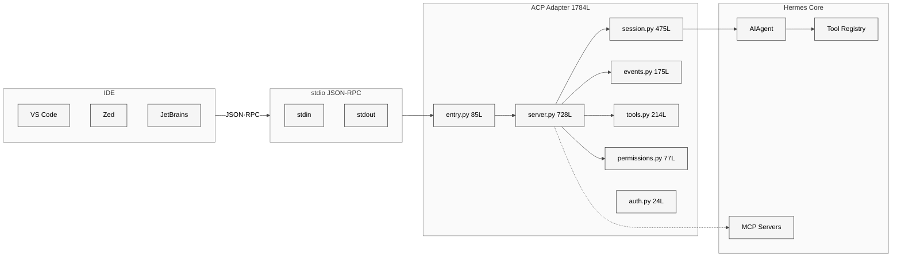
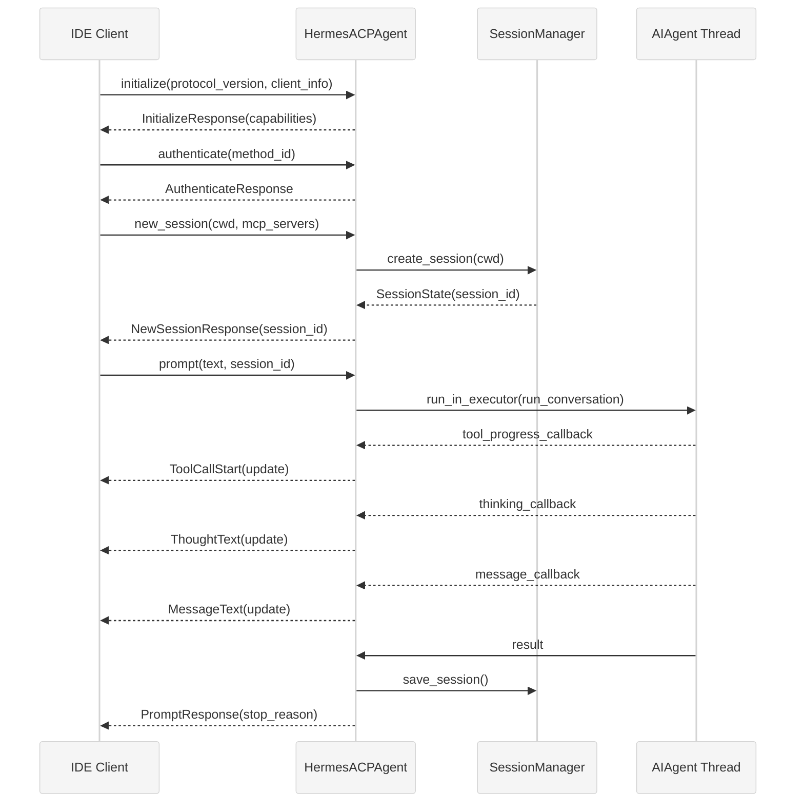

# 第二十一章 ACP IDE 集成

## 21.1 本质：将 Agent 嵌入编辑器的协议桥梁

ACP（Agent Communication Protocol）适配器是 Hermes Agent 进入 IDE 生态的桥梁。它将 Hermes 的完整 Agent 能力——工具调用、记忆、技能、上下文压缩——通过标准化的 JSON-RPC 协议暴露给 VS Code、Zed、JetBrains 等编辑器。用户在编辑器的 AI 面板中对话，背后是完整的 Hermes Agent 在执行。

整个适配器由 9 个 Python 文件组成（合计 1784 行），核心是 `server.py`（728 行）中的 `HermesACPAgent` 类和 `session.py`（475 行）中的 `SessionManager`。

<div style="background: #ffffff; padding: 16px; border-radius: 8px; margin: 16px 0;">



</div>

## 21.2 核心问题：同步 Agent 与异步协议的融合

ACP 适配器面临三个关键挑战：

**线程模型不匹配**。ACP 协议运行在异步事件循环上，而 Hermes 的 `AIAgent.run_conversation()` 是同步阻塞调用。Agent 可能执行数十秒的工具调用循环，不能阻塞事件循环。

**stdout 独占**。ACP 使用 stdio 传输，JSON-RPC 帧占据 stdout。但 AIAgent 内部（以及它调用的工具）可能通过 `print()` 输出状态信息。任何非 JSON-RPC 内容出现在 stdout 上都会破坏协议。

**会话持久性**。编辑器可能在空闲后重启 ACP 进程，但用户期望之前的对话上下文还在。ACP 适配器需要在进程重启后恢复会话状态。

## 21.3 解决思路：线程池 + stderr 重定向 + SQLite 持久化

### 线程池执行模型

`server.py` L70 创建了一个 4 线程的线程池：

```python
_executor = ThreadPoolExecutor(max_workers=4, thread_name_prefix="acp-agent")
```

`prompt()` 方法（L352-L467）将 Agent 执行委托给线程池：

```python
result = await loop.run_in_executor(_executor, _run_agent)
```

Agent 在工作线程中同步运行，事件循环保持响应。Agent 产生的中间事件（工具调用开始、思考过程、消息流）通过 `asyncio.run_coroutine_threadsafe()` 从工作线程安全地推送回事件循环。

### stderr 重定向

`session.py` L25-L33 定义了 `_acp_stderr_print()`，所有 AIAgent 实例的 `_print_fn` 被替换为这个函数（L474）：

```python
agent._print_fn = _acp_stderr_print
```

这保证了 Agent 的任何人类可读输出都走 stderr，stdout 纯净地保留给 ACP 协议帧。

### SQLite 会话持久化

`SessionManager` 使用 Hermes 的共享 `SessionDB`（`~/.hermes/state.db`）存储会话。每次 `prompt()` 完成后调用 `save_session()` 写入数据库。当编辑器重连并调用 `load_session()` 或 `resume_session()` 时，`_restore()` 方法（L333-L405）从数据库恢复完整的对话历史和 Agent 配置。

## 21.4 实现细节

### ACP 生命周期

<div style="background: #ffffff; padding: 16px; border-radius: 8px; margin: 16px 0;">



</div>

### 入口与启动

`entry.py`（85 行）是 ACP 适配器的入口点，可通过三种方式启动：

```bash
python -m acp_adapter.entry
hermes acp
hermes-acp
```

启动流程：`_setup_logging()` 将所有日志路由到 stderr -> `_load_env()` 加载 `~/.hermes/.env` -> 创建 `HermesACPAgent` 实例 -> `acp.run_agent(agent)` 进入事件循环。

### 会话管理

`SessionManager`（475 行）是线程安全的会话管理器。核心数据结构：

- `_sessions: Dict[str, SessionState]`——内存中的活跃会话
- `_lock: Lock`——保护并发访问
- `_db_instance`——懒初始化的 SQLite 连接

`SessionState` 数据类保存每个会话的运行时状态：`session_id`、`agent`（AIAgent 实例）、`cwd`（工作目录）、`model`、`history`（对话历史）、`cancel_event`（取消信号）。

`fork_session()` 支持会话分叉——深拷贝对话历史到新会话，用于编辑器的"fork conversation"功能。

`update_cwd()` 在编辑器切换目录时更新会话的工作目录，并通过 `_register_task_cwd()` 将新路径注入到终端工具的路径解析中。

### 事件桥接

`events.py`（175 行）是线程间事件传递的桥梁。四个工厂函数创建回调，每个回调内部使用 `asyncio.run_coroutine_threadsafe()` 将事件从 Agent 工作线程推送到事件循环线程：

```python
def _send_update(conn, session_id, loop, update):
    future = asyncio.run_coroutine_threadsafe(
        conn.session_update(session_id, update), loop
    )
    future.result(timeout=5)
```

- `make_tool_progress_cb()`——工具调用开始时发送 `ToolCallStart`，使用 FIFO 队列追踪同名并行调用的 ID
- `make_thinking_cb()`——流式推送 Agent 的思考过程
- `make_step_cb()`——每轮工具完成后发送 `ToolCallProgress(status="completed")`
- `make_message_cb()`——流式推送 Agent 的最终响应文本

### 工具类型映射

`tools.py`（214 行）将 Hermes 工具名映射到 ACP 的 `ToolKind` 枚举：

```python
TOOL_KIND_MAP = {
    "read_file": "read",
    "write_file": "edit",
    "terminal": "execute",
    "web_search": "fetch",
    "_thinking": "think",
    # ...
}
```

IDE 利用这些类型信息在 UI 上显示不同的图标和行为——"edit"类型的工具调用显示 diff 视图，"execute"类型显示终端输出。

`build_tool_start()` 为不同工具构建语义化的 ACP 内容：`patch` 工具生成 diff 内容，`terminal` 工具显示命令行，`read_file` 显示文件路径。

### 权限桥接

`permissions.py`（77 行）将 ACP 的权限请求机制桥接到 Hermes 的危险命令审批系统。当 Agent 要执行危险命令时：

1. `make_approval_callback()` 创建一个回调函数
2. 回调通过 ACP 的 `request_permission()` 向 IDE 发送权限请求
3. IDE 弹出对话框，用户选择 "Allow once" / "Allow always" / "Deny"
4. 响应通过 `AllowedOutcome` 返回，映射回 Hermes 的 "once" / "always" / "deny"

超时 60 秒自动拒绝：`future.result(timeout=timeout)`。

### Slash 命令

`HermesACPAgent` 内置 7 个 Slash 命令（L96-L136）：`/help`、`/model`、`/tools`、`/context`、`/reset`、`/compact`、`/version`。这些命令在 `prompt()` 入口处被拦截，不经过 LLM 调用，直接返回结果。

`/compact` 命令（L629-L668）特别值得注意——它调用 Agent 的 `_compress_context()` 方法压缩对话历史，但临时将 `_session_db` 设为 None 以避免 SQLite 的会话分裂副作用。

### MCP 服务器注册

IDE 可以在创建会话时传入 MCP 服务器配置。`_register_session_mcp_servers()`（L150-L213）接收 ACP 的 `McpServerStdio` 或 `McpServerHttp` 配置，转换为 Hermes 格式后调用 `register_mcp_servers()`，然后刷新 Agent 的工具表面（`get_tool_definitions()` + `_invalidate_system_prompt()`）。这使得 IDE 扩展提供的 MCP 工具能直接被 Hermes Agent 使用。

## 21.5 易错点

**线程池大小**。`max_workers=4` 意味着最多 4 个并发会话。如果 IDE 打开了 5 个 tab 并同时发送消息，第 5 个会排队等待。对于单用户场景通常够用，但在共享部署中可能不足。

**Cancel 的竞态窗口**。`cancel()` 设置 `cancel_event` 并调用 `agent.interrupt()`。但如果 Agent 正处于 HTTP 请求中间（等待 LLM 响应），interrupt 可能不会立即生效，需要等到当前 API 调用返回。

**会话恢复仅限 ACP 源**。`_restore()` 检查 `row.get("source") != "acp"` 后才恢复。如果同一个 session_id 碰巧存在于 Gateway 或 CLI 创建的会话中，不会被错误恢复。但这也意味着 ACP 会话和 Gateway 会话完全隔离，无法共享上下文。

## 21.6 竞品对比

| 特性 | Hermes ACP | Continue.dev | GitHub Copilot | Cursor |
|------|-----------|-------------|----------------|--------|
| 传输协议 | stdio JSON-RPC | LSP | 私有协议 | 私有协议 |
| Agent 能力 | 完整 Agent + 工具 | LLM + 补全 | LLM + 补全 | Agent + 工具 |
| 会话持久化 | SQLite | 内存 | 云端 | 本地 |
| MCP 集成 | 动态注册 | 静态配置 | 不支持 | 部分支持 |
| 多编辑器 | VS Code + Zed + JB | VS Code + JB | VS Code + JB | 仅 Cursor |
| 开源 | 是 | 是 | 否 | 否 |

Hermes ACP 的独特优势在于它不是一个简单的 LLM 补全服务，而是将完整的 Agent 运行时（含终端执行、文件操作、浏览器控制、记忆系统）暴露给编辑器。代价是更高的资源消耗和更复杂的错误处理。

## 21.7 遗留问题

**无流式文件编辑**。当前 `build_tool_start()` 为 `write_file` 和 `patch` 生成一次性的 diff 内容。IDE 看到的是工具调用完成后的结果，而非实时的编辑过程。对于大文件改写，用户体验不如 Cursor 的实时流式编辑。

**认证简化**。`auth.py`（24 行）仅检测当前 LLM 提供商是否配置，不做真正的用户身份验证。在共享机器上，任何能连接到 ACP stdio 的进程都能使用 Hermes Agent。

**无并行 Agent 调度**。当前每个会话依次处理消息。如果用户在一个会话中快速发送多条消息，后续消息必须等待前一条完成。没有 Gateway 那样的 interrupt + queue 机制。
