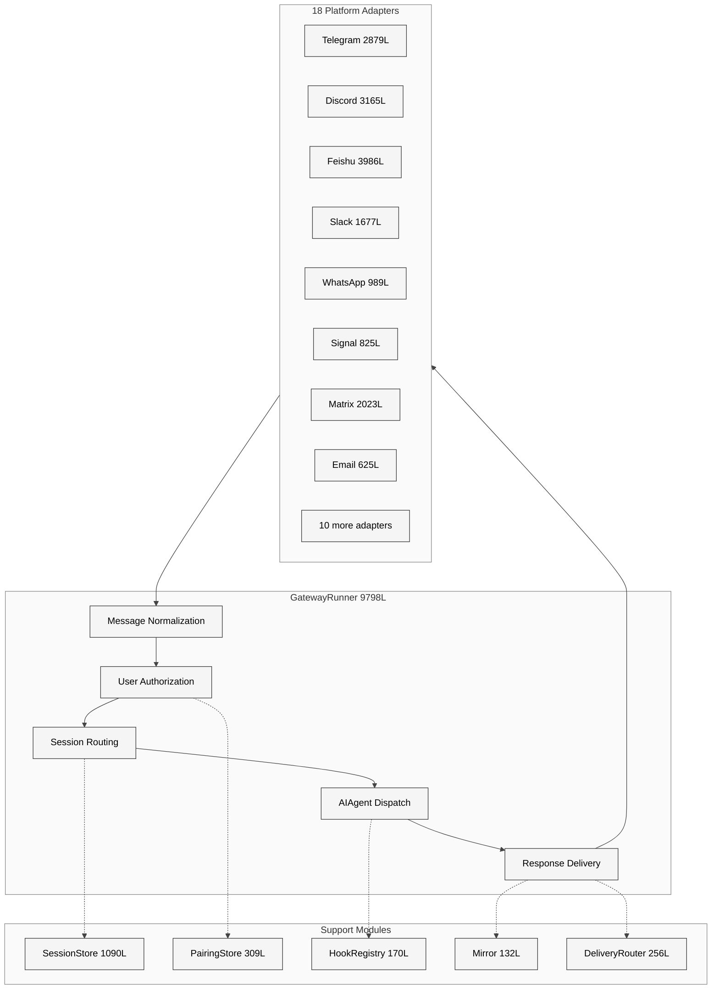
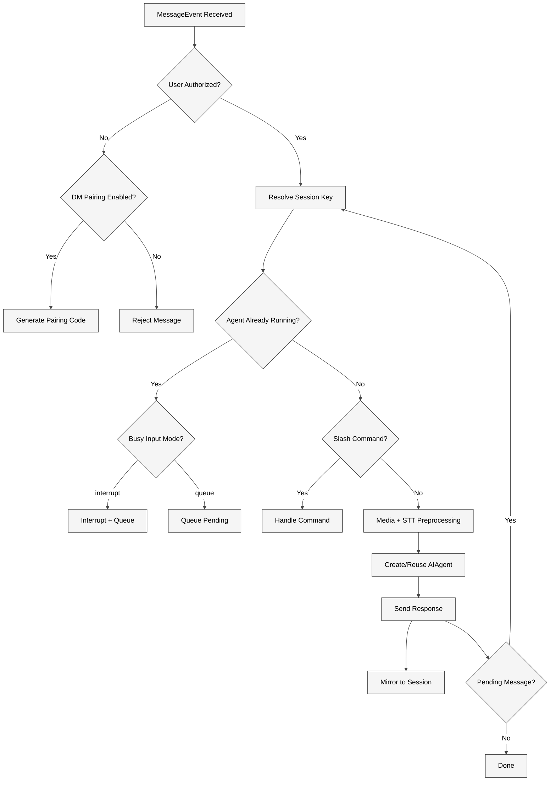

# 第21章 Gateway 网关

## 19.1 本质：多平台统一消息总线

Gateway 是 Hermes Agent 从单用户 CLI 工具进化为多平台服务的核心枢纽。它的本质是一个**异步消息总线**：将来自 18 个异构通信平台的消息归一化为统一的 `MessageEvent`，路由到正确的 Agent 会话，再将 Agent 的响应按各平台的格式和限制分发回去。

整个网关子系统由 `gateway/run.py`（9798 行）主控，配合 `session.py`（1090 行）、`delivery.py`（256 行）、`pairing.py`（309 行）、`hooks.py`（170 行）、`mirror.py`（132 行）以及 `platforms/` 目录下 24 个适配器文件（合计约 30514 行），构成了项目中规模最大的子系统。

## 19.2 核心问题：异构平台的统一接入

Gateway 要解决的核心难题有三个：

**平台异构性**。Telegram 用 UTF-16 计算消息长度（上限 4096 code units），Discord 用 2000 字符，飞书有富文本卡片，Email 是 MIME 格式。`base.py`（2133 行）中的 `utf16_len()` 函数专门处理 UTF-16 编码问题，BMP 之外的 emoji 消费两个 code units。

**会话隔离**。同一个 Telegram 群里的消息不应干扰另一个群的上下文。而一个用户可能同时在 DM 和群里发消息。`session.py` 的 `build_session_key()` 用 `agent:main:{platform}:{chat_type}:{chat_id}` 格式构建唯一的会话键，确保每个对话流独立。

**安全边界**。Gateway 暴露在公网上，必须在消息进入 Agent 之前建立信任。Hermes 采用四级授权体系：平台级 allow-all 标志、环境变量白名单、DM 配对码审批、全局 allow-all 兜底——默认拒绝。

## 19.3 解决思路：适配器模式 + 消息归一化

### 适配器抽象层

所有平台适配器继承自 `BasePlatformAdapter`（`platforms/base.py`，2133 行），必须实现 `connect()`、`send()` 和 `disconnect()` 三个核心方法。基类提供了消息截断、代理检测、重试发送、UTF-16 安全切分等共用逻辑。

| 平台 | 代码行数 | 协议特点 |
|------|---------|---------|
| Feishu | 3986 | 富文本卡片, 事件订阅 webhook |
| Discord | 3165 | WebSocket 长连接, Slash commands |
| Telegram | 2879 | Long polling / Webhook, UTF-16 限制 |
| API Server | 2436 | RESTful HTTP, 通用集成 |
| Matrix | 2023 | 联邦协议, E2EE 支持 |
| QQBot | 1960 | 腾讯官方 API |
| Weixin | 1829 | XML 消息格式, 加密验签 |
| Slack | 1677 | Socket Mode / Events API |
| WeChat Work | 1430 | 企业微信回调加解密 |
| WhatsApp | 989 | Cloud API, LID 映射 |
| BlueBubbles | 918 | macOS iMessage 桥接 |
| Signal | 825 | signal-cli REST API |
| Mattermost | 740 | WebSocket |
| Webhook | 672 | HMAC 签名验证 |
| Email | 625 | IMAP + SMTP |
| HomeAssistant | 449 | 状态变化事件 |
| SMS | 373 | Twilio API |
| DingTalk | 333 | 钉钉机器人 |

### 消息归一化

平台适配器将各自的消息格式转为统一的 `MessageEvent` 数据类。`GatewayRunner` 收到事件后不再关心来源是 Telegram 的 `Update` 对象还是 Discord 的 `Message` 对象——统一通过 `SessionSource` 记录平台、聊天 ID、用户 ID、聊天类型（dm/group/channel/thread）等元数据。

## 19.4 实现细节

### GatewayRunner 主循环

`GatewayRunner.__init__()`（约 L560-L662）初始化了大量运行时状态：

- `_running_agents: Dict[str, Any]` 追踪每个会话正在运行的 Agent 实例
- `_agent_cache: Dict[str, tuple]` 缓存 AIAgent 实例以保持 prompt cache
- `_pending_approvals` 追踪待审批的危险命令
- `_failed_platforms` 记录启动失败的平台，用于后台重连

`start()` 方法（L1726）遍历配置中的所有平台，为每个平台创建适配器实例并调用 `connect()`。连接失败的平台会被放入 `_failed_platforms` 字典，由后台任务以指数退避策略重试。

### 用户授权四级体系

`_is_user_authorized()`（L2564）按以下优先级检查：

1. **平台级 allow-all**：如 `DISCORD_ALLOW_ALL_USERS=true`，适用于私有服务器
2. **环境变量白名单**：如 `TELEGRAM_ALLOWED_USERS="123,456"`，逗号分隔的用户 ID 列表
3. **DM 配对审批**：`PairingStore` 维护的已批准用户列表
4. **全局 allow-all**：`GATEWAY_ALLOW_ALL_USERS=true`

对于 WhatsApp，`_expand_whatsapp_auth_aliases()` 会自动解析 LID（Linked Identity）映射文件，将电话号码和 LID 互相关联，避免因桥接系统的 ID 格式差异导致授权失败。

### DM 配对系统

`pairing.py`（309 行）实现了基于验证码的用户审批流程，安全设计遵循 OWASP 和 NIST SP 800-63-4 规范：

- **8 字符验证码**：使用 32 字符无歧义字母表（排除 0/O/1/I），由 `secrets.choice()` 生成
- **1 小时有效期**：`CODE_TTL_SECONDS = 3600`
- **频率限制**：每个用户每 10 分钟最多请求一次（`RATE_LIMIT_SECONDS = 600`）
- **锁定机制**：5 次失败审批后锁定 1 小时（`MAX_FAILED_ATTEMPTS = 5`）
- **文件权限**：所有数据文件使用 `chmod 0600`，通过 `_secure_write()` 原子写入

### Hook 系统

`hooks.py`（170 行）的 `HookRegistry` 提供事件驱动的扩展点。支持 8 种事件类型：`gateway:startup`、`session:start`、`session:end`、`session:reset`、`agent:start`、`agent:step`、`agent:end`、`command:*`（通配符）。

Hook 从 `~/.hermes/hooks/` 目录发现，每个 Hook 目录包含 `HOOK.yaml`（元数据）和 `handler.py`（处理函数）。内置的 `boot_md.py` Hook 在启动时执行 `~/.hermes/BOOT.md`。所有 Hook 的错误被捕获并记录，永远不会阻塞主管线。

### 跨会话镜像

`mirror.py`（132 行）的 `mirror_to_session()` 解决了一个微妙问题：当 CLI 或 cron 任务向某个平台会话发送消息时，接收方的 Agent 没有这条消息的上下文。Mirror 机制会在目标会话的 JSONL 转录和 SQLite 数据库中追加一条 `mirror: True` 的消息记录，确保 Agent 知道发生了什么。

### 投递系统

`delivery.py`（256 行）的 `DeliveryRouter` 负责将 cron 任务输出和 Agent 响应路由到正确的目标。`DeliveryTarget.parse()` 支持四种目标格式：`origin`（回到来源）、`local`（本地文件）、`telegram`（使用 home channel）、`telegram:123456`（指定聊天）。超过 4000 字符的输出会被截断，完整内容保存到本地文件。

## 19.5 易错点

**SSL 证书问题**。`run.py` 顶部的 `_ensure_ssl_certs()`（L35-L72）在所有 HTTP 库导入之前运行，依次检查 Python 内置路径、certifi 包和 8 个常见发行版路径。这是针对 NixOS 等非标准系统的防御性措施——如果放在导入之后，aiohttp 可能已经用了错误的 CA 路径。

**_AGENT_PENDING_SENTINEL 竞态**。L316 定义了一个哨兵对象，在异步间隙期间占位。没有它，两条快速连续的消息可能都通过"agent 未运行"检查，导致同一个会话创建两个 Agent 实例。

**Agent 缓存失效**。`_agent_cache` 使用 `(AIAgent, config_signature_str)` 元组存储，配置签名变化时才重建。但如果 config.yaml 被修改而签名没变（比如只改了注释），缓存不会更新。这是性能换正确性的有意取舍——prompt caching 在 Anthropic 上能节约约 10x 成本。

## 19.6 竞品对比

| 特性 | Hermes Gateway | Botpress | Rasa |
|------|---------------|----------|------|
| 平台数量 | 18 | 12 | 5 |
| 架构模式 | 单进程异步 | 微服务 | 微服务 |
| Agent 集成 | 原生 LLM Agent | NLU + Flow | NLU + Policy |
| 会话隔离 | Session Key | Channel | Tracker |
| 用户授权 | 白名单 + 配对码 | 角色系统 | 无内置 |
| 部署复杂度 | 单二进制 | Docker Compose | Helm Chart |

Hermes 的独特优势在于将完整的 LLM Agent（含工具调用、记忆、技能）直接嵌入网关进程，避免了微服务架构的网络开销和状态同步问题。代价是单进程承载所有平台连接，扩展上限受限。

## 19.7 遗留问题

**水平扩展缺失**。`GatewayRunner` 是单实例设计，`_running_agents` 和 `_agent_cache` 都是进程内字典。当连接平台超过 10 个且消息并发量大时，单进程可能成为瓶颈。目前没有多实例 + 会话亲和性的方案。

**平台适配器质量不均**。Feishu（3986 行）和 Discord（3165 行）功能完善，但 DingTalk（333 行）和 SMS（373 行）可能只实现了最基本的文本收发，缺少富媒体和群组功能。

**内存泄漏风险**。`_agent_cache` 没有 LRU 淘汰机制，长时间运行的网关会为每个曾经活跃的会话缓存一个 AIAgent 实例。如果有大量不同的一次性会话，内存使用会持续增长。
