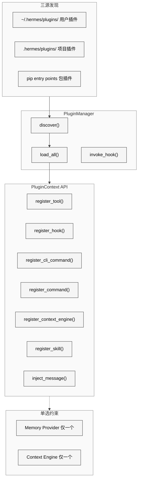
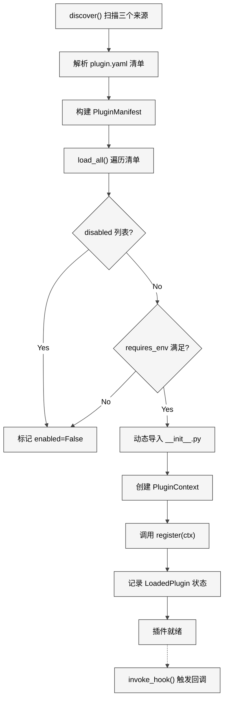

# 第22章 插件系统

## 20.1 本质：可扩展的能力注入框架

Hermes Agent 的插件系统是一个**三源发现、单选约束、生命周期管理**的能力注入框架。它允许外部代码在不修改核心仓库的前提下，向 Agent 注册新工具、新 Hook、新 CLI 命令、新 Slash 命令，甚至替换记忆提供者和上下文压缩引擎。

核心实现集中在 `hermes_cli/plugins.py`（812 行）和 `hermes_cli/plugins_cmd.py`（1128 行），内置的两个特殊插件类型位于 `plugins/memory/` 和 `plugins/context_engine/`。

<div style="background: #ffffff; padding: 16px; border-radius: 8px; margin: 16px 0;">



</div>

## 20.2 核心问题：开放性与安全性的平衡

插件系统面临三个核心挑战：

**发现可靠性**。插件可能来自用户目录、项目目录或 pip 包，这三个来源的优先级和冲突规则需要明确定义。同名插件出现在多个来源时该加载哪个？

**接口边界**。插件能做什么、不能做什么必须有清晰的边界。如果插件能任意修改 Agent 内部状态，系统将变得不可预测。如果插件的工具注册绕过了内置工具注册表，工具调用分发就会出错。

**单选语义**。记忆提供者和上下文引擎在任何时刻只能有一个活跃实例。如果两个插件都试图注册记忆提供者，系统需要明确的冲突解决策略。

## 20.3 解决思路：Facade 模式 + 声明式清单

### 三源发现机制

`PluginManager.discover()`（`plugins.py`）按以下顺序扫描：

1. **用户插件**：`~/.hermes/plugins/<name>/`，始终扫描
2. **项目插件**：`.hermes/plugins/<name>/`，需 `HERMES_ENABLE_PROJECT_PLUGINS` 环境变量显式启用（安全考虑，避免恶意仓库自动加载代码）
3. **Pip 入口点**：通过 `importlib.metadata.entry_points(group="hermes_agent.plugins")` 发现已安装的 Python 包

每个目录插件必须包含 `plugin.yaml` 清单和 `__init__.py` 入口文件。清单声明名称、版本、所需环境变量、提供的工具和 Hook 列表：

```yaml
name: my-memory-plugin
version: "1.0"
description: Custom memory backend using Redis
requires_env:
  - REDIS_URL
provides_tools:
  - memory_store
  - memory_search
provides_hooks:
  - on_session_end
```

### PluginContext Facade

`PluginContext` 是交给每个插件的 `register()` 函数的唯一接口。它是典型的 Facade 模式——插件不直接访问工具注册表、Hook 系统或 Agent 内部状态，而是通过 `PluginContext` 的受控方法间接操作。

`PluginContext` 提供 7 个注册方法：

| 方法 | 功能 | 约束 |
|------|------|------|
| `register_tool()` | 注册工具到全局 Registry | 工具名全局唯一 |
| `register_hook()` | 注册生命周期回调 | 10 种有效 Hook 名 |
| `register_cli_command()` | 注册 `hermes <subcmd>` 子命令 | 不与内置命令冲突 |
| `register_command()` | 注册 `/slash` 会话内命令 | 不与内置命令冲突 |
| `register_context_engine()` | 替换上下文压缩引擎 | 全局仅一个 |
| `register_skill()` | 注册只读技能 | 命名空间隔离 |
| `inject_message()` | 向当前会话注入消息 | 仅 CLI 模式可用 |

## 20.4 实现细节

### 插件生命周期

<div style="background: #ffffff; padding: 16px; border-radius: 8px; margin: 16px 0;">



</div>

### PluginManifest 数据结构

`PluginManifest` 数据类（L92-L104）记录插件的声明信息：

```python
@dataclass
class PluginManifest:
    name: str
    version: str = ""
    description: str = ""
    author: str = ""
    requires_env: List[Union[str, Dict[str, Any]]]
    provides_tools: List[str]
    provides_hooks: List[str]
    source: str = ""        # "user", "project", "entrypoint"
    path: Optional[str] = None
```

`requires_env` 支持两种格式：简单字符串（`"REDIS_URL"`）和字典（`{"name": "REDIS_URL", "optional": true}`），后者允许非强制依赖。

### LoadedPlugin 运行时状态

`LoadedPlugin`（L107-L117）追踪每个插件的加载结果：

```python
@dataclass
class LoadedPlugin:
    manifest: PluginManifest
    module: Optional[types.ModuleType] = None
    tools_registered: List[str]
    hooks_registered: List[str]
    commands_registered: List[str]
    enabled: bool = False
    error: Optional[str] = None
```

### 10 种有效 Hook

`VALID_HOOKS`（L54-L65）定义了完整的 Hook 集合：

- `pre_tool_call` / `post_tool_call`：工具调用前后
- `pre_llm_call` / `post_llm_call`：LLM API 调用前后
- `pre_api_request` / `post_api_request`：HTTP 请求前后
- `on_session_start` / `on_session_end` / `on_session_finalize` / `on_session_reset`：会话生命周期

注册未知 Hook 名称会产生警告但不会失败——这是为了前向兼容，让为未来版本开发的插件在当前版本上也能加载。

### 工具注册的委托路径

`PluginContext.register_tool()`（L133-L160）不是自己维护工具列表，而是直接委托给 `tools.registry.registry.register()`。这确保了插件工具和内置工具在同一个注册表中，工具调用分发逻辑无需区分来源。同时，工具名被追加到 `_plugin_tool_names` 集合中，用于统计和卸载。

### 上下文引擎的单选约束

`register_context_engine()`（L264-L293）实现了严格的单选语义：

```python
def register_context_engine(self, engine) -> None:
    if self._manager._context_engine is not None:
        logger.warning("... one is already registered ...")
        return
    from agent.context_engine import ContextEngine
    if not isinstance(engine, ContextEngine):
        logger.warning("... does not inherit from ContextEngine ...")
        return
    self._manager._context_engine = engine
```

第一个注册的引擎获胜，后续注册被静默拒绝。这比抛出异常更友好——允许用户同时安装多个引擎插件，只有第一个被发现的生效。

### 禁用列表

`_get_disabled_plugins()`（L77-L85）从 `config.yaml` 的 `plugins.disabled` 字段读取禁用列表。这允许用户安装插件但不加载，方便调试和 A/B 测试。

### Slash 命令防冲突

`register_command()`（L217-L260）在注册前检查是否与内置命令冲突：

```python
from hermes_cli.commands import resolve_command
if resolve_command(clean) is not None:
    logger.warning("conflicts with a built-in command. Skipping.")
    return
```

### 消息注入

`inject_message()`（L164-L188）是一个特殊能力——插件可以向当前会话注入消息，就像用户自己输入一样。如果 Agent 正在运行，消息进入中断队列；如果 Agent 空闲，消息排入下一轮输入。这使得外部事件源（如消息桥接插件）能驱动 Agent 行为。但此功能仅在 CLI 模式下可用，Gateway 模式下 `_cli_ref` 为 None。

## 20.5 易错点

**项目插件的安全风险**。`.hermes/plugins/` 来自 git 仓库，克隆一个恶意仓库就能自动执行代码。因此项目插件默认禁用，需要显式设置 `HERMES_ENABLE_PROJECT_PLUGINS=true`。但这个限制容易被用户忽视——文档中应该更醒目地标注。

**环境变量检查时机**。`requires_env` 在 `load_all()` 时检查，不在 `discover()` 时。如果一个插件的环境变量在运行中被设置（比如通过工具执行 `export`），插件不会自动加载。这是一次性决策，不支持热加载。

**Hook 调用顺序不确定**。当多个插件注册了同一个 Hook 时，调用顺序取决于发现顺序（目录字母序 + 入口点顺序），这不是一个可靠的保证。如果两个 `post_tool_call` Hook 有顺序依赖，结果将不可预测。

## 20.6 竞品对比

| 特性 | Hermes 插件 | LangChain Tools | OpenAI Plugins |
|------|------------|----------------|----------------|
| 发现机制 | 三源（目录+pip） | 代码导入 | HTTP 清单 |
| 注册方式 | register(ctx) | 类继承 | openapi.yaml |
| Hook 系统 | 10 种生命周期 Hook | Callbacks | 无 |
| CLI 集成 | 子命令注册 | 无 | 无 |
| 单选约束 | 记忆+上下文引擎 | 无 | 无 |
| 安全隔离 | 同进程、禁用列表 | 无 | 沙箱 |
| 热加载 | 不支持 | 不支持 | 支持 |

Hermes 的优势在于将插件深度集成到 Agent 的整个生命周期（从 CLI 到 Gateway、从工具到 Hook），而非仅仅暴露工具接口。LangChain 的工具虽然更灵活，但缺少 Hook 和 CLI 命令注册的能力。OpenAI Plugins 的 HTTP 隔离更安全，但延迟更高且无法访问本地资源。

## 20.7 遗留问题

**无沙箱隔离**。插件代码与 Agent 在同一个进程、同一个 Python 解释器中运行。恶意或有缺陷的插件可以 `import os; os.remove()` 删除任何文件，或者通过 monkey-patching 修改核心模块行为。pip 入口点插件尤其危险——安装一个看似无害的包就能注入代码。

**无版本约束**。`PluginManifest` 有 `version` 字段但没有被使用。没有机制表达"这个插件需要 Hermes >= 1.5"或"这个插件与另一个插件不兼容"。

**记忆提供者的切换代价**。从内置记忆切换到插件记忆提供者后，如果插件出错或被卸载，已存储的记忆可能丢失。没有迁移工具在不同记忆后端之间转移数据。
