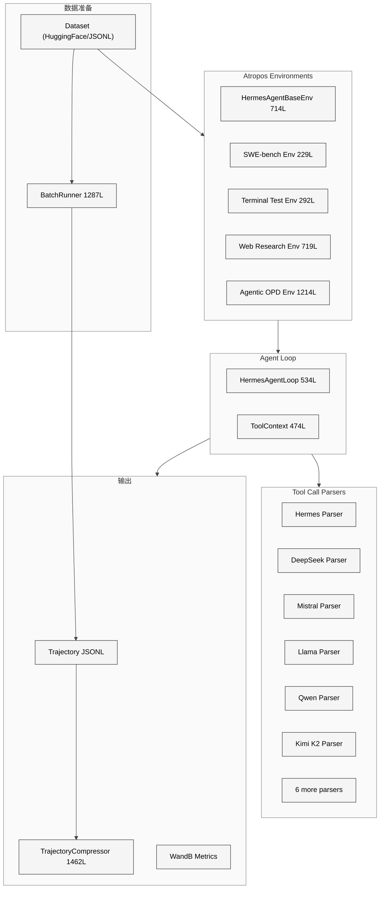
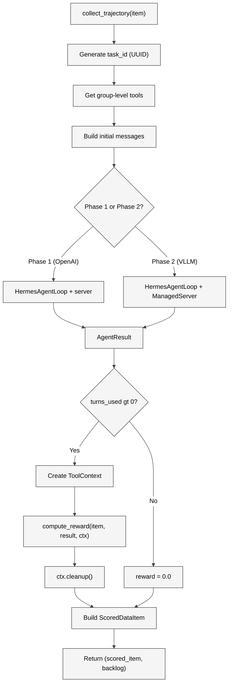

# 第二十三章 RL 与训练环境

## 23.1 本质：Agent 能力的自我进化闭环

Hermes Agent 不仅是一个推理时的工具调用框架，它还内建了一个完整的**强化学习训练数据生成管线**。这个子系统的核心目标是：用 Agent 自身的工具调用行为生成高质量的训练轨迹（Trajectory），用于训练下一代更强的 tool-calling 模型。

这形成了一个自我进化闭环：Agent 执行任务 -> 生成轨迹 -> 训练更强模型 -> 部署更强 Agent -> 执行更复杂任务。

训练子系统分布在 `environments/` 目录（约 3726 行核心代码 + 1077 行解析器）、`batch_runner.py`（1287 行）、`trajectory_compressor.py`（1462 行）、`agent/trajectory.py`（56 行）和 `rl_cli.py`（446 行），合计约 7000+ 行。

<div style="background: #ffffff; padding: 16px; border-radius: 8px; margin: 16px 0;">



</div>

## 23.2 核心问题：真实工具调用的轨迹质量

传统的 LLM 训练数据是静态的 Q&A 对。但 tool-calling 模型需要的训练数据是**多轮交互轨迹**：模型发出工具调用 -> 工具返回结果 -> 模型决定下一步。这种动态轨迹有三个关键挑战：

**执行环境隔离**。每个训练 rollout 需要独立的终端、文件系统和浏览器会话。如果两个并行 rollout 共享同一个终端，命令执行会互相干扰。

**Token 级精度**。Phase 2（VLLM 驱动的 RL 训练）需要精确的 token ID、logprobs 和 mask。Phase 1（SFT 数据生成）只需要消息级别的对话格式。两种模式必须用同一套基础设施。

**工具调用格式多样性**。不同模型家族使用不同的工具调用格式：Hermes 用 `<tool_call>` 标签，DeepSeek 用 JSON 块，Mistral 用 `[TOOL_CALLS]` 标记。训练系统必须能解析和生成所有格式。

## 23.3 解决思路：Atropos 集成 + 双阶段架构

### Atropos 框架

Hermes 的 RL 训练不是自建的——它集成了 NousResearch 的 Atropos 框架。`HermesAgentBaseEnv` 继承自 `atroposlib.envs.base.BaseEnv`，实现了 Atropos 要求的接口：`setup()`、`get_next_item()`、`collect_trajectory()`、`compute_reward()`、`evaluate()`。

### 双阶段架构

**Phase 1（OpenAI Server 模式）**：使用标准 OpenAI `/v1/chat/completions` API。VLLM、SGLang、OpenRouter 或 OpenAI 服务器原生处理工具调用解析。输出是消息格式的对话历史，适合 SFT 数据生成和评估。

**Phase 2（VLLM ManagedServer 模式）**：使用 VLLM 的 `/generate` 端点。客户端工具调用解析器将原始文本输出转换为结构化的 `tool_calls`。`ManagedServer` 提供精确的 token ID、mask 和 logprobs，支持完整的 RL 训练。

`_use_managed_server()`（`hermes_base_env.py` L328-L344）自动检测当前服务器类型并选择模式。

## 23.4 实现细节

### HermesAgentBaseEnv（714 行）

这是所有 Hermes 训练环境的抽象基类。其配置类 `HermesAgentEnvConfig` 定义了丰富的参数：

| 配置项 | 默认值 | 说明 |
|--------|--------|------|
| `enabled_toolsets` | None (全部) | 启用的工具集 |
| `distribution` | None | 工具集分布名称 |
| `max_agent_turns` | 30 | 每轮最大 LLM 调用次数 |
| `terminal_backend` | "local" | 终端后端类型 |
| `terminal_timeout` | 120s | 命令超时 |
| `tool_pool_size` | 128 | 工具执行线程池大小 |
| `tool_call_parser` | "hermes" | Phase 2 工具调用解析器 |
| `default_result_size_chars` | 配置文件 | 工具结果大小上限 |

**工具集分布**。`distribution` 参数支持概率采样——每个 group 从预定义的分布中采样一组工具集。例如 `"development"` 分布可能以 70% 概率选择 `["terminal", "file"]`，20% 选择 `["terminal", "file", "web"]`，10% 选择全部工具。这为训练数据引入了工具组合的多样性。

**collect_trajectory() 核心流程**（L489-L644）：

<div style="background: #ffffff; padding: 16px; border-radius: 8px; margin: 16px 0;">



</div>

### HermesAgentLoop（534 行）

`agent_loop.py` 是独立于 `run_agent.py` 的轻量级 Agent 循环实现，专为训练场景优化。与生产环境的 `AIAgent` 不同，它不包含会话管理、记忆、技能索引等开销，只保留核心的工具调用循环。

关键设计：工具执行通过 `concurrent.futures.ThreadPoolExecutor` 在独立线程中运行（L33），线程池大小可通过 `resize_tool_pool()` 动态调整。这是因为 Modal/Docker 终端后端内部使用 `asyncio.run()`，如果直接在 Atropos 的事件循环中调用会死锁。

`AgentResult` 数据类（L64-L78）记录每次 rollout 的完整结果：

```python
@dataclass
class AgentResult:
    messages: List[Dict[str, Any]]
    managed_state: Optional[Dict[str, Any]] = None
    turns_used: int = 0
    finished_naturally: bool = False
    reasoning_per_turn: List[Optional[str]]
    tool_errors: List[ToolError]
```

### ToolContext（474 行）

`tool_context.py` 为奖励函数提供完整的工具访问权限。`compute_reward()` 不是简单的文本匹配——它可以调用终端执行测试命令、读取文件验证结果、甚至用浏览器检查 Web 应用。所有工具调用都通过 `task_id` 隔离到当前 rollout 的沙箱中。

### 工具调用解析器（12 个解析器，1077 行）

`environments/tool_call_parsers/` 包含 12 个解析器，每个对应一个模型家族的工具调用格式：

| 解析器 | 行数 | 格式特征 |
|--------|------|---------|
| hermes | 75 | `<tool_call>{"name":..., "arguments":...}</tool_call>` |
| mistral | 137 | `[TOOL_CALLS] [{"name":..., "arguments":...}]` |
| llama | 96 | `<\|python_tag\|>` 或 JSON 调用 |
| qwen | 19 | (复用 hermes 格式) |
| qwen3_coder | 163 | 自定义 Qwen3 格式 |
| deepseek_v3 | 89 | 嵌入式 JSON 块 |
| deepseek_v3_1 | 72 | 改进版 JSON 格式 |
| glm45 | 109 | GLM-4.5 格式 |
| glm47 | 35 | GLM-4.7 简化格式 |
| kimi_k2 | 93 | Kimi K2 思考格式 |
| longcat | 69 | LongCat 格式 |

每个解析器实现 `parse(text) -> (tool_calls, content)` 和 `format(tool_calls) -> text` 两个方向的转换。Phase 2 的 `ToolCallTranslator` 使用这些解析器在 VLLM 原始文本输出和 OpenAI 结构化 `tool_calls` 之间双向翻译。

### BatchRunner（1287 行）

`batch_runner.py` 提供了不依赖 Atropos 的独立批量数据生成能力：

```bash
python batch_runner.py --dataset_file=data.jsonl --batch_size=10 --run_name=my_run
```

核心特性：
- **多进程并行**：使用 `multiprocessing.Pool` 并行处理多个 prompt
- **检查点恢复**：断点续跑，已完成的样本跳过
- **工具统计**：聚合所有 batch 的工具使用频率、成功率、错误率
- **Schema 规范化**：`_normalize_tool_stats()` 确保所有可能的工具名都出现在统计中，避免 HuggingFace datasets 的 schema 不匹配

`ALL_POSSIBLE_TOOLS` 从 `model_tools.py` 的 `TOOL_TO_TOOLSET_MAP` 自动派生，当新工具被添加时无需手动更新。

### 轨迹格式（ShareGPT）

`agent/trajectory.py`（56 行）定义了轨迹的存储格式——ShareGPT 标准的 JSONL：

```json
{
  "conversations": [
    {"from": "system", "value": "..."},
    {"from": "human", "value": "..."},
    {"from": "gpt", "value": "<tool_call>...</tool_call>"},
    {"from": "tool", "value": "..."},
    {"from": "gpt", "value": "Task completed."}
  ],
  "timestamp": "2026-04-15T10:30:00",
  "model": "hermes-3-llama-3.1-70b",
  "completed": true
}
```

`convert_scratchpad_to_think()` 将内部的 `<REASONING_SCRATCHPAD>` 标签转换为标准的 `<think>` 标签，使推理过程数据可以用于 reasoning model 训练。

### 轨迹压缩器（1462 行）

`trajectory_compressor.py` 是一个独立的后处理工具，将长轨迹压缩到目标 token 预算内（默认 15250 token）。压缩策略精心设计：

1. **保护首尾**：系统提示、第一条用户消息、第一条 Agent 回复、第一条工具结果永远保留；最后 4 个 turn 保留
2. **仅压缩中间**：从第 2 条工具响应开始，选择性压缩
3. **按需压缩**：只压缩刚好足够达到目标的量
4. **LLM 摘要替换**：被压缩的区域用 LLM 生成的摘要替换（使用 `google/gemini-3-flash-preview`）
5. **并发控制**：`max_concurrent_requests=50` 限制并发 API 调用

配置类 `CompressionConfig` 支持从 YAML 文件加载，可调整保护策略、摘要模型、并发数等。

### RL CLI（446 行）

`rl_cli.py` 是 RL 训练工作流的专用 CLI 入口，默认使用 `anthropic/claude-opus-4.5` 模型，终端工作目录指向 `tinker-atropos/` 子模块。它预配置了更长的超时、RL 专用系统提示和完整工具集。

### 具体环境实例

**SWE-bench Environment**（229 行）：在 Docker/Modal 沙箱中执行 SWE-bench 任务，Agent 需要修复真实的 GitHub issue。奖励函数运行 pytest 测试来验证修复是否正确。

**Terminal Test Environment**（292 行）：通用的终端任务环境，Agent 使用命令行工具完成文本处理、系统管理等任务。

**Web Research Environment**（719 行）：Agent 使用浏览器和搜索工具进行信息检索和分析。

**Agentic OPD Environment**（1214 行）：最复杂的环境，用于开放式编程任务。

## 23.5 易错点

**线程池饥饿**。`tool_pool_size=128` 看似充足，但当 89 个并行 TB2 eval 任务同时执行工具调用时，每个任务需要一个线程。如果某些工具调用阻塞了很长时间（比如 Modal 沙箱创建超时），线程池会被耗尽，后续任务排队等待数分钟。

**Phase 1/Phase 2 回退的静默降级**。当 Phase 2 的 `ManagedServer` 不可用时，代码静默回退到 Phase 1（L537-L554）。Phase 1 产生的是占位 token，不适合真正的 RL 训练。如果用户没注意到日志中的 warning，可能用无效数据训练了模型。

**轨迹压缩的摘要质量**。压缩器使用 LLM 生成摘要来替换被裁剪的中间步骤。但摘要可能丢失关键的工具调用细节或错误修复过程，导致训练模型学到不完整的推理链。

## 23.6 竞品对比

| 特性 | Hermes RL | SWE-Agent | OpenHands | AgentBench |
|------|-----------|-----------|-----------|------------|
| RL 框架 | Atropos 原生 | 无 | 无 | 无 |
| 训练阶段 | SFT + RL (双阶段) | 仅推理 | 仅推理 | 仅评估 |
| 工具格式 | 12 个解析器 | 1 (自定义) | 1 (自定义) | 不涉及 |
| 批量生成 | BatchRunner + 检查点 | 无 | 无 | 有 |
| 轨迹压缩 | LLM 摘要压缩 | 无 | 无 | 无 |
| 沙箱后端 | 5 种 (Docker/Modal/SSH/...) | Docker | Docker | Docker |
| 奖励函数 | ToolContext (完整工具访问) | pytest | pytest | 自定义 |

Hermes 是唯一一个将**推理引擎和训练数据生成一体化**的开源 Agent 框架。SWE-Agent 和 OpenHands 专注于推理时性能，不包含训练管线。Hermes 的训练子系统可以直接用生产 Agent 的真实工具链生成训练数据，避免了合成数据与真实环境的分布偏移。

## 23.7 遗留问题

**奖励函数设计困难**。`compute_reward()` 的灵活性是双刃剑——ToolContext 给了奖励函数完整的工具访问权，但设计一个准确衡量 Agent 表现的奖励函数本身就是一个研究问题。过于简单的奖励（如"测试通过=1"）会导致奖励 hacking，过于复杂的奖励难以调试和迭代。

**无在线 RL 支持**。当前架构是离线的：收集轨迹 -> 计算奖励 -> 批量训练。没有在线 RL 的闭环——Agent 不能在服务真实用户时同时更新策略。Atropos 框架支持在线训练，但 Hermes 的集成尚未到达这一步。

**跨环境泛化**。SWE-bench 环境训练出的模型可能在终端任务上表现不佳，反之亦然。目前缺少系统性的多环境联合训练策略和评估基准。
