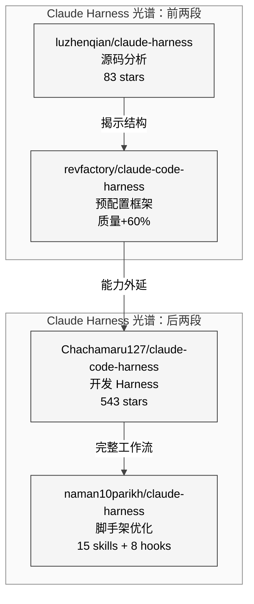
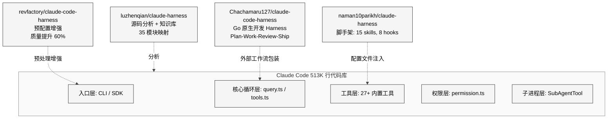
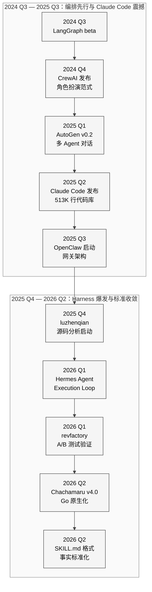

# 第29章 全网 Harness 实现全景

## 29.1 引言：Harness 为什么重要

2026年，AI Agent 领域发生了一次认知跃迁：业界逐渐意识到，**模型能力是必要条件，但远非充分条件**。一个 Agent 的真实能力上限，不取决于底层 LLM 的 benchmark 得分，而取决于围绕模型构建的整套"Harness"——工具注册、记忆管理、技能系统、编排逻辑、安全沙箱、自我改进机制的总和。

这一认知可以用一个简洁的公式表达：

> **Agent = Model + Harness**

围绕 Claude Code 所形成的大体量 TypeScript Harness 实现横跨五个架构层级（入口层、核心循环层、工具层、权限层、子进程层），这本身就是 Harness 论点的强证据——如果模型本身就够了，为什么还需要如此复杂的工程外壳？

2024至2026年间，全球开源社区涌现了数十个 Harness 实现项目。它们从不同角度回答同一个问题：**如何让 LLM 从"能聊天"变成"能做事"？** 有的选择分析现有 Agent 的源码结构（逆向工程），有的选择构建预配置框架提升输出质量（增强模式），有的选择设计全新的编排拓扑（编排模式），有的选择实现极简执行循环并在其上叠加韧性工程（循环模式）。

本章将对全球范围内所有重要的 Harness 实现进行全景扫描，建立分类学框架，并从中提取对 Hermes Agent 的具体启示。

### 29.1.1 Harness 论点的三层含义

1. **工程层**：同一个模型在不同 Harness 下的评分结果可能出现显著差异（revfactory 的 A/B 测试中，综合评分从 49.5 提升到 79.3，约为 60% 的相对提升）
2. **架构层**：Harness 的拓扑选择（网关/循环/编排/增强）决定了 Agent 的能力边界和扩展方向
3. **生态层**：SKILL.md 格式、MCP 协议、hook 系统等正在形成事实标准，Harness 之间的互操作性日益重要

### 29.1.2 为什么 2026 年出现 Harness 爆发

三个催化因素的叠加：

| 催化因素 | 说明 |
|---------|------|
| Claude Code 开源信号 | 2025年底 Claude Code 的架构被大量逆向分析，揭示了"五十万行 Harness"的真实规模 |
| MCP 协议标准化 | Model Context Protocol 为工具注册提供了通用接口，降低了 Harness 的集成成本 |
| SKILL.md 格式收敛 | 多个独立项目不约而同采用 Markdown frontmatter 格式描述技能，形成事实标准 |

## 29.2 Claude Harness 生态系

围绕 Claude Code 形成的四个 Harness 项目构成了一个完整的光谱：从纯粹的源码分析，到预配置增强，到完整的开发工作流 Harness，再到轻量级脚手架优化。

<div style="background: #ffffff !important; background-color: #ffffff !important; padding: 16px; border-radius: 8px; margin: 16px 0;" bgcolor="#ffffff">



</div>

### 29.2.1 luzhenqian/claude-harness：源码考古学

**定位**：对 Claude Code 进行交互式源码分析的知识库项目。

| 指标 | 数据 |
|------|------|
| GitHub Stars | 83 |
| 分析规模 | 514,587 行代码，1,902 个源文件 |
| 模块映射 | 35 个已映射模块 |
| 技术文章 | 31+ 篇子系统分析 |
| 核心价值 | 将 Claude Code 的"黑箱"变为"白箱" |

这个项目的意义不在于它提供了可运行的 Harness，而在于它构建了一份 Claude Code 的"解剖学图谱"。通过对五十万行 TypeScript 的系统性分析，它揭示了以下架构洞察：

- **五层架构**：入口层（CLI/SDK）、核心循环层（query.ts/tools.ts）、工具层（27+ 内置工具）、权限层（permission.ts）、子进程层（SubAgentTool）
- **状态管理**：基于 Zustand 的 AppState 存储，跨组件共享会话状态
- **工具调度**：ToolUseBlock 解析 → ToolRegistry 分发 → Permission 检查 → 执行 → 结果回注

对于其他 Harness 项目来说，luzhenqian/claude-harness 的分析结果是设计参考的上游来源。理解 Claude Code 的架构选择，才能有意识地选择"跟随"或"偏离"。

### 29.2.2 revfactory/claude-code-harness：预配置框架

**定位**：通过结构化预配置提升 Claude Code 输出质量的增强层。

这个项目的核心贡献是一组经过 A/B 测试验证的预配置策略，能够在不修改 Claude Code 源码的前提下显著提升其输出质量。

**A/B 测试结果**：

| 任务复杂度 | 无 Harness 均分 | 有 Harness 均分 | 提升幅度 |
|-----------|---------------|----------------|---------|
| 基础任务 | 约 55 | 约 78.8 | +23.8 |
| 进阶任务 | 约 48 | 约 77.6 | +29.6 |
| 专家任务 | 约 42 | 约 78.2 | +36.2 |
| 全局平均 | 49.5 | 79.3 | 约 +60%（相对提升） |

关键发现：**任务越复杂，预配置 Harness 的增益越大**。这意味着 Harness 的价值不是线性的，而是超线性的——在简单任务上模型本身就能做好，但在复杂任务上，缺乏结构化引导的模型输出会急剧退化。

预配置策略的核心机制包括：

- **任务分解模板**：将复杂任务分解为 Plan → Implement → Review → Test 四步
- **输出格式约束**：通过 system prompt 模板强制结构化输出
- **质量检查点**：在每个阶段设置自动化质量门控
- **上下文压缩**：减少 token 浪费，将更多 context window 留给有效信息

### 29.2.3 Chachamaru127/claude-code-harness：开发 Harness

**定位**：围绕 Claude Code 构建完整开发工作流的 Harness 系统，Claude Harness 生态中星数最高的项目。

| 指标 | 数据 |
|------|------|
| GitHub Stars | 543（生态中最高） |
| 当前版本 | v4.0 "Hokage" |
| 核心语言 | Go（v4.0 起原生化） |
| Hook 延迟 | 从 40-60ms 降至 10ms |
| 工作流 | Plan → Work → Review → Ship |

**v4.0 "Hokage" 的技术跃迁**：

v4.0 的最大变化是从 Node.js 迁移到 Go 原生引擎。这不仅是语言层面的切换，更是架构哲学的转变——从"在 Claude Code 的 Node.js 运行时中注入增强逻辑"转向"用独立的高性能运行时托管整个工作流"。

迁移带来的具体收益：

- **Hook 延迟**：从 40-60ms 降至 10ms，降幅约 75-83%
- **消除 Node.js 依赖**：部署更轻量，不再需要 Node.js 运行时
- **并发能力**：Go 的 goroutine 模型天然适合并行工具调用
- **二进制分发**：单一可执行文件，零依赖安装

**Plan → Work → Review → Ship 工作流**：

```
Plan  ──→  开发者定义任务目标和约束
Work  ──→  Agent 执行编码、测试、调试循环
Review ──→  自动化代码审查和质量检查
Ship  ──→  生成 PR/MR 并准备合并
```

这个四阶段工作流是 Chachamaru 项目的核心抽象。与 Hermes Agent 的 conversation loop 不同，它将"一次开发任务"作为原子单位，而不是"一轮对话"。这种粒度选择决定了它更适合软件开发场景，但在通用对话场景中灵活性较低。

### 29.2.4 naman10parikh/claude-harness：脚手架优化

**定位**：轻量级的 Claude Code 增强脚手架，约 1,200 行 bash/markdown。

| 组件 | 数量 | 说明 |
|------|------|------|
| Skills | 15 | 预置技能模板 |
| Hooks | 8 | 生命周期钩子 |
| Rules | 3 | 行为规则 |
| Templates | 3 | 项目模板 |
| 总代码量 | ~1,200 行 | bash + markdown |

这个项目的设计哲学是"最小侵入"——不重新实现执行引擎，不包装 Claude Code 的 API，而是通过标准化的 SKILL.md 文件、hook 脚本和规则文件来增强 Claude Code 的默认行为。

它的价值在于提供了一个"最佳实践起步包"：对于新接触 Claude Code 自定义能力的用户，这组预配置文件是立即可用的生产力提升工具。

### 29.2.5 四项目关系总结

<div style="background: #ffffff !important; background-color: #ffffff !important; padding: 16px; border-radius: 8px; margin: 16px 0;" bgcolor="#ffffff">



</div>

四个项目分别作用于 Claude Code 的不同层级：

- **luzhenqian**：读取全部五层，产出分析文档（纯读取，不修改）
- **revfactory**：作用于入口层，通过预配置模板影响输入质量
- **Chachamaru**：包装核心循环层，用 Go 引擎实现外部工作流控制
- **naman**：注入工具层，通过 SKILL.md 和 hook 扩展工具能力

## 29.3 编排框架：LangGraph / CrewAI / AutoGen

与 Claude Harness 生态关注"增强单个 Agent"不同，编排框架关注的是"协调多个 Agent"。这是一个根本性的设计分歧：前者假设一个足够强的 Agent 加上好的 Harness 就够了，后者假设复杂任务需要多个专门化 Agent 的协作。

### 29.3.1 LangGraph：图驱动编排

LangGraph 是 LangChain 生态中的编排层，核心抽象是**有状态有向图**。

**架构特征**：

| 特征 | 说明 |
|------|------|
| 核心抽象 | StateGraph — 节点（Node）+ 边（Edge） |
| 状态管理 | 显式 State 对象在节点间传递 |
| 路由机制 | 条件边（Conditional Edge）支持动态分支 |
| 持久化 | Checkpointer 支持工作流中断和恢复 |
| 可观测性 | 集成 LangSmith 提供全链路追踪 |
| 生态 | Python + TypeScript 双语言支持 |

**LangGraph 的设计哲学**：

LangGraph 代表了"显式控制流"学派——开发者必须明确定义每个节点的输入/输出、每条边的路由条件。这与 CrewAI 的"隐式角色协作"形成鲜明对比。

显式控制的优势在于可预测性和可调试性：当工作流出现问题时，开发者可以精确定位到某个节点或某条边。代价是较高的前期设计成本和较低的灵活性——新增一个步骤意味着重新设计图拓扑。

```python
# LangGraph 典型用法示意
from langgraph.graph import StateGraph, END

graph = StateGraph(AgentState)
graph.add_node("planner", plan_step)
graph.add_node("executor", execute_step)
graph.add_node("reviewer", review_step)

graph.add_edge("planner", "executor")
graph.add_conditional_edges(
    "executor",
    should_review,
    {"review": "reviewer", "done": END}
)
graph.add_edge("reviewer", "planner")
```

### 29.3.2 CrewAI：角色扮演多智能体

CrewAI 将 Agent 组织为"团队"（Crew），每个 Agent 扮演特定角色（Role），在共享任务上协作。

**架构特征**：

| 特征 | 说明 |
|------|------|
| 核心抽象 | Crew（团队）+ Agent（角色）+ Task（任务） |
| 角色定义 | 自然语言描述角色、目标和背景知识 |
| 执行模式 | Sequential（顺序）/ Hierarchical（层级）/ Parallel（并行） |
| 委托机制 | Agent 可主动将子任务委托给其他 Agent |
| 原型速度 | 多 Agent 系统中原型搭建最快 |
| 社区生态 | 活跃的 CrewAI Tools 市场 |

**CrewAI 的设计哲学**：

CrewAI 代表了"角色即架构"学派——系统的行为由角色定义和任务描述决定，而不是由代码中的控制流决定。这种声明式的设计让非技术用户也能理解和修改 Agent 系统的行为。

```python
# CrewAI 典型用法示意
from crewai import Agent, Task, Crew

researcher = Agent(
    role="Senior Researcher",
    goal="Discover cutting-edge developments",
    backstory="Expert in technology trends..."
)

writer = Agent(
    role="Technical Writer",
    goal="Create comprehensive reports",
    backstory="Experienced in technical writing..."
)

research_task = Task(
    description="Research the latest AI agent frameworks",
    agent=researcher
)

write_task = Task(
    description="Write a detailed report based on research",
    agent=writer
)

crew = Crew(
    agents=[researcher, writer],
    tasks=[research_task, write_task],
    process="sequential"
)
```

### 29.3.3 Microsoft AutoGen：多智能体对话

AutoGen 是微软研究院推出的多智能体对话框架，核心假设是 Agent 之间通过自然语言消息进行协作。

**架构特征**：

| 特征 | 说明 |
|------|------|
| 核心抽象 | ConversableAgent — 可对话的 Agent 基类 |
| 对话模式 | Agent 之间直接发送消息，像"聊天室"一样协作 |
| 人类参与 | UserProxyAgent 支持人类随时介入对话 |
| 代码执行 | 内置 Docker 沙箱执行 Agent 生成的代码 |
| 企业集成 | 深度集成 Azure OpenAI、Azure AI Search |
| 多模态 | 支持文本、图像、代码等多模态消息 |

**AutoGen 的设计哲学**：

AutoGen 代表了"对话即计算"学派——Agent 之间的协作不需要预定义的工作流图，而是通过多轮对话自然涌现。这种设计在探索性任务（如研究、创意生成）中有天然优势，但在需要精确控制的生产任务中可能产生不可预测的行为。

### 29.3.4 编排框架 vs 个人 Agent Harness

编排框架（LangGraph/CrewAI/AutoGen）与个人 Agent Harness（Hermes/OpenClaw）之间存在一个根本性的设计张力：

| 维度 | 编排框架 | 个人 Agent Harness |
|------|---------|------------------|
| 核心假设 | 复杂任务需要多 Agent 协作 | 一个强 Agent + 好的 Harness 就够 |
| 复杂度管理 | 分布在多个 Agent 之间 | 集中在单一 Agent 的 Harness 中 |
| 状态管理 | 分布式状态，需要协调协议 | 集中式状态，单进程管理 |
| 调试难度 | 高（需追踪 Agent 间通信） | 低（单一执行流） |
| 适用场景 | 企业工作流、团队协作 | 个人生产力、开发助手 |
| 典型代表 | LangGraph, CrewAI, AutoGen | Hermes Agent, OpenClaw |

这个对比揭示了一个深层观点：**"编排优先"和"Agent 优先"是两种互补而非互斥的范式**。Hermes Agent 已经通过 SubAgent 机制引入了有限的多 Agent 协作，而 LangGraph 也在单个节点内支持完整的 Agent 执行循环。两种范式正在从不同方向靠拢。

## 29.4 项目分类学：四种 Harness 范式

综合分析全球范围内的 Harness 实现后，我们可以提炼出四种基本范式。每个项目都可以在这个分类框架中找到自己的位置。

```mermaid
%%{init: {'theme': 'neutral', 'themeVariables': {'background': '#ffffff', 'primaryColor': '#f5f5f5', 'primaryTextColor': '#000000', 'primaryBorderColor': '#333333', 'lineColor': '#444444', 'textColor': '#000000', 'mainBkg': '#f5f5f5', 'nodeBorder': '#333333', 'clusterBkg': '#fafafa', 'clusterBorder': '#888888', 'edgeLabelBackground': '#ffffff'}}}%%
graph LR
    subgraph gateway["Gateway 模式"]
        direction TB
        GW1["OpenClaw<br/>中心化网关路由"]
        GW2["多通道 · 认证 · 限流<br/>适合: 多客户端共享"]
    end

    subgraph loop["Execution Loop 模式"]
        direction TB
        LP1["Hermes Agent<br/>轻量循环 + 韧性工程"]
        LP2["单进程 · 自我改进<br/>适合: 个人 Agent"]
    end

    subgraph orch["Orchestration 模式"]
        direction TB
        OR1["LangGraph / CrewAI / AutoGen<br/>图/团队/对话编排"]
        OR2["多 Agent 协作<br/>适合: 企业工作流"]
    end

    subgraph enhance["Enhancement 模式"]
        direction TB
        EN1["claude-code-harness 系列<br/>增强现有 Agent"]
        EN2["非侵入 · 预配置<br/>适合: 快速提升"]
    end

    gateway ---|"共享: MCP 工具协议"| loop
    loop ---|"共享: SKILL.md 格式"| enhance
    enhance ---|"共享: Hook 系统"| orch
    orch ---|"共享: LLM API 层"| gateway
```

<div style="background: #ffffff !important; background-color: #ffffff !important; padding: 16px; border-radius: 8px; margin: 16px 0;" bgcolor="#ffffff">



</div>

### 29.4.1 Gateway 模式

**代表项目**：OpenClaw

**核心特征**：所有请求通过中心化网关服务器路由，网关负责认证、限流、通道管理、模型选择。

**架构优势**：
- 多客户端共享同一 Agent 实例
- 统一的认证和审计机制
- 支持 20+ 消息通道的统一接入
- WebSocket 实时双向通信

**架构代价**：
- 网关成为单点故障（single point of failure）
- 部署和运维复杂度高
- 不适合纯本地场景

**适用场景**：团队共享 Agent、多平台统一接入、需要认证和审计的企业环境。

### 29.4.2 Execution Loop 模式

**代表项目**：Hermes Agent

**核心特征**：围绕一个紧凑的 conversation loop 构建，通过工具注册表、记忆管理和技能系统实现能力扩展，并在循环之上叠加韧性工程（重试、断路器、优雅降级）。

**架构优势**：
- 极简核心，易于理解和调试
- 单进程运行，部署简单
- 自我改进能力（skill evolution）
- 18 平台适配器，覆盖面广

**架构代价**：
- 单 Agent 执行，复杂编排能力有限
- 状态管理完全在进程内，无持久化编排状态
- 横向扩展需要额外架构设计

**适用场景**：个人 Agent、开发助手、需要自我改进能力的长期运行系统。

### 29.4.3 Orchestration 模式

**代表项目**：LangGraph、CrewAI、AutoGen

**核心特征**：将多个 Agent 组织为图/团队/对话网络，通过预定义的编排逻辑协调它们的行为。

**架构优势**：
- 天然支持任务分解和并行执行
- 角色专门化降低单个 Agent 的能力要求
- 丰富的控制流原语（条件分支、循环、并行）
- 成熟的可观测性工具链

**架构代价**：
- 设计复杂度高
- 分布式状态协调困难
- Agent 间通信开销
- 调试困难（需追踪多个 Agent 的交互）

**适用场景**：企业工作流自动化、复杂的多步骤任务、需要专门化角色分工的场景。

### 29.4.4 Harness Enhancement 模式

**代表项目**：claude-code-harness 系列（revfactory、Chachamaru、naman）

**核心特征**：不重新实现 Agent，而是通过预配置、hook 注入、工作流包装等手段增强现有 Agent 的能力。

**架构优势**：
- 最小侵入，不修改上游 Agent 代码
- 快速见效，立即可用
- 可叠加——多个增强层可同时使用
- 低维护成本——上游 Agent 升级时适配成本低

**架构代价**：
- 受上游 Agent 架构限制
- 能力上限由上游 Agent 决定
- 深度定制困难
- 缺乏对 Agent 内部状态的访问

**适用场景**：已有可用 Agent 但需要提升质量/效率、不希望自建完整 Harness 的团队。

### 29.4.5 范式选择的决策树

选择哪种范式取决于三个关键问题：

1. **你需要多个 Agent 协作吗？** 如果是 → Orchestration 模式
2. **你有一个可用的 Agent 只是不够好？** 如果是 → Enhancement 模式
3. **你需要多客户端/多用户共享？** 如果是 → Gateway 模式
4. **你需要一个自主的个人 Agent？** 如果是 → Execution Loop 模式

## 29.5 技术指标对比矩阵

以下矩阵覆盖全球范围内八个重要的 Harness 实现项目，从十一个维度进行对比。

| 维度 | Hermes Agent | OpenClaw | OpenHarness | JiuwenClaw | Chachamaru | LangGraph | CrewAI | AutoGen |
|------|-------------|----------|-------------|------------|------------|-----------|--------|---------|
| **核心语言** | Python | TypeScript | Python | Python | Go (v4.0) | Python/TS | Python | Python |
| **范式** | Execution Loop | Gateway | Loop + MCP | Gateway | Enhancement | Orchestration | Orchestration | Orchestration |
| **架构类型** | 单 Agent 循环 | 中心化网关 | 工具增强循环 | 网关 + 扩展 | 工作流包装 | 有状态图 | 角色团队 | 对话网络 |
| **工具数量** | 15+ 内置 | 10+ 内置 | MCP 动态 | 20+ | 依赖上游 | 框架级 | 10+ 内置 | 10+ 内置 |
| **记忆系统** | MEMORY.md 持久化 | 会话内存 | 上下文窗口 | 持久化存储 | 依赖上游 | Checkpointer | 短期/长期 | 对话历史 |
| **Skill 系统** | SKILL.md + 进化 | SKILL.md | 无 | SKILL.md | 通过 Hook | 无原生 | Agent 定义 | Agent 定义 |
| **平台数** | 18 | 20+ | CLI | 10+ | CLI | 库集成 | 库集成 | 库集成 |
| **沙箱支持** | Docker | 无 | MCP 沙箱 | 有限 | 无 | 无 | 无 | Docker |
| **自我改进** | 有（skill evolution） | 无 | 无 | 有限 | 无 | 无 | 无 | 无 |
| **License** | 开源 | 开源 | 开源 | 开源 | 开源 | MIT | MIT | MIT |
| **Stars** | — | 高 | 中 | 中 | 543 | 极高 | 极高 | 极高 |

### 29.5.1 矩阵解读

**语言分布**：Python 在 Harness 领域占据主导地位（8 个项目中 5 个使用 Python），TypeScript 次之（2 个），Go 是后起之秀（Chachamaru v4.0 的转型表明 Go 在高性能 Harness 中有优势）。

**自我改进能力**：这是 Hermes Agent 最突出的差异化特征之一。在本章覆盖的八个项目里，Hermes 对 skill evolution 的实现投入最深之一，但这种判断仍依赖当前样本范围，而不宜外推为整个生态的绝对结论。更准确地说，自我改进需要 skill 系统、记忆系统和回顾机制的联动，而 Execution Loop 模式更容易把这些能力整合进同一条主循环。

**平台覆盖**：Hermes Agent（18 平台）和 OpenClaw（20+）在平台覆盖上处于前列。编排框架（LangGraph/CrewAI/AutoGen）主要作为库集成使用，不直接提供消息平台适配器。

**沙箱支持**：安全沙箱的实现差异反映了不同项目对安全性的重视程度。Hermes Agent 和 AutoGen 使用 Docker 沙箱，其他项目要么依赖上游、要么没有沙箱支持。

## 29.6 趋势与洞察

### 29.6.1 收敛趋势

尽管各项目的设计哲学差异显著，但在以下方面正在快速收敛：

**SKILL.md 格式标准化**

多个独立项目不约而同采用了 Markdown frontmatter 格式描述技能：

```yaml
---
name: example-skill
description: Skill description
triggers:
  - keyword1
  - keyword2
---
# Skill Content
...
```

Hermes Agent、OpenClaw、JiuwenClaw、naman10parikh/claude-harness 都使用了这种格式，尽管它们之间没有直接的代码依赖关系。这是一种典型的"趋同进化"——相同的需求（可发现、可组合、可机器解析的技能描述）导致了相同的解决方案。

**MCP 协议集成**

Model Context Protocol 正在成为 Harness 与外部工具交互的通用接口。2026 年上半年，几乎所有活跃开发的 Harness 项目都增加了对 MCP 的支持或计划支持。

**多模型支持**

单一模型锁定正在消失。新一代 Harness 普遍支持多模型配置——根据任务类型、成本预算和延迟要求动态选择模型。

### 29.6.2 分歧趋势

在以下方面，各项目正在走向不同的方向：

| 分歧维度 | 路线 A | 路线 B |
|---------|--------|--------|
| 进化 vs 编排 | Hermes: 单 Agent 自我进化 | LangGraph: 多 Agent 编排 |
| 网关 vs 本地 | OpenClaw: 中心化服务 | Hermes: 本地优先 |
| 通用 vs 专用 | CrewAI: 通用团队协作 | Chachamaru: 专注软件开发 |
| 重量级 vs 轻量级 | AutoGen: 完整企业框架 | naman: 最小脚手架 |

### 29.6.3 "Harness 之战"：2026年的竞争格局

<div style="background: #ffffff !important; background-color: #ffffff !important; padding: 16px; border-radius: 8px; margin: 16px 0;" bgcolor="#ffffff">



</div>

这条时间线揭示了一个清晰的演化链：

1. **2024**: 编排框架先行（LangGraph、CrewAI），建立了"多 Agent"思维
2. **2025**: Claude Code 发布，揭示了"单 Agent 五十万行 Harness"的真实规模，冲击了"简单包装就够"的认知
3. **2026 Q1**: Claude Harness 生态爆发，源码分析、预配置、开发工作流三条路线并进
4. **2026 Q2**: 格式标准（SKILL.md）和协议标准（MCP）开始收敛，Harness 从"百花齐放"进入"标准整合"阶段

### 29.6.4 Python 为何主导新 Harness 实现

在八个主要 Harness 项目中，五个使用 Python。这个现象当然可以提出一些解释，但也不宜说得太满。更稳妥的说法是：Python 在这类项目中看起来更常见，原因可能包括：

1. **ML/AI 生态更集中于 Python**：调用主流模型 SDK、拼接数据处理和实验脚本时，Python 往往更方便
2. **原型与实验迭代较快**：Harness 需要频繁试验 prompt、工具、路由和工作流，Python 在这类任务上通常较顺手
3. **社区习惯与人才池**：AI/ML 研究者和实践者更熟悉 Python，这可能自然影响了语言选择
4. **交互式调试环境更成熟**：Notebook、脚本化实验和临时分析在 Python 生态里更常见

但也要保留一个更朴素的解释：不少团队可能只是使用了自己最熟悉的语言，而不是围绕语言本身做了特别强的产品或战略判断。

但 Chachamaru v4.0 的 Go 转型表明，**当 Harness 从原型走向生产时，性能和部署便利性可能迫使语言迁移**。Go 的编译型二进制分发、低延迟 goroutine 模型和零依赖部署正是生产环境所需要的。

## 29.7 对 Hermes Agent 的启示

### 29.7.1 Hermes 的优势领域

通过全景对比，Hermes Agent 在以下领域处于领先位置：

**1. 自我改进**

在本章覆盖的样本中，Hermes 对完整 skill evolution 机制的投入最深。revfactory 的 A/B 测试数据说明 Harness 会显著影响输出评分，而 Hermes 的自我改进机制意味着这类提升有机会累积到长期使用过程中。

**2. 平台覆盖**

18 个平台适配器（CLI、Telegram、Discord、Slack、WeChat、DingTalk、飞书、钉钉等）使 Hermes 成为"到达用户最多"的 Harness 之一，仅次于 OpenClaw 的 20+ 通道。

**3. 韧性工程**

重试机制、断路器模式、优雅降级——这些在其他 Harness 中普遍缺失的韧性工程特性是 Hermes 的差异化优势。LLM API 的不稳定性（超时、限流、模型切换）使得韧性工程不是"锦上添花"而是"生产必需"。

**4. MEMORY.md 持久化**

与大多数依赖会话内存或 Checkpointer 的项目不同，Hermes 的 Markdown 文件持久化方案具有天然的人类可读性和版本控制友好性。

### 29.7.2 Hermes 可以学习的方面

**1. 从 LangGraph 学习：显式工作流定义**

LangGraph 的 StateGraph 抽象提供了一种声明式的方式定义复杂工作流。Hermes 目前的 conversation loop 在处理复杂多步骤任务时缺乏显式的流程控制。引入轻量级的工作流定义能力（不必是完整的图引擎），可以提升 Hermes 处理结构化任务的能力。

**2. 从 CrewAI 学习：角色专门化**

CrewAI 的角色定义机制可以用于 Hermes 的 SubAgent 系统——让不同的 SubAgent 扮演不同角色（researcher、coder、reviewer），通过角色专门化降低每个 Agent 的能力要求。

**3. 从 Chachamaru 学习：性能优化**

Chachamaru v4.0 的 Go 迁移证明了性能优化的价值（Hook 延迟降低 75-83%）。Hermes 的 Python 实现在 Hook 和工具调用路径上可能存在类似的优化空间。关键路径的 Cython 编译或 Rust 扩展是可行的优化方向。

**4. 从 AutoGen 学习：安全沙箱**

AutoGen 的 Docker 沙箱执行模型值得 Hermes 借鉴。虽然 Hermes 已有基本的沙箱支持，但 AutoGen 在沙箱生命周期管理、网络隔离、资源限制等方面更为成熟。

**5. 从 revfactory 学习：可量化的质量度量**

revfactory 的 A/B 测试方法论——定义质量评分标准、对比有无 Harness 的输出、按任务复杂度分层分析——为 Hermes 提供了一个质量度量的参考框架。Hermes 的自我改进机制需要类似的量化反馈才能避免"进化幻觉"（看似在改进但缺乏客观证据）。

### 29.7.3 Hermes 的战略定位

综合分析后，Hermes Agent 应定位为：

> **自主进化的个人 Agent Harness**——以 Execution Loop 为核心，以 self-improvement 为差异化，向编排能力适度扩展但不全面转向编排范式。

这意味着：
- **继续深化**自我改进机制，这是 Hermes 在当前样本中最清晰的强项之一
- **适度引入**工作流定义能力（轻量版 StateGraph），但不实现完整的编排框架
- **保持**平台覆盖的广度优势，同时提升每个平台适配器的深度
- **补齐**安全沙箱和质量度量的短板

## 29.8 仍存在的问题

### 29.8.1 生态碎片化

当前 Harness 生态最突出的问题是碎片化。八个主要项目使用三种语言（Python/TypeScript/Go）、四种架构范式、多种不兼容的配置格式。虽然 SKILL.md 和 MCP 正在推动标准化，但距离真正的互操作性还有很长的路。

具体而言：

- **Skill 可移植性**：一个为 Hermes 编写的 SKILL.md 不能直接在 OpenClaw 中使用（尽管格式相同，但运行时约定不同）
- **工具注册兼容性**：MCP 提供了工具描述的标准格式，但 Harness 内部的工具调度机制各不相同
- **记忆系统互通**：Hermes 的 MEMORY.md、LangGraph 的 Checkpointer、CrewAI 的长期记忆之间没有互转机制

### 29.8.2 互操作性挑战

理想状态下，用户应该能够：
1. 用 Hermes 作为核心 Agent 循环
2. 调用 LangGraph 定义的子工作流
3. 使用 OpenClaw 的网关进行多通道接入
4. 使用 Chachamaru 的 hook 系统做质量控制

但当前的技术现实是：每个项目都是一个"封闭花园"，跨 Harness 组合几乎不可能。这不仅是技术问题，更是社区协调问题——没有一个中立的标准组织在推动 Harness 层面的互操作性标准。

### 29.8.3 简单性与能力的张力

Harness 设计中存在一个基本矛盾：

- **简单性方向**：naman 的 1,200 行脚手架证明了极简 Harness 的价值——安装快、学习快、使用快
- **能力方向**：Claude Code 的 513,237 行代码库证明了复杂 Harness 的必要性——要做好，就需要大量工程

每个项目都在这两极之间寻找自己的平衡点。Hermes Agent 的选择是"中等复杂度"——比 naman 的脚手架重得多，但比 Claude Code 的完整代码库轻得多。这个位置是否是最优的？没有确定答案，但可以确定的是：**没有一个单一的复杂度级别适合所有场景**。

### 29.8.4 评估标准的缺失

revfactory 的 A/B 测试是目前少数对 Harness 效果进行定量评估的尝试。但 Harness 领域整体缺乏：

- **标准化 benchmark**：没有一个像 HumanEval 之于代码生成、MMLU 之于通用能力那样的标准评测集
- **可复现的评估流程**：各项目的效果声明大多基于定性观察而非定量实验
- **横向对比方法论**：如何公平地比较一个 Gateway Harness 和一个 Execution Loop Harness？它们的能力维度都不同

建立标准化的 Harness 评估体系是整个生态的迫切需求。

### 29.8.5 安全性的系统性忽视

在八个项目的对比中，安全性是被一致低估的维度：

- 只有 Hermes 和 AutoGen 实现了基本的沙箱执行
- 没有项目实现了对 prompt injection 的一劳永逸防御；更准确的现实是，各项目通常只实现了局部防护层，仍存在被绕过或覆盖不足的空间
- 权限模型普遍简陋——大多数 Harness 中，Agent 对所有工具拥有无限制访问权
- 审计日志在大多数项目中缺失或不完整

随着 Agent 能力的增强（特别是代码执行和文件系统操作），安全性从"nice-to-have"变成了"必须有"。第一个因 Harness 安全漏洞导致的重大事故可能加速整个生态对安全性的重视。

## 29.9 本章小结

本章完成了对全球 Harness 实现的全景扫描。核心发现如下：

1. **四种范式**：Gateway（OpenClaw）、Execution Loop（Hermes）、Orchestration（LangGraph/CrewAI/AutoGen）、Enhancement（claude-code-harness 系列）是当前 Harness 设计的四种基本范式

2. **收敛与分歧并存**：SKILL.md 格式和 MCP 协议正在标准化，但架构哲学（单 Agent vs 多 Agent、网关 vs 本地、通用 vs 专用）的分歧在加深

3. **Claude Harness 生态**：四个 claude-harness 项目形成了从分析到实践的完整光谱，revfactory 的 A/B 测试首次量化证明了 Harness 对输出质量的 60% 提升

4. **Hermes 的差异化**：自我改进是 Hermes 在当前样本中最突出的差异化方向，平台覆盖和韧性工程则构成相对优势

5. **生态挑战**：碎片化、互操作性缺失、评估标准缺失、安全性忽视是整个 Harness 生态面临的系统性问题

Harness 论点——**不是模型，而是 Harness 决定了 Agent 的能力上限**——正在被越来越多的证据支持。2026年的 "Harness 之战" 不仅是技术竞争，更是关于"Agent 应该如何构建"的范式之争。这场竞争的结果将深刻影响 AI Agent 从实验室走向生产环境的路径。

---

**下一章预告**：第30章将聚焦三个项目的 Skill 系统对比，深入分析 SKILL.md 格式从"巧合趋同"走向"事实标准"的演化过程。
