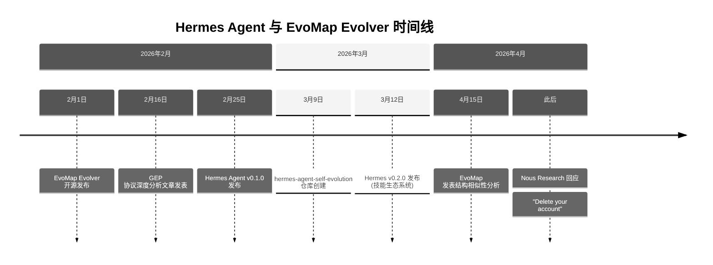
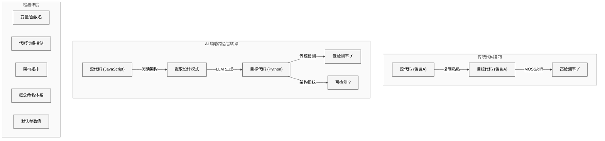
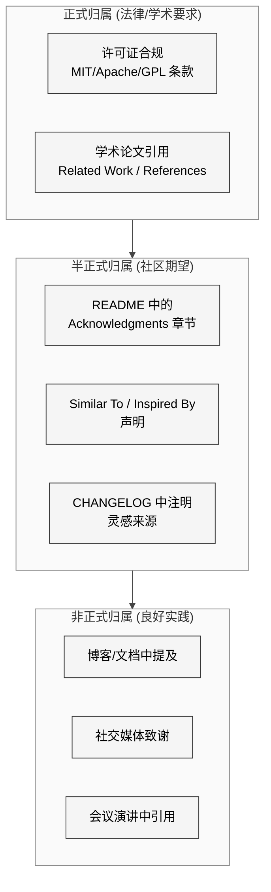
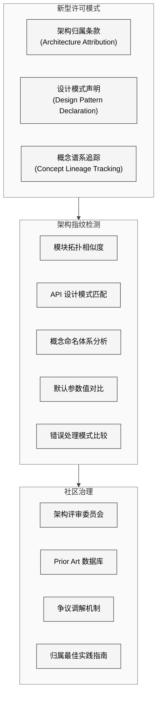

# 第32章 开源伦理与启示

## 32.1 引言

开源软件运动建立在代码共享与社区协作的基础之上，但"开放"并不意味着"无需致谢"。当一个项目的架构设计明显受到另一个项目的影响时，开源社区长期以来形成了一套非正式但被广泛认可的归属规范。2026 年初围绕 Hermes Agent 与 EvoMap Evolver 之间关系的争议，为 AI Agent 领域的开源伦理提出了新的命题：在 AI 辅助的跨语言代码生成时代，架构层面的借鉴与致谢边界应当如何界定？

本章将以事实为基础，梳理争议的时间线，分析 AI 代码转译带来的新挑战，总结开源社区的归属规范，并对 Hermes 项目"做了什么"和"未做什么"进行对称性评估。本章的目的不是做出法律或道德判断，而是为读者提供充分的信息以形成自己的观点。

## 32.2 争议时间线

### 关键节点详述

**2026 年 2 月 1 日**，EvoMap 团队将 Evolver 项目以 MIT 许可证开源。Evolver 实现了 GEP（Gene-Expression Programming）协议，核心概念包括 Gene（基因）、Capsule（胶囊）、evolution_narrative（进化叙事）、signals_match（信号匹配选择）、blast radius estimation（爆炸半径估算）等。

**2 月 16 日**，社区开发者发表了对 GEP 协议的深度技术分析，详细拆解了 Evolver 的进化循环架构、Gene 选择机制和 Capsule 固化流程。这篇文章引起了广泛关注。

**2 月 25 日**，Nous Research 发布 Hermes Agent v0.1.0。该版本的核心功能包括工具调用、多模型支持、会话管理等基础 Agent 能力。

**3 月 9 日**，`hermes-agent-self-evolution` 仓库创建，引入了 Agent 自进化能力。

**3 月 12 日**，Hermes v0.2.0 发布，引入了技能生态系统（Skills Ecosystem），包括 SKILL.md 文件格式、技能目录结构、渐进式展开加载机制等。

**4 月 15 日**，EvoMap 团队发表了一篇详细的结构相似性分析，指出 Hermes Agent 的多个架构模式与 Evolver 存在高度相似性，包括但不限于：进化原则文件的命名与角色、Gene/Skill 的选择机制设计、叙事记忆的实现方式、爆炸半径估算的概念等。

此后，Nous Research 方面的公开回应引发了争议。在社交媒体上，相关回应被描述为"Delete your account"等简短且带有对抗性的措辞，未就技术层面的相似性进行实质性回应。

## 32.3 AI 代码转译与"架构洗钱"

大语言模型使得将一种编程语言的代码库转译为另一种语言变得前所未有地容易。Evolver 使用 Node.js（JavaScript）编写，而 Hermes Agent 使用 Python 编写——语言的差异使得传统的代码比较工具（如 diff、MOSS 等抄袭检测系统）难以直接发现借鉴关系。这种现象被一些评论者称为"AI 代码洗钱"（AI Code Laundering）。

AI 辅助跨语言转译的挑战在于：它能改变代码的"表面指纹"（变量名、语法结构、控制流风格）而保留"深层指纹"（架构拓扑、概念命名体系、模块间依赖关系、默认参数值的选择等）。传统的代码抄袭检测侧重于前者，对后者缺乏有效手段。

### 类似案例

这种争议并非孤例。近年来已有多起涉及 AI Agent 和开源项目的类似案例，供读者参考：

- **美团 Tabbit 与陪读蛙（PeiDuWa）**：美团的 AI 教育产品被指在产品功能和交互设计上与独立开发者的项目高度相似。争议焦点在于大公司是否利用资源优势快速复制独立开发者的创新。

- **三省六部 AI 法院与 Edict**：一个中文 AI 法律项目被指借鉴了英文开源项目的架构设计，同样涉及跨语言/跨文化的架构相似性问题。

- **Microsoft Peerd 与 Spegel**：微软的容器镜像分发项目 Peerd 被指与开源项目 Spegel 在架构上高度相似。此案例的特殊之处在于，微软后来公开致谢了 Spegel 项目。

- **Cursor Composer 2 与 Kimi K2.5 的关系**：Cursor 的 Composer 2 功能被认为在底层使用了月之暗面的 Kimi K2.5 模型进行重新包装，引发了关于模型层面的"转售"边界讨论。

这些案例共同反映了一个趋势：在 AI 加速软件开发的时代，"借鉴"与"抄袭"之间的灰色地带正在扩大，现有的法律和伦理框架尚未充分适应这一变化。

## 32.4 开源归属规范

开源社区对于归属（Attribution）有一套虽未成文法但被广泛遵循的规范体系。这些规范按正式程度可分为以下层次：

**许可证合规**是最底线的要求。MIT 许可证要求保留版权声明和许可证文本——但这只适用于直接复制代码的情况。对于架构层面的借鉴，MIT 许可证本身不要求归属。

**学术论文中的 Related Work 章节**是学术界对于"我的工作建立在哪些前人工作之上"的标准化表达方式。缺少 Related Work 部分或遗漏关键相关工作，通常被视为严重的学术失范。

**README 中的致谢声明**（如 "Inspired by X", "Similar to Y", "Based on the ideas from Z"）是开源社区最常见的归属方式。这种声明不具有法律约束力，但其存在或缺失往往反映了项目维护者对社区规范的态度。

## 32.5 Hermes 做了什么

客观而言，Hermes Agent 在学术引用方面有值得肯定的做法：

1. **引用了 GEPA（Gene-Expression Programming with Agents）学术概念**：Hermes 的自进化子系统在文档中引用了 GEPA 作为理论基础，表明开发团队关注了该领域的学术研究。

2. **引用了 DSPy 框架**：在优化和提示词工程方面，Hermes 文档引用了斯坦福 DSPy 框架的思想。

3. **引用了 Imbue AI 的 Darwinian Evolver 概念**：在自进化设计的哲学层面，文档提及了 Imbue AI 提出的达尔文式进化器概念。

这些引用表明 Hermes 团队认可了学术层面的知识贡献，并遵循了学术引用的基本规范。引用学术论文和概念框架是负责任的做法，体现了对知识谱系的尊重。

## 32.6 Hermes 没有做什么

然而，在 EvoMap 团队和社区观察者看来，有一个显著的缺失：

**在至少 7 份公开材料中（包括 README、博客文章、发布公告、技术文档等），Hermes 项目未提及 Evolver、EvoMap 或 GEP 协议的开源实现。** 这些公开材料涵盖了 v0.1.0 到 v0.2.0 的发布周期，以及自进化子系统和技能生态系统的介绍文档。

这一缺失的意义在于：

- Hermes 引用了 GEPA 的学术概念，但未提及 GEPA 概念最知名的开源实现——Evolver。
- Hermes 引用了 Darwinian Evolver 的哲学概念，但未提及在时间线上先于 Hermes 发布的、实现了类似架构的具体开源项目。
- 在 GEP 协议深度分析文章广泛传播的时间窗口内（2 月 16 日之后），Hermes 的自进化仓库于 3 月 9 日创建，但相关文档中未出现对 Evolver 的引用。

需要强调的是：引用学术概念而不引用具体开源实现，在技术上是合规的（学术论文引用和开源项目致谢是两个不同的层面）。但从开源社区规范的角度看，当一个项目的架构设计与另一个先发的开源项目存在显著相似性时，社区通常期望在 "Acknowledgments"、"Related Projects" 或 "Inspired By" 部分进行说明。

## 32.7 结构相似性的技术分析

EvoMap 团队在 4 月 15 日发表的分析中列举了多个结构相似点。作为技术分析，这里不做法律层面的判断，仅将部分公开的比较呈现给读者：

| 比较维度 | EvoMap Evolver | Hermes Agent |
|---------|---------------|--------------|
| **进化原则文件** | EVOLUTION_PRINCIPLES.md | 类似的原则/约束文档 |
| **记忆叙事** | evolution_narrative.md (自动追加 Markdown 日志) | MEMORY.md 策展式记忆 (手动管理条目) |
| **知识编码** | Gene JSON (signals_match, strategy, constraints) | SKILL.md (YAML 前置元数据, 指令正文, 约束) |
| **选择机制** | Jaccard 信号匹配 | 技能检索 + 渐进展开 |
| **固化机制** | Capsule (成功操作封装) | Skill 创建工具 |
| **失败记录** | failed_capsules.json | 无直接对应 |
| **事件日志** | events.jsonl (追加式) | SQLite messages (追加式) |
| **爆炸半径** | blast radius estimation | 文件/行影响估算 |

读者需要自行评估：这些相似性是否超出了"同一问题域的独立设计者自然会收敛到相似解决方案"的范围。AI Agent 自进化是一个新兴领域，设计空间有限，一定程度的趋同是可以预期的。但趋同的程度和具体命名/概念的重叠度，是判断的关键参考因素。

## 32.8 未来启示

### 32.8.1 新型许可模式

现有的开源许可证体系（MIT、Apache 2.0、GPL 等）主要针对代码级的复制和分发，对架构级的借鉴缺乏约束力。未来可能出现的许可创新包括：

- **架构归属条款**：要求衍生项目在采用类似架构时在文档中说明灵感来源。
- **设计模式声明**：项目维护者主动声明其核心设计模式的来源，形成可追溯的创新谱系。
- **概念溯源标注**：类似学术论文的引用体系，但适用于软件架构领域。

### 32.8.2 架构指纹技术

随着 AI 代码转译使得代码级检测失效，社区可能需要发展新的"架构指纹"检测技术：

- **模块拓扑分析**：比较两个项目的模块依赖图（而非代码内容）的结构相似性。
- **概念命名体系映射**：检测两个项目是否使用了高度相似的领域概念命名体系（如 Gene/Capsule/Narrative vs Skill/Memory/Session）。
- **默认参数值对比**：特定的魔术数字（如容量上限、裁剪阈值、衰减参数）的一致性，有时比代码结构更能揭示借鉴关系。
- **错误处理模式比较**：错误处理的分支结构和恢复策略，往往带有原始项目的"设计基因"。

### 32.8.3 社区治理机制

长远来看，AI Agent 开源社区可能需要建立更正式的治理机制：

- **Prior Art 数据库**：类似专利领域的"现有技术"数据库，记录 AI Agent 架构创新的时间戳和技术描述。
- **争议调解框架**：在项目间发生架构相似性争议时，提供结构化的调解流程，避免社交媒体上的对抗性交锋。
- **归属最佳实践指南**：社区共同制定的归属规范文档，明确不同层次的借鉴应对应什么程度的致谢。

## 32.9 双方立场的公平呈现

### EvoMap 方面的关切

EvoMap 团队的核心关切在于：一个在时间线上后发的项目，在架构层面与其开源实现存在显著相似性，但在所有公开材料中未提及他们的工作。这种感受可以被理解为——无论最终事实如何——对于开源贡献者而言，看到自己的创新被采用但未被致谢，是一种切实的伤害。

EvoMap 团队通过发表技术分析而非法律诉讼来表达关切，采取了相对克制和建设性的方式。

### Nous Research 方面的可能立场

虽然 Nous Research 未发表详细的技术回应，但基于一般性的论证框架，可以推测其可能的立场：

- **独立设计论**：AI Agent 自进化是一个设计空间有限的领域，相似的解决方案可能是独立设计的自然趋同。
- **学术引用已尽义务**：引用了 GEPA 学术概念、DSPy 和 Darwinian Evolver，已经尽到了学术层面的归属义务。
- **实现差异显著**：Hermes 使用 Python 编写，Evolver 使用 JavaScript 编写，具体实现细节（如 SQLite FTS5 vs JSONL + Jaccard、冻结快照 vs 叙事截断）存在显著差异。
- **功能范围不同**：Hermes 是一个通用 AI Agent 平台，自进化只是其众多子系统之一；Evolver 是一个专注于自进化的项目。

### 中立观察

从技术分析的角度，本研究认为以下观察是客观的：

1. 两个项目在架构层面存在多个相似点，这些相似点超出了纯粹的偶然趋同所能解释的范围。
2. 两个项目在具体实现上也存在显著差异，Hermes 的记忆系统、插件架构和安全机制的复杂度明显超出了 Evolver 的对应部分。
3. 在时间线上，Evolver 的开源时间早于 Hermes 的相关功能发布。
4. Hermes 引用了学术概念但未引用具体的先发开源实现。
5. 在开源社区的通常实践中，引用具体的先发项目（即使仅作为"Related Projects"或"Inspired By"）是被普遍期望的。

## 32.10 结语

Hermes Agent 与 EvoMap Evolver 之间的争议，是 AI 时代开源伦理面临的一个缩影。当 AI 使得代码转译和架构复现变得前所未有地容易时，传统的代码级抄袭检测和许可证合规框架已不足以覆盖所有场景。

本章不对争议双方做出是非判断。技术分析可以呈现结构相似性的客观事实，但对"相似性是否构成借鉴"以及"借鉴是否需要致谢"的判断，涉及主观价值取向和社区规范的理解差异，这些问题最终留给读者自行思考。

我们能确定的是：开源社区需要发展新的规范和工具来应对 AI 时代的架构归属问题。在这一进程中，所有参与者——无论是原创者还是后来者——都将从更清晰的规则和更成熟的社区治理中受益。一个健康的开源生态系统，既鼓励创新的自由流动，也尊重创新者的智力贡献。这两者并不矛盾，而是相辅相成的。
