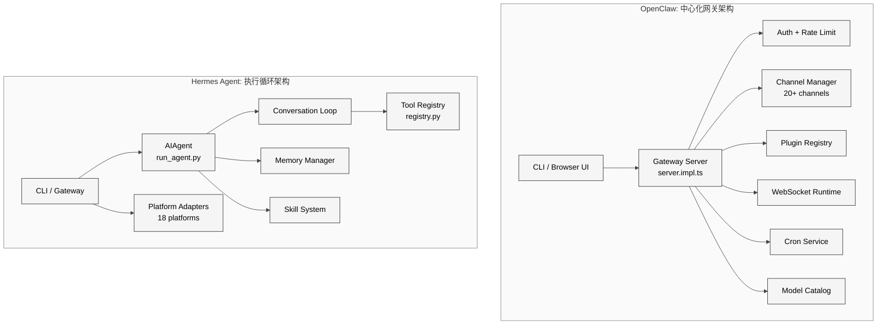
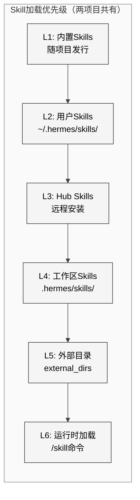
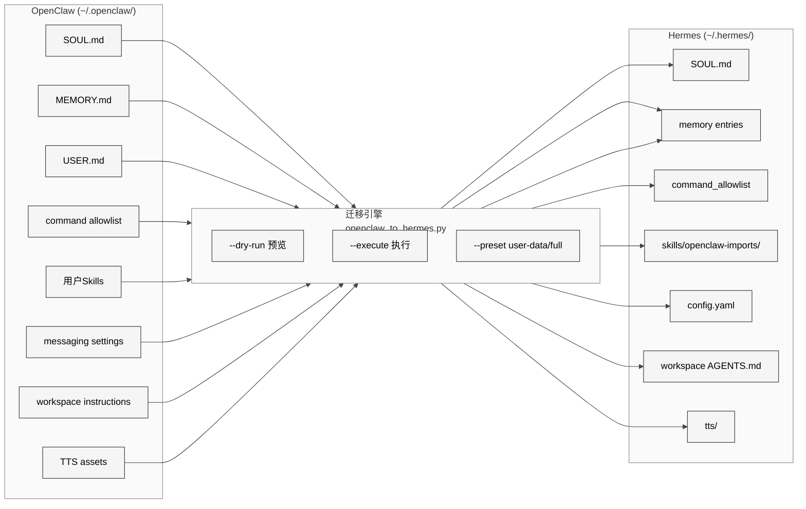

# 第26章 OpenClaw架构对比

## 24.1 引言

OpenClaw与Hermes Agent共享大量设计理念——两者均使用SKILL.md格式、AGENTS.md引导文件、以及分层的skill加载架构。但在工程实现上，两者走向了截然不同的技术路线：OpenClaw选择TypeScript构建中心化网关服务器，Hermes Agent选择Python构建轻量级执行循环。本章将从架构模式、技能系统、引导文件、工具注册、迁移桥接和通道覆盖六个维度展开对比分析。

## 24.2 架构模式对比：中心化网关 vs 执行循环

### 24.2.1 架构拓扑

<div style="background: #ffffff; padding: 16px; border-radius: 8px; margin: 16px 0;">



</div>

### 24.2.2 OpenClaw网关模式

OpenClaw的核心是`src/gateway/server.impl.ts`中的`startGatewayServer()`函数，这是一个超过850行的启动入口，负责编排以下子系统：

- **认证与限流**：通过`resolveGatewayAuth()`和`createAuthRateLimiter()`实现多模式认证（token、Tailscale等）
- **通道管理**：`createChannelManager()`统一管理20余个消息通道的生命周期
- **插件系统**：`prepareGatewayPluginBootstrap()`支持延迟加载的插件注册表
- **WebSocket运行时**：`attachGatewayWsHandlers()`处理实时双向通信
- **Cron调度**：`buildGatewayCronService()`提供定时任务能力
- **模型目录**：`loadGatewayModelCatalog()`管理多模型配置

这种设计的优势在于：所有客户端（CLI、浏览器控制台、移动端、消息通道）共享同一个有状态的网关进程，能够实现跨客户端的会话同步和统一的认证策略。

### 24.2.3 Hermes执行循环模式

Hermes Agent的核心是`run_agent.py`中的`AIAgent`类，采用经典的conversation loop模式：

```python
class AIAgent:
    def run_conversation(self, user_message):
        # 1. 构建系统提示（含Skills、Memory、环境信息）
        # 2. 调用LLM API
        # 3. 解析tool_calls → 分发到registry
        # 4. 将tool结果追加到messages
        # 5. 重复直到LLM返回无tool_call的回复
```

关键设计决策包括：
- **模块化导入**：从`agent/`包导入`ContextCompressor`、`SubdirectoryHintTracker`、`prompt_caching`等独立组件
- **工具系统外挂**：通过`model_tools.py`桥接`tools/registry.py`单例注册表
- **多后端适配**：支持OpenAI、Anthropic、Google、本地模型等多个Provider

| 维度 | OpenClaw | Hermes Agent |
|------|----------|-------------|
| 语言 | TypeScript | Python |
| 架构模式 | 有状态中心网关 | 无状态执行循环 |
| 入口文件 | `server.impl.ts` (857行) | `run_agent.py` (11000+行) |
| 进程模型 | 长驻daemon | 按需启动/长驻均可 |
| 客户端协议 | WebSocket + HTTP | stdin/stdout + HTTP API |
| 状态管理 | 网关内存 | 文件系统（MEMORY.md等） |
| 插件扩展 | TypeScript插件注册表 | Python工具文件自注册 |

## 24.3 Skill系统对比

### 24.3.1 共同标准

两个项目均采用agentskills.io定义的SKILL.md格式，使用YAML frontmatter存储元数据，markdown正文承载指令内容。这种选择并非偶然——两个项目都将Skill视为Agent的"程序性记忆"。

### 24.3.2 六级加载优先级

<div style="background: #ffffff; padding: 16px; border-radius: 8px; margin: 16px 0;">



</div>

Hermes Agent的skill加载实现在`tools/skills_tool.py`中，采用渐进式披露(Progressive Disclosure)架构：

- **Tier 1 — 元数据**：`skills_list()`仅返回名称和描述（≤64字符+≤1024字符），节省token消耗
- **Tier 2 — 完整内容**：`skill_view()`加载SKILL.md完整指令
- **Tier 3 — 关联文件**：`skill_view(name, file_path)`按需加载references/templates/scripts/assets子目录

Hermes的`scan_skill_commands()`函数（`agent/skill_commands.py`）扫描所有skill目录，将每个skill注册为`/skill-name`斜杠命令，支持平台过滤（macOS/Linux/Windows）和禁用列表。

### 24.3.3 Skill发现差异

| 特性 | OpenClaw | Hermes Agent |
|------|----------|-------------|
| 格式 | SKILL.md (agentskills.io) | SKILL.md (agentskills.io) |
| 渐进披露 | 支持 | 三层架构（metadata→content→files） |
| 斜杠命令 | `/skill-name` 调用 | `/skill-name` + frontmatter条件 |
| 平台过滤 | 支持 | `platforms: [macos, linux]` |
| 禁用控制 | 配置文件 | `config.yaml` disabled列表 |
| 配置注入 | — | `metadata.hermes.config`自动解析 |
| 预加载 | — | `--skill` CLI参数会话级预加载 |

## 24.4 引导文件对比

两个项目共享三个关键引导文件的概念，但用途侧重不同：

| 文件 | 用途 | OpenClaw | Hermes Agent |
|------|------|----------|-------------|
| `AGENTS.md` | 工作区级agent指令 | 工作区根目录 | 工作区根目录 + 终端工作目录 |
| `SOUL.md` | agent人格定义 | 全局persona | `~/.hermes/SOUL.md` 个性化身份 |
| `USER.md` | 用户画像 | 用户偏好存储 | 结构化记忆（偏好、风格、时区） |

Hermes Agent在`agent/prompt_builder.py`中构建系统提示时，按以下顺序合并这些文件：

1. `DEFAULT_AGENT_IDENTITY` — 内置默认身份
2. `SOUL.md` — 用户自定义人格覆盖
3. `MEMORY.md` + `USER.md` — 声明性记忆上下文
4. Skills系统提示 — 可用skill列表
5. 环境提示 — 平台、工具集、工作区信息

## 24.5 工具注册模式对比

### 24.5.1 Hermes: AST扫描自注册

Hermes Agent的工具注册采用独特的AST静态分析机制（`tools/registry.py`）：

```python
def _module_registers_tools(module_path: Path) -> bool:
    source = module_path.read_text(encoding="utf-8")
    tree = ast.parse(source, filename=str(module_path))
    return any(_is_registry_register_call(stmt) for stmt in tree.body)
```

`discover_builtin_tools()`扫描`tools/`目录下所有`.py`文件，通过AST检测模块顶层是否包含`registry.register()`调用，只导入那些确实注册了工具的模块。这种设计避免了不必要的依赖加载。

每个工具文件通过`registry.register()`在模块级别声明：

```python
registry.register(
    name="skill_manage",
    toolset="skills",
    schema=SKILL_MANAGE_SCHEMA,
    handler=lambda args, **kw: skill_manage(...),
    emoji="📝",
)
```

`ToolRegistry`类维护线程安全的单例注册表（使用`threading.RLock`），支持：
- **工具集分组**：通过`toolset`字段实现功能分组
- **可用性检查**：`check_fn`回调动态判断工具是否可用
- **MCP动态刷新**：支持运行时注销和重新注册（`deregister()`）
- **防遮蔽保护**：拒绝跨toolset的同名工具覆盖

### 24.5.2 OpenClaw: TypeScript插件注册表

OpenClaw使用`pluginRegistry`结合`coreGatewayHandlers`实现工具注册，其特点在于：
- 插件在网关启动时通过`prepareGatewayPluginBootstrap()`批量加载
- 延迟加载的通道插件通过`reloadDeferredGatewayPlugins()`按需激活
- 网关方法通过`GATEWAY_EVENTS`常量和`baseGatewayMethods`数组注册

| 维度 | OpenClaw | Hermes Agent |
|------|----------|-------------|
| 发现机制 | 显式配置 | AST扫描自动发现 |
| 注册时机 | 网关启动时 | 模块导入时（惰性） |
| 线程安全 | 事件循环单线程 | RLock互斥锁 |
| 动态更新 | 插件重载 | MCP nuke-and-repave |
| 遮蔽保护 | — | 跨toolset拒绝覆盖 |
| 序列化格式 | TypeScript类型 | OpenAI function schema |

## 24.6 迁移桥接分析

Hermes Agent提供了`hermes claw migrate`命令和完整的迁移skill（`optional-skills/migration/openclaw-migration/`，2794行），专门用于从OpenClaw迁移用户数据。

<div style="background: #ffffff; padding: 16px; border-radius: 8px; margin: 16px 0;">



</div>

迁移skill的`SKILL.md`定义了严格的交互协议：

1. **安全优先**：默认不迁移secrets，需`--migrate-secrets`显式授权
2. **冲突处理**：`--skill-conflict`支持skip/overwrite/rename三种策略
3. **原子性**：overwrite操作自动创建backup
4. **交互式决策**：使用`clarify`工具逐项确认冲突（SOUL.md → skill冲突 → 迁移模式 → workspace目标）
5. **结构化报告**：输出JSON格式的详细迁移报告

迁移覆盖范围映射表：

| OpenClaw资产 | Hermes目标 | 迁移类别 |
|-------------|-----------|---------|
| `SOUL.md` | `~/.hermes/SOUL.md` | soul |
| `MEMORY.md` | memory entries | memory |
| `USER.md` | user-profile entries | user-profile |
| command approval | `command_allowlist` | command-allowlist |
| `TELEGRAM_*` 设置 | `config.yaml` | messaging-settings |
| 用户skills | `skills/openclaw-imports/` | skills |
| workspace指令 | 目标workspace `AGENTS.md` | workspace-agents |
| `workspace/tts/` | `~/.hermes/tts/` | tts-assets |

## 24.7 通道覆盖对比

### 24.7.1 Hermes Agent平台列表

Hermes Agent在`gateway/platforms/`目录下实现了18个消息平台适配器：

| 平台 | 文件 | 备注 |
|------|------|------|
| Telegram | `telegram.py` | 含`telegram_network.py`网络层 |
| Discord | `discord.py` | — |
| Slack | `slack.py` | — |
| WhatsApp | `whatsapp.py` | — |
| Signal | `signal.py` | — |
| Matrix | `matrix.py` | — |
| Email | `email.py` | — |
| SMS | `sms.py` | — |
| WeChat (微信) | `weixin.py` | — |
| WeCom (企业微信) | `wecom.py` | 含`wecom_callback.py`、`wecom_crypto.py` |
| Feishu (飞书) | `feishu.py` | — |
| DingTalk (钉钉) | `dingtalk.py` | — |
| QQ Bot | `qqbot.py` | — |
| Mattermost | `mattermost.py` | — |
| BlueBubbles | `bluebubbles.py` | iMessage桥接 |
| Home Assistant | `homeassistant.py` | IoT场景 |
| Webhook | `webhook.py` | 通用HTTP回调 |
| API Server | `api_server.py` | RESTful API |

所有适配器继承`base.py`中的公共基类，遵循统一的消息收发接口。

### 24.7.2 OpenClaw通道系统

OpenClaw在`src/channels/plugins/`下拥有129个TypeScript文件的庞大通道框架，通过`catalog.ts`和`bundled-ids.ts`管理通道注册表。其架构特点包括：

- **配对系统**：`pairing.ts`、`pairing-adapters.ts`实现设备配对协议
- **会话绑定**：`binding-routing.ts`、`configured-binding-compiler.ts`等实现复杂的会话路由
- **组策略**：`group-policy-warnings.ts`、`setup-group-access.ts`处理群组访问控制
- **消息能力矩阵**：`message-capabilities.ts`定义各通道的能力差异

| 维度 | OpenClaw | Hermes Agent |
|------|----------|-------------|
| 通道数量 | 20+ | 18 |
| 实现语言 | TypeScript | Python |
| 架构风格 | 插件化+配对绑定 | 适配器模式（继承基类） |
| 中国本土通道 | 部分 | 微信/企业微信/飞书/钉钉/QQ |
| IoT | — | Home Assistant |
| 配置方式 | 网关配置 | `config.yaml` + 环境变量 |
| 文件规模 | 129文件 | 25文件 |

## 24.8 小结

OpenClaw与Hermes Agent代表了Agent架构的两种有效范式。OpenClaw的中心化网关模式适合需要统一管控、多客户端同步、以及复杂认证策略的企业场景；Hermes Agent的执行循环模式更适合轻量部署、快速迭代、以及对中国本土消息平台有深度需求的场景。

两者在skill系统标准上的趋同（agentskills.io SKILL.md格式、六级加载优先级、渐进式披露）表明Agent生态正在形成共识。而Hermes提供的OpenClaw迁移桥接（2794行的migration skill）则清晰地表明了生态迁移路径——从用户视角看，从OpenClaw切换到Hermes的成本被控制在一条CLI命令之内。
