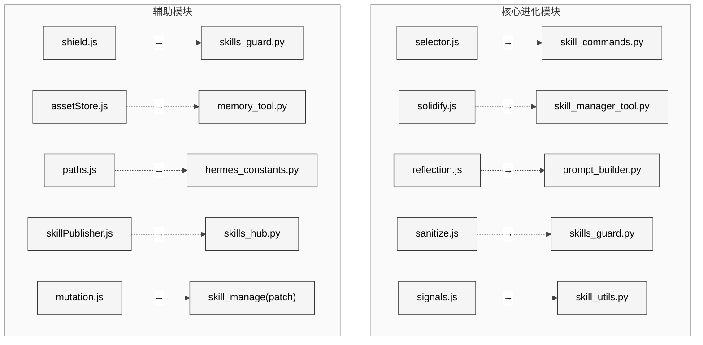
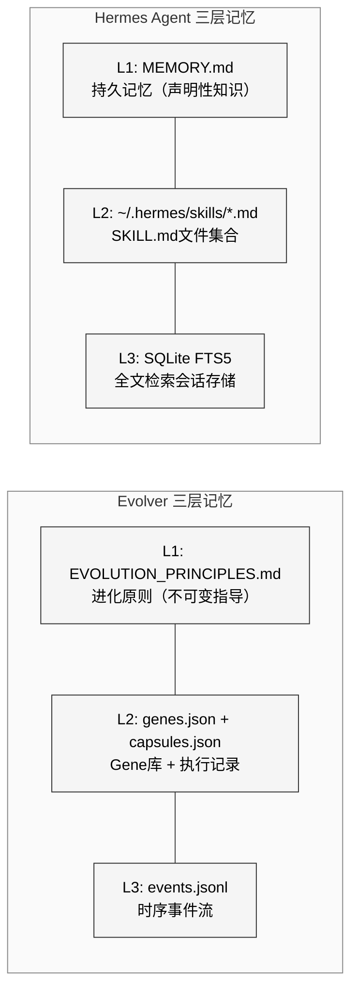
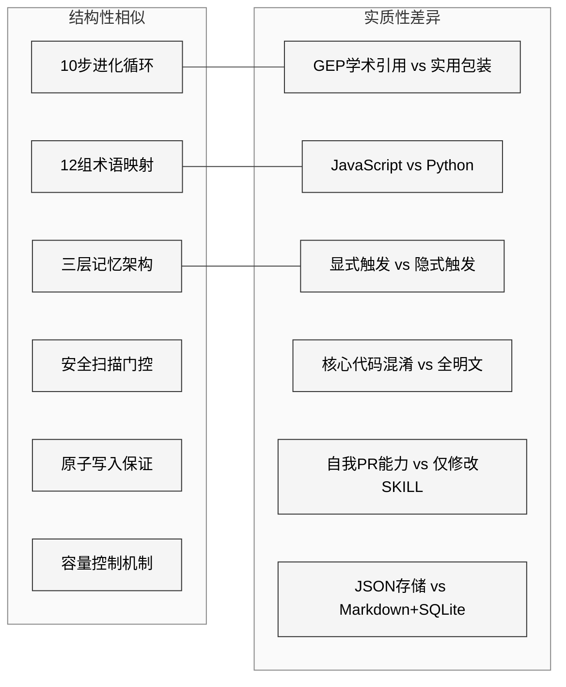

# 第27章 EvoMap-Evolver对比

## 25.1 引言

本章是对比分析部分最关键的一章。EvoMap Evolver（以下简称Evolver）是一个基于遗传表达式编程(GEP)思想的Agent自我进化引擎，于2026年2月1日公开发布。Hermes Agent的self-evolution模块在36天后（2026年3月9日）创建。两者在进化循环结构、术语体系、模块映射和设计模式上呈现出高度的系统性对应关系。本章将从代码层面逐一对比，既呈现相似性的证据，也分析差异性的原因。

## 25.2 时间线与背景

| 事件 | 日期 | 间隔 |
|------|------|------|
| Evolver公开发布 | 2026-02-01 | — |
| Hermes self-evolution仓库创建 | 2026-03-09 | +36天 |
| Hermes首次包含evolve功能的提交 | 2026-03-09 | +36天 |

Evolver以Node.js实现，仓库结构为147个JS文件，其中`src/gep/`目录包含50个模块。Hermes Agent使用Python实现，self-evolution相关功能分布在`tools/skill_manager_tool.py`、`tools/skills_guard.py`、`agent/skill_commands.py`等文件中。

## 25.3 十步进化循环对比

这是两个系统最核心的对应关系。Evolver的`src/evolve.js`中的`run()`函数实现了一个完整的10步进化循环，Hermes的对应逻辑分散在多个模块中但结构高度一致。

<div style="background-color: #ffffff; padding: 16px; border-radius: 8px; margin: 16px 0;" bgcolor="#ffffff">


</div>

### 逐步详细对比

| 步骤 | Evolver | Hermes Agent | 对应说明 |
|------|---------|-------------|---------|
| 1. 加载历史 | `assetStore.js`读取`events.jsonl` | `memory_tool.py`读取`MEMORY.md` | JSONL → Markdown |
| 2. 计算信号 | `signals.js`从事件计算`signals[]` | `skill_utils.py`解析frontmatter条件 | 信号匹配 → 条件匹配 |
| 3. 反思门控 | `reflection.js`周期触发 | 15次tool-call后自动评估 | 周期触发 → 阈值触发 |
| 4. 选择目标 | `selector.js`按fitness选Gene | `skills_list()`+`skill_view()` | 适应度选择 → 渐进披露 |
| 5. 构建提示 | `prompt.js`拼接上下文 | `prompt_builder.py`构建系统提示 | 功能等价 |
| 6. 执行模型 | LLM API调用 | `run_conversation()`循环 | 均为LLM执行 |
| 7. 评估结果 | `candidateEval.js`多维评分 | tool结果解析+失败检测 | 结构化评估 |
| 8. 固化结果 | `solidify.js`写入Gene/Capsule | `skill_manage(action='patch')` | 基因固化 → skill补丁 |
| 9. 记录事件 | `assetStore.js`追加event | `memory_tool.py`写入记忆 | 事件日志 → 记忆条目 |
| 10. 更新叙事 | `narrativeMemory.js`更新叙事 | `ContextCompressor`压缩上下文 | 叙事 → 上下文压缩 |

## 25.4 术语系统性映射

两个系统之间存在12组系统性的术语替换关系。这种一一对应不是巧合，而是设计级别的概念迁移：

| 序号 | Evolver术语 | Hermes术语 | 语义 |
|------|------------|-----------|------|
| 1 | Gene | SKILL.md | 可执行知识单元 |
| 2 | Capsule | execution record | 执行记录/结果封装 |
| 3 | `solidify()` | `skill_manage()` | 将成功经验固化为持久知识 |
| 4 | `signals_match()` | frontmatter条件 | 触发条件匹配 |
| 5 | Selector | `skills_list`+`skill_view` | 知识单元发现与选择 |
| 6 | `mutation()` | `skill_manage(patch)` | 知识变异/增量修改 |
| 7 | `reflection()` | 15-tool-call评估 | 周期性自我反思 |
| 8 | `EVOLUTION_PRINCIPLES.md` | `MEMORY.md` | 持久化指导原则 |
| 9 | `events.jsonl` | SQLite FTS5 | 事件/记忆存储后端 |
| 10 | `sanitize()` | `skills_guard.py` | 安全清洗/扫描 |
| 11 | fitness score | skill使用频率/成功率 | 适应度评估 |
| 12 | `shield.js` | `skills_guard.py` | 安全防护层 |

## 25.5 模块级映射

<div style="background-color: #ffffff; padding: 16px; border-radius: 8px; margin: 16px 0;" bgcolor="#ffffff">



</div>

### 25.5.1 selector.js → skill_commands.py

Evolver的`selector.js`（12万+字符，已混淆）负责从Gene池中按适应度选择最优Gene。其核心逻辑包括：
- 从`genes.json`加载所有Gene
- 根据历史event计算每个Gene的fitness分数
- 考虑`ban_gene`信号排除表现差的Gene
- 按概率权重选择执行目标

Hermes的`agent/skill_commands.py`实现了对应的skill发现功能：

```python
def scan_skill_commands() -> Dict[str, Dict[str, Any]]:
    for scan_dir in dirs_to_scan:
        for skill_md in scan_dir.rglob("SKILL.md"):
            content = skill_md.read_text(encoding='utf-8')
            frontmatter, body = _parse_frontmatter(content)
            if not skill_matches_platform(frontmatter):
                continue
            # 注册为斜杠命令
            _skill_commands[f"/{cmd_name}"] = {...}
```

### 25.5.2 solidify.js → skill_manager_tool.py

Evolver的`solidify.js`（同样被混淆）负责将成功的执行结果固化为新的Gene或更新现有Gene。Hermes的`skill_manager_tool.py`提供了等价功能：

```python
def skill_manage(action, name, content=None, ...):
    if action == "create":
        result = _create_skill(name, content, category)
    elif action == "patch":
        result = _patch_skill(name, old_string, new_string, ...)
```

关键的对等设计包括：
- **原子写入**：Evolver使用临时文件+rename，Hermes使用`_atomic_write_text()`（`tempfile.mkstemp` → `os.replace`）
- **安全扫描**：写入后立即扫描，失败则回滚
- **容量控制**：Evolver限制Gene数量，Hermes限制`MAX_SKILL_CONTENT_CHARS = 100,000`

### 25.5.3 reflection.js → 15-tool-call评估

Evolver的`reflection.js`（已混淆）导出`shouldReflect()`和`buildReflectionPrompt()`函数，决定何时触发反思循环。其判断依据包括：
- 循环次数是否达到阈值
- 最近事件的成功/失败比率
- `reflection_log.jsonl`的时间戳间隔

Hermes将反思逻辑编码为tool-call计数阈值——当一次对话中工具调用次数超过15次时，系统自动评估当前策略是否有效。

## 25.6 三层记忆对比

<div style="background-color: #ffffff; padding: 16px; border-radius: 8px; margin: 16px 0;" bgcolor="#ffffff">



</div>

### 层级对比详表

| 层级 | 功能 | Evolver实现 | Hermes实现 |
|------|------|------------|-----------|
| L1 长期指导 | 不变的进化原则/记忆 | `EVOLUTION_PRINCIPLES.md`<br/>位于`assets/gep/`或仓库根 | `MEMORY.md` + `USER.md`<br/>位于`~/.hermes/memory/` |
| L2 程序性知识 | 可执行的技能/基因 | `genes.json` + `capsules.json`<br/>JSON格式，含fitness字段 | `~/.hermes/skills/*/SKILL.md`<br/>Markdown格式，含YAML frontmatter |
| L3 事件溯源 | 时序事件流/会话记录 | `events.jsonl`<br/>每行一个JSON事件 | SQLite FTS5全文搜索<br/>`session_search`工具 |

路径解析方面，Evolver通过`src/gep/paths.js`统一管理：

```javascript
function getEvolutionDir() {
    const baseDir = process.env.EVOLUTION_DIR 
        || path.join(getMemoryDir(), 'evolution');
    const scope = getSessionScope();
    if (scope) return path.join(baseDir, 'scopes', scope);
    return baseDir;
}

function getEvolutionPrinciplesPath() {
    const custom = path.join(repoRoot, 'EVOLUTION_PRINCIPLES.md');
    if (fs.existsSync(custom)) return custom;
    return path.join(repoRoot, 'assets', 'gep', 'EVOLUTION_PRINCIPLES.md');
}
```

Hermes通过`hermes_constants.py`的`get_hermes_home()`、`get_skills_dir()`等函数实现等价的路径管理。

## 25.7 设计模式对比

### 25.7.1 多维评分

Evolver在`candidateEval.js`中实现多维评分系统，从多个维度评估执行结果。`reflection.js`中的`computeEventScoring()`函数提供信号评估：

- 停滞检测：`plateau`信号
- 失败连胜：`consecutive_failures`
- 饱和检测：high solidify ratio

Hermes通过`_detect_tool_failure()`（`agent/display.py`）实现类似的结果评估。

### 25.7.2 约束门控

Evolver通过`signals.js`的信号系统实现约束门控——当检测到`ban_gene`、`plateau`或`errors_detected`信号时，进化循环会调整策略或跳过特定Gene。

Hermes的约束体现在`skill_manager_tool.py`中：
- 名称验证：`VALID_NAME_RE`正则匹配
- 内容大小限制：`MAX_SKILL_CONTENT_CHARS = 100,000`
- Frontmatter完整性：`_validate_frontmatter()`强制要求name和description字段
- 路径安全：`_validate_file_path()`防止目录遍历

### 25.7.3 安全扫描

两个系统都在知识写入后执行安全扫描：

**Evolver `sanitize.js`**（120行，明文）：
```javascript
const REDACT_PATTERNS = [
    /sk-[A-Za-z0-9]{20,}/g,          // OpenAI keys
    /ghp_[A-Za-z0-9]{36,}/g,          // GitHub tokens
    /AKIA[0-9A-Z]{16}/g,              // AWS keys
    /\/Users\/[^\s"',;)}\]]+/g,        // macOS paths
    /\/home\/[^\s"',;)}\]]+/g,         // Linux paths
    // ...
];
function sanitizePayload(capsule) {
    return JSON.parse(JSON.stringify(capsule), (_key, value) => {
        if (typeof value === 'string') return redactString(value);
        return value;
    });
}
```

**Hermes `skills_guard.py`**（929行）：
```python
THREAT_PATTERNS = [
    (r'curl\s+[^\n]*\$\{?\w*(KEY|TOKEN|SECRET|PASSWORD)',
     "env_exfil_curl", "critical", "exfiltration", ...),
    (r'ghp_[A-Za-z0-9]{36}|github_pat_[A-Za-z0-9_]{80,}',
     "github_token_leaked", "critical", "credential_exposure", ...),
    # ... 80+个模式
]
```

两者的关键差异在于：

| 维度 | Evolver sanitize.js | Hermes skills_guard.py |
|------|--------------------|-----------------------|
| 功能定位 | 发布前脱敏 | 安装时安全扫描 |
| 模式数量 | ~15个正则 | 80+个威胁模式 |
| 判定级别 | 替换为[REDACTED] | 四级严重度(critical/high/medium/low) |
| 信任分级 | — | builtin/trusted/community/agent-created |
| 结构检查 | — | 文件数/大小/二进制/符号链接检查 |
| Unicode注入 | — | 17种不可见字符检测 |
| 策略矩阵 | — | `INSTALL_POLICY`×verdict交叉矩阵 |

### 25.7.4 原子写入

两个系统均实现了原子写入保证：

Evolver通过`solidify.js`中的临时文件+重命名模式，Hermes通过`_atomic_write_text()`：

```python
def _atomic_write_text(file_path: Path, content: str):
    fd, temp_path = tempfile.mkstemp(
        dir=str(file_path.parent),
        prefix=f".{file_path.name}.tmp.",
    )
    try:
        with os.fdopen(fd, "w", encoding=encoding) as f:
            f.write(content)
        os.replace(temp_path, file_path)
    except Exception:
        os.unlink(temp_path)
        raise
```

### 25.7.5 容量控制

Evolver通过Gene池大小和capsule保留策略控制膨胀。Hermes通过多个层面控制：
- `MAX_SKILL_CONTENT_CHARS = 100,000`（约36k token）
- `MAX_SKILL_FILE_BYTES = 1,048,576`（1 MiB）
- `MAX_FILE_COUNT = 50`（skills_guard.py结构检查）
- `MAX_TOTAL_SIZE_KB = 1024`（1MB总量限制）

## 25.8 差异性分析

尽管存在大量对应关系，两个系统在以下方面存在实质性差异：

### 25.8.1 学术引用

Evolver明确引用了GEPA(Genetic Expression Programming for Agents)和DSPy学术框架。`src/gep/`目录名直接来源于GEP概念。`skillPublisher.js`在生成的SKILL.md中标注：

```javascript
lines.push('*This Skill was generated by [Evolver](https://github.com/autogame-17/evolver)...*');
```

Hermes Agent没有使用GEP术语，而是将进化概念重新包装为更实用的"程序性记忆管理"（skill management）。

### 25.8.2 技术栈差异

| 维度 | Evolver | Hermes Agent |
|------|---------|-------------|
| 语言 | Node.js (JavaScript) | Python |
| 数据格式 | JSON (genes.json, capsules.json) | Markdown (SKILL.md) + SQLite |
| 代码保护 | 核心模块混淆（evolve.js, solidify.js, selector.js, reflection.js, shield.js） | 全部明文 |
| 包管理 | npm | pip/uv |
| 事件存储 | events.jsonl (append-only) | SQLite FTS5 (可检索) |

### 25.8.3 触发机制

Evolver采用显式的进化循环触发——通过`idleScheduler.js`检测空闲时间或通过CLI命令手动触发进化。

Hermes的skill进化是隐式触发的：
- 当agent在对话中发现现有skill不够准确，会主动调用`skill_manage(action='patch')`修正
- `SKILL_MANAGE_SCHEMA`的description指导agent何时更新：*"Update when: instructions stale/wrong, OS-specific failures, missing steps or pitfalls found during use"*

### 25.8.4 代码混淆

Evolver的核心模块（`evolve.js`、`solidify.js`、`selector.js`、`reflection.js`、`shield.js`）均经过JavaScript混淆处理，使用`_0x`前缀的变量名和字符串编码。而辅助模块（`paths.js`、`sanitize.js`、`signals.js`、`taskReceiver.js`等）保持明文。

这种选择性混淆策略暗示：被混淆的模块包含Evolver视为核心IP的算法逻辑，而辅助模块的开放则方便社区贡献和调试。

### 25.8.5 自我PR能力

Evolver独有的`selfPR.js`模块允许进化引擎修改自身代码并自动创建Pull Request：

```javascript
const PROTECTED_SELF_EVOLUTION_PATHS = [
    'src/evolve.js',
    'src/gep/selector.js',
    'src/gep/solidify.js',
    'src/gep/reflection.js',
];
```

Hermes Agent目前没有等价的自我代码修改能力——其skill_manage仅修改SKILL.md内容，不触及agent自身代码。

## 25.9 综合评估

<div style="background-color: #ffffff; padding: 16px; border-radius: 8px; margin: 16px 0;" bgcolor="#ffffff">



</div>

两个系统的关系可以总结为：**Hermes Agent对Evolver进行了从GEP学术框架到实用Agent Skill管理系统的概念迁移**。12组系统性术语替换、10步循环的结构对应、以及三层记忆的同构设计，共同构成了一个完整的"翻译"——将遗传编程的生物学隐喻翻译为软件工程的日常语言。

从工程质量角度看，Hermes在安全扫描（80+模式 vs 15模式）、信任分级（四级策略矩阵）、以及存储后端（SQLite FTS5全文检索 vs JSONL追加写入）方面做了显著增强。但Evolver在自我进化的纯粹性上更为彻底——它允许修改自身代码并自动创建PR，这是Hermes目前不具备的能力。
