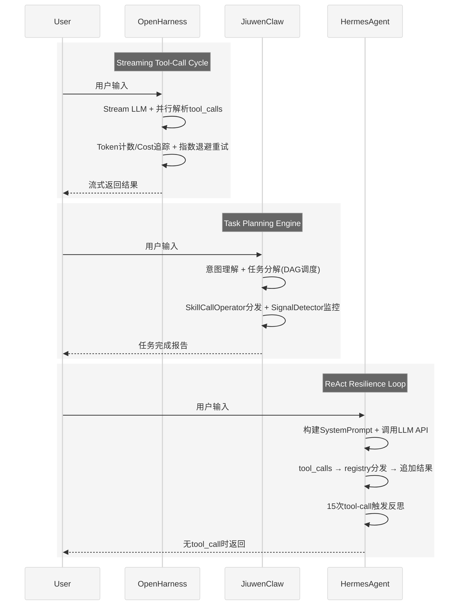
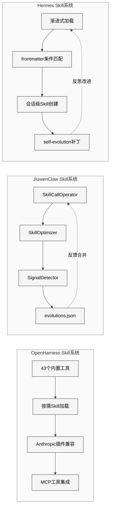
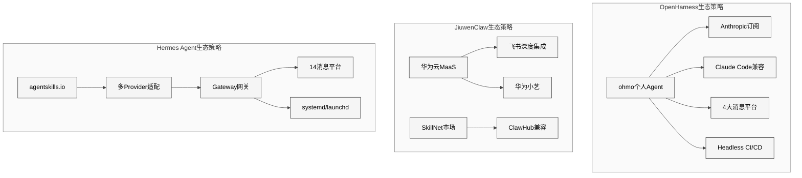

# 第28章 OpenHarness与JiuwenClaw对比

## 28.1 引言

在OpenClaw引领了开源AI Agent harness风潮之后，2026年第一季度涌现出多个同类项目。本章聚焦其中两个具有代表性的后发者——**OpenHarness**（HKUDS/OpenHarness，GitHub Stars 9,884）和**JiuwenClaw**（openJiuwen-ai/jiuwenclaw，GitHub Stars 398），将它们与Hermes Agent进行系统性的代码级对比分析。

三个项目的背景截然不同：

- **OpenHarness**由香港大学数据科学实验室（HKUDS）开发，走学术严谨路线，以Claude Code兼容为核心设计目标，内置个人Agent "ohmo"，最新版本v0.1.6（2026年4月10日）已支持auto-compaction和headless worker模式。
- **JiuwenClaw**由openJiuwen-ai团队构建，面向中国企业生态，深度整合华为云MaaS和飞书平台，以智能任务规划和Skill自进化为核心卖点，采用Apache 2.0协议开源。
- **Hermes Agent**以社区驱动和自我改进为差异化定位，支持14个消息平台、SQLite FTS5记忆引擎、多维度自进化系统。

本章将按照七维度框架——项目定位、Agent Loop、Skill系统、记忆管理、安全模型、平台集成、设计哲学——逐一展开对比，揭示三种Agent哲学在代码实现中的具体体现。

## 28.2 项目定位与技术路线对比

### 28.2.1 三个项目的核心定位

```mermaid
%%{init: {'theme': 'neutral', 'themeVariables': {'background': '#ffffff', 'primaryColor': '#f5f5f5', 'primaryTextColor': '#000000', 'primaryBorderColor': '#333333', 'lineColor': '#444444', 'textColor': '#000000', 'mainBkg': '#f5f5f5', 'nodeBorder': '#333333', 'clusterBkg': '#fafafa', 'clusterBorder': '#888888', 'edgeLabelBackground': '#ffffff'}}}%%
graph TD
    subgraph openHarness["OpenHarness -- 学术Harness"]
        OH1["Claude Code兼容层"]
        OH2["Streaming工具循环"]
        OH3["ohmo个人Agent"]
        OH4["React TUI终端"]
        OH1 --> OH2
        OH2 --> OH3
        OH3 --> OH4
    end

    subgraph jiuwenClaw["JiuwenClaw -- 企业Agent"]
        JC1["华为云MaaS集成"]
        JC2["任务规划引擎"]
        JC3["Skill自进化"]
        JC4["飞书原生支持"]
        JC1 --> JC2
        JC2 --> JC3
        JC3 --> JC4
    end

    subgraph hermesAgent["Hermes Agent -- 自改进Agent"]
        HA1["社区驱动生态"]
        HA2["ReAct韧性循环"]
        HA3["多维自进化引擎"]
        HA4["14平台Gateway"]
        HA1 --> HA2
        HA2 --> HA3
        HA3 --> HA4
    end
```

<div style="background-color: #ffffff; padding: 16px; border-radius: 8px; margin: 16px 0;" bgcolor="#ffffff">



</div>

### 28.2.2 技术选型全景对比

| 维度 | OpenHarness | JiuwenClaw | Hermes Agent |
|------|------------|------------|-------------|
| 语言 | Python | Python (79.9%) | Python |
| Stars | 9,884 | 398 | — |
| 开源协议 | MIT | Apache 2.0 | 自定义 |
| 首次发布 | 2026年Q1 | 2026-03-05 | 2026-03-09 |
| 最新版本 | v0.1.6 (2026-04-10) | — | 持续更新 |
| 核心架构 | Streaming tool-call循环 | 任务规划引擎 | ReAct conversation loop |
| 主要用户群 | 学术研究者、Claude Code用户 | 华为生态企业 | 开源社区开发者 |
| 模型支持 | Claude (Anthropic订阅) | 华为云MaaS、通用模型 | OpenAI、Anthropic、Google、本地模型 |
| 平台重心 | CLI终端 + ohmo Bot | 飞书、华为小艺 | 14个消息平台 + Gateway |
| 部署模式 | 本地CLI / headless worker | 自托管部署 | 本地 / systemd / launchd |
| 工具数量 | 43个内置工具 | Skill驱动 | registry.py注册表 |
| Skill标准 | SKILL.md / agentskills.io | SKILL.md / SkillNet | SKILL.md / agentskills.io |

### 28.2.3 GitHub仓库概况

- **OpenHarness**: `github.com/HKUDS/OpenHarness`，描述为"Open Agent Harness with a Built-in Personal Agent--Ohmo!"，Python实现，社区活跃度高，v0.1.6引入auto-compaction和Markdown rendering in React TUI
- **JiuwenClaw**: `github.com/openJiuwen-ai/jiuwenclaw`，描述为"JiuwenClaw is an intelligent AI Agent built on openJiuwen"，Python 79.9%，面向企业级AI Agent场景
- **Hermes Agent**: 社区驱动的自改进Agent项目，`run_agent.py`达11,487行，以韧性工程和渐进式上下文管理为核心

三个项目都选择了Python作为主要语言，这与AI Agent生态中Python的统治地位一致——LLM SDK（openai、anthropic）、数据处理（pandas、numpy）、Web框架（Flask、FastAPI）均以Python为第一公民。但三者在架构模式上的分歧反映了不同的价值取向。

值得注意的是，OpenHarness的Stars数量（9,884）几乎是JiuwenClaw（398）的25倍。这一差距部分归因于HKU团队的学术影响力——论文引用带来的GitHub流量是普通开源项目难以企及的；部分归因于Claude Code兼容性带来的自然流量——搜索Claude Code替代方案的用户会被引导到OpenHarness。而JiuwenClaw的低Stars数则反映了华为生态内部署为主、外部推广不足的现实。

### 28.2.4 版本演进节奏

| 指标 | OpenHarness | JiuwenClaw | Hermes Agent |
|------|------------|------------|-------------|
| 首次公开 | 2026 Q1 | 2026-03-05 | 2026-03-09 |
| 截至分析日的版本 | v0.1.6 | 无公开版本号 | 持续滚动更新 |
| 发版频率 | 约每2周一个patch | 不定期 | 持续提交 |
| Changelog风格 | 结构化Release Notes | README更新 | 提交历史 |
| v0.1.6亮点 | auto-compaction, headless worker, React TUI | — | — |

OpenHarness采用语义化版本（SemVer），每个Release都附带结构化的Changelog，这在学术开源项目中并不常见——通常学术代码的版本管理远不如产业项目规范。JiuwenClaw目前没有公开的版本号体系，更像是"trunk-based development"模式，主分支即最新版本。Hermes Agent采用持续滚动更新，不发布正式版本号。

## 28.3 Agent Loop实现对比

Agent Loop是AI Agent的心脏——它决定了Agent如何接收输入、调用工具、处理错误、返回结果。三个项目在这一核心机制上的实现差异最能体现设计哲学的不同。

### 28.3.1 三种Loop架构总览

<div style="background-color: #ffffff; padding: 16px; border-radius: 8px; margin: 16px 0;" bgcolor="#ffffff">



</div>

### 28.3.2 OpenHarness: Streaming Tool-Call Cycle

OpenHarness的Agent Loop围绕**流式工具调用循环**构建，核心特性包括：

**并行工具执行**：当LLM一次返回多个tool_calls时，OpenHarness不是串行执行，而是并行分发所有工具调用，等待全部完成后再将结果合并送回LLM。这种设计在涉及多文件读取、多API查询等场景下能显著降低延迟。

**API重试与指数退避**：OpenHarness实现了完整的API异常处理链——遇到rate limit（429）、服务不可用（503）等错误时，自动按指数退避策略重试，而非直接向用户报错。

**Token计数与Cost追踪**：每轮循环结束后，OpenHarness会累计input/output tokens并计算费用。这对学术研究场景尤为重要——研究者需要精确控制实验成本。

**流式响应**：LLM的回复以streaming方式输出到React TUI终端，用户在等待长回复时能看到逐字生成过程，改善了交互体验。

### 28.3.3 JiuwenClaw: Task Planning Engine

JiuwenClaw的Loop与OpenHarness和Hermes有本质区别——它不是简单的LLM-Tool循环，而是一个**任务规划引擎**：

**意图理解与任务分解**：用户输入首先经过意图理解层，被分解为有向无环图（DAG）形式的子任务序列。每个子任务标注了优先级、依赖关系和预期输出格式。

**中断/插入/重排**：JiuwenClaw的任务队列支持运行时修改——用户可以中断当前任务、插入紧急任务、或者重新排列任务优先级。这是典型的企业场景需求，在实际工作中用户的需求经常变化。

**SkillCallOperator分发**：任务到达执行阶段后，由SkillCallOperator决定调用哪个Skill、传递哪些参数、以什么顺序执行。

**状态维护**：每个任务都有明确的状态（pending、running、completed、failed），SkillOptimizer和SignalDetector在后台监控任务执行情况。

### 28.3.4 Hermes Agent: ReAct Resilience Loop

Hermes Agent的`run_agent.py`实现了经典的ReAct循环，但加入了大量韧性工程措施：

```python
# Hermes Agent核心循环伪代码
class AIAgent:
    def run_conversation(self, user_message):
        messages = self.build_messages(user_message)
        tool_call_count = 0
        while True:
            response = self.call_llm(messages)
            if not response.tool_calls:
                return response.content
            for tool_call in response.tool_calls:
                result = self.registry.execute(tool_call)
                messages.append(tool_result(result))
                tool_call_count += 1
            if tool_call_count >= 15:
                self.trigger_reflection()
```

关键韧性机制包括：
- **15次tool-call反思门控**：防止Agent陷入无效循环
- **上下文压缩**：`ContextCompressor`在messages过长时自动压缩历史
- **渐进式Skill加载**：只在需要时加载Skill，避免一次性消耗过多context window
- **多Provider容错**：支持在OpenAI、Anthropic、Google等多个后端之间failover

### 28.3.5 Agent Loop对比表

| 维度 | OpenHarness | JiuwenClaw | Hermes Agent |
|------|------------|------------|-------------|
| 循环类型 | Streaming tool-call cycle | Task planning engine | ReAct conversation loop |
| 工具执行 | 并行执行 | SkillCallOperator串行 | 串行逐个执行 |
| 错误处理 | 指数退避自动重试 | 任务状态标记failed | 韧性工程 + 多Provider容错 |
| 流式输出 | 原生支持 | 视平台而定 | 支持 |
| 反思机制 | 未明确公开 | SignalDetector监控 | 15次tool-call自动反思 |
| Token管理 | 内置计数 + 费用追踪 | 未明确公开 | ContextCompressor自动压缩 |
| 中断支持 | 未明确 | 原生支持中断/插入/重排 | 未原生支持 |
| 代码规模 | 模块化，分布在多文件 | 任务引擎 + Skill层 | run_agent.py 11,487行 |

## 28.4 Skill系统对比

Skill系统是AI Agent的"程序性记忆"——它决定了Agent拥有哪些能力、如何发现和加载这些能力、以及如何从经验中学习新能力。三个项目在这一维度上的设计差异尤为突出。

### 28.4.1 共同基础：SKILL.md标准

三个项目都采用或兼容agentskills.io定义的SKILL.md格式：

```markdown
---
name: example-skill
description: 技能描述
---
# Skill标题
## 使用说明
具体指令内容...
```

YAML frontmatter存储元数据（名称、描述、触发条件），Markdown正文承载Agent在执行时需要遵循的详细指令。这种"文档即代码"的设计是当前Agent生态的事实标准。

### 28.4.2 OpenHarness: 按需加载与插件生态

OpenHarness的Skill系统围绕**按需加载**和**插件生态兼容**设计：

**43个内置工具**：OpenHarness出厂即带File、Shell、Search、Web、MCP五大类共43个工具。这种"丰富默认"的策略降低了用户上手门槛——不需要额外安装就能完成大部分编程任务。

**按需Skill加载**：与Hermes的渐进式加载类似，OpenHarness不会一次性将所有Skill注入system prompt，而是根据当前任务上下文动态选择相关Skill加载。

**插件生态兼容**：OpenHarness的plugin ecosystem设计兼容Anthropic官方的skills和plugins标准。这意味着为Claude Code开发的第三方插件可以在OpenHarness中直接使用，大幅扩展了可用能力范围。

### 28.4.3 JiuwenClaw: 三层Skill架构

JiuwenClaw的Skill系统是三个项目中最具创新性的设计——它实现了一个**三层自进化架构**：

```
SkillCallOperator  →  技能调用调度层（决定调用哪个Skill）
SkillOptimizer     →  技能优化层（分析执行结果，提出改进建议）
SignalDetector     →  信号检测层（监控失败/纠正信号）
```

**进化闭环**：当SignalDetector检测到Skill执行失败或用户纠正行为时，会生成信号写入`evolutions.json`。SkillOptimizer周期性消费这些信号，对Skill文档提出修改建议，修改经过验证后合并回Skill文档正文。

这与Hermes Agent的自进化机制（第10章详述）在设计模式上高度一致，但JiuwenClaw将其拆分为三个独立组件，职责划分更清晰。

### 28.4.4 Hermes Agent: 渐进加载与会话进化

Hermes Agent的Skill系统兼具加载优化和运行时进化：

**渐进式加载**：`skill_utils.py`中实现了基于frontmatter条件的Skill匹配算法——首先评估`when`条件（如文件类型、项目语言），匹配成功的Skill才注入system prompt。这避免了context window的浪费。

**会话级Skill创建**：Hermes独有的`/skill create`命令允许Agent在当前会话中从经验创建新Skill。比如Agent在解决一个复杂的调试问题后，可以将解决步骤固化为新的Skill文档。

**自进化引擎**：15次tool-call反思门控与`skill_manage(action='patch')`配合，实现了"执行-反思-改进"闭环。

### 28.4.5 Skill生命周期对比

Skill从创建到退役的完整生命周期在三个项目中有着不同的阶段划分：

**OpenHarness的Skill生命周期**：
1. **发现**：通过插件市场或Anthropic生态浏览可用Skill
2. **安装**：`skill install`命令下载到本地
3. **加载**：运行时按需注入system prompt
4. **执行**：Agent调用Skill中描述的能力
5. **更新**：手动拉取新版本

**JiuwenClaw的Skill生命周期**：
1. **发现**：SkillNet市场或ClawHub浏览
2. **安装**：安装到本地Skill目录
3. **调度**：SkillCallOperator决定何时调用
4. **执行**：按任务规划引擎的调度执行
5. **监控**：SignalDetector持续监控执行质量
6. **进化**：SkillOptimizer分析evolutions.json，提出改进
7. **合并**：优化建议经验证后合并回Skill文档

**Hermes Agent的Skill生命周期**：
1. **创建**：会话中`/skill create`从经验生成，或手动编写
2. **注册**：放入`~/.hermes/skills/`目录
3. **条件匹配**：frontmatter中的`when`条件决定是否加载
4. **渐进加载**：匹配成功的Skill按优先级注入
5. **执行与反思**：15次tool-call后触发反思评估
6. **补丁**：`skill_manage(action='patch')`增量修改
7. **安全扫描**：`skills_guard.py`定期扫描安全风险

JiuwenClaw的"进化闭环"（步骤5-7）和Hermes的"反思-补丁"（步骤5-6）虽然在实现细节上不同，但在设计意图上高度一致：都在追求Agent从使用经验中改进自身能力的目标。

### 28.4.6 Skill系统三方对比

<div style="background-color: #ffffff; padding: 16px; border-radius: 8px; margin: 16px 0;" bgcolor="#ffffff">



</div>

| 维度 | OpenHarness | JiuwenClaw | Hermes Agent |
|------|------------|------------|-------------|
| 加载策略 | 按需加载 | SkillCallOperator调度 | 渐进式frontmatter条件加载 |
| 内置工具 | 43个（5大类） | Skill驱动 | registry.py注册表 |
| 进化机制 | 未明确公开 | 三层架构(Operator/Optimizer/Detector) | 15-tool-call反思 + skill_manage |
| 进化存储 | — | evolutions.json | MEMORY.md + SKILL.md补丁 |
| 生态兼容 | Anthropic skills/plugins | SkillNet, ClawHub | agentskills.io |
| Skill创建 | 插件安装 | 市场安装 + 自进化生成 | 会话级/skill create创建 |
| 安全扫描 | 未明确 | 未明确 | skills_guard.py |

## 28.5 记忆与上下文管理对比

记忆系统是Agent跨会话学习的基础。三个项目在持久记忆、上下文管理和抗"上下文遗忘症"机制上各有侧重。

### 28.5.1 OpenHarness: CLAUDE.md注入与Auto-Compaction

OpenHarness的记忆体系围绕Claude Code的设计惯例构建：

**CLAUDE.md发现与注入**：类似Hermes中的AGENTS.md，OpenHarness在启动时会自动发现并注入工作区中的CLAUDE.md文件。这些文件包含项目约定、代码风格、构建命令等上下文信息，让Agent在新会话中也能"记住"项目规则。

**Auto-Compaction（v0.1.6新特性）**：这是OpenHarness最新引入的关键特性——当对话超过context window的阈值时，系统自动将历史消息压缩为摘要。这解决了multi-day session中上下文溢出的问题。

**MEMORY.md持久记忆**：与Hermes类似，OpenHarness也使用MEMORY.md文件存储跨会话的持久化记忆。

**Session Resume/History**：OpenHarness支持会话恢复——用户可以从上次中断的地方继续工作，历史消息和工具结果完整保留。

### 28.5.2 JiuwenClaw: 三层记忆架构

JiuwenClaw在记忆系统设计上强调**抗"上下文遗忘症"**（contextual amnesia），这是企业场景中常见的痛点——Agent在长对话中逐渐"忘记"早期信息。

JiuwenClaw采用三层架构解决这一问题：

1. **工作记忆层**：当前任务的临时上下文，随任务结束清除
2. **会话记忆层**：单次会话内的累积信息，用于维持对话连贯性
3. **持久记忆层**：跨会话的长期知识，与Skill自进化系统联动

当SignalDetector检测到Agent的回复与之前的上下文矛盾时，会主动触发记忆回溯——从持久层检索相关信息注入当前上下文。

### 28.5.3 Hermes Agent: 结构化记忆矩阵

Hermes Agent拥有三个项目中最丰富的记忆文件体系：

| 记忆文件 | 容量上限 | 用途 |
|---------|---------|------|
| MEMORY.md | 2,200字符 | 跨会话持久化关键事实 |
| USER.md | 1,375字符 | 用户偏好与行为模式 |
| SOUL.md | — | Agent人格与行为准则 |
| SQLite FTS5 | 无硬限制 | 全文搜索索引，长期记忆后端 |

Hermes的独特之处在于`ContextCompressor`——当messages总长度超过阈值时，不是简单截断而是智能压缩：保留最近N轮完整对话，将更早的对话压缩为关键要点摘要。

### 28.5.4 记忆系统三方对比表

| 维度 | OpenHarness | JiuwenClaw | Hermes Agent |
|------|------------|------------|-------------|
| 项目引导文件 | CLAUDE.md | — | AGENTS.md |
| 持久记忆文件 | MEMORY.md | 持久记忆层 | MEMORY.md (2200字符) |
| 用户画像 | 未明确 | 未明确 | USER.md (1375字符) |
| Agent人格 | 未明确 | 未明确 | SOUL.md |
| 上下文压缩 | Auto-Compaction (v0.1.6) | 三层架构自动回溯 | ContextCompressor智能压缩 |
| 会话恢复 | 原生支持 | 任务状态持久化 | 文件系统持久化 |
| 搜索引擎 | 未明确 | 未明确 | SQLite FTS5全文搜索 |
| 抗遗忘机制 | Auto-Compaction | SignalDetector矛盾检测 | 15-tool-call反思门控 |

### 28.5.5 上下文窗口利用率分析

三个项目对LLM上下文窗口的利用策略有本质差异：

**OpenHarness**的auto-compaction策略是"阈值触发，批量压缩"——当对话长度超过context window的80%时，将较早的消息压缩为摘要。这种策略的优点是实现简单、触发时机明确；缺点是压缩操作本身需要一次额外的LLM调用，在multi-day session中可能频繁触发。

**JiuwenClaw**的三层记忆架构通过"分层缓存"降低上下文压力——工作记忆层只保留当前任务的context，会话记忆层保留最近N轮的摘要，持久记忆层按需检索。这类似操作系统的L1/L2/L3缓存设计，访问频率越高的信息离"CPU"（当前推理上下文）越近。

**Hermes Agent**的`ContextCompressor`采用"智能压缩"策略——不是简单截断或摘要，而是根据消息的重要性评分选择性保留。最近3轮完整保留，更早的消息按"是否包含关键决策点"、"是否包含用户明确指令"等维度评分后压缩。

| 策略 | OpenHarness | JiuwenClaw | Hermes Agent |
|------|------------|------------|-------------|
| 触发条件 | context window 80%阈值 | 分层自动管理 | messages总长度超阈值 |
| 压缩方式 | 批量摘要 | 分层缓存 | 智能评分选择性保留 |
| 额外LLM调用 | 每次压缩1次 | 层间迁移时 | 每次压缩1次 |
| 信息损失 | 中等（摘要丢失细节） | 低（分层保留） | 低（重要性评分） |

## 28.6 安全与权限模型对比

安全是AI Agent落地的关键瓶颈。Agent需要执行Shell命令、读写文件、访问网络——每一项操作都可能带来安全风险。三个项目在安全哲学上存在根本性差异。

### 28.6.1 OpenHarness: 多级权限体系

OpenHarness实现了三个项目中最精细的权限控制系统：

**多级权限模式**：OpenHarness支持多个预设权限级别（类似Unix的user/group/other），从"完全信任"到"严格审批"可逐级配置。

**路径级规则（Path-level Rules）**：管理员可以为特定文件路径或目录设置独立的读写权限。例如：

```yaml
permissions:
  /src/**:        read-write
  /config/**:     read-only
  /secrets/**:    deny
  /.env:          deny
```

**命令级规则**：类似路径规则，Shell命令也可以按白名单/黑名单配置。

**Pre/Post-Tool Hooks**：这是OpenHarness最独特的安全特性——每个工具调用前后都可以挂载hook脚本。Pre-hook可以拦截不安全的操作，post-hook可以审计执行结果。

**交互式审批对话框**：当Agent尝试执行需要审批的操作时，OpenHarness会弹出交互式对话框，要求用户确认后才继续执行。

### 28.6.2 JiuwenClaw: 数据主权优先

JiuwenClaw的安全设计围绕**企业数据主权**展开，这反映了中国企业市场的核心关切：

**自托管部署**：JiuwenClaw提供完整的自托管方案，所有数据（对话记录、任务日志、Skill文档）都存储在企业自己的基础设施上，不经过任何第三方服务。

**华为云MaaS集成**：模型推理通过华为云的MaaS（Model as a Service）接口调用，数据传输走华为云专线，满足等保和数据出境合规要求。

**数据隔离**：企业部署时，不同部门或项目的数据可以通过Namespace隔离，防止跨项目信息泄露。

### 28.6.3 Hermes Agent: 危险命令审批体系

Hermes Agent在安全设计上取中间路线：

**危险命令审批**：`skills_guard.py`维护了一个危险命令清单，当Agent尝试执行如`rm -rf`、`chmod 777`、`sudo`等命令时，需要用户显式审批。

**允许列表（Allowlists）**：用户可以配置白名单，将已知安全的命令和路径标记为信任，后续执行无需重复审批。

**容器后端**：Hermes支持将工具执行放入Docker容器中运行，提供进程级隔离。即使Agent执行了恶意命令，影响范围也限制在容器内部。

### 28.6.4 安全模型对比表

| 维度 | OpenHarness | JiuwenClaw | Hermes Agent |
|------|------------|------------|-------------|
| 安全哲学 | 精细化权限控制 | 数据主权优先 | 危险行为审批 |
| 权限粒度 | 路径级 + 命令级 | Namespace级 | 命令级 + 路径白名单 |
| 审批机制 | 交互式对话框 | 部署级策略 | 用户显式确认 |
| Hook系统 | Pre/Post-Tool Hooks | 未明确 | 未明确 |
| 隔离手段 | 权限模式隔离 | 自托管Namespace隔离 | Docker容器隔离 |
| 合规特性 | 审计日志 | 等保/数据出境合规 | 操作日志 |
| Skill安全 | 插件签名验证 | 未明确 | skills_guard.py扫描 |

## 28.7 平台集成与生态对比

AI Agent的价值不仅取决于其核心能力，还取决于它能与多少平台和服务对接。三个项目在平台集成策略上走了完全不同的路线。

### 28.7.1 OpenHarness: ohmo个人Agent

OpenHarness的平台集成通过其内置个人Agent **ohmo** 实现：

**ohmo的能力矩阵**：
- 分支管理：自动fork分支、写代码、运行测试、开PR
- 消息通道：集成飞书（Feishu）、Slack、Telegram、Discord四大平台
- 订阅运行：基于Claude Code或Codex订阅提供模型推理能力
- Headless Worker模式（v0.1.6）：无需终端交互即可执行任务，适合CI/CD集成

ohmo的设计理念是"个人编程助手"——它不只是一个Agent框架，而是一个可以替你写代码、提PR、回消息的虚拟同事。

### 28.7.2 JiuwenClaw: 中国企业生态深度集成

JiuwenClaw的平台策略聚焦于中国企业办公生态：

**飞书（Lark）原生集成**：JiuwenClaw以飞书为第一公民平台，支持在飞书中直接与Agent对话、分配任务、查看任务进度。这对中国企业用户意味着零摩擦的采用门槛——不需要引入新的沟通工具。

**华为小艺助手**：JiuwenClaw集成了华为终端的小艺智能助手，可以在华为手机和平板上通过语音或文字与Agent交互。

**Web界面**：提供独立的Web管理界面，用于Skill管理、任务监控、系统配置等运维操作。

### 28.7.3 Hermes Agent: 14平台Gateway架构

Hermes Agent走的是"广覆盖"路线（第21章已详述）：

**14个消息平台适配器**：包括Telegram、Discord、Slack、飞书、微信、WhatsApp、Matrix、IRC等主流消息平台，通过Gateway统一接入。

**Gateway服务架构**：独立于Agent核心的网关进程，负责消息路由、协议转换和会话管理。

**系统级守护进程**：支持systemd（Linux）和launchd（macOS）部署，确保Agent 7x24小时在线。

### 28.7.4 平台集成对比表

| 平台 | OpenHarness | JiuwenClaw | Hermes Agent |
|------|------------|------------|-------------|
| CLI终端 | 原生(React TUI) | -- | 原生 |
| Web界面 | -- | 原生 | -- |
| 飞书/Lark | ohmo集成 | 原生集成 | Gateway适配 |
| Slack | ohmo集成 | -- | Gateway适配 |
| Telegram | ohmo集成 | -- | Gateway适配 |
| Discord | ohmo集成 | -- | Gateway适配 |
| 华为小艺 | -- | 原生集成 | -- |
| 微信 | -- | -- | Gateway适配 |
| WhatsApp | -- | -- | Gateway适配 |
| Matrix | -- | -- | Gateway适配 |
| IRC | -- | -- | Gateway适配 |
| CI/CD | Headless Worker | -- | systemd/launchd |
| **总计** | **4+1** | **3** | **14+** |

### 28.7.5 生态策略对比

<div style="background-color: #ffffff; padding: 16px; border-radius: 8px; margin: 16px 0;" bgcolor="#ffffff">



</div>

三种策略可以总结为：
- **OpenHarness**："个人Agent平台"——以ohmo为中心辐射到各平台
- **JiuwenClaw**："企业办公融合"——深度嵌入华为+飞书生态
- **Hermes Agent**："广覆盖网关"——通过Gateway统一接入最多平台

## 28.8 独到见解：三个项目反映的三种Agent哲学

对比完代码级实现后，本节退后一步，从设计哲学的高度审视三个项目。它们各自代表了当前AI Agent领域的一种典型思路，理解这些差异有助于预判整个生态的演化方向。

### 28.8.1 OpenHarness: "学术Harness"哲学

OpenHarness的设计哲学可以用一句话概括：**"以Claude Code为参考实现，用学术严谨构建开放替代"**。

这一哲学体现在多个层面：

**Claude Code兼容性**：OpenHarness不是要创造全新的Agent范式，而是要构建一个与Claude Code（Anthropic的官方CLI Agent）高度兼容的开放实现。CLAUDE.md注入、Anthropic插件兼容、Codex订阅支持——每一个设计决策都在向Claude Code靠拢。

**学术实验友好**：Token计数、Cost追踪、并行工具执行的精确时间测量——这些特性对普通用户用处不大，但对需要控制实验变量的研究者至关重要。

**工程化程度高**：作为HKU研究团队的作品，OpenHarness的代码质量和文档完整度都达到了发表论文的标准。v0.1.6的Release Notes详细说明了每个新特性的设计动机和实现约束。

**局限性**：对Claude Code/Codex订阅的强依赖意味着OpenHarness本质上是Anthropic生态的"第三方客户端"，在模型供应商多元化方面不如Hermes灵活。

### 28.8.2 JiuwenClaw: "企业Agent"哲学

JiuwenClaw的设计哲学是：**"任务管理即核心价值，平台融合即采用门槛"**。

**任务优先于对话**：在JiuwenClaw的世界观中，Agent不是一个聊天伙伴，而是一个任务执行者。用户不是与Agent"对话"，而是向Agent"分配任务"。这种定位深刻影响了其架构——Task Planning Engine而非Conversation Loop成为核心。

**企业级可控性**：中断、插入、重排任务的能力反映了企业场景的现实——领导可能随时改变优先级，紧急需求需要插队处理。这种灵活性在学术框架和个人工具中往往被忽略。

**飞书原生集成**：在中国企业市场，飞书（或钉钉、企业微信）不只是通讯工具，而是工作流平台。JiuwenClaw选择深度集成飞书而非支持10+平台，是一个精明的市场策略——"在飞书里用"比"支持飞书"的体验差距是巨大的。

**华为生态闭环**：华为云MaaS + 华为小艺 + 飞书构成了完整的企业Agent闭环。这种生态绑定的风险在于过度依赖华为——如果企业使用的是阿里云+钉钉或腾讯云+企业微信，JiuwenClaw的吸引力会大打折扣。

### 28.8.3 Hermes Agent: "自改进Agent"哲学

Hermes Agent的设计哲学是：**"从经验中学习是Agent最本质的能力"**。

**自进化为核心差异化**：从MEMORY.md到USER.md到SOUL.md，从15次tool-call反思到skill_manage补丁，从SQLite FTS5到ContextCompressor——Hermes的每一个子系统都在服务于同一个目标：让Agent变得更聪明。

**社区驱动**：不依赖特定厂商（Anthropic或华为），支持多个Provider和多个平台。这种中立性吸引了更广泛的社区贡献者，但也意味着没有商业实体的资源投入。

**韧性优先于性能**：Hermes没有追求OpenHarness的并行工具执行效率，也没有实现JiuwenClaw的任务中断能力，而是将工程精力投入到容错、重试、反思等韧性机制上。这反映了一种信念——在不确定的AI世界中，可靠性比性能更重要。

### 28.8.4 三种哲学的对比矩阵

| 维度 | OpenHarness "学术Harness" | JiuwenClaw "企业Agent" | Hermes "自改进Agent" |
|------|--------------------------|----------------------|---------------------|
| 核心信念 | 开放兼容是第一优先级 | 任务管理是核心价值 | 从经验学习是本质能力 |
| 成功指标 | Claude Code兼容度 | 企业采用率 | Agent智能增长 |
| 技术投资重心 | 并行执行、Token管理 | 任务引擎、平台融合 | 记忆、反思、自进化 |
| 目标用户 | 研究者、开发者 | 企业员工、管理者 | 技术社区 |
| 风险 | Anthropic依赖 | 华为生态依赖 | 社区维护持续性 |
| 竞争壁垒 | 学术声誉 + 9884 Stars | 企业渠道 + 合规 | 自进化技术深度 |

## 28.9 仍存在的问题

### 28.9.1 OpenHarness的未解决问题

**Anthropic/Codex订阅强依赖**：OpenHarness的ohmo功能依赖Claude Code或Codex订阅。这意味着：
- 无订阅用户无法体验ohmo的核心功能（分支管理、PR生成）
- 模型切换受限，无法像Hermes那样自由选择OpenAI或本地模型
- 商业风险——如果Anthropic调整订阅策略或API定价，OpenHarness的用户直接受影响

**CLI导向的局限**：尽管v0.1.6引入了React TUI终端渲染和headless worker模式，OpenHarness本质上仍是一个CLI工具。对于非技术用户（如企业项目经理），CLI的使用门槛太高。

**并行执行的一致性问题**：并行工具执行虽然提升了性能，但引入了执行顺序的不确定性。当两个工具修改同一文件或依赖彼此的输出时，并行执行可能产生竞态条件。

### 28.9.2 JiuwenClaw的未解决问题

**社区规模过小**：398 Stars对比OpenHarness的9,884 Stars，反映了社区参与度的巨大差距。小社区意味着更少的bug报告、更少的功能贡献、更慢的问题响应速度。

**华为生态依赖**：深度绑定华为云MaaS和飞书平台，在以下场景中会成为瓶颈：
- 使用阿里云/腾讯云/AWS的企业需要额外的适配工作
- 使用钉钉/企业微信的企业无法获得原生体验
- 国际化场景中华为云的覆盖范围有限

**Skill自进化的验证困难**：三层架构（SkillCallOperator/SkillOptimizer/SignalDetector）的设计虽然优雅，但自进化结果的质量验证是一个开放问题——evolutions.json中的优化建议可能引入新的问题。

**开源时间短**：2026年3月5日才创建仓库，生态成熟度不足。

### 28.9.3 Hermes Agent的未解决问题

**单文件架构的可维护性**：`run_agent.py`单文件11,487行在可读性和可维护性上存在隐患。对比OpenHarness的模块化设计，Hermes的核心代码过于集中。

**反思机制的固定阈值**：15次tool-call作为反思触发阈值是硬编码的。不同任务的复杂度差异巨大——简单查询可能3次tool-call就完成，复杂重构可能需要50次。固定阈值无法适应所有场景。

**平台集成的维护负担**：14个消息平台适配器意味着14套独立的协议兼容、14个可能的breakage点。每当某个平台更新API版本，对应适配器都需要同步更新。

### 28.9.4 整体生态的碎片化问题

三个项目的并存（加上OpenClaw、EvoMap Evolver等）揭示了一个更深层的问题：**Agent Harness生态正在碎片化**。

**Skill标准的分裂**：虽然三者都兼容SKILL.md格式，但各自的元数据字段、加载逻辑、进化机制不完全一致。为OpenHarness编写的Skill不一定能在JiuwenClaw中完美运行，反之亦然。

**用户选择困难**：面对多个功能重叠但各有特色的项目，用户难以做出最优选择。选择了OpenHarness就被绑定到Anthropic生态，选择了JiuwenClaw就被绑定到华为生态。

**社区力量分散**：本可以集中到一个项目中的贡献者被分散到多个项目，导致每个项目的发展速度都受到影响。这与Kubernetes生态早期的碎片化状态类似——最终需要一个类似CNCF的标准化组织来统一。

**可能的收敛路径**：
1. **标准化层面**：agentskills.io等标准组织推动Skill格式和Agent协议的统一
2. **市场层面**：用户用脚投票，Stars和活跃度差距拉大后自然收敛
3. **技术层面**：某个项目实现了"killer feature"（如真正可靠的自进化），其他项目转型为其上游或下游

### 28.9.5 技术债务对比

每个快速发展的开源项目都会积累技术债务。三个项目的债务特征各不相同：

| 债务类型 | OpenHarness | JiuwenClaw | Hermes Agent |
|---------|------------|------------|-------------|
| 架构债务 | 低（模块化设计良好） | 中（三层架构耦合点） | 高（单文件11487行） |
| 测试债务 | 低（学术项目重视可复现） | 高（早期阶段） | 中 |
| 文档债务 | 低（Release Notes完整） | 高（文档较少） | 中 |
| 依赖债务 | 高（Anthropic生态强依赖） | 高（华为生态强依赖） | 低（多Provider无锁定） |
| 兼容性债务 | 中（Claude Code版本追随） | 低（自控节奏） | 中（14平台维护） |

OpenHarness的架构债务最低但依赖债务最高；Hermes的依赖债务最低但架构债务最高——这种对称性恰好反映了"精致的框架 vs 灵活的实现"的权衡。

## 28.10 总结

本章对OpenHarness、JiuwenClaw和Hermes Agent进行了七个维度的系统性对比。三个项目虽然共享Python语言、SKILL.md标准和ReAct基本范式，但在架构模式、核心价值和目标市场上走向了截然不同的方向。

OpenHarness以9,884 Stars领先社区影响力，其学术背景赋予了严谨的工程质量，但对Anthropic生态的强依赖限制了其中立性。JiuwenClaw虽然社区规模最小，但其企业级任务管理和华为生态融合在特定市场中具有不可替代的价值。Hermes Agent在自进化深度和平台覆盖广度上占优，但单文件架构和固定反思阈值显示出工程成熟度的提升空间。

从更宏观的视角看，三个项目的并存反映了AI Agent生态从"一家独大"走向"百花齐放"的过渡阶段。这种碎片化既是生态活力的体现，也是效率损耗的来源。未来的演化方向——是标准统一还是持续分裂，是社区收敛还是继续分化——将取决于Skill互操作性标准的成熟速度和用户需求的进一步分化程度。

---

> **延伸阅读**
> - 第26章：OpenClaw架构对比——TypeScript中心化网关 vs Python执行循环
> - 第27章：EvoMap-Evolver对比——进化循环的十步对应分析
> - 第30章：三项目Skill系统对比——更深入的Skill加载与进化机制对比
> - 第31章：记忆系统三方对比——MEMORY.md、SQLite FTS5与上下文压缩的横向评测
> - OpenHarness GitHub: `github.com/HKUDS/OpenHarness`
> - JiuwenClaw GitHub: `github.com/openJiuwen-ai/jiuwenclaw`
