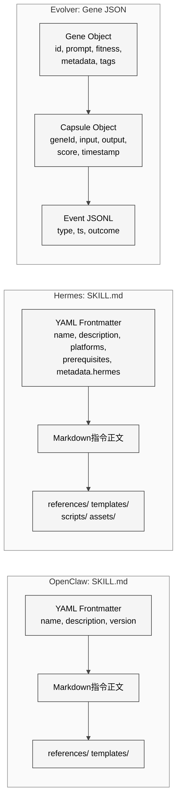
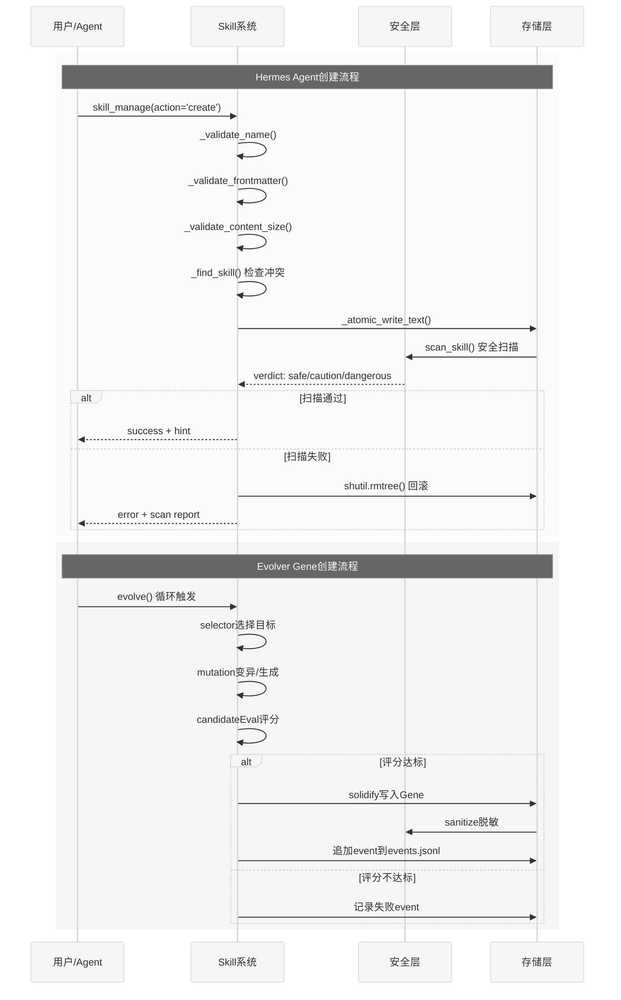
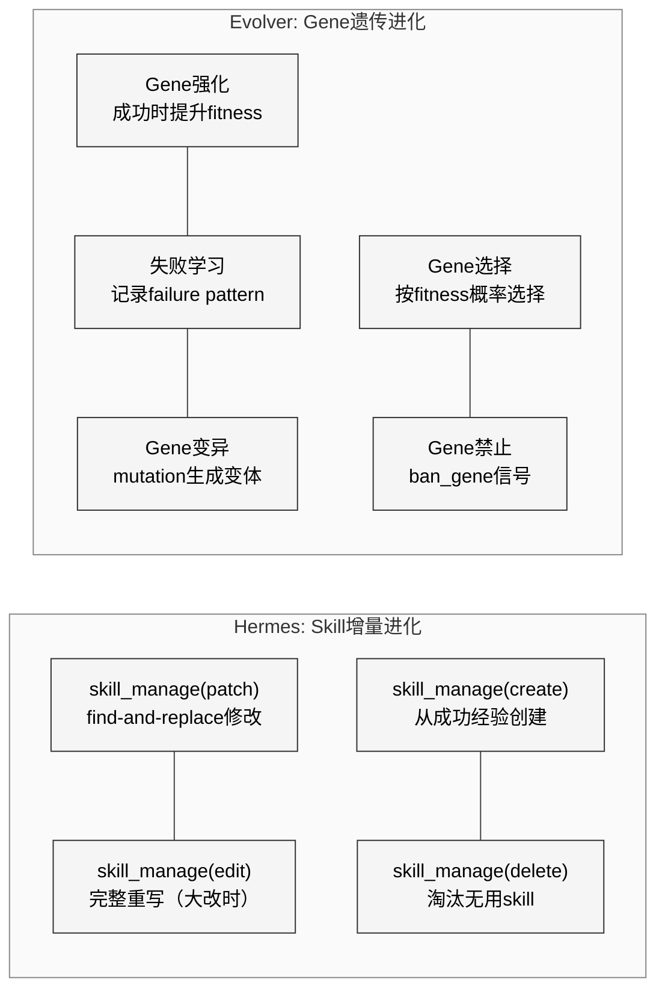
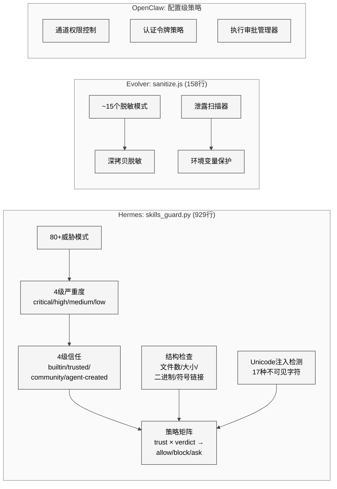
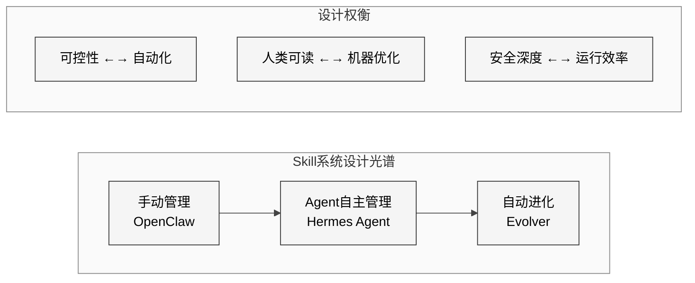

# 第30章 多项目Skill系统对比

## 30.1 引言

Skill系统是Agent实现知识积累和行为扩展的核心机制。本章将Hermes Agent、OpenClaw、EvoMap Evolver、OpenHarness和JiuwenClaw五个项目的Skill系统进行系统性横向对比，揭示五种路线的设计权衡。

前三个项目（Hermes、OpenClaw、Evolver）在第26-27章中已进行了深度架构对比，本章聚焦于Skill子系统的跨项目分析。OpenHarness和JiuwenClaw的加入扩展了对比光谱：OpenHarness代表了"Claude Code兼容"路线的Skill策略，JiuwenClaw则展示了"自进化Skill"在中国企业生态中的独立实现。

## 30.2 格式对比

<div style="background-color: #ffffff; padding: 16px; border-radius: 8px; margin: 16px 0;" bgcolor="#ffffff">



</div>

### 26.2.1 OpenClaw SKILL.md

OpenClaw采用agentskills.io标准的SKILL.md格式。每个Skill是一个包含`SKILL.md`文件的目录，frontmatter使用YAML定义元数据：

```yaml
---
name: skill-name
description: Brief description
version: 1.0.0
license: MIT
---
# Skill Instructions
...
```

### 26.2.2 Hermes Agent SKILL.md

Hermes Agent同样采用SKILL.md格式，但在frontmatter中扩展了多个Hermes特有字段（定义在`tools/skills_tool.py`）：

```yaml
---
name: skill-name
description: Brief description (max 1024 chars)
version: 1.0.0
platforms: [macos, linux]        # 平台限制
prerequisites:
  env_vars: [API_KEY]            # 环境变量依赖
  commands: [curl, jq]           # 命令依赖
metadata:
  hermes:
    tags: [fine-tuning, llm]
    related_skills: [peft, lora]
    config:                       # Skill配置变量
      - key: my_setting
        default: value
---
```

Hermes的`agent/skill_utils.py`中的`parse_frontmatter()`实现了完整的YAML解析，支持CSafeLoader加速和降级fallback：

```python
def parse_frontmatter(content: str) -> Tuple[Dict[str, Any], str]:
    try:
        parsed = yaml_load(yaml_content)  # CSafeLoader优先
        if isinstance(parsed, dict):
            frontmatter = parsed
    except Exception:
        # Fallback: 简单key:value逐行解析
        for line in yaml_content.strip().split("\n"):
            ...
```

目录结构增加了`scripts/`和`assets/`子目录（agentskills.io扩展标准）：

```
my-skill/
├── SKILL.md          # 主指令（必需）
├── references/       # 参考文档
├── templates/        # 输出模板
├── scripts/          # 可执行脚本
└── assets/           # 补充资源
```

### 26.2.3 Evolver Gene JSON + Capsule JSON

Evolver使用结构化的JSON格式，存储在`assets/gep/`目录下：

- **genes.json**：所有Gene的数组，每个Gene包含id、prompt、fitness分数、元数据标签等
- **capsules.json**：所有执行记录（Capsule）的数组，每个Capsule关联一个Gene ID
- **events.jsonl**：时序事件流，每行一个JSON对象

`skillPublisher.js`提供了Gene → SKILL.md的转换能力：

```javascript
// Convert a Gene object into SKILL.md format
// @param {object} gene - Gene asset
function geneToSkillMd(gene) {
    lines.push('---');
    lines.push('name: ' + gene.id);
    // ... 转换Gene字段为YAML frontmatter
    lines.push('---');
    lines.push(gene.prompt);
    // 附加ESL-1.0许可声明
}
```

### 格式综合对比表

| 维度 | OpenClaw | Hermes Agent | Evolver |
|------|----------|-------------|---------|
| 主格式 | SKILL.md (Markdown) | SKILL.md (Markdown) | Gene JSON |
| 元数据 | YAML frontmatter | 扩展YAML frontmatter | JSON字段 |
| 人类可读性 | 高 | 高 | 中 |
| 机器可解析性 | 中（需YAML解析） | 中（YAML + fallback） | 高（原生JSON） |
| 平台限制 | 支持 | `platforms`字段 | — |
| 依赖声明 | — | `prerequisites` | — |
| 配置变量 | — | `metadata.hermes.config` | — |
| 执行记录 | 外部 | 外部（memory） | Capsule JSON |
| 适应度分数 | — | 隐式（使用频率） | 显式`fitness`字段 |
| 许可协议 | 开放 | MIT | ESL-1.0 |

## 30.3 创建流程对比

<div style="background-color: #ffffff; padding: 16px; border-radius: 8px; margin: 16px 0;" bgcolor="#ffffff">



</div>

### 26.3.1 Hermes Agent：Agent自主创建

Hermes Agent通过`skill_manage`工具让agent自主创建skill。`SKILL_MANAGE_SCHEMA`的description字段精确指导了创建时机：

> *"Create when: complex task succeeded (5+ calls), errors overcome, user-corrected approach worked, non-trivial workflow discovered, or user asks you to remember a procedure."*

创建流程的验证链：
1. `_validate_name()`：正则`^[a-z0-9][a-z0-9._-]*$`，最长64字符
2. `_validate_category()`：单级目录，无路径分隔符
3. `_validate_frontmatter()`：YAML解析 + name/description必填 + body非空
4. `_validate_content_size()`：≤100,000字符
5. `_find_skill()`：跨所有skill目录检查命名冲突
6. `_atomic_write_text()`：原子写入
7. `_security_scan_skill()`：安全扫描，失败则`shutil.rmtree()`回滚

### 26.3.2 Evolver：自动进化生成

Evolver的Gene创建是进化循环的产物——不需要用户手动触发。进化引擎在检测到创新机会时自动：
1. 通过`selector.js`选择基础Gene
2. 通过`mutation.js`执行变异
3. 通过LLM生成新的prompt内容
4. 通过`candidateEval.js`评估质量
5. 评分达标后通过`solidify.js`固化为新Gene

### 26.3.3 OpenClaw：用户手动创建

OpenClaw的skill创建主要依赖用户手动编写SKILL.md文件并放置在正确的目录中，或通过Hub安装已有skill。

## 30.4 发现机制对比

三个项目在skill发现上采用了截然不同的策略：

| 项目 | 发现策略 | 实现 | token开销 |
|------|---------|------|----------|
| OpenClaw | 配置加载 | 配置文件指定 | 低（仅加载启用的） |
| Hermes | 渐进式披露 | skills_list → skill_view → file | 极低（按需加载） |
| Evolver | 信号匹配 | signals.js → selector.js | 中（计算fitness） |

### Hermes的渐进式披露实现细节

`tools/skills_tool.py`定义了三层披露架构：

**Tier 1 — 列表（最小化token消耗）**：
```python
def skills_list():
    # 仅返回 name (≤64 chars) + description (≤1024 chars)
    # 不加载SKILL.md正文
```

**Tier 2 — 完整内容**：
```python
def skill_view(name):
    # 加载SKILL.md全文
    # 解析frontmatter + body
    # 检查prerequisites
```

**Tier 3 — 关联文件**：
```python
def skill_view(name, file_path="references/api.md"):
    # 按需加载子目录文件
```

### Evolver的信号匹配

Evolver通过`signals.js`计算当前上下文信号，然后`selector.js`根据信号选择匹配的Gene：

```javascript
// signals.js 中的信号类型示例
signals.push('ban_gene:' + topGene);  // 禁止表现差的Gene
// plateau 信号：检测进化停滞
// consecutive_failures：连续失败次数
// errors_detected：错误检测
```

## 30.5 进化策略对比

<div style="background-color: #ffffff; padding: 16px; border-radius: 8px; margin: 16px 0;" bgcolor="#ffffff">



</div>

### 26.5.1 Hermes: skill_manage(patch)增量修正

Hermes的skill进化以`patch`为主要手段——当agent在使用某个skill时遇到问题，它会调用`skill_manage(action='patch')`进行精确修正：

```python
def _patch_skill(name, old_string, new_string, file_path=None, replace_all=False):
    # 使用fuzzy_find_and_replace处理轻微格式差异
    from tools.fuzzy_match import fuzzy_find_and_replace
    new_content, match_count, _strategy, match_error = fuzzy_find_and_replace(
        content, old_string, new_string, replace_all
    )
```

进化触发时机由`SKILL_MANAGE_SCHEMA`的description编码：

> *"Update when: instructions stale/wrong, OS-specific failures, missing steps or pitfalls found during use. If you used a skill and hit issues not covered by it, patch it immediately."*

### 26.5.2 Evolver: Gene强化+失败学习管线

Evolver实现了更接近遗传算法的进化管线：

1. **Gene强化**：成功执行后，`solidify.js`提升Gene的fitness分数
2. **失败学习**：失败时记录`constraint violations`和`failure modes`，供后续参考
3. **Gene变异**：`mutation.js`基于现有Gene生成变体
4. **适应度选择**：`selector.js`按fitness加权概率选择Gene
5. **Gene禁止**：`signals.js`对连续失败的Gene发出`ban_gene`信号

`solidify.js`还实现了"受保护路径"检查——某些关键文件（如`MEMORY.md`）的删除会被标记为`CRITICAL_FILE_DELETED`约束违规：

```javascript
// 来自测试文件 solidify-helpers.test.js
assert.equal(isCriticalProtectedPath('MEMORY.md'), true);
classifyFailureMode({
    constraintViolations: ['CRITICAL_FILE_DELETED: MEMORY.md']
});
```

### 26.5.3 OpenClaw: 手动维护

OpenClaw的skill进化主要依赖用户手动维护——修改SKILL.md文件内容，或从Hub更新到新版本。

### 进化策略综合对比

| 维度 | OpenClaw | Hermes Agent | Evolver |
|------|----------|-------------|---------|
| 进化主体 | 用户 | Agent自主 | 进化引擎 |
| 修改粒度 | 全文替换 | patch (find-replace) | Gene变异 |
| 适应度 | 无 | 隐式（使用频率） | 显式fitness分数 |
| 失败学习 | 无 | skill_manage更新 | failure pattern记录 |
| 淘汰机制 | 手动删除 | skill_manage(delete) | ban_gene信号 |
| 自动触发 | 否 | 是（使用中发现问题） | 是（进化循环） |
| 回滚保护 | — | 原子写入+安全扫描 | 原子写入 |

## 30.6 存储机制对比

| 维度 | OpenClaw | Hermes Agent | Evolver |
|------|----------|-------------|---------|
| 主存储 | 文件系统目录 | `~/.hermes/skills/` | `assets/gep/` |
| 数据格式 | SKILL.md (Markdown) | SKILL.md (Markdown) | JSON (genes.json) |
| 执行记录 | 外部系统 | SQLite FTS5 | capsules.json + events.jsonl |
| 长期记忆 | 配置文件 | MEMORY.md + USER.md | EVOLUTION_PRINCIPLES.md |
| 索引 | 目录遍历 | 目录遍历 + FTS5 | JSON数组线性扫描 |
| 持久性 | 文件系统 | 文件系统 + SQLite | 文件系统 |
| 分区 | 无 | category子目录 | session scope |
| 外部目录 | — | `skills.external_dirs`配置 | — |
| 备份 | — | 自动备份（overwrite时） | Git版本控制 |

Hermes Agent的存储路径管理通过`hermes_constants.py`集中配置：

```python
# tools/skill_manager_tool.py
HERMES_HOME = get_hermes_home()
SKILLS_DIR = HERMES_HOME / "skills"
```

Evolver通过`src/gep/paths.js`管理，支持环境变量覆盖和session scope隔离：

```javascript
function getGepAssetsDir() {
    const baseDir = process.env.GEP_ASSETS_DIR 
        || path.join(repoRoot, 'assets', 'gep');
    const scope = getSessionScope();
    if (scope) return path.join(baseDir, 'scopes', scope);
    return baseDir;
}
```

## 30.7 安全模型对比

<div style="background-color: #ffffff; padding: 16px; border-radius: 8px; margin: 16px 0;" bgcolor="#ffffff">



</div>

### 26.7.1 Hermes skills_guard.py：深度防御

Hermes的安全扫描是三个项目中最全面的，覆盖10大威胁类别：

| 类别 | 模式数 | 典型检测 |
|------|--------|---------|
| exfiltration | 18 | curl + secret变量、DNS泄露、markdown图片注入 |
| injection | 16 | 忽略指令、角色劫持、DAN越狱、HTML隐藏指令 |
| destructive | 8 | rm -rf /、磁盘格式化、Python rmtree |
| persistence | 10 | crontab、shell rc文件、SSH authorized_keys、systemd |
| network | 10 | 反向shell、隧道服务、webhook站点 |
| obfuscation | 14 | base64管道执行、eval/exec、Unicode逃逸链 |
| execution | 6 | subprocess、os.system、child_process |
| traversal | 5 | 深层路径遍历、/etc/passwd、/proc |
| supply_chain | 8 | curl|sh、未固定版本pip/npm、git clone |
| privilege_escalation | 5 | sudo、setuid、NOPASSWD |
| credential_exposure | 6 | 硬编码API key、私钥、GitHub token |
| mining | 2 | xmrig、hashrate |

信任分级策略矩阵：

```python
INSTALL_POLICY = {
    #                  safe      caution    dangerous
    "builtin":       ("allow",  "allow",   "allow"),
    "trusted":       ("allow",  "allow",   "block"),
    "community":     ("allow",  "block",   "block"),
    "agent-created": ("allow",  "allow",   "ask"),
}
```

### 26.7.2 Evolver sanitize.js：发布前脱敏

Evolver的安全模型聚焦于**输出脱敏**而非**输入检测**：

```javascript
const REDACT_PATTERNS = [
    /sk-[A-Za-z0-9]{20,}/g,              // OpenAI keys
    /ghp_[A-Za-z0-9]{36,}/g,             // GitHub tokens
    /AKIA[0-9A-Z]{16}/g,                 // AWS keys
    /\/Users\/[^\s"',;)}\]]+/g,           // macOS paths
    /[a-zA-Z0-9._%+-]+@[a-zA-Z0-9.-]+/g  // emails
];

function sanitizePayload(capsule) {
    return JSON.parse(JSON.stringify(capsule), (_key, value) => {
        if (typeof value === 'string') return redactString(value);
        return value;
    });
}
```

此外，`scanForLeaks()`提供了非破坏性的泄露检测，返回结构化的建议：

```javascript
const LEAK_SCANNERS = [
    { type: 'api_key', pattern: /sk-[A-Za-z0-9]{20,}/g, 
      suggest: 'process.env.OPENAI_API_KEY' },
    { type: 'local_path', pattern: /\/Users\/[a-zA-Z0-9_.-]+\//g, 
      suggest: 'process.env.HOME' },
    // ...
];
```

Evolver还有`shield.js`模块（已混淆），其功能包括运行时环境检测和调试器防护。

### 安全模型综合对比

| 维度 | OpenClaw | Hermes Agent | Evolver |
|------|----------|-------------|---------|
| 安全定位 | 通道/认证层 | 安装时输入扫描 | 发布时输出脱敏 |
| 威胁模式数 | — | 80+ | ~15 |
| 严重度分级 | — | 4级 | — |
| 信任分级 | — | 4级策略矩阵 | — |
| 结构检查 | — | 文件数/大小/二进制 | — |
| Unicode检测 | — | 17种不可见字符 | — |
| 泄露扫描 | — | 模式匹配 | 带建议的扫描器 |
| 运行时防护 | 认证+限流 | 路径遍历防护 | 调试器检测（shield.js） |
| 回滚策略 | — | 扫描失败自动回滚 | — |
| 代码保护 | — | 全明文 | 核心模块混淆 |

## 30.8 OpenHarness Skill 系统

OpenHarness 的 Skill 策略可以概括为"兼容优先"：

**格式与加载**：OpenHarness 完全兼容 Anthropic 的 SKILL.md 标准以及 Claude Code 的插件格式。Skill 采用按需加载（on-demand loading），只有在对话中明确触发时才注入 context，避免了预加载带来的 token 浪费。

**工具集成**：43 个内置工具覆盖 File、Shell、Search、Web、MCP 五大类别，与 Skill 系统形成互补。Skill 负责流程编排，工具负责原子操作，两者通过 plugin ecosystem 统一管理。

**与 Claude Code 的兼容性**：ohmo（OpenHarness 的内置 Agent）可以直接运行在 Claude Code 或 Codex 订阅上，这意味着为 Claude Code 编写的 Skill 可以无修改地在 OpenHarness 上运行。这种兼容性策略降低了迁移成本，但也限制了 Skill 系统的独立创新空间。

**安全模型**：multi-level permission modes 和 pre/post-tool hooks 为 Skill 执行提供了细粒度的控制。与 Hermes 的 80+ 模式安全扫描不同，OpenHarness 更依赖运行时的权限门控而非静态分析。

## 30.9 JiuwenClaw Skill 系统

JiuwenClaw 的 Skill 系统最显著的特点是内置了完整的自进化机制：

**三层架构**：
- `SkillCallOperator`：负责 Skill 的调用执行
- `SkillOptimizer`：基于执行反馈优化 Skill 内容
- `SignalDetector`：检测用户纠正和执行失败信号

**进化流程**：当 Skill 执行失败或用户提供纠正时，`SignalDetector` 捕获信号，`SkillOptimizer` 生成优化建议，更新记录写入 `evolutions.json`，最终合并回 Skill 文档。这与 Hermes 的 `skill_improve` 工具有相似之处，但 JiuwenClaw 将进化逻辑内建到了框架核心，而非作为可选功能。

**市场生态**：支持 SkillNet 和 ClawHub 两个市场，兼容 agentskills.io 标准。这与 Hermes 的 `skills.sh` 和 `well-known` 发现机制形成互补的生态布局。

**任务规划集成**：与纯 Skill 系统不同，JiuwenClaw 的 Skill 与智能任务规划引擎深度集成——Skill 不仅可以被调用，还可以被任务规划器动态编排、中断和恢复。这是其他四个项目中不具备的能力。

## 30.10 综合评估

<div style="background-color: #ffffff; padding: 16px; border-radius: 8px; margin: 16px 0;" bgcolor="#ffffff">



</div>

五个项目代表了Skill系统设计的五个位置：

1. **OpenClaw：人类中心**。Skill格式对人类友好，创建/修改由用户驱动，安全由通道层和认证保障。适合需要精确控制skill内容的团队场景。

2. **Hermes Agent：Agent辅助**。Skill格式兼顾人类可读和机器可解析，agent可以自主创建和修补skill，安全扫描提供深度防御。代表了当前实用性和安全性的平衡点。

3. **Evolver：机器自治**。知识单元（Gene）以JSON格式优化机器处理，由进化引擎自动生成和淘汰，fitness分数提供量化的适应度信号。代表了自主Agent的前沿探索。

4. **OpenHarness：兼容优先**。完全兼容 Claude Code/Anthropic 的 Skill 和插件格式，按需加载，以运行时权限门控替代静态安全扫描。代表了"站在巨人肩膀上"的务实路线。

5. **JiuwenClaw：框架内建进化**。将 Skill 自进化机制（SignalDetector + SkillOptimizer）内建到框架核心，与任务规划引擎深度集成。代表了中国企业生态对自进化能力的独立实现。

从SKILL.md到Gene JSON的格式选择，从手动维护到自动进化的创建策略，从配置级策略到80+模式安全扫描的防御深度——五个项目的差异本质上反映了对"Agent应该拥有多大程度的自主性"这一根本问题的不同回答。

值得注意的是，Evolver的`skillPublisher.js`提供了Gene → SKILL.md的转换能力，Hermes的SKILL.md格式与OpenClaw完全兼容，OpenHarness直接兼容Anthropic格式，JiuwenClaw支持agentskills.io标准。这意味着五个系统的知识表示层虽然内部实现各异，但在SKILL.md标准层面已经初步实现了互操作性。这种生态层面的格式趋同，是Agent Skill标准化进程中最具实际意义的发展。
