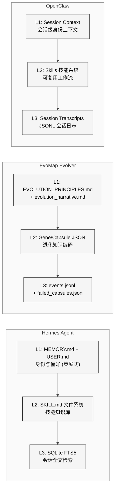
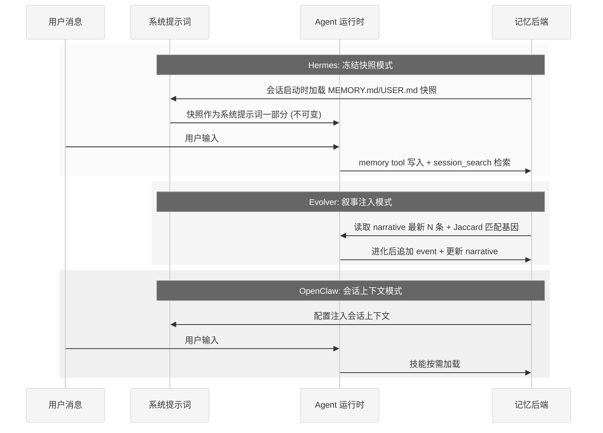
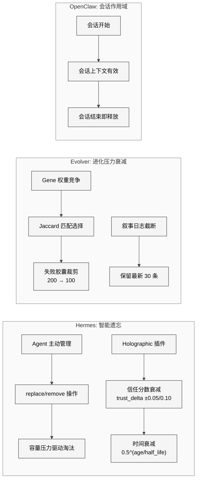

# 第31章 多项目记忆系统对比

## 31.1 引言

记忆系统是 AI Agent 实现跨会话连续性的核心基础设施。一个 Agent 能否记住用户的偏好、学习新的技能、从过去的错误中汲取教训，完全取决于其记忆架构的设计。本章将对 Hermes Agent、EvoMap Evolver、OpenClaw、OpenHarness 和 JiuwenClaw 五个项目的记忆系统进行系统性对比分析，揭示不同设计哲学下的工程权衡。

五个项目的记忆系统分别代表了五种典型范式：Hermes 采用"策展式记忆"（Curated Memory），由 Agent 主动管理有限容量的记忆条目；Evolver 采用"进化式记忆"（Evolutionary Memory），以基因、胶囊和叙事日志记录系统的演化轨迹；OpenClaw 采用"会话式记忆"（Session-scoped Memory），依赖会话上下文和技能系统实现知识复用；OpenHarness 采用"文档注入式记忆"（Document-injected Memory），以 CLAUDE.md/MEMORY.md 发现和自动压缩为核心；JiuwenClaw 采用"三层积累式记忆"（Three-layer Accumulative Memory），专门对抗长任务中的"上下文遗忘症"。

## 31.2 三层记忆映射

三个项目的记忆系统均可抽象为三个层次：L1（身份/原则层）、L2（知识/技能层）和 L3（历史/检索层），但各层的实现方式存在显著差异。

<div style="background-color: #ffffff; padding: 16px; border-radius: 8px; margin: 16px 0;" bgcolor="#ffffff">



</div>

### 27.2.1 L1：身份与原则层

**Hermes** 的 L1 层由两个 Markdown 文件组成。`MEMORY.md` 存储 Agent 的个人笔记（环境事实、项目惯例、工具特性），上限 2200 字符；`USER.md` 存储用户画像（偏好、沟通风格、工作习惯），上限 1375 字符。两个文件在会话启动时以"冻结快照"（Frozen Snapshot）模式注入系统提示词，会话中的修改立即持久化到磁盘但不更新系统提示词——这一设计刻意保持了 KV-Cache 前缀的稳定性。

**Evolver** 的 L1 层由 `EVOLUTION_PRINCIPLES.md`（可由用户自定义或回退到默认路径 `assets/gep/EVOLUTION_PRINCIPLES.md`）和 `evolution_narrative.md`（自动维护的进化叙事日志）构成。前者定义系统的演化约束和目标，后者以时间线形式记录每次进化操作的摘要。叙事日志在每次进化循环后自动追加条目，其格式为 `### [时间戳] 操作类型 — 状态`。

**OpenClaw** 的 L1 层相对简单，主要通过会话上下文实现。其身份信息在每次会话开始时通过配置系统注入，缺少跨会话持久化的独立身份文件。

### 27.2.2 L2：知识与技能层

三个项目在 L2 层的设计体现了各自的核心哲学差异。

Hermes 的 SKILL.md 系统采用目录化组织方式，每个技能是一个包含 `SKILL.md`（YAML 前置元数据 + 正文指令）、`references/`、`templates/` 和 `assets/` 子目录的文件夹。技能通过 `skills_list` 和 `skill_view` 工具以渐进式展开（Progressive Disclosure）方式加载：列表仅返回名称和描述，查看时才加载完整内容，有效控制了上下文消耗。

Evolver 的 L2 层由 Gene（基因）和 Capsule（胶囊）两种 JSON 数据结构组成。Gene 定义了可复用的进化策略——包含 `signals_match`（触发信号匹配）、`preconditions`（前置条件）、`strategy`（执行策略列表）、`constraints`（约束如最大文件数）和 `validation`（验证命令）。Capsule 则是成功进化操作的固化产物，记录具体的代码修改模式。两者共同形成了"选择 → 变异 → 验证 → 固化"的达尔文式知识进化循环。

OpenClaw 的技能系统也采用目录化组织，功能上与 Hermes 的 SKILL.md 系统结构类似。

### 27.2.3 L3：历史与检索层

Hermes 的 L3 层使用 SQLite WAL 模式数据库存储所有会话历史，并通过 FTS5 虚拟表实现全文检索。`messages_fts` 表与 `messages` 表通过触发器保持同步，支持关键词搜索、短语匹配、布尔表达式和前缀搜索。搜索结果经过 Gemini Flash 等辅助模型摘要后返回，避免了原始会话记录直接膨胀主模型上下文。

Evolver 的 L3 层由 `events.jsonl`（进化事件日志）和 `failed_capsules.json`（失败胶囊记录）组成。事件以追加写入（append-only）方式记录每次进化操作的完整上下文，失败胶囊则维护一个上限为 200 条（超出后裁剪至 100 条）的滚动窗口。检索时使用 Jaccard 相似度进行信号匹配。

OpenClaw 的 L3 层使用 JSONL 格式的会话记录，通过文件系统存储会话历史。

## 31.3 记忆注入机制

记忆如何进入 LLM 的上下文窗口，是记忆系统设计中最关键的工程决策之一。

<div style="background-color: #ffffff; padding: 16px; border-radius: 8px; margin: 16px 0;" bgcolor="#ffffff">



</div>

**Hermes 的冻结快照模式**具有显著的工程优势。`MemoryStore` 类在 `load_from_disk()` 时捕获 `_system_prompt_snapshot`，此后通过 `format_for_system_prompt()` 返回的始终是这个冻结副本。会话中通过 `memory` 工具进行的 add/replace/remove 操作会立即写入磁盘（使用原子性的 temp-file + rename 策略），但不改变系统提示词。这保证了整个会话期间系统提示词前缀的稳定性，使得 LLM 提供商的 KV-Cache 命中率最大化，直接降低了推理成本。

Hermes 还通过 `MemoryProvider` 插件接口支持外部记忆提供者的异步预取机制。以 RetainDB 为例，`queue_prefetch()` 在每轮结束时启动后台线程进行语义搜索和辩证综合（Dialectic Synthesis），`prefetch()` 在下一轮开始时消费缓存结果并注入上下文。这种"提前一轮"的流水线设计隐藏了网络延迟。

**Evolver 的叙事注入**则在进化循环启动时调用 `getRecentNarrative(maxChars)` 函数读取叙事日志的最新条目，将其作为 LLM 提示词的一部分提供进化上下文。`narrativeMemory.js` 中的 `trimNarrative()` 函数负责在叙事超出容量时按条目边界截断。

## 31.4 容量控制策略

| 维度 | Hermes Agent | EvoMap Evolver | OpenClaw |
|------|-------------|----------------|----------|
| **L1 容量限制** | MEMORY.md: 2,200 chars<br/>USER.md: 1,375 chars | Narrative: 约 30 条/12KB<br/>Principles: 无硬限 | 无显式限制 |
| **L1 计量单位** | 字符（模型无关） | 条目数 + 字节 | N/A |
| **L2 容量控制** | 渐进式展开<br/>列表仅返回元数据 | Gene/Capsule 按需读取<br/>JSONL 追加式 | 按需加载 |
| **L3 存储上限** | SQLite 无硬限<br/>90天自动清理 | events.jsonl 无硬限<br/>failed_capsules: 200→100 | 会话级 |
| **溢出策略** | 拒绝写入 + 提示用户<br/>替换或删除已有条目 | 滚动窗口截断<br/>旧叙事条目按 `###` 边界裁剪 | 会话结束即释放 |
| **反重复机制** | 精确去重 +<br/>`_scan_memory_content` 注入检测 | 内容哈希 (`contentHash.js`)<br/>+ Schema 版本控制 | 无显式机制 |

Hermes 的容量控制策略值得深入分析。`MemoryStore` 在 `add()` 操作中先计算新条目加入后的总字符数，超出限制则立即拒绝并返回当前使用量和已有条目列表，引导 Agent 自行进行 replace 或 remove 操作。这种"硬上限 + 软引导"的模式迫使 Agent 扮演自己的记忆策展人角色，在有限空间内保留最有价值的信息。`replace()` 操作同样检查替换后是否超出预算，确保任何操作都不会突破容量上限。

Evolver 的容量控制更为灵活。`trimNarrative()` 函数以 `### [` 作为条目边界进行分割，当总长度超过约 12KB 时从头部开始裁剪最旧的条目。`failed_capsules.json` 采用环形缓冲策略，当列表长度超过 200 时裁剪至最新的 100 条。

## 31.5 记忆衰减机制

记忆衰减是智能记忆系统区别于简单存储系统的关键能力。

<div style="background-color: #ffffff; padding: 16px; border-radius: 8px; margin: 16px 0;" bgcolor="#ffffff">



</div>

**Hermes 的记忆衰减**体现在多个层面。在 L1 层，Agent 通过 `memory` 工具的 `replace` 和 `remove` 操作进行"智能遗忘"——当新信息需要写入但空间不足时，Agent 必须判断哪些旧条目可以被替换或移除。这种由 Agent 自主驱动的遗忘机制，本质上将记忆管理的认知负担交给了 LLM 本身。

在 Holographic 记忆插件层面，`FactRetriever` 实现了更精细的衰减机制。信任分数（trust_score）通过不对称反馈调整：有用反馈 +0.05，无用反馈 -0.10，范围钳制在 [0.0, 1.0]。时间衰减采用指数函数 `0.5^(age_days / half_life)`，可配置半衰期。最终检索分数为 `relevance × trust_score × temporal_decay`，低信任或过时的事实自然下沉。

**Evolver 的衰减**通过进化选择压力实现。`taskReceiver.js` 中的 `jaccard()` 函数计算任务信号与已有 Gene 信号的重叠度，低匹配度的 Gene 在选择阶段被跳过。失败胶囊的环形缓冲裁剪也是一种隐式衰减——无法产生成功突变的知识自然被遗忘。

**OpenClaw** 采用最简的衰减策略——会话作用域（Session-scoped）记忆在会话结束时自然释放。跨会话知识依赖技能系统和用户手动管理。

## 31.6 检索能力对比

| 特性 | Hermes (FTS5) | Evolver (JSONL + Jaccard) | OpenClaw |
|------|--------------|--------------------------|----------|
| **搜索引擎** | SQLite FTS5 | 文件读取 + Jaccard 相似度 | 会话搜索 |
| **索引类型** | 倒排索引 (自动同步触发器) | 无索引 (线性扫描) | 无专用索引 |
| **查询语法** | 关键词、短语、布尔、前缀 | 信号标签匹配 | 关键词 |
| **排序算法** | BM25 (FTS5 rank) | Jaccard 系数 | 时间序 |
| **结果处理** | 辅助模型摘要 | 直接返回 | 直接返回 |
| **上下文窗口** | 匹配位置 ± 100K chars | Gene 全文 | 会话全文 |
| **增强检索** | Holographic: HRR 向量代数<br/>+ Jaccard 重排 + 信任加权 | 无 | 无 |
| **语义搜索** | RetainDB 插件 (云端向量) | 无 | 无 |

Hermes 的检索系统是三者中最为复杂的。核心的 `session_search` 工具使用 FTS5 进行第一阶段候选检索（MATCH + rank 排序），然后按会话分组，将匹配的会话文本截断到 100K 字符（使用 `_truncate_around_matches()` 在匹配位置周围取窗口），最后并行发送到 Gemini Flash 进行摘要。这种"检索 → 截断 → 摘要"的流水线避免了原始会话记录直接注入主模型的上下文膨胀问题。

Holographic 插件更进一步，实现了多策略混合检索：FTS5 权重 0.4 + Jaccard 相似度权重 0.3 + HRR（全息简化表示）向量代数权重 0.3。HRR 支持组合查询（compositional query）——可以用向量代数表达"找到同时涉及实体 A 和实体 B 的事实"，这种能力是传统嵌入向量数据库无法实现的。`FactRetriever.reason()` 方法实现了多实体的 AND 语义交集查询，`contradict()` 方法通过实体重叠 + 内容向量发散检测潜在的矛盾事实。

Evolver 的检索则更为聚焦——`taskReceiver.js` 中的 `jaccard()` 函数计算两个信号集的 Jaccard 系数 `|A ∩ B| / |A ∪ B|`，当相似度低于 0.15 时跳过该 Gene。这种检索方式专为进化选择设计，不追求通用性。

## 31.7 外部记忆提供者

Hermes 通过 `MemoryProvider` 抽象基类定义了标准化的记忆插件接口，目前已集成 8 个外部提供者：

| 插件 | 类型 | 核心能力 |
|------|------|----------|
| RetainDB | 云端语义 | 向量搜索 + 辩证综合 + 共享文件 |
| Honcho | 会话管理 | 平台级会话状态 |
| Hindsight | 事后分析 | 会话结束后提取洞察 |
| Mem0 | 通用记忆 | 第三方记忆 API |
| Holographic | 本地代数 | HRR 向量 + 信任评分 + 矛盾检测 |
| SuperMemory | 增强记忆 | 增强型外部记忆 |
| OpenViking | 开放记忆 | 开放协议记忆 |
| ByteRover | 字节级 | 字节级记忆管理 |

每个插件遵循统一的生命周期：`initialize()` → `system_prompt_block()` → `prefetch()` / `queue_prefetch()` → `sync_turn()` → `shutdown()`。内置记忆（MEMORY.md / USER.md）始终作为第一个提供者活跃，外部提供者同一时间只能有一个，防止工具 schema 膨胀和后端冲突。

Evolver 和 OpenClaw 均未实现类似的记忆插件架构，其记忆系统是单体式设计。

## 31.8 架构综合对比

<div style="background-color: #ffffff; padding: 16px; border-radius: 8px; margin: 16px 0;" bgcolor="#ffffff">

```mermaid
%%{init: {'theme': 'neutral', 'themeVariables': {'background': '#ffffff', 'primaryColor': '#f5f5f5', 'primaryTextColor': '#000000', 'primaryBorderColor': '#333333', 'lineColor': '#444444', 'textColor': '#000000', 'mainBkg': '#f5f5f5', 'nodeBorder': '#333333', 'clusterBkg': '#fafafa', 'clusterBorder': '#888888', 'edgeLabelBackground': '#ffffff'}}}%%
radar
    title 记忆系统能力雷达图 (1-5)
    "持久性" : 5, 4, 2
    "检索能力" : 5, 3, 2
    "容量控制" : 5, 4, 2
    "衰减机制" : 4, 3, 1
    "可扩展性" : 5, 2, 2
    "安全防护" : 5, 3, 2
```

</div>

| 对比维度 | Hermes Agent | EvoMap Evolver | OpenClaw | OpenHarness | JiuwenClaw |
|---------|-------------|----------------|----------|-------------|------------|
| **设计哲学** | 策展式 (有限 + 精选) | 进化式 (适者生存) | 会话式 (用完即弃) | 文档注入式 (兼容优先) | 三层积累式 (任务驱动) |
| **持久化后端** | SQLite (WAL) + Markdown | JSON + JSONL + Markdown | JSONL + 文件系统 | Markdown + Session Store | 多层存储 + 向量DB(可选) |
| **并发安全** | 文件锁 + 原子替换 + WAL<br/>+ 应用层 jitter 重试 | 原子写入 (tmp + rename) | 文件系统级 | 文件锁 + Session 隔离 | 任务级状态隔离 |
| **安全扫描** | 注入检测 (12 种模式)<br/>+ 不可见字符检测 | 无 | 无 | 权限门控 + Hooks | 部署级隔离 |
| **上下文效率** | 冻结快照 (KV-Cache 友好)<br/>+ 渐进式展开 | 截断窗口 | 按需加载 | Auto-compaction | 任务状态快照 |
| **LLM 辅助** | FTS5 摘要 + 预取流水线 | 进化提示词组装 | 无 | Auto-compaction 摘要 | SignalDetector 模式识别 |
| **插件生态** | 8 个外部记忆提供者 | 无 | 无 | Claude Code 兼容 | 华为云 MaaS 集成 |

## 31.9 OpenHarness 记忆系统

OpenHarness 的记忆策略可以概括为"文档注入 + 自动压缩"：

**CLAUDE.md 发现与注入**：类似于 Hermes 的 AGENTS.md，OpenHarness 自动发现并注入工作目录下的 CLAUDE.md 文件，将项目上下文持久化为文件系统中的 Markdown 文档。子目录的 CLAUDE.md 通过 lazy discovery 在工具调用时按需注入，不进入全局 system prompt。

**持久化 MEMORY.md**：OpenHarness 同样使用 MEMORY.md 作为持久记忆的载体，语义上与 Hermes 的实现一致。不同之处在于，OpenHarness 的记忆与 ohmo 个人 Agent 深度集成——ohmo 在长会话中自动维护记忆条目。

**Auto-compaction**：v0.1.6 引入的核心特性。在多日长会话中，当上下文接近模型窗口上限时，OpenHarness 自动触发压缩，保留关键信息并释放 token 空间。这与 Hermes 的 `/compress` 命令在理念上一致，但 OpenHarness 将其自动化了。

**Session Resume**：完整的会话恢复机制，包括历史消息、工具调用状态和上下文快照。与 Hermes 的 `hermes -c` 恢复机制类似，但实现细节不同。

## 31.10 JiuwenClaw 记忆系统

JiuwenClaw 的记忆系统设计围绕一个核心问题：解决长任务执行中的"上下文遗忘症"（contextual amnesia）。

**三层积累架构**：
- **短期记忆层**：当前任务会话上下文，包括对话历史和工具调用结果
- **中期记忆层**：任务状态快照，记录任务规划中的每个步骤的完成状态、中间结果和优先级变化
- **长期记忆层**：跨会话的用户偏好、Skill 进化历史（`evolutions.json`）和积累的领域知识

**任务状态持久化**：与其他项目不同，JiuwenClaw 的记忆系统与其智能任务规划引擎深度耦合。当用户中断当前任务、插入新任务或重新排序时，任务状态（而非仅仅对话历史）被完整保存。这使得 Agent 可以在任意时间点恢复到之前的任务上下文。

**进化信号记忆**：`SignalDetector` 组件不仅服务于 Skill 进化，也构成了记忆系统的一部分——它记录用户的纠正模式和执行失败模式，这些模式随时间积累形成 Agent 对特定用户和特定任务类型的"经验记忆"。

**与华为生态的集成**：部署在华为云上时，JiuwenClaw 可以利用华为云 MaaS 的向量数据库服务作为外部记忆后端，类似于 Hermes 的 8 个外部记忆提供者插件。

## 31.11 设计取舍分析

Hermes 的记忆系统展现了高度的工程成熟度：冻结快照优化了推理成本，字符级容量控制避免了 token 计数的模型依赖性，注入检测防止了记忆投毒攻击，插件架构支持了多种后端的灵活切换。但这种设计的代价是复杂性——`MemoryStore` 加上 `SessionDB` 加上 `MemoryProvider` 接口加上 8 个插件，记忆子系统的代码量已经超过了许多独立项目。

Evolver 的记忆系统则更加聚焦于其核心使命——代码自进化。Gene/Capsule 的设计不追求通用记忆能力，而是精确服务于"选择 → 变异 → 验证 → 固化"的进化循环。叙事日志以人类可读的 Markdown 格式记录进化历史，兼具调试日志和知识库的双重功能。这种领域特化的设计在其应用场景内具有高效率，但缺乏 Hermes 那样的通用性和可扩展性。

OpenClaw 的会话作用域记忆是五者中最轻量的方案，适合无状态或弱状态的 Agent 场景。其简洁性是一种设计选择而非缺陷——在某些安全敏感的场景中，"不记忆"反而是一种特性。

OpenHarness 的文档注入式记忆走的是务实路线：CLAUDE.md + MEMORY.md + auto-compaction 提供了足够好的跨会话连续性，同时保持了与 Claude Code 生态的完全兼容。对于已经在 Claude Code 上积累了大量 CLAUDE.md 文件的用户而言，这种零迁移成本的记忆方案极具吸引力。

JiuwenClaw 的三层积累式记忆是五个项目中唯一将任务状态（而非仅仅对话历史）纳入记忆管理的方案。这种设计使其在长任务执行场景中表现突出——用户可以中断、切换、恢复任务而不丢失上下文。但这种深度耦合也限制了其通用性。

五个项目的记忆系统对比，本质上反映了 AI Agent 领域的一个核心张力：通用性与专注度、功能完备与工程简洁之间的权衡。没有一种方案在所有维度上都优于其他方案——最佳选择取决于具体的应用场景和设计目标。
