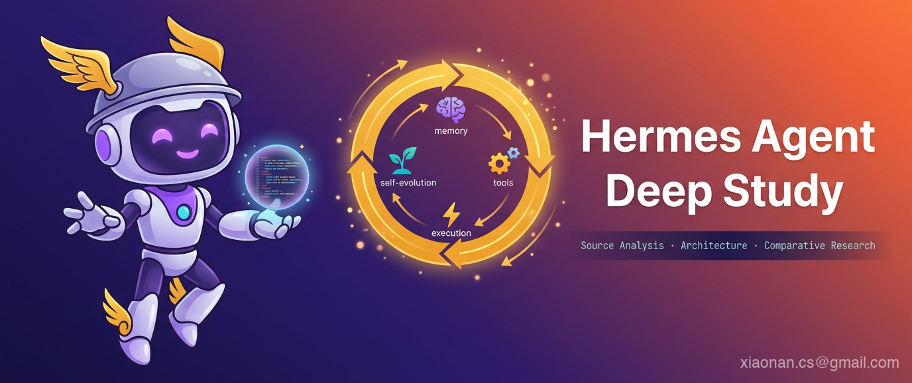

# Hermes Agent 深度研究

**从机制本质到代码实现，从 OpenClaw 渊源到 EvoMap 争议**

---

## 这份研究在说什么

Hermes Agent 是 2026 年最受关注的开源 AI Agent 项目之一——90k Stars，Nous Research 出品，口号是"The agent that grows with you"。

但它的火爆背后有两个绕不开的问题：

1. 整体架构（Gateway、Tool Registry、Skill System、启动文件体系）与 OpenClaw（358k Stars）存在大量可比结构，只是从 TypeScript 换成了 Python，还内置了 `hermes claw migrate` 迁移工具。
2. 核心差异化卖点"自进化"被中国团队 EvoMap 指控架构级抄袭——10 步主循环对齐、12 组术语替换、三层记忆对应、7 份材料零引用。

本研究从源码层面拆解 Hermes Agent，同时代码级对比多个同源项目，用事实说话。

与此同时，本研究也补充了一个近来社区讨论迅速升温、但常被说得过满的话题：`autoresearch`。我们的判断是，`autoresearch` 更适合被理解为建立在 Cron、Git 与评分机制之上的研究型延展工作流，而不是当前 Hermes 面向多数用户的默认主入口。

---

## 研究结构

### 总纲

| 文档 | 内容 |
|------|------|
| [总纲 — Hermes Agent 技术主线分析](总纲-Hermes-Agent技术主线分析.md) | 核心机制、火爆原因、设计哲学、架构全貌 |
| [全网调研 — 社区认知地图](全网调研-社区认知地图.md) | 中英文社区技术分析索引、观点争议、认知盲区 |

### Part I 原理与使用

Hermes Agent 是什么、怎么工作、怎么用。读完这部分你能完整理解它的设计逻辑，并掌握从入门到高级、再到研究型延展工作流的使用方法。

| 章节 | 主题 | 核心源码 |
|------|------|---------|
| [01](part1-principles-and-usage/01-项目全景与设计哲学.md) | 项目全景与设计哲学 | `run_agent.py`, `AGENTS.md` |
| [02](part1-principles-and-usage/02-启动流程与配置系统.md) | 启动流程与配置系统 | `hermes_cli/main.py`, `config.py` |
| [03](part1-principles-and-usage/03-初级使用方法.md) | 初级使用方法 | 安装、配置、CLI 交互、命令速查 |
| [04](part1-principles-and-usage/04-高级使用方法.md) | 高级使用方法 | Cron 自动化、Skill 生态、Gateway 部署、MCP 集成、Batch 与 autoresearch 使用定位 |
| [05](part1-principles-and-usage/05-Agent核心循环.md) | Agent 核心循环 | `run_agent.py` (11,487 行) |
| [06](part1-principles-and-usage/06-SystemPrompt组装.md) | System Prompt 组装 | `agent/prompt_builder.py` |
| [07](part1-principles-and-usage/07-Provider与API模式.md) | Provider 与 API 模式 | `runtime_provider.py`, `auth.py` |
| [08](part1-principles-and-usage/08-记忆系统.md) | 记忆系统 | `memory_manager.py`, `memory_tool.py` |
| [09](part1-principles-and-usage/09-Skill系统.md) | Skill 系统 | `skill_commands.py`, `skills_hub.py` |
| [10](part1-principles-and-usage/10-自进化引擎.md) | 自进化引擎 | `hermes-agent-self-evolution/` |
| [11](part1-principles-and-usage/11-状态管理与Profile隔离.md) | 状态管理与 Profile 隔离 | `hermes_constants.py` |

### Part II 源码分析

逐模块拆解实现细节。每章追踪关键代码路径，分析设计权衡。

| 章节 | 主题 | 核心源码 |
|------|------|---------|
| [12](part2-source-analysis/12-上下文压缩与缓存.md) | 上下文压缩与缓存 | `context_compressor.py`, `prompt_caching.py` |
| [13](part2-source-analysis/13-会话持久化.md) | 会话持久化 | `hermes_state.py`, `session.py` |
| [14](part2-source-analysis/14-工具系统总览.md) | 工具系统总览 | `tools/registry.py`, `toolsets.py` |
| [15](part2-source-analysis/15-终端与沙箱执行.md) | 终端与沙箱执行 | `terminal_tool.py`, `environments/` |
| [16](part2-source-analysis/16-文件与代码工具.md) | 文件与代码工具 | `file_tools.py`, `code_execution_tool.py` |
| [17](part2-source-analysis/17-浏览器自动化.md) | 浏览器自动化 | `browser_tool.py` |
| [18](part2-source-analysis/18-MCP集成.md) | MCP 集成 | `mcp_tool.py` |
| [19](part2-source-analysis/19-子Agent委托.md) | 子 Agent 委托 | `delegate_tool.py` |
| [20](part2-source-analysis/20-定时任务.md) | 定时任务 | `cron/` |
| [21](part2-source-analysis/21-Gateway网关.md) | Gateway 网关 | `gateway/run.py` (9,798 行) |
| [22](part2-source-analysis/22-插件系统.md) | 插件系统 | `plugins.py`, `plugins/` |
| [23](part2-source-analysis/23-ACP-IDE集成.md) | ACP IDE 集成 | `acp_adapter/` |
| [24](part2-source-analysis/24-安全与权限.md) | 安全与权限 | `approval.py`, `skills_guard.py` |
| [25](part2-source-analysis/25-RL与训练环境.md) | RL 与训练环境 | `environments/`, `batch_runner.py` |

### Part III 同源项目对比分析

代码级对比 Hermes Agent 与同源/同类项目：OpenClaw、EvoMap Evolver、OpenHarness、JiuwenClaw 及全网 Harness 实现。

| 章节 | 主题 |
|------|------|
| [26](part3-comparative-analysis/26-OpenClaw架构对比.md) | OpenClaw 架构对比 — Gateway vs ExecutionLoop |
| [27](part3-comparative-analysis/27-EvoMap-Evolver对比.md) | EvoMap Evolver 对比 — 自进化模块逐步对比 |
| [28](part3-comparative-analysis/28-OpenHarness与JiuwenClaw对比.md) | OpenHarness 与 JiuwenClaw 对比 — 三种 Agent 哲学 |
| [29](part3-comparative-analysis/29-全网Harness实现全景.md) | 全网 Harness 实现全景 — 四种范式分类学 |
| [30](part3-comparative-analysis/30-三项目Skill系统对比.md) | 多项目 Skill 系统对比 |
| [31](part3-comparative-analysis/31-记忆系统三方对比.md) | 多项目记忆系统对比 |
| [32](part3-comparative-analysis/32-开源伦理与启示.md) | 开源伦理与启示 |

### 附录

| 文档 | 内容 |
|------|------|
| [附录 A](appendix/A-章节配置.yaml) | 章节配置与元数据 |
| [附录 B](appendix/B-关键数据结构索引.md) | 核心类/函数速查表 |
| [附录 C](appendix/C-参考文献.md) | 参考文献与引用来源 |

---

## 源码基线

| 项目 | 版本 | 语言 | Stars |
|------|------|------|-------|
| Hermes Agent | v0.9.0 (main, April 2026) | Python | 90,209 |
| OpenClaw | latest (April 2026) | TypeScript | 358,225 |
| EvoMap Evolver | latest (April 2026) | Node.js | 2,512 |
| OpenHarness | v0.1.6 (April 2026) | Python | 9,884 |
| JiuwenClaw | latest (April 2026) | Python | 398 |

## 怎么读

- **快速了解**：读总纲，15 分钟掌握全貌
- **快速上手**：Part I 第 3-4 章，从安装到高级用法
- **研究型用法**：Part I 第 4 章先看高级场景定位与 `autoresearch` 延展，再接 Part II 第 25 章理解 Batch / RL 路径
- **自动研究工作流**：先读 Part I 第 4 章的 `autoresearch` 小节，再按需要跳到 Part II 第 20 章 `定时任务` 和第 25 章 `RL 与训练环境`
- **理解设计**：Part I 从头读，掌握"为什么这么做"
- **看实现**：Part II 按需跳转，追踪代码路径
- **看争议**：直接读 Part III

## 许可

本研究内容采用 [CC BY-SA 4.0](https://creativecommons.org/licenses/by-sa/4.0/) 许可证。所分析的源码版权归原项目所有者所有。
