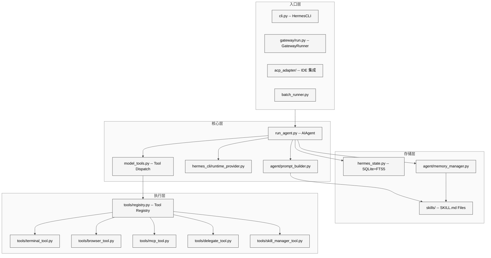
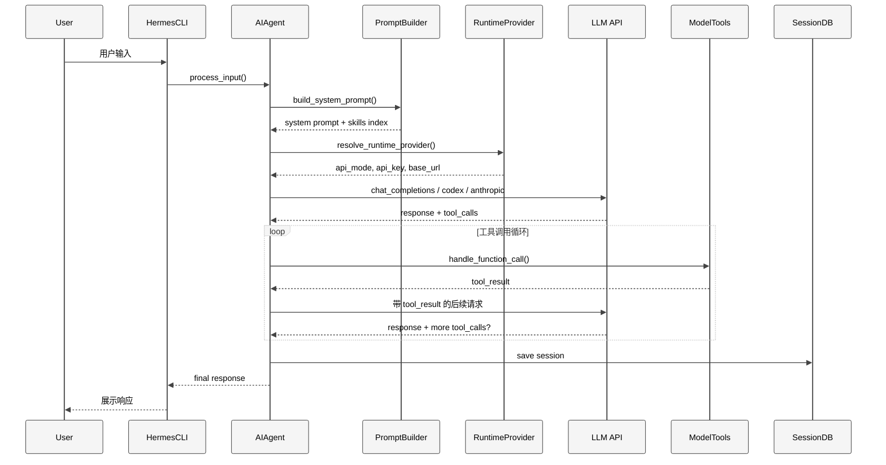
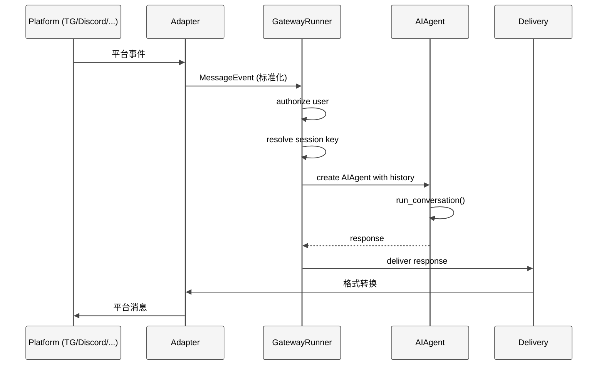
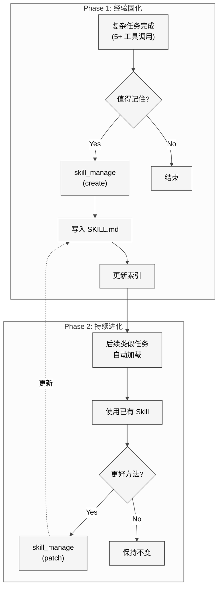
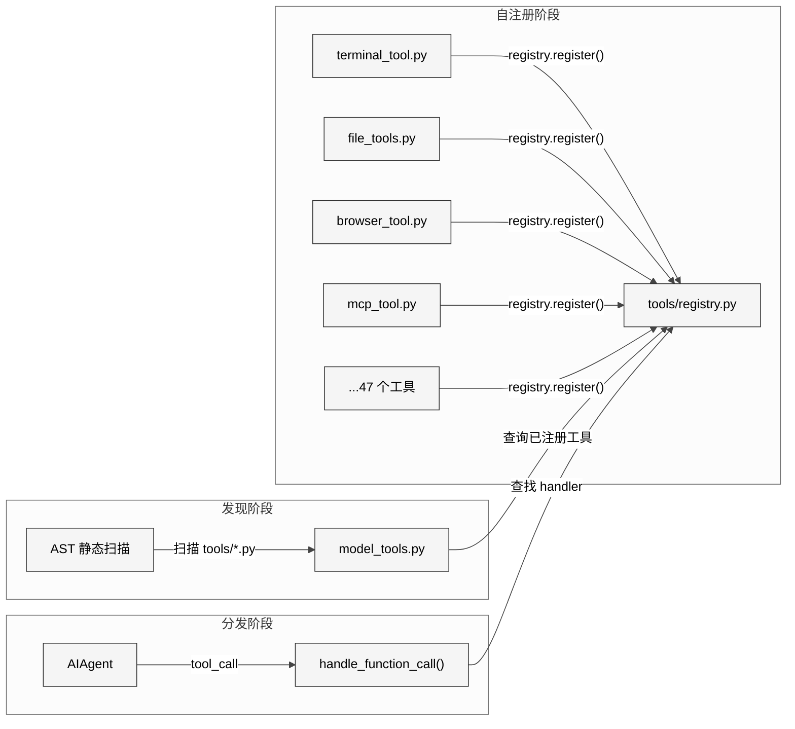
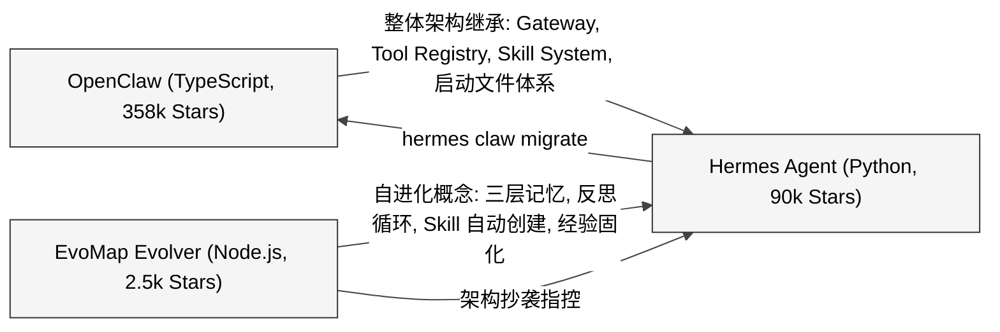

# 总纲 — Hermes Agent 技术主线分析

> 本文是研究导论，系统性回答三个核心问题：Hermes Agent 的机制本质是什么？它为什么会火爆？核心逻辑和设计原理是什么？

---

## 1. 项目定位与规模

### 1.1 一句话定义

Hermes Agent 是一个**持久型自进化 AI Agent 框架**，用 Python 实现，支持多平台接入、多种 LLM 后端、沙箱化工具执行、持久记忆和自主技能创建。其口号是"The agent that grows with you"——一个能与你共同成长的 AI 代理。

### 1.2 源码规模

基于 v0.9.0（2026 年 4 月）的统计：

| 维度 | 数值 |
|------|------|
| Python 文件数 | 886 |
| Python 总行数 | 411,492 |
| Markdown 文件数 | 556 |
| 测试文件数 | 577 |
| 内置 Skill 类别 | 26 |
| 可选 Skill 类别 | 14 |
| 平台适配器数 | 18 |
| 工具数 | 47 |
| 工具集数 | 19 |

### 1.3 核心文件 Top 10

| 文件 | 行数 | 职责 |
|------|------|------|
| `run_agent.py` | 11,487 | AIAgent 核心对话循环 |
| `cli.py` | 10,033 | HermesCLI 交互终端 |
| `gateway/run.py` | 9,798 | GatewayRunner 消息分发 |
| `hermes_cli/main.py` | 6,383 | CLI 子命令入口 |
| `batch_runner.py` | 55,322 字节 | 批量轨迹生成 |
| `hermes_state.py` | 49,536 字节 | SQLite 会话存储 |
| `hermes_cli/config.py` | 3,513 | 配置管理与迁移 |
| `hermes_cli/auth.py` | 3,300 | Provider 凭证解析 |
| `hermes_cli/setup.py` | 3,209 | 交互式安装向导 |
| `tools/skills_hub.py` | 3,053 | Skills Hub 浏览/搜索 |

---

## 2. 核心机制：Hermes Agent 究竟是什么？

### 2.1 本质判断

**Hermes Agent 的本质是 OpenClaw 的 Python 重实现 + EvoMap 的自进化概念嫁接。**

这个判断基于以下事实：

1. **整体架构继承自 OpenClaw**：Gateway 网关模式、Agent Runtime、Tool Registry 自注册模式、SKILL.md 技能格式、AGENTS.md/SOUL.md/USER.md 启动文件体系——这些核心设计决策与 OpenClaw 完全一致。Hermes 甚至内置了 `hermes claw migrate` 迁移命令，在代码中有完整的 OpenClaw 到 Hermes 的配置映射（`optional-skills/migration/openclaw-migration/scripts/openclaw_to_hermes.py`，2,794 行）。

2. **差异化卖点来自 EvoMap**：Hermes 相比 OpenClaw 的核心差异——自进化能力（Skill 自动创建、经验提取、反思循环、三层记忆）——与 EvoMap Evolver 的 GEP 协议架构高度同构。EvoMap 团队的技术对比报告展示了 10 步主循环的精确对齐和 12 组术语的系统性替换。

3. **语言层面的完全重写**：OpenClaw 用 TypeScript/Node.js，Evolver 用 Node.js，Hermes 用 Python。这不是简单的 fork，而是跨语言的架构复现。

### 2.2 架构总览

<div style="background-color: #ffffff; padding: 16px; border-radius: 8px; margin: 16px 0;" bgcolor="#ffffff">



</div>

### 2.3 六大子系统

Hermes Agent 由六个紧密协作的子系统构成：

#### 子系统 1：Agent Loop（核心循环）

`run_agent.py` 中的 `AIAgent` 类是整个系统的心脏，11,487 行代码实现了完整的对话循环：

```
用户输入 -> prompt_builder 组装系统提示 -> runtime_provider 解析模型/密钥
-> API 调用（三种模式之一）-> 工具调用? -> model_tools.handle_function_call()
-> 循环直到完成 -> 展示响应 -> 保存到 SessionDB
```

三种 API 模式：
- **Chat Completions**：标准 OpenAI 兼容模式
- **Codex Responses**：OpenAI Codex 专用模式
- **Anthropic Messages**：Anthropic 原生格式

#### 子系统 2：Prompt System（提示词系统）

`agent/prompt_builder.py` 负责组装系统提示词，来源包括：
- SOUL.md（人格/身份）
- MEMORY.md + USER.md（持久记忆）
- Skills Index（技能目录，渐进式加载）
- 上下文文件（AGENTS.md、.hermes.md）
- 工具使用指南
- 模型特定指令

内置 Prompt 注入防御（`_scan_context_content()`），检测 80+ 种威胁模式。

#### 子系统 3：Tool System（工具系统）

基于 `tools/registry.py` 的自注册模式：

```
tools/registry.py  (无依赖 — 被所有工具文件导入)
       ^
tools/*.py  (每个文件在模块级别调用 registry.register())
       ^
model_tools.py  (导入 tools/registry + 触发工具发现)
       ^
run_agent.py, cli.py, batch_runner.py
```

47 个工具分布在 19 个工具集中，涵盖终端、文件、浏览器、Web、MCP、委托、技能管理等领域。

#### 子系统 4：Session Persistence（会话持久化）

`hermes_state.py` 实现了基于 SQLite 的会话存储：
- WAL 模式支持并发读写
- FTS5 虚拟表支持全文搜索
- 压缩触发的 Session 分裂（通过 `parent_session_id` 链）
- 源标记（cli、telegram、discord 等）

#### 子系统 5：Memory System（记忆系统）

三层记忆架构：

| 层次 | 实现 | 用途 |
|------|------|------|
| 声明性记忆 | MEMORY.md + USER.md | 持久事实，注入系统提示 |
| 过程性记忆 | ~/.hermes/skills/ (SKILL.md) | 可复用的程序性知识 |
| 搜索性记忆 | SQLite FTS5 | 跨会话全文搜索 |

支持 8 个外部 Memory Provider 插件（Honcho、Mem0、Hindsight、Supermemory 等），但同一时间只能激活一个。

#### 子系统 6：Messaging Gateway（消息网关）

`gateway/run.py` 的 `GatewayRunner`（9,798 行）实现了 18 个平台适配器：

Telegram、Discord、Slack、WhatsApp、Signal、Matrix、Mattermost、Email、SMS、DingTalk、Feishu、WeCom、WeCom Callback、Weixin、BlueBubbles、QQBot、Home Assistant、Webhook + API Server。

每个适配器将平台消息标准化后路由到同一个 AIAgent 实例。

---

## 3. 为什么 Hermes Agent 会火爆？

### 3.1 五大火爆因子

**因子 1：自进化叙事的市场吸引力**

"The agent that grows with you" 是 2026 年 AI Agent 领域最有吸引力的叙事。在一个充斥着一次性 Chatbot 和僵化工作流的市场中，"越用越强"的承诺精准击中用户痛点。Hermes 的 Skill 自动创建机制——在完成复杂任务后自动将经验固化为 SKILL.md 文件——为这一叙事提供了可感知的技术支撑。

**因子 2：OpenClaw 用户的无缝迁移**

Hermes 内置的 `hermes claw migrate` 命令让 OpenClaw 的 240k+ 用户群成为现成的迁移池。一条命令即可导入人格、技能、记忆、频道配置甚至 API 密钥。这至少说明 Hermes 在产品设计上认真考虑过 OpenClaw 用户的迁移路径；至于它是否承担了更明确的用户获取策略角色，还需要更多外部证据支持。

**因子 3：六种沙箱执行后端**

Local、Docker、SSH、Daytona、Modal、Singularity 六种终端后端覆盖了从个人笔记本到 GPU 集群的全部场景。Daytona 和 Modal 提供 serverless 持久化——Agent 环境在空闲时休眠，按需唤醒，空闲成本趋近于零。"$5 VPS 就能跑"的说法虽然是极限场景，但极具传播力。

**因子 4：Nous Research 品牌背书**

Nous Research 是开源 LLM 领域的知名团队，Hermes 系列模型在社区有广泛认知。这个品牌背书让项目一发布就获得了大量关注，第一个月就突破 50k Stars。

**因子 5：MIT 开源 + 完全自托管**

零遥测、零追踪、数据完全本地存储、MIT 许可证。在数据隐私日益受重视的 2026 年，这种"Data Sovereignty"定位是强有力的卖点。

### 3.2 技术层面的真正创新

抛开争议不谈，Hermes Agent 在工程实现上确实有一些值得关注的创新点：

1. **渐进式技能发现**（Progressive Disclosure）：先通过 `skills_list()` 只返回名称+描述，Agent 按需通过 `skill_view(name)` 加载完整内容。这种三层渐进加载在 Token 成本控制上是务实的工程选择。

2. **FTS5 会话搜索**：用 SQLite FTS5 替代向量数据库做跨会话搜索，避免了 RAG 的额外开销，在大部分场景下提供了足够好的召回率。

3. **Prompt 注入防御**：`prompt_builder.py` 中的 `_scan_context_content()` 检测 80+ 种威胁模式，包括隐形 Unicode 字符、HTML 隐藏注入、凭证泄露尝试等。这在开源 Agent 框架中是较为完善的。

4. **统一 Agent 核心**：一个 `AIAgent` 类同时服务于 CLI、Gateway、ACP、Batch 和 API Server 五种入口。平台差异只存在于入口层，不侵入 Agent 核心。

---

## 4. 核心逻辑：数据流详解

### 4.1 CLI 会话流

<div style="background-color: #ffffff; padding: 16px; border-radius: 8px; margin: 16px 0;" bgcolor="#ffffff">



</div>

### 4.2 Gateway 消息流

<div style="background-color: #ffffff; padding: 16px; border-radius: 8px; margin: 16px 0;" bgcolor="#ffffff">



</div>

### 4.3 Skill 自动创建流

<div style="background-color: #ffffff; padding: 16px; border-radius: 8px; margin: 16px 0;" bgcolor="#ffffff">



</div>

### 4.4 工具注册与发现机制

<div style="background-color: #ffffff; padding: 16px; border-radius: 8px; margin: 16px 0;" bgcolor="#ffffff">



</div>

---

## 5. 设计原理：六大设计原则

基于源码分析和官方文档，Hermes Agent 遵循以下设计原则：

### 原则 1：Prompt 稳定性

系统提示词在对话过程中不改变。除了用户显式动作（如 `/model` 切换模型），不会发生破坏缓存的变更。这保证了 Anthropic Prompt Caching 的有效性。

### 原则 2：可观察执行

每个工具调用对用户可见。CLI 中通过 `KawaiiSpinner` 显示进度，Gateway 中通过聊天消息推送进度。没有"黑盒"执行。

### 原则 3：可中断性

API 调用和工具执行都可以中途取消。CLI 支持 `Ctrl+C`，Gateway 支持 `/stop` 或发送新消息中断。

### 原则 4：平台无关核心

一个 `AIAgent` 类服务所有入口。平台差异只存在于入口层（CLI、Gateway、ACP、Batch、API Server），不侵入 Agent 核心。

### 原则 5：松耦合

可选子系统（MCP、插件、Memory Provider、RL 环境）使用注册模式和 `check_fn` 门控，不是硬依赖。

### 原则 6：Profile 隔离

每个 Profile（`hermes -p <name>`）拥有独立的 HERMES_HOME、配置、记忆、会话和 Gateway PID。多个 Profile 可以并发运行。

---

## 6. 模块依赖图

```mermaid
%%{init: {'theme': 'neutral', 'themeVariables': {'background': '#ffffff', 'primaryColor': '#f5f5f5', 'primaryTextColor': '#000000', 'primaryBorderColor': '#333333', 'lineColor': '#444444', 'textColor': '#000000', 'mainBkg': '#f5f5f5', 'nodeBorder': '#333333', 'clusterBkg': '#fafafa', 'clusterBorder': '#888888', 'edgeLabelBackground': '#ffffff'}}}%%
graph TD
    subgraph entryPoints ["入口层"]
        CLI["cli.py (10,033L)"]
        GWRUN["gateway/run.py (9,798L)"]
        ACPA["acp_adapter/"]
        BATCHR["batch_runner.py"]
    end

    subgraph agentCore ["Agent 核心"]
        RUNAG["run_agent.py (11,487L)"]
        MODTOOLS["model_tools.py"]
    end

    subgraph agentInternal ["Agent 内部"]
        PRBUILD["prompt_builder.py"]
        CTXCOMP["context_compressor.py"]
        PRCACHE["prompt_caching.py"]
        MEMMGR["memory_manager.py"]
        AUXCLI["auxiliary_client.py"]
        SKILLCMD["skill_commands.py"]
    end

    subgraph toolSystem ["工具系统"]
        TREG["tools/registry.py"]
        TERMTOOL["terminal_tool.py"]
        FILETOOL["file_tools.py"]
        BRWTOOL["browser_tool.py"]
        MCPTOOL["mcp_tool.py"]
        DELTOOL["delegate_tool.py"]
        SKMTOOL["skill_manager_tool.py"]
    end

    subgraph storage ["存储"]
        HSTATE["hermes_state.py"]
        GWSESS["gateway/session.py"]
    end

    subgraph config ["配置"]
        HCONST["hermes_constants.py"]
        HCLICONF["hermes_cli/config.py"]
        RTPROV["runtime_provider.py"]
    end

    CLI --> RUNAG
    GWRUN --> RUNAG
    ACPA --> RUNAG
    BATCHR --> RUNAG
    
    RUNAG --> MODTOOLS
    RUNAG --> PRBUILD
    RUNAG --> CTXCOMP
    RUNAG --> PRCACHE
    RUNAG --> MEMMGR
    RUNAG --> AUXCLI
    RUNAG --> HSTATE
    RUNAG --> RTPROV
    
    MODTOOLS --> TREG
    TREG --> TERMTOOL
    TREG --> FILETOOL
    TREG --> BRWTOOL
    TREG --> MCPTOOL
    TREG --> DELTOOL
    TREG --> SKMTOOL
    
    PRBUILD --> SKILLCMD
    
    GWRUN --> GWSESS
    HSTATE --> HCONST
    RTPROV --> HCLICONF
```

<div style="background-color: #ffffff; padding: 16px; border-radius: 8px; margin: 16px 0;" bgcolor="#ffffff">



</div>

---

## 7. 关键设计决策分析

### 7.1 为什么选择 Python 而非 TypeScript？

OpenClaw 用 TypeScript，Hermes 用 Python。这个选择可能出于以下考量：

1. **AI/ML 生态**：Python 是 AI 领域的主导语言，DSPy、GEPA 等学术框架都是 Python 生态
2. **研究友好**：Nous Research 同时在做 LLM 训练和 Agent 研究，Python 统一了 RL 环境和 Agent 框架的语言栈
3. **用户群体**：AI 工程师和研究者更熟悉 Python

### 7.2 为什么用 SQLite 而非向量数据库？

Hermes 用 SQLite FTS5 做跨会话搜索，而非流行的向量数据库 + RAG 方案：

1. **零外部依赖**：SQLite 是 Python 标准库的一部分，不需要额外安装
2. **足够好的召回**：对于个人 Agent 的会话历史，关键词匹配的召回率已经足够
3. **确定性**：FTS5 的搜索结果是确定的，不受 embedding 模型变化影响
4. **部署简便**：符合 "$5 VPS" 的定位

### 7.3 为什么用 SKILL.md 而非 JSON/YAML？

技能文件采用 Markdown + YAML Frontmatter 格式：

1. **人类可读**：相比 JSON/YAML，Markdown 对非开发者更友好
2. **标准兼容**：遵循 agentskills.io 开放标准
3. **LLM 友好**：Markdown 是 LLM 最自然的输出格式，Agent 可以直接生成
4. **版本控制友好**：Git diff 对 Markdown 的展示优于结构化数据

---

## 8. 与前代项目的关系概览

### 8.1 三项目关系图

<div style="background-color: #ffffff; padding: 16px; border-radius: 8px; margin: 16px 0;" bgcolor="#ffffff">



</div>

### 8.2 时间线

| 日期 | 事件 |
|------|------|
| 2025-07-22 | hermes-agent 仓库创建（私有） |
| 2025-11 | OpenClaw 开源发布 |
| 2025-12-18 | agentskills.io 发布 SKILL.md 开放标准 |
| 2026-02-01 | EvoMap Evolver 开源发布，GEP 协议首次公开 |
| 2026-02-16 | GEP 协议深度解读文章发布 |
| 2026-02-25 | Hermes Agent v0.1.0 发布（首次公开） |
| 2026-03-09 | hermes-agent-self-evolution 仓库创建 |
| 2026-03-12 | Hermes Agent v0.2.0 发布，正式推出 Skills 生态 |
| 2026-04-15 | EvoMap 发布架构相似性分析报告，指控 Hermes 抄袭 |

### 8.3 代码级对比在 Part III 展开

以上只是概览。代码级别的详细对比将在 Part III 对比分析中展开：

- **第 24 章**：OpenClaw Gateway 模式 vs Hermes ExecutionLoop 模式的架构对比
- **第 25 章**：EvoMap Evolver 自进化主循环与 Hermes 自进化模块的逐步对比
- **第 26 章**：三个项目的 Skill/Gene 系统对比
- **第 27 章**：三层记忆架构的精确对应分析
- **第 28 章**：开源伦理争议的全面梳理

---

## 9. 各章导引

### Part I 原理与使用

第 1-2 章从项目全景和启动流程入手。第 3-4 章提供从入门到高级的完整使用指南，涵盖安装配置、CLI 交互、Cron 自动化、Skill 生态、Gateway 多平台部署等实战内容。第 5-11 章深入核心机制：Agent 循环、Prompt 组装、Provider 路由、记忆系统、Skill 系统、自进化引擎和状态管理。

### Part II 源码分析

第 12-25 章逐模块拆解实现细节：上下文压缩、会话持久化、47 个工具的注册分发、6 种沙箱后端、9,798 行的 Gateway 网关、18 个平台适配器、插件系统、安全防御和 RL 训练环境。

### Part III 同源项目对比分析

第 26-32 章是本研究的特色：从代码层面对比 Hermes Agent 与 OpenClaw、EvoMap Evolver、OpenHarness、JiuwenClaw 等同源项目，还覆盖全网 Harness 实现的四种范式分类学（Gateway / ExecutionLoop / Orchestration / Enhancement），分析架构继承关系、代码相似度和抄袭争议，最后讨论开源伦理和 AI 时代的代码洗稿问题。

---

## 10. 小结

Hermes Agent 是一个工程上成熟的 AI Agent 框架，其 41 万行 Python 代码覆盖了从对话循环到多平台网关的完整栈。它的火爆源于"自进化"叙事的吸引力、OpenClaw 用户的迁移便利、灵活的沙箱执行和 Nous Research 的品牌背书。

但从技术本质上看，它并非从零创造，而是在 OpenClaw 的架构基础上用 Python 重写，并将 EvoMap Evolver 的自进化概念嫁接其上。这种"站在前人肩膀上"的做法在开源世界本身并无问题——问题在于 Hermes 团队在 7 份公开材料中对 Evolver 的零引用。

后续章节将用源码证据逐一展开这些判断。
